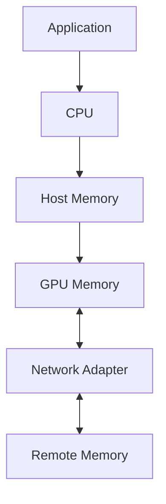

# DMA, RDMA, and Peer-to-Peer

High-performance systems fail when every byte must be copied by the CPU. Direct Memory Access (DMA) allows devices to transfer data without the CPU executing each copy. Remote Direct Memory Access (RDMA) extends that principle across a network. Peer-to-peer access allows supported devices to exchange data through direct paths rather than staging through host memory.

## Learning Objectives

You will be able to distinguish CPU copies, DMA, peer-to-peer, and RDMA; explain registration and protection; and identify where “direct” paths still depend on host software and topology.

## Data-Movement Models

A traditional staged path may copy device data to host memory before the NIC sends it. A direct path allows the NIC and GPU to participate in DMA with less staging, but setup, synchronization, protection, and completion processing still involve software.

| Mechanism | Scope | CPU role | Typical use |
|---|---|---|---|
| Programmed copy | Local | CPU moves data | Small control data |
| DMA | Local device-memory transfer | Configures descriptors and handles completion | Storage and device I/O |
| Peer-to-peer DMA | Local devices | Establishes mappings and synchronization | GPU-to-GPU or GPU-to-NIC |
| RDMA | Network | Registers memory, posts work, handles completions | Low-latency cluster communication |

## Memory Registration and Protection

A device cannot safely DMA to arbitrary addresses. The operating system, IOMMU, driver, and device cooperate to map and protect memory. RDMA stacks register memory regions and provide keys that authorize access. Registration has cost, so high-performance software reuses registered buffers and avoids registering on the critical path.

The term “zero copy” should be used carefully. A path may avoid an intermediate host copy while still performing DMA reads and writes, cache maintenance, protocol processing, or format conversion. The correct question is which copies and staging boundaries were removed.

## Ordering and Completion

Direct access does not remove synchronization. Producers and consumers must agree when a buffer is valid. CUDA streams, events, NIC completion queues, memory barriers, and application protocols coordinate ownership. A fast transfer that exposes partially written data is incorrect.

## Production Risks

Direct paths depend on:

- compatible devices and drivers;
- IOMMU and security configuration;
- PCIe topology;
- pinned or registered memory limits;
- container privileges and device exposure;
- correct cleanup after process failure.

A configuration that disables protection to improve performance can create unacceptable security and reliability risk. Validate the supported architecture rather than copying benchmark tuning blindly.

## Troubleshooting

**Symptom:** RDMA connectivity exists, but GPU communication falls back to host staging.

Check device topology, peer-memory modules or supported driver interfaces, memory-registration errors, container permissions, IOMMU policy, and library debug logs. Compare CPU utilization and PCIe counters during direct and staged tests.

**Resolution:** restore the supported driver stack, ensure the GPU and NIC share an appropriate path, expose required devices to the workload, and verify with a benchmark designed specifically for GPU buffers.

## Customer Perspective

Customers often ask whether RDMA “removes the CPU.” Explain that RDMA removes the CPU from the byte-by-byte data path, not from connection setup, memory management, security, orchestration, or failure handling.

## Interview Preparation

**Question:** Why is pinned memory commonly used for DMA?

Because pageable memory can move or be reclaimed. Pinning provides stable physical backing for device access, but excessive pinning reduces memory-management flexibility and can harm the host.

## Key Takeaways

- DMA reduces CPU involvement in data movement.
- RDMA extends direct access across the network.
- Peer-to-peer paths depend on mappings, topology, and synchronization.
- Direct does not mean unprotected, copy-free in every sense, or CPU-free.

## Cross References

- [NVLink and NVSwitch](./chapter-03-nvlink-and-nvswitch)
- [Next: GPUDirect RDMA](./chapter-05-gpudirect-rdma)
