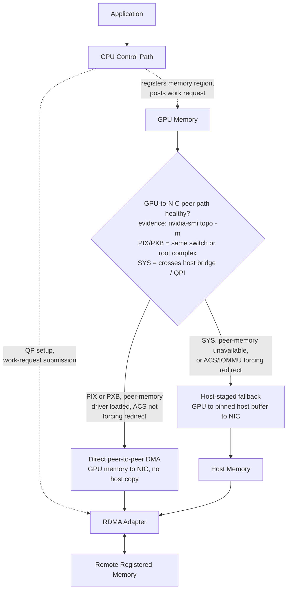
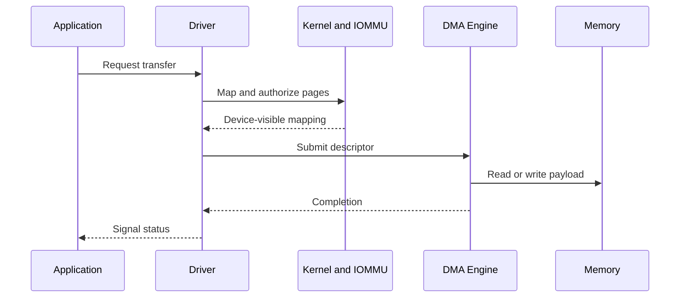
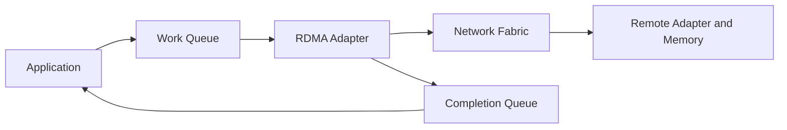
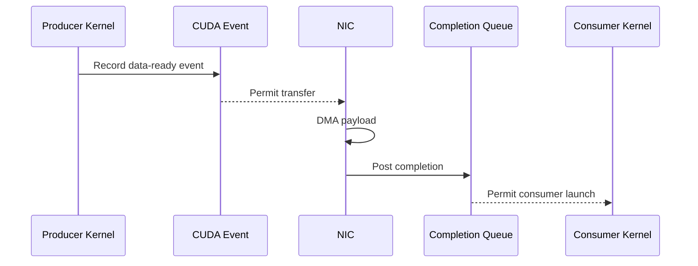

# DMA, RDMA, and Peer-to-Peer

## Introduction

A CPU can move data by loading bytes from one address and storing them at another. That model is simple, but it becomes wasteful when GPUs, network adapters, and storage controllers move large tensors continuously.

High-performance I/O separates the **control path** from the **payload path**. The CPU establishes permissions, creates queues, submits descriptors, and handles completion. Device engines move the payload between approved memory regions.

Direct Memory Access (DMA), peer-to-peer DMA, and Remote Direct Memory Access (RDMA) are related mechanisms built around that separation. They reduce selected copies and CPU work, but they do not remove memory protection, registration, synchronization, topology constraints, or failure handling.

| Chapter field | Value |
|---|---|
| Volume | 07 — GPU Networking |
| Difficulty | Advanced |
| Estimated reading time | 60 minutes |
| Previous | NVLink and NVSwitch |
| Next | GPUDirect RDMA |

## Story: The “Zero-Copy” Path That Increased CPU Usage

A training platform enables RDMA and expects CPU utilization to fall. Instead, CPU usage increases, tail latency becomes unstable, and some transfers fall back to host staging.

The deployment treated “direct” as if it meant “automatic.” Buffers were registered repeatedly on the critical path. The GPU and NIC were on different PCIe roots. Container permissions were incomplete. The application reused buffers before completion events had established safe ownership.

After the team creates reusable registered pools, aligns GPU and NIC placement, fixes software compatibility, and enforces completion ordering, the path becomes both faster and more predictable.

> Direct data movement removes selected copies. It does not remove systems engineering.

## Learning Objectives

After completing this chapter, you will be able to:

- distinguish programmed copies, DMA, peer-to-peer DMA, and RDMA;
- explain memory registration and protection keys;
- describe work queues and completion queues;
- explain why pinned memory is useful but finite;
- reason about ordering between CUDA work and network operations;
- identify host-staged fallback;
- troubleshoot registration, topology, permission, and completion failures.

## Big Picture



**Figure 7.4.1 — Control and payload paths, with the fault-isolation branch that actually matters.** The CPU authorizes and submits work; device engines move the payload. The decision point in the middle is the one question every RDMA-on-GPU incident reduces to: did this transfer take the direct peer path, or did it silently fall back to host staging? `nvidia-smi topo -m` is the first piece of evidence for that branch — see the annotated output below.

## Why Programmed Copies Do Not Scale

A programmed copy consumes CPU instructions, cache capacity, host-memory bandwidth, and scheduler time for every byte. Small control structures may tolerate that cost. Large tensors do not.

DMA allows a device to read or write memory after the operating system and driver establish a valid mapping. The CPU submits the operation and later handles completion rather than copying the payload itself.

## DMA Lifecycle



A DMA descriptor commonly describes an address, length, direction, queue, protection context, and completion behavior.

## Peer-to-Peer DMA

Peer-to-peer DMA allows one supported device to access another device’s memory or address window without staging the payload through ordinary host memory.

Examples include:

- GPU-to-GPU transfer;
- GPU-to-NIC transfer;
- GPU-to-storage-controller transfer.

Support depends on device capabilities, PCIe topology, firmware, address translation, drivers, virtualization, and security policy. A peer path can be functionally valid yet inefficient when it crosses remote root complexes or contended switches.

**Reading the topology before trusting any peer path:**

```bash
nvidia-smi topo -m
```

```text
        GPU0    GPU1    NIC0    NIC1    CPU Affinity    NUMA Affinity
GPU0     X      NV18    PIX     SYS     0-31            0
GPU1    NV18     X      SYS     PIX     32-63           1
NIC0    PIX     SYS      X      SYS
NIC1    SYS     PIX     SYS      X

Legend:
  X    = self
  NV#  = NVLink, # = link count
  PIX  = single PCIe switch (fast peer path)
  PXB  = multiple PCIe switches, same root complex
  PHB  = shared host bridge
  SYS  = crosses a CPU-to-CPU interconnect (slowest peer path)
```

Read `GPU0`/`NIC0` and `GPU1`/`NIC1`: both show `PIX`, meaning the GPU and adapter sit one PCIe switch apart — this is the pairing that should be used for peer-to-peer DMA. `GPU0`/`NIC1` shows `SYS`, meaning that path crosses the CPU-to-CPU interconnect; a peer transfer over that pairing is still functionally valid but will show materially lower bandwidth and higher, more variable latency than the `PIX` pairing. `CPU Affinity` and `NUMA Affinity` matter for exactly the same reason — pinning the process to NUMA node 0 while it drives `NIC1` (which lives under CPU 1) reintroduces a remote-memory hop even on a machine with otherwise-favorable topology. This table is the first evidence to pull for the Big Picture decision branch above: `PIX`/`PXB` supports the direct path; `SYS` is a strong signal the transfer will fall back to (or should deliberately use) host staging.

## RDMA

RDMA extends direct memory operations across a network. An RDMA-capable adapter transfers data between registered memory regions while limiting CPU involvement in the payload path.

The CPU still performs important work:

- connection and queue setup;
- memory registration;
- work-request submission;
- completion processing;
- timeout and error recovery;
- orchestration and observability.

RDMA is therefore not CPU-free. It moves CPU effort away from byte-by-byte copying and toward control and progress.

## Memory Registration

A device must not access arbitrary process memory. Registration creates a stable and authorized memory region.

A simplified registration lifecycle is:

1. select a virtual-address range;
2. stabilize or pin the backing memory;
3. create device-visible mappings;
4. define access permissions;
5. return local and remote keys where applicable;
6. retain the region until all in-flight work completes;
7. deregister and release resources safely.

Registration is expensive enough that production software normally reuses registered pools instead of registering every request.

**Confirming the adapter and its registration limits before blaming the application:**

```bash
ibv_devinfo -v
```

```text
hca_id: mlx5_0
        transport:                      InfiniBand (0)
        fw_ver:                         28.39.2048
        node_guid:                      9803:9b03:00fc:1a20
        max_mr_size:                    0xffffffffffffffff
        max_qp:                         262144
        max_qp_wr:                      32768
        max_cq:                         266752
        max_cqe:                        4194303
        max_mr:                         262144
        max_pd:                         262144
        max_pkeys:                      128
        local_ca_ack_delay:             16
        port:   1
                state:                  PORT_ACTIVE (4)
                link_layer:             InfiniBand
                active_mtu:             4096 (4)
                active_speed:           25.0 Gbps (EDR encoding, per-lane)
                phys_state:             LINK_UP (5)
```

`state: PORT_ACTIVE` and `phys_state: LINK_UP` confirm the physical link is up before anything else is investigated — a down port makes every downstream RDMA symptom moot. `max_mr` (maximum memory regions) and `max_qp` (maximum queue pairs) are hard adapter ceilings; a service that registers a new region per request instead of reusing a pool can hit `max_mr` under load long before it hits any memory-capacity limit, and the failure looks like "registration suddenly starts failing" rather than "out of memory." `active_mtu` and `active_speed` matter for the performance math later in this chapter — a link negotiated at a lower MTU or speed than expected (for example `active_speed` reporting `10.0 Gbps` on hardware rated for 25 Gbps per lane) points at a cabling, negotiation, or firmware problem, not an application bug.

### Pinned memory

Pinned host memory provides stable backing for DMA, but excessive pinning reduces the memory available for reclamation and can exhaust process, kernel, or adapter limits. It must be monitored and released correctly.

**Checking the pinning ceiling and current usage:**

```bash
ulimit -l
cat /proc/meminfo | grep -i mlocked
```

```text
$ ulimit -l
65536          # 64 MiB — the default soft memlock limit on many distributions

$ grep -i mlocked /proc/meminfo
Mlocked:         589824 kB   # ~576 MiB currently pinned system-wide
```

A default `ulimit -l` of 64 MiB is far smaller than a single GPU-scale RDMA buffer pool; a container or process that inherits this default will see registration calls fail once it tries to pin more than 64 MiB, even though the host has plenty of free RAM. Production RDMA workloads raise this limit explicitly (via `/etc/security/limits.conf`, a container's `ulimits`, or a Kubernetes `securityContext`) and then track `Mlocked` in `/proc/meminfo` over time — a value that climbs steadily without leveling off is the signature of a registration leak (buffers pinned and never released), not normal steady-state behavior, since a healthy pool reuses a bounded set of pinned regions.

## Protection Keys

RDMA memory regions carry protection information:

- a local key authorizes local adapter access;
- a remote key authorizes permitted remote operations;
- the region defines the valid address range and access rights.

An address alone is not sufficient. The operation must present the correct protection context.

## Queues and Completions



Applications post work and later consume completions. A completion has specific semantics. It may prove local adapter completion without proving that every application-level consumer is ready.

Software must understand local completion, remote visibility, ordering, fencing, timeout behavior, and failure states.

**Proving the queue-pair path works at all, before troubleshooting anything GPU-specific:**

```bash
# server
ib_write_bw -d mlx5_0 -a
# client
ib_write_bw -d mlx5_0 -a <server_ip>
```

```text
---------------------------------------------------------------------------------------
                    RDMA_Write BW Test
 Dual-port       : OFF          Device         : mlx5_0
 Number of qps   : 1            Transport type : IB
 Connection type : RC           Using SRQ      : OFF
 rdma_cm QPs     : OFF
 Mtu             : 4096[B]
 Link type       : IB
 Max inline data : 0[B]
---------------------------------------------------------------------------------------
 #bytes     #iterations    BW peak[MB/sec]    BW average[MB/sec]   MsgRate[Mpps]
 65536      1000             24610.32            24601.87            0.393630
---------------------------------------------------------------------------------------
```

This is a **host-memory** RDMA test — no GPU buffers are involved yet, and it is deliberately the first test to run because it isolates the network transport from GPU-memory integration entirely. `Connection type: RC` (Reliable Connection) confirms the queue pair is using a reliable transport with in-order, acknowledged delivery. `BW average: 24601.87 MB/sec` (~24 GB/s, illustrative for an EDR-class single-port link) is the baseline: if a later GPU-buffer test (using `ib_write_bw --use_cuda=0` against the same adapter) comes back far below this number, the gap is attributable to the GPU-memory path — registration, peer access, or a topology hop — not the network fabric, because the fabric already proved itself healthy here. Recording this number per node class is what later lets an incident say "GPU-buffer RDMA is running at 40% of this node's proven host-RDMA baseline" instead of guessing.

## Ordering with CUDA Work

A NIC must not read a GPU buffer before the producer kernel finishes. A consumer kernel must not read received data before the network operation completes and the data is visible.



Incorrect ordering can produce stale data, partial buffers, silent corruption, hangs, or use-after-free failures.

## What “Zero Copy” Actually Means

“Zero copy” usually means that one or more intermediate CPU-memory copies were removed. Physical data still moves through DMA engines, adapters, switches, and memory interfaces.

The useful question is:

> Which staging boundaries were removed, and which remain?

## Comparison

| Mechanism | Scope | Payload mover | CPU role | Example |
|---|---|---|---|---|
| Programmed copy | Local | CPU instructions | Copies every byte | Small control data |
| DMA | Local | Device engine | Maps, submits, completes | Host memory to GPU |
| Peer-to-peer DMA | Local devices | Device engine | Enables mapping and ordering | GPU to NIC |
| RDMA | Across network | RDMA adapters | Registers, queues, completes | Node-to-node tensor transfer |

## Architecture Considerations

### Performance

Separate registration cost from steady-state transfer cost. A benchmark that registers memory for every operation may be measuring setup rather than transport.

**Worked, illustrative math — why re-registering per request is expensive at scale:** if memory registration for a mid-sized buffer costs on the order of 50 microseconds (illustrative — actual cost depends on region size, pinning path, and adapter) and a service issues 20,000 requests per second while registering a fresh region for every one, that is `20,000 × 50µs = 1.0 second` of registration overhead consumed every second — the workload is registration-bound before any payload has moved. A reused, pre-registered pool amortizes that cost to effectively zero on the steady-state path, which is exactly why production RDMA software treats registration as a startup/pool-growth event rather than a per-request step.

### Scalability

Large deployments consume queue pairs, memory regions, completion resources, adapter contexts, and pinned memory. Capacity planning must include these finite control resources.

### Reliability

A process, GPU, NIC, or peer can fail after work is posted. The design needs timeouts, teardown, cleanup, retry policy, and safe buffer ownership.

### Security

Direct memory access increases the importance of correct mappings and isolation. Use supported IOMMU, virtualization, container, and driver configurations. Do not disable protection merely to improve a benchmark.

### Operations

Monitor registration failures, pinned-memory consumption, completion errors, retries, timeouts, peer-memory failures, CPU use, and transport fallback.

## Production Deployment Pattern

A production design should document:

1. supported GPU, NIC, firmware, and driver combinations;
2. GPU-to-NIC topology requirements;
3. registration and buffer-pool strategy;
4. buffer lifetime and ownership rules;
5. completion semantics;
6. container device and permission requirements;
7. IOMMU and security policy;
8. fallback behavior;
9. metrics and runbooks.

Silent fallback may preserve correctness while destroying performance. Treat fallback as an explicit operational state.

## Production Troubleshooting

### Host RDMA works, but GPU buffers do not

**Symptoms:** Host-memory tests pass; GPU-buffer tests fail, stage through host memory, or consume unexpected CPU.

**Diagnosis:** Check support matrices, peer-memory integration, PCIe topology, registration errors, container device exposure, IOMMU policy, and communication-library logs.

**Evidence in practice:** the host-memory `ib_write_bw` test from earlier in this chapter reported `BW average: 24601.87 MB/sec`. Running the GPU-buffer variant on the same node shows the gap directly:

```bash
ib_write_bw -d mlx5_0 -a --use_cuda=0
```

```text
 #bytes     #iterations    BW peak[MB/sec]    BW average[MB/sec]   MsgRate[Mpps]
 65536      1000              9840.11             9762.44            0.156199
---------------------------------------------------------------------------------------
Failed to allocate GPU buffer / peer-memory registration fallback: staging through host buffer
```

`BW average: 9762.44 MB/sec` is roughly 40% of the 24601.87 MB/sec host-memory baseline, and the explicit `staging through host buffer` line is the smoking gun: the peer-memory registration path is not engaging, so the test — and by extension the real workload — is silently taking the host-staged fallback branch from the Big Picture diagram instead of the direct peer path. Cross-checking `nvidia-smi topo -m` for this GPU/NIC pair against dmesg for peer-memory driver load errors (`dmesg | grep -i nv_peer_mem`) is the next step; a `SYS` topology reading or an absent peer-memory kernel module both explain this exact signature.

**Resolution:** Restore a supported software and topology combination, then verify with a GPU-buffer-specific test.

### Registration failures increase under load

**Likely causes:** Pinned-memory limits, registration leaks, excessive short-lived regions, or adapter-resource exhaustion.

**Evidence in practice:** watching `Mlocked` in `/proc/meminfo` over a load window shows the leak signature described earlier — a value that climbs and never plateaus:

```text
$ for i in 1 2 3 4; do grep Mlocked /proc/meminfo; sleep 60; done
Mlocked:         589824 kB
Mlocked:         842112 kB
Mlocked:        1103872 kB
Mlocked:        1391616 kB
```

Roughly 260 MB of additional pinned memory accumulates every 60 seconds with no plateau — this is not a workload that pinned a working set once and stabilized; it is a process registering new regions faster than it deregisters old ones. The corresponding `ibv_devinfo -v` reading of `max_mr: 262144` gives the ceiling: at this accumulation rate, the process will either exhaust `ulimit -l` or the adapter's `max_mr` well before it exhausts host RAM, and the failure will present as "registration suddenly fails under load" rather than an obvious out-of-memory condition.

**Resolution:** Reuse registered pools, fix cleanup, and monitor resource consumption before raising limits.

### Data corruption appears only under concurrency

**Likely cause:** Incorrect synchronization or buffer lifetime.

**Resolution:** Rebuild the ownership model with explicit CUDA events, completions, and fences. Never rely on timing.

### Direct path still uses high CPU

Separate payload copying from registration, polling, interrupts, protocol progress, and application serialization. Polling can intentionally trade CPU for lower latency.

## Customer Scenario

A customer asks whether RDMA removes the need for CPU capacity in GPU nodes. The architect explains that it reduces CPU involvement in payload movement but does not remove application execution, launch, preprocessing, queue progress, observability, or error handling.

CPU sizing must therefore come from measured workload behavior rather than a “zero-copy” assumption.

## Interview Preparation

### Knowledge Questions

1. What is the difference between DMA and RDMA?

   > "DMA is local — a device engine reads or writes memory on the same machine after the CPU sets up a mapping. RDMA extends that same idea across a network: an RDMA-capable adapter transfers data between registered memory regions on two different machines while keeping the CPU out of the byte-by-byte path. RDMA is really DMA plus a network transport, plus the queueing and completion machinery needed to make that safe across a fabric instead of a PCIe bus."

2. Why must memory be registered?

   > "A device can't be allowed to touch arbitrary process memory — that would break every memory-protection guarantee the OS provides. Registration pins the backing pages so they can't move or be reclaimed mid-transfer, builds a device-visible mapping, and hands back a key that proves the operation is authorized for that exact address range. Without registration, a NIC or GPU DMA engine writing to memory would be no different from an unchecked pointer write from an untrusted process."

3. Why is pinned memory finite?

   > "Pinned memory can't be swapped or reclaimed by the kernel, so every megabyte pinned is a megabyte the system permanently loses from its reclaim pool. There are also hard ceilings under it — `ulimit -l` per process, and adapter limits like `max_mr` on the NIC itself. I've seen `ulimit -l` default to 64 MiB, which is nothing for a GPU-scale buffer pool, so it has to be raised deliberately and then watched, because a leak here doesn't look like a normal memory leak — it looks like registration calls mysteriously starting to fail."

4. What does a completion prove?

   > "A completion proves the local adapter finished its side of the operation — nothing more. It doesn't prove the remote application consumer is ready to read the data, and depending on the transport it may not even prove remote visibility. I treat a completion as 'the adapter is done,' and I look separately at the ordering and fencing rules to know when it's safe for a downstream kernel or process to actually touch the data."

5. Why is "zero copy" imprecise?

   > "'Zero copy' almost always means one specific CPU-memory copy was removed, not that data stopped moving physically. The bytes still cross DMA engines, PCIe links, switches, and memory interfaces — that traffic doesn't disappear. So instead of taking the term at face value, I ask 'which staging boundary was actually removed, and which ones are still there' — that's the question that tells you what you actually bought."

### Architecture Questions

1. Draw a GPU-to-NIC peer-DMA path with protection boundaries.

   > "I'd start with the application box, then a CPU control-path box next to it, because the CPU never touches the payload but it does everything else — registers the GPU memory region, gets back a protection key, and posts the work request. Then I draw the actual data edge straight from GPU memory to the NIC, skipping host memory, and I label that edge with the protection key, because that's the boundary that makes it safe — the NIC can only touch the address range that key authorizes. Then I add a branch off to the side: if the GPU and NIC are on the same PCIe switch, that direct edge is real; if `nvidia-smi topo -m` shows `SYS` between them, I redraw the edge going through host memory instead, because that's what actually happens on that topology."

2. Design a reusable registered-buffer pool.

   > "I'd allocate and register a fixed set of buffers once at startup — sized off the working set, not per-request — and hand them out from a free list. Every consumer gets a buffer, does its transfer, and returns it to the pool instead of deregistering it. I'd track in-flight completions per buffer so nothing gets reused before its CUDA event or RDMA completion confirms it's safe, and I'd monitor `Mlocked` and the adapter's `max_mr` counter so pool growth is visible and bounded instead of open-ended."

3. Explain how CUDA events and RDMA completions prevent races.

   > "The producer kernel records a CUDA event when it's done writing the buffer. The NIC is only permitted to start its DMA read after that event fires — that stops the NIC from reading stale or partial data. On the other side, the consumer kernel doesn't launch until the RDMA completion for the receive has posted. So you've got two separate proof points, one per side of the wire, and skipping either one — reading before the event, or launching before the completion — is exactly how you get silent corruption instead of a crash, which is the scary version of this bug."

### Scenario Questions

1. Host RDMA passes, but GPU RDMA fails. What do you inspect?

   > "First I isolate the two layers — I already know from the host test that the fabric, cabling, and basic queue-pair setup are fine, so I don't touch any of that. I go straight to the GPU-specific pieces: is the peer-memory driver actually loaded, does `nvidia-smi topo -m` show a `PIX`/`PXB` path or a `SYS` path between this GPU and this NIC, and does the GPU-buffer test log show it silently staging through host memory instead of erroring out. In my experience it's almost always one of those three — not the fabric."

2. A service leaks pinned memory. What symptoms appear?

   > "`Mlocked` in `/proc/meminfo` climbs steadily and never plateaus, even though the workload's actual working set should be stable. Eventually registration calls start failing — not with an out-of-memory error, but with something like 'cannot pin memory' — because you hit `ulimit -l` or the adapter's `max_mr` ceiling well before you exhaust host RAM. The fix is almost never 'raise the limit'; it's finding the code path that registers without a matching deregister."

3. Data corruption occurs only under load. How do you test ordering?

   > "Corruption that only shows up under load is a strong signal that ownership is being decided by timing rather than by an explicit signal — it works at low concurrency because there's enough slack for the race to not matter. I'd rebuild the buffer lifecycle with explicit CUDA events and RDMA completions gating every reuse, then stress-test specifically to remove timing slack — smaller buffers, tighter loops, artificial delays in random places — to try to force the race to manifest predictably instead of hoping it reproduces."

## Summary

DMA separates payload movement from CPU instruction execution. Peer-to-peer DMA allows supported local devices to communicate more directly. RDMA extends direct operations across a network.

These mechanisms depend on registration, protection, queues, topology, ordering, completion, and cleanup. Direct data movement is a controlled systems path—not a shortcut around systems engineering.

## Key Takeaways

- DMA reduces CPU copying but still requires CPU control.
- RDMA operates on registered memory across a network.
- Peer performance depends on topology and platform support.
- Registration and pinned memory are finite resources.
- Correct ordering is as important as bandwidth.
- “Zero copy” should identify exactly which copies were removed.

## Quick Revision Sheet

| Concept | Remember |
|---|---|
| DMA | Device moves payload after CPU setup |
| Peer-to-peer | Supported devices access each other more directly |
| RDMA | Direct memory operation across a network |
| Registration | Stable, authorized device access |
| Protection key | Authorizes a memory-region operation |
| Completion | Reports defined operation progress or status |

## Cross References

- Previous: [NVLink and NVSwitch](./chapter-03-nvlink-and-nvswitch)
- Next: [GPUDirect RDMA](./chapter-05-gpudirect-rdma)
- Related lab: [Benchmark RDMA and GPUDirect Paths](./labs/lab-03-benchmark-rdma-and-gpudirect-paths)

## Further Reading

Use current documentation for the selected GPU, NIC, operating system, virtualization layer, driver, CUDA stack, and communication library. Direct-memory support is version- and platform-specific.
