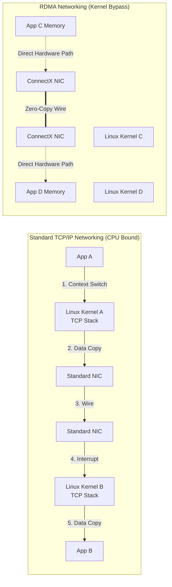

# Chapter 4 — DMA, RDMA, and Peer-to-Peer

| Chapter metadata | Value |
|---|---|
| Volume | 07 — GPU Networking and Data Paths |
| Difficulty | Advanced |
| Estimated reading time | 35 minutes |
| Primary audience | DevOps, SRE, Platform, Cloud and Infrastructure Engineers |
| Core question | How exactly do we send network packets without the Linux OS Kernel noticing? |

## Introduction

Up until now, we have solved communication *inside* the server. NVLink handles GPU-to-GPU traffic. PCIe Switches handle GPU-to-NIC traffic. 

Now, the data must leave the server and travel over the network. 

If you configure an AI server using standard Linux networking commands, you will invoke the **TCP/IP Stack**. This stack is an absolute masterpiece of engineering designed to route web pages reliably across the messy, packet-dropping public Internet. 
It is also the absolute enemy of AI infrastructure.

A Senior Infrastructure Engineer must know how to surgically bypass the Linux Kernel using DMA and RDMA.

## 1. The TCP/IP Penalty

When a Python application (like a web server) wants to send data across a standard network:
1. The application generates data in User Space memory.
2. The application issues a System Call (`send()`) to the Linux Kernel.
3. **Context Switch:** The CPU stops executing user code and switches to Kernel privileges.
4. **Data Copy:** The CPU physically copies the data from User Space RAM into Kernel Space RAM. 
5. The CPU executes the TCP/IP stack (adding TCP headers, calculating checksums, handling MTU fragmentation).
6. The CPU signals the Network Interface Card (NIC) driver.
7. The NIC reads the data over the PCIe bus and sends it down the wire.

For a 10 Gbps web server, the CPU easily handles this. 
For a 400 Gbps AI training cluster, this process instantly consumes 100% of the CPU cores. The server crashes, and the GPUs sit idle.

## 2. Direct Memory Access (DMA)

The first step in bypassing the CPU is **DMA (Direct Memory Access)**. 

Modern hardware contains specialized DMA Engines (copy controllers). Instead of the CPU reading the data from RAM and feeding it to the NIC, the CPU simply sends an instruction to the NIC: *"Here is the physical memory address. Go fetch the data yourself."*

The NIC reaches across the PCIe bus, reads the Host RAM directly, and sends it. The CPU is freed to do other work.

## 3. Remote Direct Memory Access (RDMA)

DMA solves the problem of a local device reading local memory. But what if Server A needs to read memory from Server B? 

This requires **RDMA (Remote Direct Memory Access)**. 

With RDMA, the NIC on Server A reads data from its local RAM (via DMA), blasts it across the network fiber, and the NIC on Server B receives the packet and writes it *directly into the physical RAM of Server B*. 

### The Magic of Kernel Bypass
During an RDMA transfer, the Linux Kernels on both servers are **completely unaware** that a massive data transfer just occurred. 
* There are no Context Switches.
* There are no buffer copies.
* There is no TCP/IP overhead.
* The latency drops from hundreds of microseconds to **~1 microsecond**.

### RDMA Fabrics
You cannot run RDMA over a cheap generic network switch. It requires specialized NICs (like NVIDIA ConnectX) and lossless fabrics:
* **InfiniBand:** Natively built from the ground up for RDMA.
* **RoCE (RDMA over Converged Ethernet):** A protocol that encapsulates RDMA commands into UDP packets so they can travel over highly-tuned, lossless Ethernet switches.

## Architectural Diagram: TCP/IP vs. RDMA

*Notice how the Linux Kernels in the RDMA path are completely bypassed and do no work.*

## Customer Scenario (Senior Level)

**The Situation:**
A cloud engineering team deploys a massive Ray cluster for distributed reinforcement learning across 100 GPU nodes. They provisioned nodes with 100GbE ConnectX-5 NICs. However, their monitoring shows `node_cpu_seconds_total` (CPU utilization) is pinned at 100% on the `system` (kernel) threads, and the network throughput is capped at 30 Gbps. They ask you to upgrade the CPUs to fix the network bottleneck.

**The Senior Architect Response:**
"Upgrading the CPUs will only marginally increase your network throughput. You are experiencing the classic symptoms of a TCP/IP processing bottleneck. 

Your ConnectX-5 NICs are fully capable of 100 Gbps, but because your cluster is configured to use standard TCP sockets for distributed communication, every single packet is being routed through the Linux Kernel. Processing 100 Gigabits of TCP traffic per second requires calculating checksums and handling interrupts for millions of packets per second. This has completely saturated your CPU cores with kernel-space operations (`system` time). 

To fix this, we do not need new CPUs. We need to implement **Kernel Bypass**. We must reconfigure the application to use **RDMA (RoCEv2)**. By binding your communication libraries to the RDMA verbs API, the ConnectX-5 NICs will push and pull data directly from the application's user-space memory across the network. The CPU utilization will instantly drop from 100% to near-idle, and your network throughput will saturate the full 100 Gbps line rate."

## Interview Preparation

**Conceptual:** What is Kernel Bypass, and why is it mandatory for AI Networking? *(Hint: Standard networking forces data through the OS Kernel for TCP/IP processing, causing massive CPU load and high latency context-switches. Kernel Bypass allows applications to talk directly to the NIC hardware via RDMA, achieving microsecond latency).*

**Architecture:** Explain how RDMA (Remote Direct Memory Access) moves a file from Server A to Server B. *(Hint: The application registers a region of physical memory with the NIC. The NIC uses DMA to read the memory, sends it across the lossless fabric, and the receiving NIC writes it directly into the receiving application's registered physical memory, completely bypassing both CPUs and both Linux kernels).*
