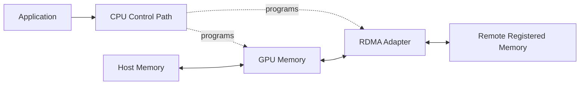
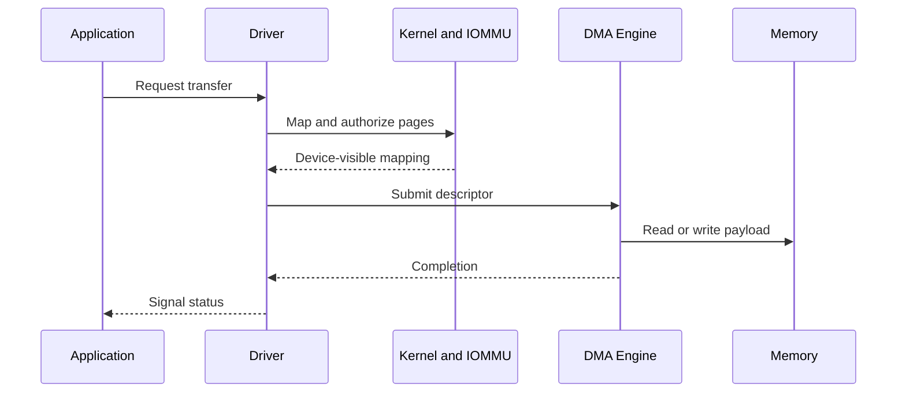
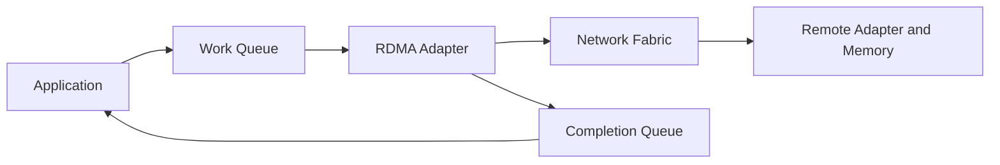
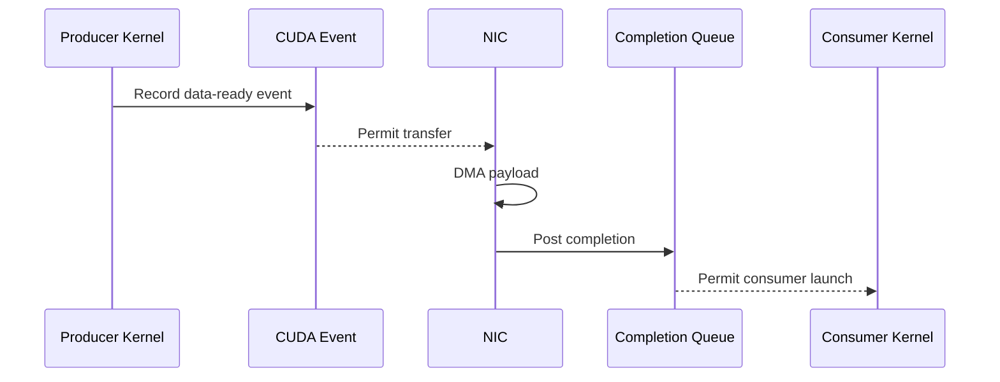

# DMA, RDMA, and Peer-to-Peer

## Introduction

A CPU can move data by loading bytes from one address and storing them at another. That model is simple, but it becomes wasteful when GPUs, network adapters, and storage controllers move large tensors continuously.

High-performance I/O separates the **control path** from the **payload path**. The CPU establishes permissions, creates queues, submits descriptors, and handles completion. Device engines move the payload between approved memory regions.

Direct Memory Access (DMA), peer-to-peer DMA, and Remote Direct Memory Access (RDMA) are related mechanisms built around that separation. They reduce selected copies and CPU work, but they do not remove memory protection, registration, synchronization, topology constraints, or failure handling.

| Chapter field | Value |
|---|---|
| Volume | 07 — GPU Networking |
| Difficulty | Advanced |
| Estimated reading time | 60 minutes |
| Previous | NVLink and NVSwitch |
| Next | GPUDirect RDMA |

## Story: The “Zero-Copy” Path That Increased CPU Usage

A training platform enables RDMA and expects CPU utilization to fall. Instead, CPU usage increases, tail latency becomes unstable, and some transfers fall back to host staging.

The deployment treated “direct” as if it meant “automatic.” Buffers were registered repeatedly on the critical path. The GPU and NIC were on different PCIe roots. Container permissions were incomplete. The application reused buffers before completion events had established safe ownership.

After the team creates reusable registered pools, aligns GPU and NIC placement, fixes software compatibility, and enforces completion ordering, the path becomes both faster and more predictable.

> Direct data movement removes selected copies. It does not remove systems engineering.

## Learning Objectives

After completing this chapter, you will be able to:

- distinguish programmed copies, DMA, peer-to-peer DMA, and RDMA;
- explain memory registration and protection keys;
- describe work queues and completion queues;
- explain why pinned memory is useful but finite;
- reason about ordering between CUDA work and network operations;
- identify host-staged fallback;
- troubleshoot registration, topology, permission, and completion failures.

## Big Picture

**Figure 7.4.1 — Control and payload paths.** The CPU authorizes and submits work; device engines move the payload.

## Why Programmed Copies Do Not Scale

A programmed copy consumes CPU instructions, cache capacity, host-memory bandwidth, and scheduler time for every byte. Small control structures may tolerate that cost. Large tensors do not.

DMA allows a device to read or write memory after the operating system and driver establish a valid mapping. The CPU submits the operation and later handles completion rather than copying the payload itself.

## DMA Lifecycle

A DMA descriptor commonly describes an address, length, direction, queue, protection context, and completion behavior.

## Peer-to-Peer DMA

Peer-to-peer DMA allows one supported device to access another device’s memory or address window without staging the payload through ordinary host memory.

Examples include:

- GPU-to-GPU transfer;
- GPU-to-NIC transfer;
- GPU-to-storage-controller transfer.

Support depends on device capabilities, PCIe topology, firmware, address translation, drivers, virtualization, and security policy. A peer path can be functionally valid yet inefficient when it crosses remote root complexes or contended switches.

## RDMA

RDMA extends direct memory operations across a network. An RDMA-capable adapter transfers data between registered memory regions while limiting CPU involvement in the payload path.

The CPU still performs important work:

- connection and queue setup;
- memory registration;
- work-request submission;
- completion processing;
- timeout and error recovery;
- orchestration and observability.

RDMA is therefore not CPU-free. It moves CPU effort away from byte-by-byte copying and toward control and progress.

## Memory Registration

A device must not access arbitrary process memory. Registration creates a stable and authorized memory region.

A simplified registration lifecycle is:

1. select a virtual-address range;
2. stabilize or pin the backing memory;
3. create device-visible mappings;
4. define access permissions;
5. return local and remote keys where applicable;
6. retain the region until all in-flight work completes;
7. deregister and release resources safely.

Registration is expensive enough that production software normally reuses registered pools instead of registering every request.

### Pinned memory

Pinned host memory provides stable backing for DMA, but excessive pinning reduces the memory available for reclamation and can exhaust process, kernel, or adapter limits. It must be monitored and released correctly.

## Protection Keys

RDMA memory regions carry protection information:

- a local key authorizes local adapter access;
- a remote key authorizes permitted remote operations;
- the region defines the valid address range and access rights.

An address alone is not sufficient. The operation must present the correct protection context.

## Queues and Completions

Applications post work and later consume completions. A completion has specific semantics. It may prove local adapter completion without proving that every application-level consumer is ready.

Software must understand local completion, remote visibility, ordering, fencing, timeout behavior, and failure states.

## Ordering with CUDA Work

A NIC must not read a GPU buffer before the producer kernel finishes. A consumer kernel must not read received data before the network operation completes and the data is visible.

Incorrect ordering can produce stale data, partial buffers, silent corruption, hangs, or use-after-free failures.

## What “Zero Copy” Actually Means

“Zero copy” usually means that one or more intermediate CPU-memory copies were removed. Physical data still moves through DMA engines, adapters, switches, and memory interfaces.

The useful question is:

> Which staging boundaries were removed, and which remain?

## Comparison

| Mechanism | Scope | Payload mover | CPU role | Example |
|---|---|---|---|---|
| Programmed copy | Local | CPU instructions | Copies every byte | Small control data |
| DMA | Local | Device engine | Maps, submits, completes | Host memory to GPU |
| Peer-to-peer DMA | Local devices | Device engine | Enables mapping and ordering | GPU to NIC |
| RDMA | Across network | RDMA adapters | Registers, queues, completes | Node-to-node tensor transfer |

## Architecture Considerations

### Performance

Separate registration cost from steady-state transfer cost. A benchmark that registers memory for every operation may be measuring setup rather than transport.

### Scalability

Large deployments consume queue pairs, memory regions, completion resources, adapter contexts, and pinned memory. Capacity planning must include these finite control resources.

### Reliability

A process, GPU, NIC, or peer can fail after work is posted. The design needs timeouts, teardown, cleanup, retry policy, and safe buffer ownership.

### Security

Direct memory access increases the importance of correct mappings and isolation. Use supported IOMMU, virtualization, container, and driver configurations. Do not disable protection merely to improve a benchmark.

### Operations

Monitor registration failures, pinned-memory consumption, completion errors, retries, timeouts, peer-memory failures, CPU use, and transport fallback.

## Production Deployment Pattern

A production design should document:

1. supported GPU, NIC, firmware, and driver combinations;
2. GPU-to-NIC topology requirements;
3. registration and buffer-pool strategy;
4. buffer lifetime and ownership rules;
5. completion semantics;
6. container device and permission requirements;
7. IOMMU and security policy;
8. fallback behavior;
9. metrics and runbooks.

Silent fallback may preserve correctness while destroying performance. Treat fallback as an explicit operational state.

## Production Troubleshooting

### Host RDMA works, but GPU buffers do not

**Symptoms:** Host-memory tests pass; GPU-buffer tests fail, stage through host memory, or consume unexpected CPU.

**Diagnosis:** Check support matrices, peer-memory integration, PCIe topology, registration errors, container device exposure, IOMMU policy, and communication-library logs.

**Resolution:** Restore a supported software and topology combination, then verify with a GPU-buffer-specific test.

### Registration failures increase under load

**Likely causes:** Pinned-memory limits, registration leaks, excessive short-lived regions, or adapter-resource exhaustion.

**Resolution:** Reuse registered pools, fix cleanup, and monitor resource consumption before raising limits.

### Data corruption appears only under concurrency

**Likely cause:** Incorrect synchronization or buffer lifetime.

**Resolution:** Rebuild the ownership model with explicit CUDA events, completions, and fences. Never rely on timing.

### Direct path still uses high CPU

Separate payload copying from registration, polling, interrupts, protocol progress, and application serialization. Polling can intentionally trade CPU for lower latency.

## Customer Scenario

A customer asks whether RDMA removes the need for CPU capacity in GPU nodes. The architect explains that it reduces CPU involvement in payload movement but does not remove application execution, launch, preprocessing, queue progress, observability, or error handling.

CPU sizing must therefore come from measured workload behavior rather than a “zero-copy” assumption.

## Interview Preparation

### Knowledge Questions

1. What is the difference between DMA and RDMA?
2. Why must memory be registered?
3. Why is pinned memory finite?
4. What does a completion prove?
5. Why is “zero copy” imprecise?

### Architecture Questions

1. Draw a GPU-to-NIC peer-DMA path with protection boundaries.
2. Design a reusable registered-buffer pool.
3. Explain how CUDA events and RDMA completions prevent races.

### Scenario Questions

1. Host RDMA passes, but GPU RDMA fails. What do you inspect?
2. A service leaks pinned memory. What symptoms appear?
3. Data corruption occurs only under load. How do you test ordering?

## Summary

DMA separates payload movement from CPU instruction execution. Peer-to-peer DMA allows supported local devices to communicate more directly. RDMA extends direct operations across a network.

These mechanisms depend on registration, protection, queues, topology, ordering, completion, and cleanup. Direct data movement is a controlled systems path—not a shortcut around systems engineering.

## Key Takeaways

- DMA reduces CPU copying but still requires CPU control.
- RDMA operates on registered memory across a network.
- Peer performance depends on topology and platform support.
- Registration and pinned memory are finite resources.
- Correct ordering is as important as bandwidth.
- “Zero copy” should identify exactly which copies were removed.

## Quick Revision Sheet

| Concept | Remember |
|---|---|
| DMA | Device moves payload after CPU setup |
| Peer-to-peer | Supported devices access each other more directly |
| RDMA | Direct memory operation across a network |
| Registration | Stable, authorized device access |
| Protection key | Authorizes a memory-region operation |
| Completion | Reports defined operation progress or status |

## Cross References

- Previous: [NVLink and NVSwitch](./chapter-03-nvlink-and-nvswitch)
- Next: [GPUDirect RDMA](./chapter-05-gpudirect-rdma)
- Related lab: [Benchmark RDMA and GPUDirect Paths](./labs/lab-03-benchmark-rdma-and-gpudirect-paths)

## Further Reading

Use current documentation for the selected GPU, NIC, operating system, virtualization layer, driver, CUDA stack, and communication library. Direct-memory support is version- and platform-specific.
