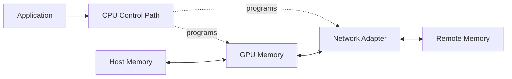
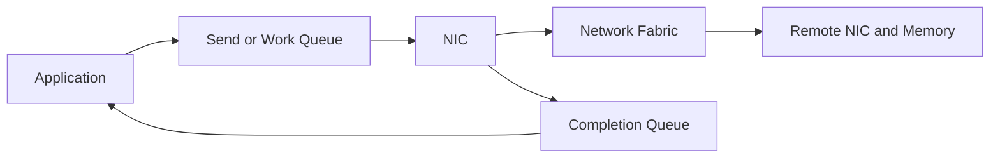
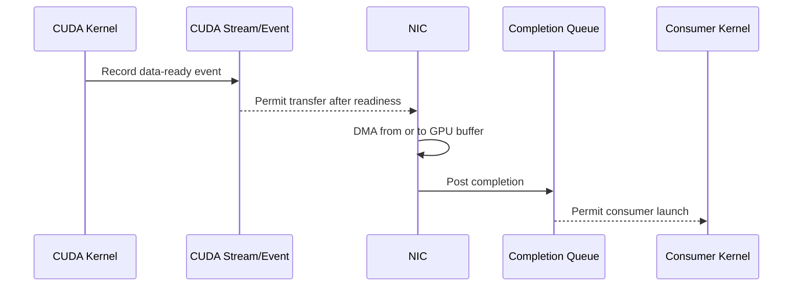

# DMA, RDMA, and Peer-to-Peer

## Introduction

A CPU can copy data by loading bytes from one address and storing them at another. That model is simple, but it does not scale when GPUs, network adapters, and storage devices move gigabytes or terabytes through a system.

High-performance I/O therefore separates **control** from **payload movement**. The CPU prepares descriptors, permissions, queue entries, and synchronization. Device engines move the payload directly between approved memory regions.

Direct Memory Access, peer-to-peer DMA, and Remote Direct Memory Access are different expressions of this principle. They reduce unnecessary CPU copying, but they do not remove the need for memory protection, registration, ordering, completion handling, topology awareness, or failure recovery.

| Chapter field | Value |
|---|---|
| Volume | 07 — GPU Networking |
| Difficulty | Advanced |
| Estimated reading time | 60–75 minutes |
| Primary focus | Direct data-movement primitives |
| Previous | NVLink and NVSwitch |
| Next | GPUDirect RDMA |

## Story: The “Zero-Copy” Deployment That Used More CPU

A team enables an RDMA-capable network for distributed training. Marketing material describes the path as direct and zero-copy. The team expects CPU utilization to fall sharply.

Instead, CPU usage increases. Registration failures appear during load. Some transfers use the intended direct path, while others stage through host memory. Tail latency becomes unstable.

The root cause is not that RDMA failed as a technology. The deployment treated “direct” as if it meant “automatic.” Buffers were registered repeatedly on the critical path. Container permissions were incomplete. The GPU and NIC were placed on different PCIe roots. The application reused memory before completion events were processed.

After redesigning buffer pools, fixing topology placement, validating memory registration, and enforcing completion ordering, the system behaves as expected.

The lesson is precise:

> Direct data movement removes selected copies. It does not remove systems engineering.

## Learning Objectives

After completing this chapter, you will be able to:

- distinguish programmed copies, DMA, peer-to-peer DMA, and RDMA;
- explain why DMA requires mapping and protection;
- describe memory registration and keys;
- explain work queues and completion queues;
- identify the role of pinned memory;
- explain ordering between CUDA work and network transfers;
- recognize host-staged fallback paths;
- troubleshoot registration, permission, topology, and completion failures.

## Big Picture

**Figure 7.4.1 — Control and payload paths are different.** The CPU establishes mappings and submits work, while device engines move the data.

## Why Programmed Copies Do Not Scale

In a programmed copy, CPU instructions load and store the payload. This consumes:

- CPU execution cycles;
- cache capacity;
- memory bandwidth;
- scheduler time;
- additional synchronization.

Small control messages may use this model effectively. Large data transfers do not.

DMA allows a device to read or write memory after the operating system and driver establish a valid mapping. The CPU submits the transfer and later processes completion rather than touching every byte.

## Direct Memory Access

A DMA-capable device typically uses descriptors containing information such as:

- source or destination address;
- length;
- direction;
- queue identifier;
- protection context;
- completion behavior.

**Figure 7.4.2 — Simplified DMA lifecycle.** Mapping, submission, transfer, and completion are separate phases.

## Peer-to-Peer DMA

Peer-to-peer DMA allows one device to access another device's exposed memory or address window without staging the payload through ordinary host memory.

Possible local paths include:

- GPU to GPU;
- GPU to NIC;
- GPU to storage controller;
- accelerator to accelerator.

Whether the path works depends on:

- device support;
- PCIe topology;
- address translation;
- driver interfaces;
- platform firmware;
- operating-system policy;
- security configuration.

A peer path can be functionally supported but still perform poorly when it crosses distant root complexes or contended switches.

## Remote Direct Memory Access

RDMA extends direct memory operations across a network. An RDMA-capable adapter can transfer data between registered memory regions with limited CPU involvement in the payload path.

The CPU still participates in:

- connection setup;
- memory registration;
- queue creation;
- work-request submission;
- completion processing;
- error recovery;
- security and orchestration.

RDMA is therefore not “CPU-free.” It changes where CPU work occurs and removes byte-by-byte payload copying.

## Memory Registration

A device must not DMA into arbitrary process memory. Registration establishes a memory region that remains available and is authorized for device access.

A simplified registration process includes:

1. select a virtual-address range;
2. pin or otherwise stabilize the backing memory;
3. create device-visible mappings;
4. assign access permissions;
5. return local and, where applicable, remote keys;
6. retain the mapping until no in-flight work can reference it.

Registration is expensive enough that high-performance applications commonly reuse registered pools instead of registering every request.

### Why pinned memory matters

Pageable host memory can be moved, reclaimed, or remapped by the operating system. Traditional DMA requires stable backing for the duration of the operation.

Pinned memory provides that stability, but excessive pinning has costs:

- less memory available for paging and reclamation;
- greater pressure on the host;
- possible registration-limit exhaustion;
- operational risk from leaked registrations.

Pinned memory is a performance tool, not an unlimited resource.

## Protection Keys

RDMA memory regions use protection information to control access. Conceptually:

- a **local key** authorizes a local device operation;
- a **remote key** authorizes a permitted remote operation;
- the memory region defines address range and access rights.

Possessing an address alone is insufficient. The operation must also present valid protection context.

This model is essential because RDMA bypasses portions of the traditional kernel networking path. Protection moves into adapter, driver, and memory-registration mechanisms.

## Queues and Completions

RDMA commonly uses queue-based operation.

**Figure 7.4.3 — Queue-based RDMA execution.** Applications post work and later consume completions.

A completion indicates the status defined by the operation and transport. It does not automatically mean every application-level dependency is satisfied. Software must understand:

- local completion;
- remote visibility;
- ordering guarantees;
- fencing;
- error states;
- timeout behavior.

## Ordering with GPU Work

A GPU buffer may be produced by a CUDA kernel and consumed by a NIC. The NIC must not read the buffer before the kernel finishes writing it. Similarly, a GPU must not consume network data before the transfer is complete and visible.

**Figure 7.4.4 — Direct paths still require ordering.** Readiness and completion must connect the GPU and network execution models.

Incorrect ordering can produce:

- stale data;
- partial buffers;
- silent corruption;
- hangs;
- use-after-free conditions.

## “Zero Copy” Explained Carefully

The phrase **zero copy** often means that one or more intermediate CPU-memory copies were removed. It does not mean that no physical data movement occurs.

A direct path may still involve:

- DMA reads and writes;
- protocol headers;
- adapter processing;
- switch traversal;
- cache or visibility operations;
- buffer-format conversion;
- synchronization.

A better architecture question is:

> Which staging boundaries and CPU-mediated copies are removed, and which remain?

## Comparing the Mechanisms

| Mechanism | Scope | Payload mover | Typical CPU role | Example |
|---|---|---|---|---|
| Programmed copy | Local | CPU instructions | Moves every byte | Small control structure |
| DMA | Local | Device engine | Maps, submits, completes | Host memory to GPU |
| Peer-to-peer DMA | Local device pair | Device engine | Enables mapping and ordering | GPU to NIC |
| RDMA | Across network | RDMA adapters | Registers, queues, completes | Node-to-node tensor transfer |

## Architecture Considerations

### Performance

Measure registration cost separately from steady-state transfer cost. A benchmark that registers memory for every operation may measure allocation behavior rather than transport capability.

### Scalability

Large systems consume queue pairs, memory regions, completion resources, pinned memory, and adapter contexts. Capacity planning must include these control-plane resources.

### Availability

In-flight direct operations complicate failure handling. A process, NIC, GPU, or peer can fail after work is posted. Applications need timeout, retry, teardown, and cleanup behavior.

### Security

Direct memory access expands the impact of incorrect mappings. Use supported IOMMU, virtualization, isolation, and driver configurations. Do not disable protection simply because a benchmark improves.

### Operations

Monitor:

- registration failures;
- pinned-memory consumption;
- queue and completion errors;
- retry and timeout counters;
- peer-memory failures;
- CPU utilization during transfer;
- topology and fallback behavior.

## Production Deployment Pattern

A robust direct-I/O design should document:

1. supported GPU, NIC, firmware, and driver combinations;
2. GPU-to-NIC topology requirements;
3. memory-registration strategy;
4. buffer-lifetime rules;
5. completion semantics;
6. container device and privilege requirements;
7. IOMMU and security policy;
8. fallback behavior;
9. observability and runbooks.

Treat fallback as an explicit design decision. Silent fallback can preserve correctness while destroying performance.

## Production Troubleshooting

### Scenario 1 — RDMA works for host buffers but not GPU buffers

**Symptoms**

- host-memory RDMA benchmarks pass;
- GPU-buffer tests fail or stage through host memory;
- CPU utilization is higher than expected.

**Diagnosis**

Check:

- GPU and NIC support matrix;
- peer-memory or current driver interface state;
- PCIe topology;
- memory-registration errors;
- container device exposure;
- IOMMU policy;
- communication-library logs.

**Root cause examples**

- unsupported GPU-to-NIC path;
- missing driver integration;
- insufficient privileges;
- remote topology;
- failed GPU-memory registration.

**Resolution**

Restore the supported software stack and topology, then verify with a GPU-buffer-specific benchmark.

### Scenario 2 — Registration failures under load

**Symptoms**

- intermittent allocation or registration errors;
- performance degrades after long runtime;
- restart temporarily resolves the issue.

**Likely causes**

- pinned-memory limit;
- registration leak;
- too many short-lived regions;
- adapter-resource exhaustion.

**Resolution**

Use reusable registered pools, fix cleanup, raise limits only when justified, and monitor resource consumption.

### Scenario 3 — Data corruption or intermittent hangs

**Symptoms**

- errors appear only under concurrency;
- checksums fail;
- buffers are occasionally incomplete;
- hangs occur during teardown.

**Likely cause**

Incorrect synchronization or buffer lifetime. A producer, NIC, or consumer is using memory before the required completion boundary.

**Resolution**

Rebuild the ordering model using explicit CUDA events, work completions, fences, and ownership rules. Do not rely on timing.

### Scenario 4 — “Direct” path uses high CPU

**Diagnosis**

Separate:

- payload copying;
- registration work;
- polling;
- interrupt handling;
- protocol progress;
- application serialization.

High CPU does not automatically prove payload staging. Polling-based progress can intentionally trade CPU for latency.

## Customer Scenario

A customer asks whether RDMA will eliminate the need for CPU capacity in GPU nodes.

The architect explains that RDMA can reduce CPU involvement in payload movement, but the node still needs CPU resources for:

- application execution;
- launch and orchestration;
- memory management;
- queue progress;
- preprocessing;
- observability;
- error handling.

The design then sizes CPU capacity from measured control-plane and preprocessing work rather than assuming it disappears.

## Interview Preparation

### Knowledge Questions

1. What is the difference between DMA and RDMA?
2. Why must memory be registered?
3. Why is pinned memory useful, and what are its risks?
4. What does a completion mean?
5. Why is “zero copy” often an imprecise phrase?

### Architecture Questions

1. Draw a GPU-to-NIC peer-DMA path with protection boundaries.
2. Explain the queue and completion model of RDMA.
3. Design a reusable registered-buffer pool for inference.

### Scenario Questions

1. Host-buffer RDMA works, but GPU-buffer RDMA fails. What do you inspect?
2. A service leaks pinned memory over several hours. What symptoms appear?
3. Data corruption occurs only under load. How do you test ordering?

### Customer Questions

1. Does RDMA remove the CPU?
2. When is direct data movement not worth the complexity?
3. How would you prove that host staging was eliminated?

### Whiteboard Question

Draw a producer GPU kernel, a NIC DMA operation, and a consumer GPU kernel. Mark the readiness and completion events required to prevent races.

## Summary

DMA separates payload movement from CPU instruction execution. Peer-to-peer DMA allows supported local devices to exchange data more directly. RDMA extends direct operations across a network.

These mechanisms depend on memory registration, protection, queues, topology, ordering, completion, and cleanup. Direct data movement is a controlled systems path, not a shortcut around systems engineering.

## Key Takeaways

- DMA reduces CPU copying but still requires CPU control.
- RDMA transfers between registered memory regions across a network.
- Peer-to-peer performance depends on topology and platform support.
- Registration and pinned memory are finite resources.
- Correct ordering is as important as bandwidth.
- “Zero copy” should identify exactly which copies were removed.

## Quick Revision Sheet

| Concept | Remember |
|---|---|
| DMA | Device moves payload after CPU setup |
| Peer-to-peer | One device directly accesses another supported endpoint |
| RDMA | Direct memory operation across a network |
| Registration | Establishes stable, authorized device access |
| Protection key | Authorizes operations on a memory region |
| Completion queue | Reports operation status and progress |
| Pinned memory | Stable host backing for DMA, but finite and costly |

## Lab Checklist

Before moving on, confirm that you can:

- explain the difference between host staging and peer DMA;
- identify registration on the critical path;
- describe buffer ownership and completion;
- recognize pinned-memory exhaustion;
- prove whether a GPU buffer used the intended direct path.

## Cross References

- Previous: [NVLink and NVSwitch](./chapter-03-nvlink-and-nvswitch)
- Next: [GPUDirect RDMA](./chapter-05-gpudirect-rdma)
- Related networking foundation: [Volume 08 — InfiniBand](../volume-08/index)
- Related lab: [Benchmark RDMA and GPUDirect Paths](./labs/lab-03-benchmark-rdma-and-gpudirect-paths)

## Further Reading

Use current documentation for the selected GPU, NIC, operating system, virtualization layer, driver, CUDA stack, and communication library. Direct-memory support and configuration are version- and platform-specific.