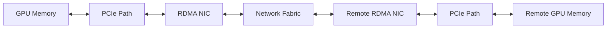

# GPUDirect RDMA

Distributed AI workloads lose time when network traffic must be staged through host memory. GPUDirect RDMA enables supported network adapters to transfer data to and from GPU memory through direct DMA paths, reducing staging and CPU pressure.

## Learning Objectives

Explain the GPUDirect RDMA path, identify prerequisites, distinguish capability from use, and troubleshoot fallback behavior.

## Architecture

**Figure 7.5.1 — Direct GPU network data path.** Control, registration, and completion remain software responsibilities even when payload data avoids host staging.

## Prerequisites

The feature depends on a supported GPU, NIC, driver stack, peer-memory interface, kernel configuration, topology, and communication library. Containerized workloads must receive the required devices and permissions. The network fabric must also be configured for the selected RDMA transport.

Capability is not proof of use. A framework may allocate host buffers, select a TCP transport, or reject the direct path because registration failed. Validate the application path with library logs, counters, and GPU-buffer benchmarks.

## Topology

A GPU and NIC under the same PCIe switch or root complex usually have a more favorable peer path than devices separated by CPU sockets. The exact supported topology is platform-specific. Use the OEM or NVIDIA platform matrix rather than assuming every enumerated pair is optimal.

| Layer | Validation question |
|---|---|
| Hardware | Are GPU and NIC peer paths supported? |
| Kernel/driver | Is peer-memory functionality active? |
| RDMA stack | Can the NIC register and access the buffer? |
| Library | Did NCCL or the application select RDMA? |
| Fabric | Are loss, congestion, routing, and MTU healthy? |
| Workload | Is message size large enough to benefit? |

## Production Design

Pair ranks, GPUs, and NICs by locality. Monitor both GPU and network telemetry. Preserve a known-good software matrix, because upgrades across kernel, driver, OFED or inbox RDMA, firmware, and communication libraries can alter behavior.

Direct paths reduce copies but can increase the blast radius of memory-mapping or driver defects. Use supported versions, least privilege, and staged validation.

## Troubleshooting

**Symptoms:** high CPU usage, lower-than-expected bandwidth, debug logs showing sockets, or one rank consistently slower.

**Diagnosis:** inspect topology, RDMA devices, memory-registration errors, library transport selection, PCIe link state, and fabric counters. Run host-memory and GPU-memory tests separately.

**Resolution:** correct GPU/NIC affinity, restore compatible software, fix fabric configuration, and retest with controlled message sizes. Do not declare success from link-up alone.

## Customer Scenario

A customer has 400 Gb/s adapters but achieves only a fraction of expected distributed throughput. The root cause is that half the ranks use remote-socket NICs and the application falls back to host staging. Rebinding ranks and restoring direct registration improves the path without adding hardware.

## Interview Preparation

**Question:** When will GPUDirect RDMA not help?

For small messages dominated by software latency, workloads that do not communicate GPU buffers, unsupported topologies, or pipelines bottlenecked elsewhere.

## Key Takeaways

- GPUDirect RDMA removes host staging from supported GPU network transfers.
- Topology and transport selection are as important as adapter speed.
- Capability must be verified at application level.
- Version compatibility and observability are production requirements.

## Cross References

- [DMA and RDMA](./chapter-04-dma-rdma-and-peer-to-peer)
- [Next: GPUDirect Storage](./chapter-06-gpudirect-storage)
