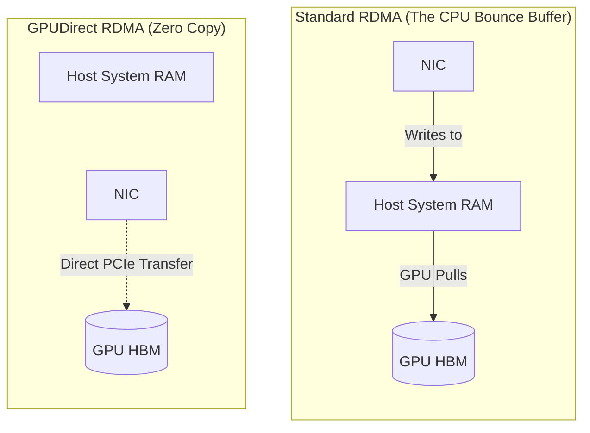

# Chapter 5 — GPUDirect RDMA

| Chapter metadata | Value |
|---|---|
| Volume | 07 — GPU Networking and Data Paths |
| Difficulty | Expert |
| Estimated reading time | 30 minutes |
| Primary audience | DevOps, SRE, Platform, Cloud and Infrastructure Engineers |
| Core question | If RDMA moves data directly into Host CPU memory, how do we get it into the GPU's memory without waking up the CPU? |

## Introduction

In Chapter 4, we learned that RDMA bypasses the Linux Kernel, moving data directly from the Network Interface Card (NIC) into the Host CPU's System RAM.

But in an AI Factory, the data isn't processed in System RAM. The data is processed in the GPU's High-Bandwidth Memory (HBM).

If we use standard RDMA, the NIC writes the data into System RAM. Then, the GPU must issue a PCIe transfer to pull the data from System RAM into its HBM. 
This is the dreaded **Host Bounce Buffer**. The data has to hit the CPU's memory before reaching the GPU, congesting the PCIe bus and adding severe latency.

To train massive models across thousands of nodes, NVIDIA created **GPUDirect RDMA**.

## 1. The GPUDirect RDMA Pipeline

GPUDirect RDMA is a technology that allows a Network Interface Card (like the ConnectX-7) to read and write data *directly* to the physical memory (HBM) of the GPU over the PCIe bus. 

### How it Works (BAR1 Memory)
Every PCIe device has a small block of memory called a Base Address Register (BAR) that it exposes to the rest of the motherboard. 
With GPUDirect RDMA, the GPU exposes a massive chunk of its HBM (using a feature called Large BAR) to the PCIe bus. 

1. GPU A (on Server 1) finishes a calculation. It tells its local NIC to send the data.
2. NIC 1 uses DMA to read the data directly out of GPU A's HBM.
3. NIC 1 blasts the data over the InfiniBand fiber optic cable.
4. NIC 2 (on Server 2) receives the data.
5. NIC 2 uses DMA to write the data directly across the PCIe bus into GPU B's exposed BAR memory.

**The Host CPU and the System RAM are completely removed from the data path.**

## 2. The Physical Motherboard Requirement

GPUDirect RDMA sounds like a pure software feature. It is not. It is governed by strict physical motherboard topologies. 

For the NIC to write directly to the GPU's memory, the electrical signals must travel over the PCIe bus. 

*   **The Bad Path:** If the GPU is wired to CPU 0, and the NIC is wired to CPU 1, GPUDirect RDMA is physically impossible. The data would have to cross the Intel UPI link between the CPUs. 
*   **The Good Path:** The GPU and the NIC must be plugged into the exact same **PCIe Switch**. This allows the PCIe switch to bounce the data directly from the NIC port to the GPU port internally, without the CPU even knowing a transfer occurred.

## Architectural Diagram: The Host Bounce Buffer vs GPUDirect

## Customer Scenario (Senior Level)

**The Situation:**
A financial institution buys 4 DGX H100 servers and connects them with a single 400G InfiniBand switch. They run a distributed PyTorch job using NCCL. They notice that the InfiniBand network is only pushing ~50 Gbps of traffic, and the GPUs are spending a significant amount of time waiting. They believe the InfiniBand cables are defective.

**The Senior Architect Response:**
"The cables are likely fine. Your cluster is suffering from a massive PCIe bottleneck because GPUDirect RDMA is disabled in the BIOS.

When you install a generic Linux OS or configure a server BIOS manually, the 'Large BAR' (Base Address Register) feature is often disabled by default. If Large BAR is disabled, the GPU cannot expose its 80GB of HBM memory to the PCIe bus. 

Because the NIC cannot see the GPU's memory directly, the NCCL library automatically falls back to standard Host-staged transfers. Every piece of data sent across the network is bouncing through the Intel CPUs' System RAM. You are attempting to push 400 Gbps of traffic through the host CPUs' memory controllers and PCIe root complexes, which violently bottlenecks the entire node.

We must reboot the servers, enter the BIOS, enable 'Above 4G Decoding' and 'Resizable BAR'. Once the operating system can map the entire GPU memory space, GPUDirect RDMA will engage, bypassing the CPUs entirely and saturating the 400G InfiniBand links instantly."

## Interview Preparation

**Conceptual:** What is the "Host Bounce Buffer," and why does GPUDirect RDMA eliminate it? *(Hint: Without GPUDirect, data from the network must be staged in the CPU's system RAM before being copied to the GPU. GPUDirect RDMA allows the NIC to write directly to the GPU's HBM over the PCIe bus, bypassing the host memory).*

**Architecture:** If you are building a custom AI server, where must you physically plug in the Network Interface Card to enable optimal GPUDirect RDMA performance? *(Hint: The NIC must be plugged into the exact same physical PCIe Switch complex as the GPU it is supporting. If it is plugged into a different root complex or across a NUMA boundary, the direct peer-to-peer PCIe transfer will fail).*
