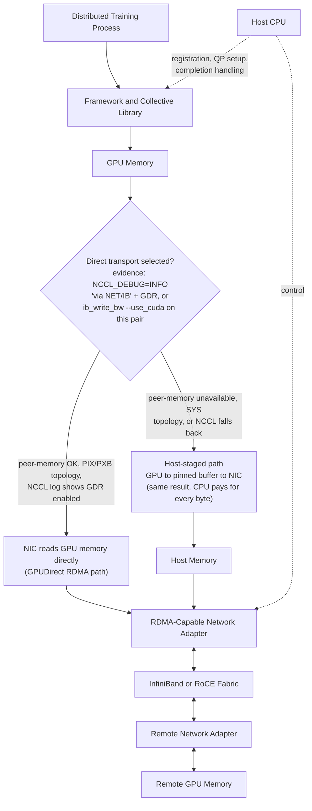
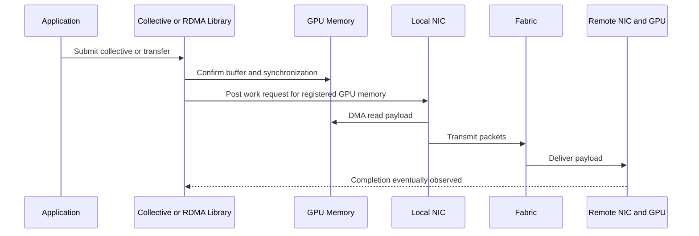
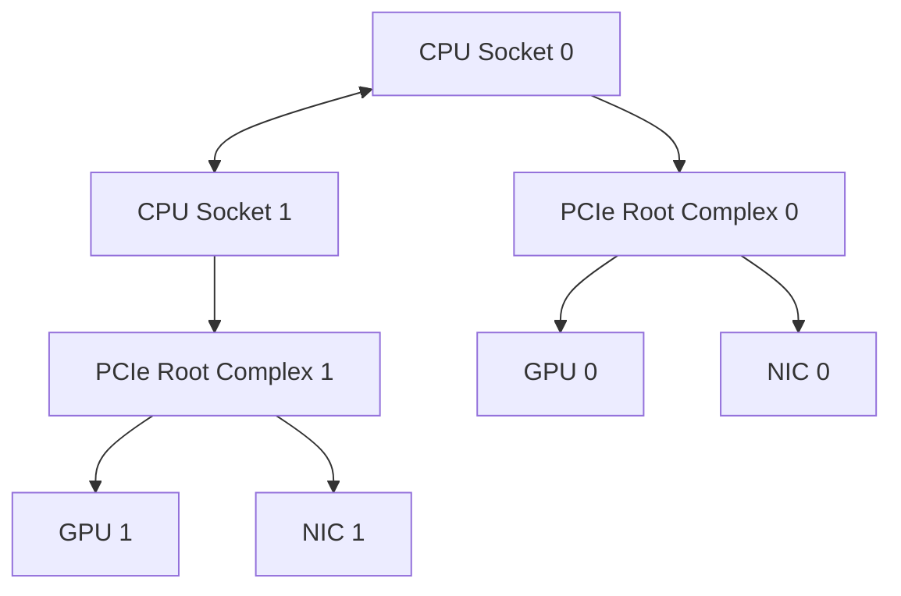

# GPUDirect RDMA

## Introduction

Distributed AI workloads repeatedly move tensors between GPUs in different servers. A traditional transfer path can involve copying data from GPU memory into host memory, processing it through the CPU networking stack, and then reversing the operation on the receiving node. That path works, but every extra copy consumes memory bandwidth, CPU cycles, and time.

GPUDirect RDMA exists to shorten this path. It allows a capable network adapter to transfer data directly to or from GPU memory without staging the payload through ordinary host buffers. The CPU still participates in setup, control, memory registration, and error handling, but it does not need to copy every byte of the data plane.

The result is not “networking without the CPU.” It is a more efficient data path whose success depends on hardware support, PCIe topology, drivers, memory registration, transport software, security policy, and application behavior.

| Chapter field | Value |
|---|---|
| Volume | 07 — GPU Networking |
| Difficulty | Advanced |
| Estimated reading time | 55 minutes |
| Primary focus | Direct GPU-to-network data movement |
| Previous | DMA, RDMA, and Peer-to-Peer |
| Next | GPUDirect Storage |

## Story

A customer deploys a multi-node training cluster with high-speed adapters and modern GPUs. Link tests between host-memory buffers achieve the expected network bandwidth, but distributed training still spends too much time in collective communication.

Profiling shows that payloads are copied from GPU memory into pinned host buffers before transmission. CPU utilization rises during communication phases, and throughput varies with NUMA placement. The network is fast, but the application is not using the intended GPU-to-adapter path.

After the platform team validates GPUDirect RDMA support, aligns GPUs with nearby adapters, and confirms the collective library is selecting the direct transport, communication becomes more consistent. The important change was not a faster switch. It was removing an unnecessary staging boundary.

## Learning Objectives

After completing this chapter, you will be able to:

- explain why GPUDirect RDMA was created;
- distinguish control-plane CPU work from data-plane payload movement;
- describe memory registration and DMA mapping at a systems level;
- identify the hardware and software dependencies of a direct path;
- explain why PCIe and NUMA topology affect delivered performance;
- validate whether a workload is using GPUDirect RDMA;
- troubleshoot direct-path failures and host-staged fallbacks;
- discuss customer trade-offs, security boundaries, and operational risks.

## Big Picture



**Figure 7.5.1 — GPUDirect RDMA shortens the payload path, if the direct branch is actually taken.** The CPU coordinates the operation; the decision point shows the one fact that separates a healthy deployment from a silently-degraded one — whether the NIC reads/writes GPU memory directly, or the transfer quietly falls back to host staging while the job keeps running. The Story below is exactly this fallback happening undetected.

## Why Host Staging Became a Bottleneck

Host staging introduces more than one copy. A send operation may require:

1. the GPU to finish producing data;
2. a copy from device memory to pinned host memory;
3. a network transfer from the host buffer;
4. a receive into remote host memory;
5. a copy into the remote GPU;
6. synchronization before the receiving kernel continues.

Each stage can be individually fast and still create an inefficient pipeline. The copies consume PCIe bandwidth twice, compete with other host traffic, and involve CPU-managed buffers. For communication-heavy training, the repeated overhead becomes part of every iteration.

GPUDirect RDMA removes the host payload buffers from the intended fast path. It does not remove PCIe, the I/O memory management unit, address translation, memory pinning, queue management, or transport protocols. It removes a specific form of data staging.

## Internal Working

### Memory registration

An RDMA adapter cannot safely access arbitrary virtual addresses. The communication stack registers a memory region and establishes the mappings required for DMA. For GPU memory, this process involves cooperation among the application or collective library, the CUDA stack, the GPU driver, the peer-memory or DMA-buf integration layer, and the RDMA driver.

Registration performs several jobs:

- identifies the memory range;
- prevents the backing pages from disappearing during I/O;
- establishes device-accessible mappings;
- associates access permissions and keys;
- makes the region usable by queue-pair work requests.

Registration is not free. Applications therefore benefit from reusing buffers and registration state rather than repeatedly registering short-lived regions.

### The send path



**Figure 7.5.2 — Simplified direct send path.** Control operations still pass through software, but the NIC reads the payload directly from GPU memory.

### The receive path

On receive, the remote adapter writes the incoming payload into a registered GPU buffer. Completion handling tells software that the operation has finished. The application must still obey synchronization rules before kernels consume the new data.

Direct memory access does not eliminate ordering requirements. A kernel reading data before the receive completes creates a correctness failure, not merely a performance problem.

## Required Architecture Layers

| Layer | Requirement | Failure symptom |
|---|---|---|
| GPU and platform | Supported peer-memory path and compatible topology | Registration or peer-access failure |
| Network adapter | RDMA capability and correct firmware | Host path only or transport failure |
| PCIe fabric | Supported peer routing and sufficient width | Low bandwidth or no direct path |
| GPU driver | Compatible memory-export mechanism | Registration errors |
| RDMA driver | Compatible peer-memory integration | RDMA tests fail on GPU buffers |
| Collective/runtime | Direct transport selected | Application silently stages through host |
| Fabric | Healthy lossless or managed RDMA transport | Retries, congestion, timeouts |
| Security policy | DMA and device access permitted | Access denied or isolation failure |

A direct path is an end-to-end property. Installing one capable component does not prove the path exists.

## Topology and Locality

The GPU and network adapter may share a PCIe switch, connect through the same root complex, or sit under different CPU sockets. These paths are not equivalent.



**Figure 7.5.3 — Preferred GPU-to-NIC locality.** Pairing each GPU group with a nearby adapter avoids unnecessary cross-socket traversal.

A direct GPU-memory path can still be physically indirect. Traffic that crosses CPU interconnects or multiple PCIe switches may deliver lower bandwidth and higher variability. Production placement should align ranks, GPUs, CPU cores, and adapters with the actual topology.

## GPUDirect RDMA and Collective Communication

Collective libraries use topology information and transport plugins to choose communication paths. A large AllReduce may combine:

- NVLink or NVSwitch within a node;
- GPUDirect RDMA between nodes;
- ring, tree, or hierarchical collective algorithms;
- multiple adapters per node;
- channel parallelism across links.

The library may fall back when a direct transport is unavailable. A fallback is valuable for availability, but dangerous for performance transparency. The job may continue while silently using host staging or sockets.

Platform teams should monitor both success and path selection. “The training job runs” is not a sufficient acceptance criterion.

## Performance Model

A simplified communication time model is:

```text
transfer time ≈ startup latency + payload size / delivered bandwidth + synchronization delay
```

GPUDirect RDMA can reduce copy overhead and CPU involvement, but it cannot exceed the slowest physical segment. Delivered bandwidth can be limited by:

- GPU memory behavior;
- PCIe width or generation;
- adapter line rate;
- fabric oversubscription;
- packet loss or congestion response;
- remote-side topology;
- collective algorithm efficiency;
- competing traffic.

Small messages are often latency-sensitive. Large messages are more bandwidth-sensitive. A benchmark must therefore test multiple message sizes.

**Worked, illustrative example — what the fallback branch actually costs a training step.** Consider an AllReduce over a 700 MB gradient tensor (roughly a 175M-parameter model's gradients at FP32) across two nodes. Using the Step 3 figures above as stand-ins for delivered bandwidth:

```text
direct path:  700 MB / 23,488 MB/s ≈ 0.030 s  ≈ 30 ms per AllReduce
staged path:  700 MB / 9,762 MB/s  ≈ 0.072 s  ≈ 72 ms per AllReduce
```

A 42 ms difference per AllReduce looks small in isolation, but a training loop that performs one AllReduce per step and runs 10,000 steps accumulates `42 ms × 10,000 ≈ 420 seconds` (7 minutes) of pure communication-path overhead from the fallback alone — with no change to the model, data, or GPU compute. This is the arithmetic behind the chapter's opening story: the fix that mattered was not a faster switch, it was making sure every channel actually took the `GDRDMA` branch instead of quietly staging through host memory.

## Architecture Trade-offs

### Performance versus operational complexity

A direct path can improve communication efficiency, but introduces compatibility dependencies across firmware, kernel, drivers, CUDA, RDMA libraries, and collective software.

### DMA capability versus isolation

RDMA and peer-memory access expand the importance of IOMMU policy, device assignment, container privileges, and tenant boundaries. A performance feature must not bypass the platform’s security model.

### Fallback availability versus predictability

Fallback paths keep workloads running but may violate performance objectives. Production platforms should alert when path selection changes.

### Adapter density versus PCIe contention

Adding more adapters increases potential network bandwidth only when the host I/O fabric can sustain the aggregate traffic.

## Production Deployment Pattern

A production design should document:

1. the approved GPU and adapter combinations;
2. the PCIe and NUMA topology for every node class;
3. firmware, driver, CUDA, RDMA, and collective compatibility;
4. the intended adapter per GPU or rank group;
5. memory-registration behavior and limits;
6. benchmark baselines across message sizes;
7. telemetry for retries, errors, and fallback paths;
8. rollback procedures for driver or firmware changes.

Commissioning should include host-memory RDMA tests, GPU-memory RDMA tests, topology inspection, and application-level collective benchmarks. Passing only one layer leaves uncertainty.

## Validation Strategy

### Step 1 — Prove hardware visibility

Confirm GPUs and adapters are visible, healthy, and operating at the expected PCIe link width and speed.

```bash
nvidia-smi --query-gpu=index,name,pcie.link.gen.current,pcie.link.width.current --format=csv
```

```text
index, name, pcie.link.gen.current, pcie.link.width.current
0, NVIDIA H100 80GB HBM3, 5, 16
1, NVIDIA H100 80GB HBM3, 5, 16
```

`pcie.link.gen.current` and `pcie.link.width.current` (5, 16 — Gen5 x16) are the **negotiated, current** values, not the card's rated maximum — a card capable of Gen5 x16 that shows `1, 16` or `5, 8` here has down-trained, and every downstream RDMA or GPUDirect number will be lower than expected until that is fixed. Compare this reading against `nvidia-smi topo -m` (introduced in the previous chapter) for the same node before running any bandwidth test — a down-trained link and a `SYS`-only GPU/NIC pairing produce similar-looking slow results but need different fixes.

### Step 2 — Prove RDMA independently

Run approved RDMA bandwidth and latency tests using host memory. This isolates the network transport from GPU-memory integration.

```bash
ib_write_bw -d mlx5_0 -a <remote_host>
```

```text
 #bytes     #iterations    BW peak[MB/sec]    BW average[MB/sec]   MsgRate[Mpps]
 4194304    1000            24842.10            24798.55            0.005914
```

`BW average: 24798.55 MB/sec` (~24.8 GB/s, illustrative for an EDR-class link) with host buffers is the node's transport baseline. Every later, GPU-buffer-involving number in this validation sequence should be compared against this figure, not against a vendor spec sheet — the spec sheet doesn't know about this node's actual cabling, firmware, or topology.

### Step 3 — Prove peer-memory integration

Run a tool or framework test that explicitly uses GPU buffers. Verify that the test reports the expected memory type and transport.

```bash
ib_write_bw -d mlx5_0 -a --use_cuda=0 <remote_host>
```

```text
 #bytes     #iterations    BW peak[MB/sec]    BW average[MB/sec]   MsgRate[Mpps]
 4194304    1000            23615.40            23488.02            0.005601
```

`--use_cuda=0` tells the test to source the payload from GPU 0's memory instead of host memory. `BW average: 23488.02 MB/sec` sitting close to the Step 2 host-memory baseline (24798.55 MB/sec, roughly 95% of it) is the signature of a healthy direct path — GDR is engaging and the GPU-memory transfer is nearly as fast as the host-memory one. If this number instead came back around 9,000-10,000 MB/sec (roughly 40% of baseline, as in the fallback example later in this chapter), that gap is the proof that the transfer is staging through host memory instead of reading GPU memory directly, regardless of what the test's exit code says.

### Step 4 — Prove collective path selection

Enable library diagnostics in a controlled environment and confirm the selected transport, adapters, and topology channels.

```bash
NCCL_DEBUG=INFO NCCL_DEBUG_SUBSYS=INIT,NET python train.py
```

```text
node0:1234:1234 [0] NCCL INFO NET/IB : Using [0]mlx5_0:1/IB [RO]; OOB eth0:10.0.0.11
node0:1234:1235 [1] NCCL INFO NET/IB : Using [1]mlx5_1:1/IB [RO]; OOB eth0:10.0.0.11
node0:1234:1234 [0] NCCL INFO Channel 00/04 : 0[0] -> 1[1] via P2P/CUMEM
node0:1234:1234 [0] NCCL INFO Channel 00/04 : 0[0] -> 2[0] via NET/IB/0/GDRDMA
node0:1234:1234 [0] NCCL INFO Using network IB
```

The line to search for is `GDRDMA` — its presence on the inter-node channel (`0[0] -> 2[0] via NET/IB/0/GDRDMA`) confirms NCCL selected the GPUDirect RDMA transport for that link. Its *absence*, or a channel instead reading `via NET/IB/0` with no `GDRDMA` suffix, means NCCL fell back to a host-staged network path for that channel even though the job will still run and complete correctly — this is precisely the silent-fallback risk called out throughout this chapter, and `NCCL_DEBUG=INFO` is the one piece of evidence that catches it directly instead of inferring it from a slow step time.

### Step 5 — Compare against baseline

Measure multiple message sizes and compare with the node-class baseline. A single peak number is not enough.

## Production Troubleshooting

### Scenario 1 — Host RDMA is fast, GPU RDMA is slow

**Symptoms**

- host-buffer bandwidth is healthy;
- GPU-buffer bandwidth is much lower;
- CPU utilization may be unexpectedly high;
- results vary by GPU and adapter pair.

**Diagnosis**

- compare local and remote GPU-to-NIC pairs;
- verify peer-memory registration succeeds;
- inspect PCIe link state and topology;
- confirm the test is not staging through host memory;
- check IOMMU and ACS-related platform behavior;
- compare driver and firmware versions with the qualified matrix.

**Likely root causes**

- remote NUMA or PCIe placement;
- direct-memory integration unavailable;
- link down-training;
- unsupported switch or root-complex path;
- software fallback.

**Resolution**

Restore supported versions, align device placement, correct platform configuration, or explicitly disable an unsafe direct path until the node is repaired.

**Evidence in practice:** on the affected node, the host-memory baseline and the GPU-buffer test diverge sharply:

```text
$ ib_write_bw -d mlx5_0 -a <remote_host>                  # host memory
 BW average[MB/sec]: 24798.55

$ ib_write_bw -d mlx5_0 -a --use_cuda=0 <remote_host>      # GPU memory
 BW average[MB/sec]: 9762.44
```

9762.44 MB/s against a 24798.55 MB/s baseline is roughly 39% — squarely in "staging through host memory" territory rather than "direct path, somewhat degraded." Cross-checking `nvidia-smi topo -m` for this GPU/NIC pair shows the mechanism:

```text
        GPU0    NIC0    NIC1
GPU0     X      SYS     PIX
```

`GPU0`↔`NIC0` reads `SYS` — the pairing being used in this job crosses the CPU-to-CPU interconnect — while `GPU0`↔`NIC1` reads `PIX`. The fix here is a rank-placement change (bind this GPU's traffic to `NIC1`, not `NIC0`), not a driver or firmware change; the topology, not the software stack, explains the entire gap.

### Scenario 2 — Collective communication regresses after an upgrade

**Symptoms**

- no hardware alarms;
- jobs still complete;
- communication time increases;
- debug output shows different transport selection.

**Root cause**

A driver, RDMA component, or collective-library change prevented the previous GPUDirect path and triggered fallback.

**Resolution**

Compare the before-and-after compatibility matrix, transport logs, loaded modules, and registration behavior. Roll back or restore the qualified combination.

### Scenario 3 — Intermittent timeouts under load

**Symptoms**

- short tests pass;
- large multi-node jobs time out;
- retry or congestion counters rise;
- failures correlate with specific racks or paths.

**Diagnosis**

Treat the issue as end-to-end. Inspect fabric congestion, adapter counters, PCIe errors, GPU XID events, collective timeouts, and workload synchronization.

**Evidence in practice:** two paired snapshots, taken during a stalled multi-node job.

```bash
nvidia-smi -q -d ROWREMAPPER,PAGE_RETIREMENT | grep -A2 Xid
dmesg -T | grep -i xid
```

```text
[Thu Aug  6 03:41:02 2026] NVRM: Xid (PCI:0000:1b:00): 79, GPU has fallen off the bus
```

An Xid 79 (illustrative — GPU has fallen off the bus) on one node in the job is enough, by itself, to explain a distributed timeout: a collective that includes a rank on that GPU cannot complete because its peer is gone, and every other rank in the collective will eventually show a timeout too, even though their own hardware is healthy. This is why "treat the issue as end-to-end" matters — a fabric-counter investigation on the *other* 63 GPUs would find nothing wrong, because nothing is wrong with them.

```bash
ibqueryerrors -r
```

```text
Errors for 0x9803...1a20 "mlx5_0" port 1
   PortRcvErrors: 1482
   SymbolErrorCounter: 0
   LinkDowned: 2
```

`PortRcvErrors: 1482` and `LinkDowned: 2` on a specific adapter identify link-level retransmission and at least two link-down events — a candidate root cause for retries and congestion that is independent of the Xid above, and evidence that this incident could have two contributing faults (a dropped GPU on one node, a flaky link on another) rather than one.

**Prevention**

Use sustained qualification tests, not only brief link checks. Alert on counter deltas and path changes.

## Customer Scenario

A financial-services customer wants to expand from eight to sixty-four GPUs. Their first question is whether they need a faster network. The architect asks for the model-parallel strategy, collective profile, message-size distribution, existing topology, and iteration timeline.

The design review shows that the current adapters have sufficient line rate, but half the ranks use remote adapters and host-staged transfers. The recommended first step is topology-aware placement and direct-path validation. Only after measuring the corrected path does the team decide whether additional fabric capacity is required.

This avoids buying bandwidth to compensate for a software and locality problem.

## Interview Preparation

### Knowledge Questions

1. What problem does GPUDirect RDMA solve?

   > "Without it, every inter-node tensor makes a detour through host memory on both ends — GPU to pinned host buffer, across the network, host buffer to remote GPU. GPUDirect RDMA lets the NIC read or write GPU memory directly, so that detour disappears from the fast path. It's not 'networking without the CPU' — the CPU still sets everything up — it's removing a specific, expensive staging copy from the steady-state transfer."

2. Why does the CPU still matter in a direct GPU-to-NIC transfer?

   > "The CPU does connection setup, memory registration, work-request submission, and completion and error handling — none of that goes away. What changes is that the CPU stops touching the payload bytes themselves. So CPU utilization during communication should drop, but it never goes to zero, and I wouldn't size CPU capacity for a GPU node assuming it will."

3. What is memory registration?

   > "It's the process that makes GPU memory safe for a NIC to touch directly. The collective library, the CUDA stack, the GPU driver, and the RDMA driver all cooperate to identify the address range, pin it so it can't move mid-transfer, build a device-accessible mapping, and issue a key that authorizes exactly that range. It's not free — which is why production systems reuse registered buffers instead of registering fresh memory on every send."

4. Why can a direct path still be slow?

   > "Because 'direct' only means the NIC skips the host-memory copy — it says nothing about the physical route the payload takes to get to that NIC. If the GPU and the adapter sit under different CPU sockets, `nvidia-smi topo -m` will show `SYS`, and that traffic is crossing a CPU interconnect even though it's technically a 'direct' GPUDirect RDMA transfer. I've seen this exact gap — a functionally-correct direct path delivering less than half of the same node's host-RDMA baseline — and topology was the entire explanation."

### Architecture Questions

1. Draw the end-to-end path for an inter-node GPU transfer.

   > "I'd draw the training process, then the collective library underneath it, then GPU memory — and from GPU memory I draw one edge straight to the local NIC, skipping host memory, labeled with the registration key. Then NIC to fabric to remote NIC to remote GPU memory, mirrored on the other side. Off to the side I'd draw the CPU with dotted lines into the collective library and the NIC — control only, never touching that main data edge. And I'd add the branch: if peer-memory isn't available or the topology is wrong, that same data edge reroutes through a host-memory box instead, and I'd say out loud that this reroute is silent — the job doesn't fail, it just gets slower."

2. Explain how PCIe and NUMA locality influence adapter selection.

   > "A GPU and a NIC that share a PCIe switch — `nvidia-smi topo -m` reporting `PIX` — give you the shortest, least contended path. Push that same transfer across a `SYS` link, crossing CPU sockets, and you're competing with cross-socket interconnect traffic and adding a hop, even though GPUDirect RDMA is 'working' in both cases. So adapter selection isn't just 'is there an adapter available' — it's 'is there an adapter available *near this GPU*,' and I'd pick the topology-matched one every time, even if a farther adapter is technically idle."

3. Design a validation plan for a new GPU and NIC node class.

   > "I wouldn't trust a single number — I'd go in layers. First, prove hardware visibility: GPUs and NICs enumerate, and PCIe link generation and width match spec. Second, prove RDMA independently with a host-memory bandwidth test — that isolates the fabric from anything GPU-specific. Third, rerun that same test against GPU buffers and compare it to the host-memory number — a healthy direct path should land close to that baseline, not at a fraction of it. Fourth, turn on `NCCL_DEBUG=INFO` and confirm the collective library's log actually shows `GDRDMA` on the inter-node channels. Only after all four layers pass do I trust an application-level benchmark, because a single green number at the top of that stack can hide a failure at any layer underneath it."

### Scenario Questions

1. Host-memory RDMA is fast but GPU-memory RDMA is slow. What do you inspect?

   > "Since the host test already proved the fabric, cabling, and adapter are healthy, I don't re-investigate the network. I go straight to the GPU-memory-specific layer: is peer-memory registration actually succeeding, what does `nvidia-smi topo -m` say about this exact GPU/NIC pair, and is the test quietly staging through host memory instead of touching GPU memory at all. In one case I've reasoned through, a GPU-buffer test came back at about 39% of the host-memory baseline, and the topology table showed `SYS` for that pair — that gap alone explained the entire regression."

2. A job completes after an upgrade but takes 30 percent longer. How could fallback explain it?

   > "A completing job with no errors is exactly what a silent fallback looks like — correctness is preserved, performance isn't. My first move after an upgrade like this is `NCCL_DEBUG=INFO` on a short run, checking whether the inter-node channels still say `GDRDMA` or whether they've quietly dropped to a plain `NET/IB` line. If the driver, RDMA component, or collective library version changed and broke the peer-memory integration, this is precisely the symptom — no alarms, just a slower number — and the log line is the one piece of evidence that catches it directly."

3. Two identical nodes show different performance. Which topology and version checks matter?

   > "'Identical' on paper doesn't mean identical in practice — I'd pull `nvidia-smi topo -m` on both and diff them; rank-to-adapter placement or even BIOS-level PCIe enumeration can differ between nominally-matched nodes. Then I'd diff driver, firmware, RDMA stack, and collective-library versions — a partial rollout or an unpinned dependency is a very common way for 'identical' hardware to diverge in software. I'd only look at the fabric itself after ruling both of those out."

### Customer Questions

1. When should a customer pay for GPUDirect-capable infrastructure?

   > "When the workload is genuinely communication-heavy — large models with frequent, large collectives — and I can show, with a topology-aware baseline, that the current path is host-staging. If I can quantify the AllReduce time difference in milliseconds per step and multiply by step count, that's a concrete number to bring to a budget conversation instead of a vague 'it'll be faster.'"

2. When is ordinary host networking sufficient?

   > "When communication is a small fraction of the step time to begin with — small models, infrequent synchronization, or workloads that are compute-bound rather than communication-bound. In those cases, GPUDirect RDMA adds qualification and compatibility overhead for a segment of the pipeline that was never the bottleneck. I'd want to see a profile before recommending the investment either way."

3. How do you explain the security and compatibility risks?

   > "Direct memory access from a NIC into GPU memory raises the stakes on IOMMU policy, device assignment, and container privileges — this isn't a feature you bolt on without touching the security model, because getting isolation wrong here means one tenant's traffic could, in principle, reach another tenant's memory. On compatibility, I'd be upfront that this is a stack of dependencies — firmware, driver, CUDA, RDMA libraries, collective software — that all have to move together, and an unqualified combination doesn't necessarily fail loudly, it can just silently fall back to a slower path."

### Whiteboard Exercise

Draw an eight-GPU, four-adapter node. Show local and remote GPU-to-NIC paths, then propose a rank-placement strategy for a two-node training job.

> "I'd draw eight GPUs in two groups of four, each group under its own CPU socket and PCIe root complex, and two adapters per socket. For each GPU I draw a short edge to the adapter under the same root complex — that's the `PIX`/`PXB` local path — and I'd draw a longer, dashed edge crossing to the other socket's adapters, labeled `SYS`, to show it's available but not preferred. For rank placement across two nodes, I'd assign each GPU's collective traffic to the adapter physically nearest it, keep that binding explicit in the launch configuration rather than letting the library guess, and verify afterward with `NCCL_DEBUG=INFO` that every inter-node channel actually shows `GDRDMA` on the adapter I intended — because the whole point of drawing this diagram is to make the placement decision explicit instead of accidental."

## Summary

GPUDirect RDMA shortens the distributed GPU data path by allowing an RDMA adapter to read or write registered GPU memory directly. It reduces host staging, but does not remove software control, memory registration, synchronization, topology constraints, or network behavior.

The feature should be treated as a qualified end-to-end architecture. Production success requires compatible components, topology-aware placement, explicit path validation, and monitoring for fallback or regression.

## Key Takeaways

- GPUDirect RDMA removes host payload staging from the intended fast path.
- The CPU still coordinates control, registration, and completion handling.
- GPU-to-NIC topology strongly affects delivered performance.
- Direct-path capability must be validated with GPU buffers, not inferred from host RDMA tests.
- Fallback can preserve functionality while hiding a serious performance regression.
- Compatibility and security are part of the architecture.

## Quick Revision Sheet

| Question | Answer |
|---|---|
| What is shortened? | The payload path between GPU memory and an RDMA adapter |
| What remains? | CPU control, registration, queues, completion, synchronization |
| Main dependencies | GPU, NIC, PCIe, drivers, RDMA stack, collective library, fabric |
| Main production risk | Silent fallback or topology mismatch |
| Best validation | Layered host, GPU-buffer, and collective benchmarks |

## Lab Checklist

Before completing the related lab, confirm that you can:

- draw the expected GPU-to-NIC path;
- identify local adapter affinity;
- distinguish host-memory and GPU-memory RDMA tests;
- capture baseline counters;
- recognize a fallback path.

## Cross References

- Previous: [DMA, RDMA, and Peer-to-Peer](./chapter-04-dma-rdma-and-peer-to-peer)
- Next: [GPUDirect Storage](./chapter-06-gpudirect-storage)
- Related: [Topology-Aware Placement](./chapter-08-topology-aware-placement)
- Lab: [Benchmark RDMA and GPUDirect Paths](./labs/lab-03-benchmark-rdma-and-gpudirect-paths)

## Further Reading

Consult the official NVIDIA GPUDirect RDMA documentation, the selected network-adapter documentation, the RDMA transport documentation for the deployed fabric, and the collective-library troubleshooting guide for the qualified software release.
