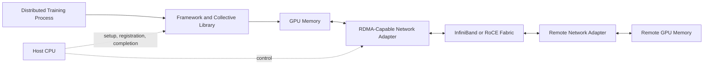
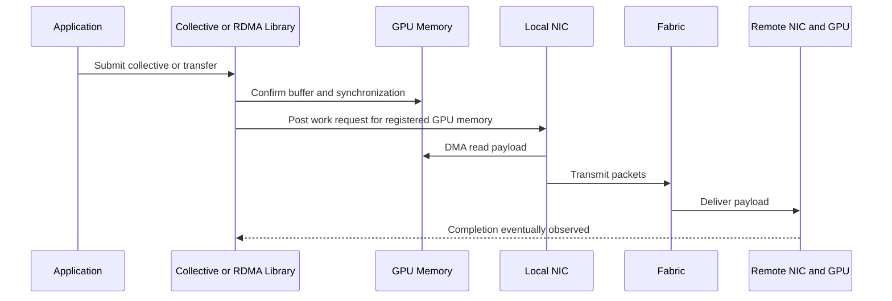
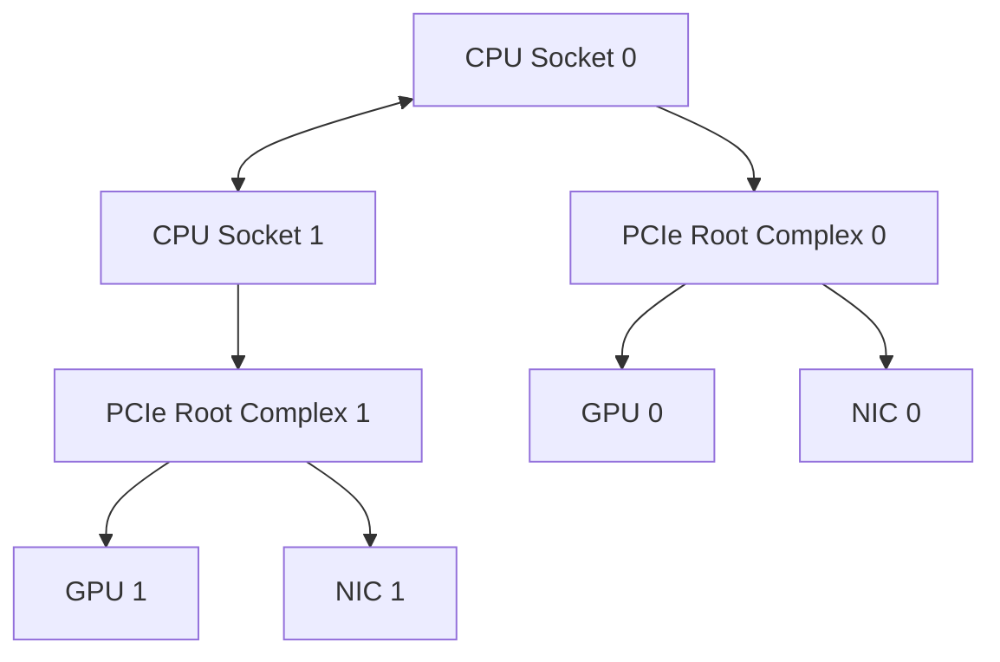

# GPUDirect RDMA

## Introduction

Distributed AI workloads repeatedly move tensors between GPUs in different servers. A traditional transfer path can involve copying data from GPU memory into host memory, processing it through the CPU networking stack, and then reversing the operation on the receiving node. That path works, but every extra copy consumes memory bandwidth, CPU cycles, and time.

GPUDirect RDMA exists to shorten this path. It allows a capable network adapter to transfer data directly to or from GPU memory without staging the payload through ordinary host buffers. The CPU still participates in setup, control, memory registration, and error handling, but it does not need to copy every byte of the data plane.

The result is not “networking without the CPU.” It is a more efficient data path whose success depends on hardware support, PCIe topology, drivers, memory registration, transport software, security policy, and application behavior.

| Chapter field | Value |
|---|---|
| Volume | 07 — GPU Networking |
| Difficulty | Advanced |
| Estimated reading time | 55 minutes |
| Primary focus | Direct GPU-to-network data movement |
| Previous | DMA, RDMA, and Peer-to-Peer |
| Next | GPUDirect Storage |

## Story

A customer deploys a multi-node training cluster with high-speed adapters and modern GPUs. Link tests between host-memory buffers achieve the expected network bandwidth, but distributed training still spends too much time in collective communication.

Profiling shows that payloads are copied from GPU memory into pinned host buffers before transmission. CPU utilization rises during communication phases, and throughput varies with NUMA placement. The network is fast, but the application is not using the intended GPU-to-adapter path.

After the platform team validates GPUDirect RDMA support, aligns GPUs with nearby adapters, and confirms the collective library is selecting the direct transport, communication becomes more consistent. The important change was not a faster switch. It was removing an unnecessary staging boundary.

## Learning Objectives

After completing this chapter, you will be able to:

- explain why GPUDirect RDMA was created;
- distinguish control-plane CPU work from data-plane payload movement;
- describe memory registration and DMA mapping at a systems level;
- identify the hardware and software dependencies of a direct path;
- explain why PCIe and NUMA topology affect delivered performance;
- validate whether a workload is using GPUDirect RDMA;
- troubleshoot direct-path failures and host-staged fallbacks;
- discuss customer trade-offs, security boundaries, and operational risks.

## Big Picture



**Figure 7.5.1 — GPUDirect RDMA shortens the payload path.** The CPU coordinates the operation, while the network adapter directly reads or writes registered GPU memory.

## Why Host Staging Became a Bottleneck

Host staging introduces more than one copy. A send operation may require:

1. the GPU to finish producing data;
2. a copy from device memory to pinned host memory;
3. a network transfer from the host buffer;
4. a receive into remote host memory;
5. a copy into the remote GPU;
6. synchronization before the receiving kernel continues.

Each stage can be individually fast and still create an inefficient pipeline. The copies consume PCIe bandwidth twice, compete with other host traffic, and involve CPU-managed buffers. For communication-heavy training, the repeated overhead becomes part of every iteration.

GPUDirect RDMA removes the host payload buffers from the intended fast path. It does not remove PCIe, the I/O memory management unit, address translation, memory pinning, queue management, or transport protocols. It removes a specific form of data staging.

## Internal Working

### Memory registration

An RDMA adapter cannot safely access arbitrary virtual addresses. The communication stack registers a memory region and establishes the mappings required for DMA. For GPU memory, this process involves cooperation among the application or collective library, the CUDA stack, the GPU driver, the peer-memory or DMA-buf integration layer, and the RDMA driver.

Registration performs several jobs:

- identifies the memory range;
- prevents the backing pages from disappearing during I/O;
- establishes device-accessible mappings;
- associates access permissions and keys;
- makes the region usable by queue-pair work requests.

Registration is not free. Applications therefore benefit from reusing buffers and registration state rather than repeatedly registering short-lived regions.

### The send path



**Figure 7.5.2 — Simplified direct send path.** Control operations still pass through software, but the NIC reads the payload directly from GPU memory.

### The receive path

On receive, the remote adapter writes the incoming payload into a registered GPU buffer. Completion handling tells software that the operation has finished. The application must still obey synchronization rules before kernels consume the new data.

Direct memory access does not eliminate ordering requirements. A kernel reading data before the receive completes creates a correctness failure, not merely a performance problem.

## Required Architecture Layers

| Layer | Requirement | Failure symptom |
|---|---|---|
| GPU and platform | Supported peer-memory path and compatible topology | Registration or peer-access failure |
| Network adapter | RDMA capability and correct firmware | Host path only or transport failure |
| PCIe fabric | Supported peer routing and sufficient width | Low bandwidth or no direct path |
| GPU driver | Compatible memory-export mechanism | Registration errors |
| RDMA driver | Compatible peer-memory integration | RDMA tests fail on GPU buffers |
| Collective/runtime | Direct transport selected | Application silently stages through host |
| Fabric | Healthy lossless or managed RDMA transport | Retries, congestion, timeouts |
| Security policy | DMA and device access permitted | Access denied or isolation failure |

A direct path is an end-to-end property. Installing one capable component does not prove the path exists.

## Topology and Locality

The GPU and network adapter may share a PCIe switch, connect through the same root complex, or sit under different CPU sockets. These paths are not equivalent.



**Figure 7.5.3 — Preferred GPU-to-NIC locality.** Pairing each GPU group with a nearby adapter avoids unnecessary cross-socket traversal.

A direct GPU-memory path can still be physically indirect. Traffic that crosses CPU interconnects or multiple PCIe switches may deliver lower bandwidth and higher variability. Production placement should align ranks, GPUs, CPU cores, and adapters with the actual topology.

## GPUDirect RDMA and Collective Communication

Collective libraries use topology information and transport plugins to choose communication paths. A large AllReduce may combine:

- NVLink or NVSwitch within a node;
- GPUDirect RDMA between nodes;
- ring, tree, or hierarchical collective algorithms;
- multiple adapters per node;
- channel parallelism across links.

The library may fall back when a direct transport is unavailable. A fallback is valuable for availability, but dangerous for performance transparency. The job may continue while silently using host staging or sockets.

Platform teams should monitor both success and path selection. “The training job runs” is not a sufficient acceptance criterion.

## Performance Model

A simplified communication time model is:

```text
transfer time ≈ startup latency + payload size / delivered bandwidth + synchronization delay
```

GPUDirect RDMA can reduce copy overhead and CPU involvement, but it cannot exceed the slowest physical segment. Delivered bandwidth can be limited by:

- GPU memory behavior;
- PCIe width or generation;
- adapter line rate;
- fabric oversubscription;
- packet loss or congestion response;
- remote-side topology;
- collective algorithm efficiency;
- competing traffic.

Small messages are often latency-sensitive. Large messages are more bandwidth-sensitive. A benchmark must therefore test multiple message sizes.

## Architecture Trade-offs

### Performance versus operational complexity

A direct path can improve communication efficiency, but introduces compatibility dependencies across firmware, kernel, drivers, CUDA, RDMA libraries, and collective software.

### DMA capability versus isolation

RDMA and peer-memory access expand the importance of IOMMU policy, device assignment, container privileges, and tenant boundaries. A performance feature must not bypass the platform’s security model.

### Fallback availability versus predictability

Fallback paths keep workloads running but may violate performance objectives. Production platforms should alert when path selection changes.

### Adapter density versus PCIe contention

Adding more adapters increases potential network bandwidth only when the host I/O fabric can sustain the aggregate traffic.

## Production Deployment Pattern

A production design should document:

1. the approved GPU and adapter combinations;
2. the PCIe and NUMA topology for every node class;
3. firmware, driver, CUDA, RDMA, and collective compatibility;
4. the intended adapter per GPU or rank group;
5. memory-registration behavior and limits;
6. benchmark baselines across message sizes;
7. telemetry for retries, errors, and fallback paths;
8. rollback procedures for driver or firmware changes.

Commissioning should include host-memory RDMA tests, GPU-memory RDMA tests, topology inspection, and application-level collective benchmarks. Passing only one layer leaves uncertainty.

## Validation Strategy

### Step 1 — Prove hardware visibility

Confirm GPUs and adapters are visible, healthy, and operating at the expected PCIe link width and speed.

### Step 2 — Prove RDMA independently

Run approved RDMA bandwidth and latency tests using host memory. This isolates the network transport from GPU-memory integration.

### Step 3 — Prove peer-memory integration

Run a tool or framework test that explicitly uses GPU buffers. Verify that the test reports the expected memory type and transport.

### Step 4 — Prove collective path selection

Enable library diagnostics in a controlled environment and confirm the selected transport, adapters, and topology channels.

### Step 5 — Compare against baseline

Measure multiple message sizes and compare with the node-class baseline. A single peak number is not enough.

## Production Troubleshooting

### Scenario 1 — Host RDMA is fast, GPU RDMA is slow

**Symptoms**

- host-buffer bandwidth is healthy;
- GPU-buffer bandwidth is much lower;
- CPU utilization may be unexpectedly high;
- results vary by GPU and adapter pair.

**Diagnosis**

- compare local and remote GPU-to-NIC pairs;
- verify peer-memory registration succeeds;
- inspect PCIe link state and topology;
- confirm the test is not staging through host memory;
- check IOMMU and ACS-related platform behavior;
- compare driver and firmware versions with the qualified matrix.

**Likely root causes**

- remote NUMA or PCIe placement;
- direct-memory integration unavailable;
- link down-training;
- unsupported switch or root-complex path;
- software fallback.

**Resolution**

Restore supported versions, align device placement, correct platform configuration, or explicitly disable an unsafe direct path until the node is repaired.

### Scenario 2 — Collective communication regresses after an upgrade

**Symptoms**

- no hardware alarms;
- jobs still complete;
- communication time increases;
- debug output shows different transport selection.

**Root cause**

A driver, RDMA component, or collective-library change prevented the previous GPUDirect path and triggered fallback.

**Resolution**

Compare the before-and-after compatibility matrix, transport logs, loaded modules, and registration behavior. Roll back or restore the qualified combination.

### Scenario 3 — Intermittent timeouts under load

**Symptoms**

- short tests pass;
- large multi-node jobs time out;
- retry or congestion counters rise;
- failures correlate with specific racks or paths.

**Diagnosis**

Treat the issue as end-to-end. Inspect fabric congestion, adapter counters, PCIe errors, GPU XID events, collective timeouts, and workload synchronization.

**Prevention**

Use sustained qualification tests, not only brief link checks. Alert on counter deltas and path changes.

## Customer Scenario

A financial-services customer wants to expand from eight to sixty-four GPUs. Their first question is whether they need a faster network. The architect asks for the model-parallel strategy, collective profile, message-size distribution, existing topology, and iteration timeline.

The design review shows that the current adapters have sufficient line rate, but half the ranks use remote adapters and host-staged transfers. The recommended first step is topology-aware placement and direct-path validation. Only after measuring the corrected path does the team decide whether additional fabric capacity is required.

This avoids buying bandwidth to compensate for a software and locality problem.

## Interview Preparation

### Knowledge Questions

1. What problem does GPUDirect RDMA solve?
2. Why does the CPU still matter in a direct GPU-to-NIC transfer?
3. What is memory registration?
4. Why can a direct path still be slow?

### Architecture Questions

1. Draw the end-to-end path for an inter-node GPU transfer.
2. Explain how PCIe and NUMA locality influence adapter selection.
3. Design a validation plan for a new GPU and NIC node class.

### Scenario Questions

1. Host-memory RDMA is fast but GPU-memory RDMA is slow. What do you inspect?
2. A job completes after an upgrade but takes 30 percent longer. How could fallback explain it?
3. Two identical nodes show different performance. Which topology and version checks matter?

### Customer Questions

1. When should a customer pay for GPUDirect-capable infrastructure?
2. When is ordinary host networking sufficient?
3. How do you explain the security and compatibility risks?

### Whiteboard Exercise

Draw an eight-GPU, four-adapter node. Show local and remote GPU-to-NIC paths, then propose a rank-placement strategy for a two-node training job.

## Summary

GPUDirect RDMA shortens the distributed GPU data path by allowing an RDMA adapter to read or write registered GPU memory directly. It reduces host staging, but does not remove software control, memory registration, synchronization, topology constraints, or network behavior.

The feature should be treated as a qualified end-to-end architecture. Production success requires compatible components, topology-aware placement, explicit path validation, and monitoring for fallback or regression.

## Key Takeaways

- GPUDirect RDMA removes host payload staging from the intended fast path.
- The CPU still coordinates control, registration, and completion handling.
- GPU-to-NIC topology strongly affects delivered performance.
- Direct-path capability must be validated with GPU buffers, not inferred from host RDMA tests.
- Fallback can preserve functionality while hiding a serious performance regression.
- Compatibility and security are part of the architecture.

## Quick Revision Sheet

| Question | Answer |
|---|---|
| What is shortened? | The payload path between GPU memory and an RDMA adapter |
| What remains? | CPU control, registration, queues, completion, synchronization |
| Main dependencies | GPU, NIC, PCIe, drivers, RDMA stack, collective library, fabric |
| Main production risk | Silent fallback or topology mismatch |
| Best validation | Layered host, GPU-buffer, and collective benchmarks |

## Lab Checklist

Before completing the related lab, confirm that you can:

- draw the expected GPU-to-NIC path;
- identify local adapter affinity;
- distinguish host-memory and GPU-memory RDMA tests;
- capture baseline counters;
- recognize a fallback path.

## Cross References

- Previous: [DMA, RDMA, and Peer-to-Peer](./chapter-04-dma-rdma-and-peer-to-peer)
- Next: [GPUDirect Storage](./chapter-06-gpudirect-storage)
- Related: [Topology-Aware Placement](./chapter-08-topology-aware-placement)
- Lab: [Benchmark RDMA and GPUDirect Paths](./labs/lab-03-benchmark-rdma-and-gpudirect-paths)

## Further Reading

Consult the official NVIDIA GPUDirect RDMA documentation, the selected network-adapter documentation, the RDMA transport documentation for the deployed fabric, and the collective-library troubleshooting guide for the qualified software release.
