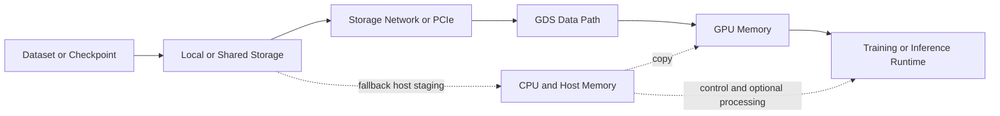
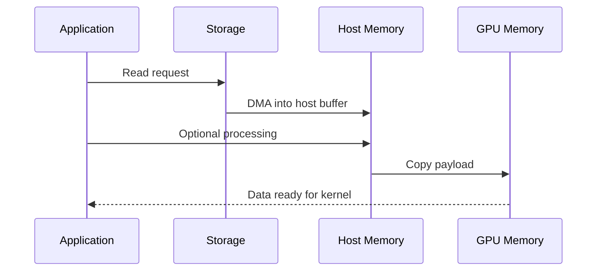
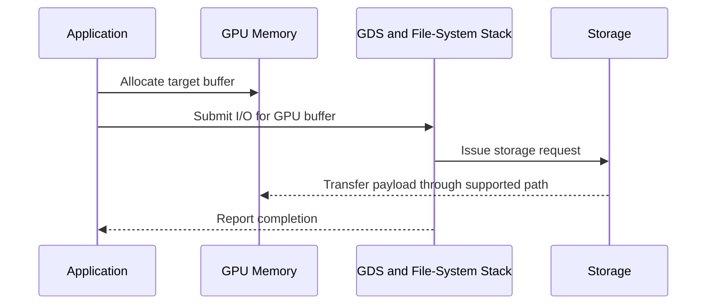
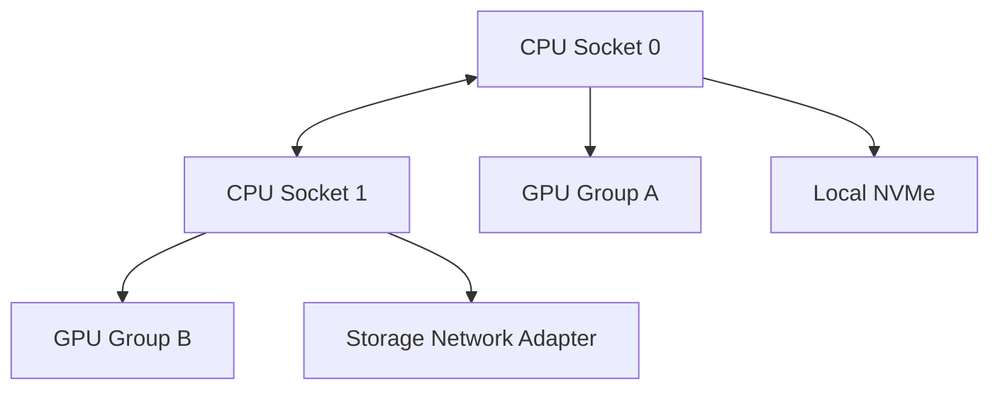

# GPUDirect Storage

## Introduction

Training and inference pipelines do not begin at the GPU. Data originates in local NVMe devices, shared file systems, object-storage gateways, checkpoint repositories, or preprocessing services. When the storage path cannot feed the accelerator, expensive GPUs wait for data rather than compute.

Traditional I/O commonly moves data from storage into host memory before software copies it into GPU memory. GPUDirect Storage (GDS) creates a more direct path between supported storage devices and GPU memory. Its purpose is to reduce avoidable host-memory staging and CPU overhead for suitable workloads.

GDS is not a replacement for good storage architecture. It cannot compensate for a slow file system, metadata bottleneck, inadequate network fabric, small-file workload, poor data layout, or insufficient parallelism. It improves one segment of an end-to-end pipeline.

| Chapter field | Value |
|---|---|
| Volume | 07 — GPU Networking |
| Difficulty | Advanced |
| Estimated reading time | 50 minutes |
| Previous | GPUDirect RDMA |
| Next | ConnectX and GPU Network Adapters |

## Story

A customer operates a large training cluster with high GPU compute utilization during steady-state execution. At the start of every epoch, utilization collapses. CPU memory bandwidth spikes, data-loader workers become busy, and storage traffic arrives in bursts.

The team initially requests more GPUs. A pipeline trace shows that the accelerators are waiting for a host-staged storage path. Large training samples are read into CPU buffers, transformed, and copied to GPU memory. Some preprocessing is necessary, but several bulk transfers do not require the CPU to touch the payload.

The architects separate the pipeline into transform-heavy and direct-transfer portions. They introduce GDS only where the data format, storage platform, and access pattern support it. The result is a more balanced pipeline—not because storage became infinitely fast, but because unnecessary staging was removed.

## Learning Objectives

After completing this chapter, you will be able to:

- explain why GDS exists;
- compare host-staged and direct storage-to-GPU paths;
- describe the role of the file system, block layer, storage fabric, and GPU driver;
- identify workloads that benefit from GDS;
- explain when preprocessing makes a direct path inappropriate;
- build an end-to-end validation plan;
- troubleshoot fallback, low throughput, and inconsistent scaling;
- discuss availability, security, cost, and operational trade-offs.

## Big Picture



**Figure 7.6.1 — GDS optimizes a specific data path.** Control and preprocessing may still use the CPU, while eligible bulk I/O can move more directly to GPU memory.

## Why Storage Became Part of GPU Architecture

Modern accelerators can consume data faster than many traditional pipelines can supply it. A workload may be limited by:

- storage media bandwidth;
- file-system concurrency;
- metadata operations;
- storage-network throughput;
- host-memory copies;
- decompression and decoding;
- data-loader scheduling;
- GPU transfer synchronization.

The slowest stage determines delivered throughput. Adding GPUs increases demand on every upstream layer. A storage design that is adequate for eight GPUs may fail at sixty-four even when capacity scales linearly.

## Traditional Host-Staged Path



This path is correct and often necessary. The CPU may need to parse records, decompress data, tokenize text, augment images, or validate checksums. The inefficiency appears when the host is used only as a transit buffer.

## Direct Path



The direct path depends on supported components and correct registration. It also depends on alignment, I/O size, queue depth, and storage concurrency. Small or irregular operations may not benefit.

## Internal Architecture

A production GDS path can include:

1. the application or framework;
2. a GDS-aware I/O library;
3. CUDA memory allocation and registration;
4. GPU driver integration;
5. file-system or block-storage support;
6. local NVMe or networked storage transport;
7. DMA-capable devices and PCIe topology;
8. completion and synchronization logic.

The exact implementation varies by platform. The architectural principle remains stable: the path must allow storage I/O to target GPU memory without unnecessary host payload copies.

## Workload Fit

| Workload pattern | GDS suitability | Reason |
|---|---|---|
| Large sequential reads into GPU-ready buffers | Strong | Bulk transfer dominates |
| Large checkpoint writes | Strong | Reduces host staging |
| Small random files | Weak | Metadata and syscall overhead dominate |
| Heavy CPU decoding or augmentation | Conditional | CPU processing remains necessary |
| Object storage through a CPU gateway | Conditional | Gateway may reintroduce staging |
| Cached dataset already in GPU memory | Low | Storage is not on the critical path |
| Multi-node shared-file-system training | Strong when supported | Parallel storage and direct transfer can align |

GDS should be selected after measuring the access pattern, not because the technology is available.

## Topology Considerations

For local NVMe, the storage device and GPU may share a PCIe hierarchy or sit under different root complexes. For shared storage, the network adapter may be close to one GPU group and remote from another.



A direct API does not guarantee a short physical path. Device affinity and shared PCIe bandwidth still matter.

## Performance Model

End-to-end data availability can be approximated as:

```text
data-ready time = storage service time + transport time + processing time + synchronization time
```

GDS mainly targets transport and copy overhead. It does not remove storage service time or application processing.

Measure:

- read and write bandwidth;
- I/O size distribution;
- queue depth;
- CPU utilization;
- host-memory bandwidth;
- GPU copy-engine activity;
- storage latency percentiles;
- time that GPU kernels wait for data;
- metadata-operation rate;
- checkpoint pause duration.

## Architecture Trade-offs

### Direct I/O versus portability

A direct path may require specific versions and supported storage platforms. A portable host path works across more environments.

### Peak throughput versus pipeline flexibility

GPU-ready formats benefit most. Pipelines requiring dynamic CPU transformations may retain host stages.

### Complexity versus utilization

GDS adds qualification, observability, and upgrade responsibilities. It is justified when data movement materially limits GPU utilization.

### Shared performance versus isolation

A high-throughput storage path can allow one job to dominate queues or bandwidth. Multi-tenant systems need QoS, quotas, and workload-aware admission.

## Production Deployment

A production rollout should include:

- a qualified component matrix;
- storage and GPU topology maps;
- approved file systems and mount options;
- supported I/O alignment and buffer behavior;
- benchmark baselines for local and shared storage;
- CPU-staged fallback expectations;
- telemetry for path selection and storage health;
- canary validation after upgrades;
- checkpoint recovery tests.

## Validation Workflow

1. Establish a normal host-buffer storage baseline.
2. Validate storage bandwidth independently of the GPU.
3. Validate GPU memory allocation and direct-I/O support.
4. Run GDS-aware I/O tests across multiple sizes and queue depths.
5. Compare CPU utilization and host-memory traffic.
6. Run the real application and correlate storage phases with GPU idle time.
7. Test fallback and recovery behavior.

A microbenchmark proves capability. Only the application proves value.

## Production Troubleshooting

### Scenario 1 — GDS test works, application remains slow

**Symptoms**

- direct-I/O benchmark is healthy;
- training still has long input stalls;
- CPU workers remain saturated.

**Root cause pattern**

The application performs CPU-heavy decoding, tokenization, augmentation, or small-file access. The direct transfer is not the dominant stage.

**Resolution**

Profile the complete loader pipeline, improve data format and batching, parallelize preprocessing, or move suitable transforms closer to the GPU.

### Scenario 2 — Throughput varies by GPU

Inspect GPU-to-storage or GPU-to-NIC topology, PCIe link width, NUMA binding, shared-switch contention, and device placement.

### Scenario 3 — Performance regresses after upgrade

Check whether the path fell back to host staging, whether kernel and driver versions remain qualified, and whether file-system support changed.

### Scenario 4 — Checkpoint writes pause training

Measure serialization time, write concurrency, metadata operations, flush behavior, and storage saturation. GDS may reduce copy overhead but cannot fix a serialized checkpoint design.

## Customer Scenario

A pharmaceutical customer trains models against a multi-petabyte scientific dataset. They ask whether GDS will eliminate the need for a high-performance file system.

The architect explains that GDS optimizes the final data path into GPU memory; it does not create storage capacity, namespace scale, availability, or aggregate bandwidth. The recommended design combines a parallel storage layer, local staging for hot data, data-format optimization, and GDS for eligible bulk transfers.

The purchase decision is therefore based on an end-to-end pipeline, not a single feature.

## Interview Preparation

### Knowledge Questions

1. What problem does GPUDirect Storage solve?
2. Why does GDS not eliminate CPU preprocessing?
3. Which workloads benefit most?
4. Why can small files remain slow?

### Architecture Questions

1. Draw local-NVMe and shared-storage GDS paths.
2. Explain how topology affects a storage-to-GPU transfer.
3. Design a checkpoint architecture for a multi-node training job.

### Scenario Questions

1. A GDS benchmark is fast but training is slow. What do you profile next?
2. Performance differs across GPU indices. What topology checks matter?
3. An upgrade increases CPU memory bandwidth during reads. What may have happened?

### Customer Questions

1. When is GDS worth the operational complexity?
2. When should a customer improve data format before buying storage?
3. How do you explain fallback and compatibility risk?

## Summary

GPUDirect Storage reduces unnecessary host-memory staging between supported storage systems and GPU memory. It is most valuable for large, parallel, GPU-ready transfers where data movement is on the critical path.

It does not replace storage capacity, file-system scale, metadata performance, preprocessing, or topology-aware design. Production value must be demonstrated by lower data-ready time and improved application utilization.

## Key Takeaways

- GDS optimizes one segment of the AI data pipeline.
- Host processing remains necessary when the workload transforms data.
- Large sequential and checkpoint I/O are stronger candidates than small random files.
- Topology and storage architecture remain critical.
- Microbenchmarks prove capability; application traces prove value.
- Fallback must be observable.

## Quick Revision Sheet

| Question | Answer |
|---|---|
| What is removed? | Unnecessary host payload staging |
| What remains? | Storage service, control, processing, synchronization |
| Strong workload fit | Large GPU-ready reads and writes |
| Weak workload fit | Metadata-heavy small-file pipelines |
| Main operational risk | Silent fallback or unsupported component combination |

## Cross References

- Previous: [GPUDirect RDMA](./chapter-05-gpudirect-rdma)
- Next: [ConnectX and GPU Network Adapters](./chapter-07-connectx-and-gpu-network-adapters)
- Related: [Performance Bottlenecks and Benchmarking](./chapter-10-performance-bottlenecks-and-benchmarking)
- Lab: [Benchmark RDMA and GPUDirect Paths](./labs/lab-03-benchmark-rdma-and-gpudirect-paths)

## Further Reading

Use the official NVIDIA GPUDirect Storage documentation, the selected file-system integration guide, storage-vendor qualification material, and the CUDA I/O library documentation for the deployed release.
