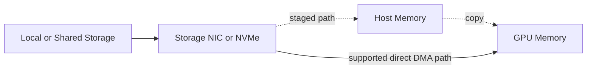

# GPUDirect Storage

Training and inference systems can leave GPUs idle while CPUs copy data between storage and accelerator memory. GPUDirect Storage (GDS) is designed to shorten supported storage-to-GPU paths and reduce host-memory staging.

## Learning Objectives

You will be able to trace traditional and direct storage paths, identify prerequisites, select suitable workloads, and troubleshoot cases where storage—not compute—limits the platform.

## Architecture

The direct path does not make the filesystem disappear. Metadata, permissions, file layout, orchestration, and completion processing remain part of the I/O stack.

## Where GDS Helps

GDS is most useful when applications read or write large GPU-bound buffers and host staging consumes CPU, memory bandwidth, or latency budget. Examples include dataset streaming, checkpointing, scientific pipelines, and analytics.

It may provide little benefit when files are tiny, metadata dominates, data requires substantial CPU preprocessing, the dataset is already cached in host memory, or the storage system cannot supply enough throughput.

| Layer | Key requirement |
|---|---|
| Application | Uses a compatible I/O path and GPU buffers |
| Filesystem/storage | Supported configuration and adequate parallelism |
| Driver stack | Compatible CUDA, NVIDIA, and storage components |
| Topology | Efficient NVMe or NIC-to-GPU PCIe path |
| Operations | Monitoring of storage, PCIe, CPU, and GPU utilization |

## Production Design

Benchmark the complete pipeline rather than a raw block device alone. Measure application request size, queue depth, filesystem behavior, storage network, PCIe locality, GPU copy engines, and preprocessing. Capacity planning must include burst behavior such as synchronized checkpoints.

Direct I/O can bypass caches that previously masked storage latency. That may improve predictability, but it can also expose a weak backend. A design should include backpressure and failure handling instead of assuming every read reaches peak bandwidth.

## Troubleshooting

**Symptoms:** GPU utilization oscillates, checkpoint writes stall training, CPU usage remains high, or GDS tools show fallback.

**Diagnosis:** compare staged and direct tests; inspect support status, filesystem mount options, buffer alignment, topology, storage latency, queue depth, and application logs.

**Resolution:** restore a supported stack, align devices by locality, increase I/O concurrency where appropriate, and fix the storage bottleneck. Do not attribute every low-utilization event to the GPU.

## Customer Scenario

A customer proposes additional GPUs to improve training throughput. Profiling shows the current GPUs repeatedly waiting for dataset reads. The correct first investment is storage-path remediation and data-pipeline tuning, not more accelerators.

## Interview Preparation

**Question:** Does GDS guarantee faster training?

No. It removes specific staging overheads. Overall training improves only when storage data movement is a meaningful bottleneck and the backend can sustain the required workload.

## Key Takeaways

- GDS targets storage-to-GPU data movement.
- Filesystem, topology, and application behavior remain critical.
- Direct paths expose backend limitations as well as remove copies.
- End-to-end measurement must precede hardware expansion.

## Cross References

- [GPUDirect RDMA](./chapter-05-gpudirect-rdma)
- [Next: ConnectX and GPU Network Adapters](./chapter-07-connectx-and-gpu-network-adapters)
