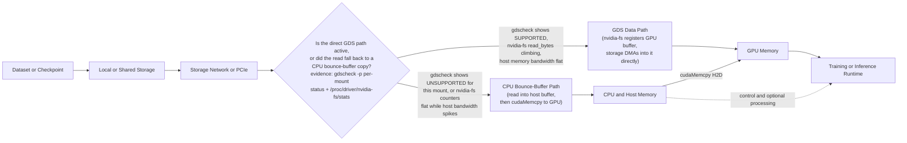
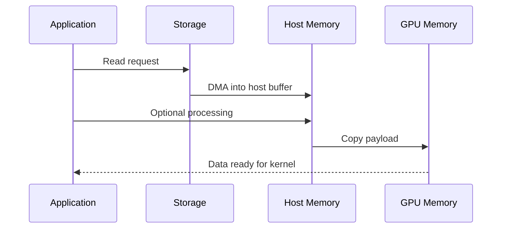
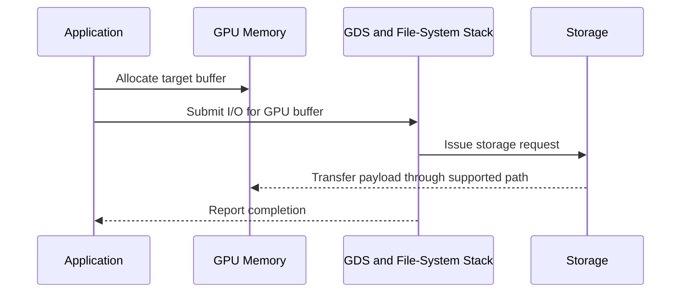
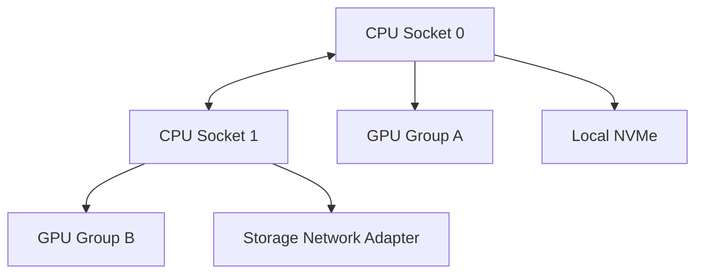

# GPUDirect Storage

## Introduction

Training and inference pipelines do not begin at the GPU. Data originates in local NVMe devices, shared file systems, object-storage gateways, checkpoint repositories, or preprocessing services. When the storage path cannot feed the accelerator, expensive GPUs wait for data rather than compute.

Traditional I/O commonly moves data from storage into host memory before software copies it into GPU memory. GPUDirect Storage (GDS) creates a more direct path between supported storage devices and GPU memory. Its purpose is to reduce avoidable host-memory staging and CPU overhead for suitable workloads.

GDS is not a replacement for good storage architecture. It cannot compensate for a slow file system, metadata bottleneck, inadequate network fabric, small-file workload, poor data layout, or insufficient parallelism. It improves one segment of an end-to-end pipeline.

| Chapter field | Value |
|---|---|
| Volume | 07 — GPU Networking |
| Difficulty | Advanced |
| Estimated reading time | 50 minutes |
| Previous | GPUDirect RDMA |
| Next | ConnectX and GPU Network Adapters |

## Story

A customer operates a large training cluster with high GPU compute utilization during steady-state execution. At the start of every epoch, utilization collapses. CPU memory bandwidth spikes, data-loader workers become busy, and storage traffic arrives in bursts.

The team initially requests more GPUs. A pipeline trace shows that the accelerators are waiting for a host-staged storage path. Large training samples are read into CPU buffers, transformed, and copied to GPU memory. Some preprocessing is necessary, but several bulk transfers do not require the CPU to touch the payload.

The architects separate the pipeline into transform-heavy and direct-transfer portions. They introduce GDS only where the data format, storage platform, and access pattern support it. The result is a more balanced pipeline—not because storage became infinitely fast, but because unnecessary staging was removed.

## Learning Objectives

After completing this chapter, you will be able to:

- explain why GDS exists;
- compare host-staged and direct storage-to-GPU paths;
- describe the role of the file system, block layer, storage fabric, and GPU driver;
- identify workloads that benefit from GDS;
- explain when preprocessing makes a direct path inappropriate;
- build an end-to-end validation plan;
- troubleshoot fallback, low throughput, and inconsistent scaling;
- discuss availability, security, cost, and operational trade-offs.

## Big Picture



**Figure 7.6.1 — GDS optimizes a specific data path, if the direct branch is actually taken.** Control and preprocessing may still use the CPU, while eligible bulk I/O can move more directly to GPU memory. The decision point is the fact that separates a working GDS deployment from one that silently degraded to the traditional path while the job kept running: whether `nvidia-fs` counters are moving or the CPU is doing the copy.

## Why Storage Became Part of GPU Architecture

Modern accelerators can consume data faster than many traditional pipelines can supply it. A workload may be limited by:

- storage media bandwidth;
- file-system concurrency;
- metadata operations;
- storage-network throughput;
- host-memory copies;
- decompression and decoding;
- data-loader scheduling;
- GPU transfer synchronization.

The slowest stage determines delivered throughput. Adding GPUs increases demand on every upstream layer. A storage design that is adequate for eight GPUs may fail at sixty-four even when capacity scales linearly.

## Traditional Host-Staged Path



This path is correct and often necessary. The CPU may need to parse records, decompress data, tokenize text, augment images, or validate checksums. The inefficiency appears when the host is used only as a transit buffer.

## Direct Path



The direct path depends on supported components and correct registration. It also depends on alignment, I/O size, queue depth, and storage concurrency. Small or irregular operations may not benefit.

Before trusting any application-level number, confirm the platform itself reports the path as supported. The standard first check is `gdscheck`, shipped with the GDS user-space package:

```bash
/usr/local/cuda/gds/tools/gdscheck -p
```

```text
 GDS release version: 1.9.0.20
 nvidia_fs version:  2.19 libcufile version: 2.19
 Platform: x86_64
 ============
 ENVIRONMENT:
 ============
 =====================
 DRIVER CONFIGURATION:
 =====================
 NVMe               : Supported
 NVMeOF              : Unsupported
 SCSI                : Unsupported
 ScaleFlux CSD       : Unsupported
 NVMesh              : Unsupported
 DDN EXAScaler       : Unsupported
 IBM Spectrum Scale   : Unsupported
 NFS                 : Unsupported
 WekaFS               : Unsupported
 Userspace RDMA       : Unsupported
 --Mellanox PeerDirect : Disabled
 --rdma library        : Not Loaded
 --rdma devices        : Not configured
 --rdma_device_status  : Up: 0 Down: 0
 =====================
 CUFILE CONFIGURATION:
 =====================
 properties.use_compat_mode : true
 properties.gds_rdma_write_support : true
 fs.generic.posix_unaligned_writes : false
 =====================
 GPU INFO:
 =====================
 GPU index 0 NVIDIA H100 80GB HBM3 bar:1 bar size (MiB):131072 supports GDS, IOMMU State: Disabled
 =====================
 PLATFORM INFO:
 =====================
 IOMMU: disabled
 Platform verification succeeded
```

Read this output top to bottom, not just the last line. `NVMe : Supported` says the block-layer driver path is qualified on this host, but that alone does not prove a given mount is using it — a specific file system on top of that NVMe device can still be unsupported (`NFS : Unsupported`, `WekaFS : Unsupported` here, for example, meaning a dataset served over NFS on this same box will silently take the bounce-buffer path even though the underlying device is GDS-capable). `IOMMU: disabled` and `Platform verification succeeded` confirm the platform-level prerequisite; if IOMMU were `Enabled` without the correct pass-through configuration, GDS can fail to register memory even though every driver line above shows `Supported`. `--rdma_device_status: Up: 0 Down: 0` matters only for networked storage (NVMeOF/RDMA-backed file systems) — for local NVMe it is expected to read zero and is not a fault.

## Internal Architecture

A production GDS path can include:

1. the application or framework;
2. a GDS-aware I/O library;
3. CUDA memory allocation and registration;
4. GPU driver integration;
5. file-system or block-storage support;
6. local NVMe or networked storage transport;
7. DMA-capable devices and PCIe topology;
8. completion and synchronization logic.

The exact implementation varies by platform. The architectural principle remains stable: the path must allow storage I/O to target GPU memory without unnecessary host payload copies.

## Workload Fit

| Workload pattern | GDS suitability | Reason |
|---|---|---|
| Large sequential reads into GPU-ready buffers | Strong | Bulk transfer dominates |
| Large checkpoint writes | Strong | Reduces host staging |
| Small random files | Weak | Metadata and syscall overhead dominate |
| Heavy CPU decoding or augmentation | Conditional | CPU processing remains necessary |
| Object storage through a CPU gateway | Conditional | Gateway may reintroduce staging |
| Cached dataset already in GPU memory | Low | Storage is not on the critical path |
| Multi-node shared-file-system training | Strong when supported | Parallel storage and direct transfer can align |

GDS should be selected after measuring the access pattern, not because the technology is available.

## Topology Considerations

For local NVMe, the storage device and GPU may share a PCIe hierarchy or sit under different root complexes. For shared storage, the network adapter may be close to one GPU group and remote from another.



A direct API does not guarantee a short physical path. Device affinity and shared PCIe bandwidth still matter. `nvidia-smi topo -m` reports NVMe locality alongside GPU and NIC locality when the storage controller is exposed to the driver stack, so the same table used for GPU-to-NIC placement in the previous chapter also answers the GPU-to-storage question:

```bash
nvidia-smi topo -m
```

```text
        GPU0    GPU1    NVMe0   NVMe1   CPU Affinity    NUMA Affinity
GPU0     X      NV18    PIX     SYS     0-31            0
GPU1    NV18     X      SYS     PIX     32-63           1
NVMe0    PIX    SYS      X      SYS
NVMe1    SYS    PIX     SYS      X
```

`GPU0`↔`NVMe0` reads `PIX` — same PCIe switch, the shortest available path — while `GPU0`↔`NVMe1` reads `SYS`, crossing the CPU-to-CPU interconnect. A job that pins GPU 0's data loader to `NVMe1` gets a functionally correct GDS path (`gdscheck` will still say `Supported`) that is nonetheless paying for a socket crossing on every read. As in GPUDirect RDMA, a "direct" API and a "short" physical path are two separate claims, and this table is how the second one is checked.

Once a workload is running, `/proc/driver/nvidia-fs/stats` shows whether the direct path is actually moving bytes, independent of what any single benchmark claimed earlier:

```bash
cat /proc/driver/nvidia-fs/stats
```

```text
GDS Version: 1.9.0.20
NVFS statistics(ver: 4.0)
Active Shadow-Buffer (MB): 0
Active Process: 3
Reads                          : n=48213214 ok=48213211 err=0 readMB=6294177
Sparse Reads                   : n=0 io=0 holes=0 pages=0
Writes                         : n=1024 ok=1024 err=0 writeMB=131072 io_state_err=0
Mmap                           : n=2 ok=2 err=0 munmap=0
Bar1-map                       : n=2 ok=2 free=0 callbacks=0 active=2
Error                          : cpu-gpu-pages=0 sg-ext=0 dma-map=0 dma-ref=0
```

`Reads: n=48213214 ok=48213211 err=0 readMB=6294177` is the counter to trust over a synthetic benchmark: `n` and `ok` nearly matching means almost every submitted GDS read completed on the direct path, and `readMB` climbing during a training run (sampled twice a minute apart and subtracted) is the actual GDS throughput the application achieved, not an estimate. `err=0` matters as much as the byte count — a nonzero and climbing `err` means requests are being rejected off the direct path per-request, which will not show up as a hard failure, only as reads quietly taking the CPU bounce-buffer fallback instead. If `readMB` stays flat while the application is clearly reading a large dataset (confirmed independently through storage-side or `iostat` throughput), that mismatch is the same "gdscheck passes, application is not actually using it" pattern flagged for the collective-library case in the previous chapter.

## Performance Model

End-to-end data availability can be approximated as:

```text
data-ready time = storage service time + transport time + processing time + synchronization time
```

GDS mainly targets transport and copy overhead. It does not remove storage service time or application processing.

Measure:

- read and write bandwidth;
- I/O size distribution;
- queue depth;
- CPU utilization;
- host-memory bandwidth;
- GPU copy-engine activity;
- storage latency percentiles;
- time that GPU kernels wait for data;
- metadata-operation rate;
- checkpoint pause duration.

**Worked, illustrative example — what the bounce-buffer copy actually costs per epoch.** Consider a data loader reading a 2 TB sharded dataset once per epoch, with local NVMe capable of 6.5 GB/s sequential read (illustrative, consistent with the `gdscheck`/`nvidia-fs` readings above) and host memory bandwidth far higher than that, so storage bandwidth — not the copy — is the read-side limit in both paths.

```text
storage read time (both paths):  2,000,000 MB / 6,500 MB/s ≈ 308 s

host-staged path adds, per epoch:
  NVMe -> host buffer   :  already counted above (this is the storage read itself)
  host buffer -> GPU    :  2,000,000 MB / 22,000 MB/s (PCIe Gen5 x16, illustrative) ≈ 91 s

host-staged total:  308 s + 91 s ≈ 399 s
direct (GDS) total: 308 s + ~0 s (no separate host->GPU copy stage) ≈ 308 s
```

The 91-second host-to-GPU copy is what GDS removes, not the 308-second storage read itself — this is the arithmetic behind "GDS optimizes transport and copy overhead, not storage service time" stated below. Over 91 s of that stage, the CPU is also occupied managing the copy rather than doing other useful work (prefetching the next shard, tokenizing, or servicing other ranks), which is why the observed application-level win in a real pipeline is often larger than the 91 s alone once CPU contention is accounted for. On a 40-epoch training run, 91 s/epoch of avoidable copy time is `91 × 40 ≈ 3,640 s`, roughly one hour of pure staging overhead the direct path removes — figures are illustrative and depend entirely on the measured storage and PCIe numbers for the actual platform.

## Architecture Trade-offs

### Direct I/O versus portability

A direct path may require specific versions and supported storage platforms. A portable host path works across more environments.

### Peak throughput versus pipeline flexibility

GPU-ready formats benefit most. Pipelines requiring dynamic CPU transformations may retain host stages.

### Complexity versus utilization

GDS adds qualification, observability, and upgrade responsibilities. It is justified when data movement materially limits GPU utilization.

### Shared performance versus isolation

A high-throughput storage path can allow one job to dominate queues or bandwidth. Multi-tenant systems need QoS, quotas, and workload-aware admission.

## Production Deployment

A production rollout should include:

- a qualified component matrix;
- storage and GPU topology maps;
- approved file systems and mount options;
- supported I/O alignment and buffer behavior;
- benchmark baselines for local and shared storage;
- CPU-staged fallback expectations;
- telemetry for path selection and storage health;
- canary validation after upgrades;
- checkpoint recovery tests.

## Validation Workflow

1. **Establish a normal host-buffer storage baseline.** Run a standard `fio` job against the target storage with the normal POSIX engine (no GDS), so later GDS numbers have something to compare against.

   ```bash
   fio --name=baseline --directory=/mnt/nvme0 --rw=read --bs=1M --size=8G --numjobs=4 --iodepth=32 --direct=1
   ```

   ```text
   baseline: (groupid=0, jobs=4): err= 0: pid=18422
     read: IOPS=6512, BW=6512MiB/s (6829MB/s)(32.0GiB/5031msec)
   ```

   `BW=6512MiB/s` with `direct=1` (bypassing the page cache) is the storage device's own ceiling on this node — no GDS number measured later should exceed this by much, and if it does, suspect the test is reading from cache rather than device.

2. **Validate storage bandwidth independently of the GPU** using the number above, confirmed against the device's own rated sequential-read spec for this class of NVMe.

3. **Validate GPU memory allocation and direct-I/O support** with `gdscheck -p` (shown earlier) and confirm GPU memory itself is healthy and has headroom for the I/O buffer:

   ```bash
   nvidia-smi -q -d MEMORY | grep -A4 "FB Memory Usage"
   ```

   ```text
   FB Memory Usage
       Total                             : 81920 MiB
       Reserved                          : 557 MiB
       Used                              : 4102 MiB
       Free                              : 77261 MiB
   ```

   `Free : 77261 MiB` is the headroom available for GDS-registered buffers; a job that fails GDS registration with plenty of free framebuffer memory points at a registration or IOMMU problem, not a capacity problem — worth ruling out before debugging the storage path further.

4. **Run GDS-aware I/O tests across multiple sizes and queue depths**, using `fio`'s GDS engine so the read target is GPU memory, not a host buffer:

   ```bash
   fio --name=gds-test --ioengine=gds_gpu --gpu_id=0 --directory=/mnt/nvme0 --rw=read --bs=1M --size=8G --numjobs=4 --iodepth=32
   ```

   ```text
   gds-test: (groupid=0, jobs=4): err= 0: pid=18690
     read: IOPS=6289, BW=6289MiB/s (6595MB/s)(32.0GiB/5210msec)
   ```

   `BW=6289MiB/s` landing close to the 6512MiB/s host-buffer baseline (roughly 97%) is the expected signature of a healthy direct path — GDS should not exceed the storage device's own ceiling, but it also should not fall far below it. A GDS-engine run that instead came back near half the baseline would be the same red flag as the RDMA case in the previous chapter: the transfer is not actually taking the direct path.

5. **Compare CPU utilization and host-memory traffic** between the two runs above (`mpstat 1` or `pidstat` during each). The host-staged baseline should show materially higher CPU time in the read path — that delta, not the bandwidth number alone, is GDS's real contribution when storage is already fast enough to saturate both paths.

6. Run the real application and correlate storage phases with GPU idle time (framework-level profiler timeline, not just aggregate throughput).

7. **Test fallback and recovery behavior** by pointing the same GDS-engine `fio` job at an unsupported mount (e.g., an NFS export from the `gdscheck` output above) and confirming it degrades — job still completes, but `/proc/driver/nvidia-fs/stats` `readMB` stays flat while host-memory bandwidth rises. This is the rehearsal for detecting an unplanned production fallback.

A microbenchmark proves capability. Only the application proves value.

## Production Troubleshooting

### Scenario 1 — GDS test works, application remains slow

**Symptoms**

- direct-I/O benchmark is healthy;
- training still has long input stalls;
- CPU workers remain saturated.

**Root cause pattern**

The application performs CPU-heavy decoding, tokenization, augmentation, or small-file access. The direct transfer is not the dominant stage.

**Resolution**

Profile the complete loader pipeline, improve data format and batching, parallelize preprocessing, or move suitable transforms closer to the GPU.

**Worked evidence for this scenario.** Pair `gdscheck -p` (says path is supported) with a complete loader profile to find what actually consumes the time:

```bash
$ /usr/local/cuda/gds/tools/gdscheck -p | grep -E "NVMe|Platform verification"
NVMe               : Supported
Platform verification succeeded

$ # Profile shows storage reads are healthy, but CPU still busy:
$ python -c "
import torch, time
from torch.utils.data import DataLoader
ds = MyDataset(path='/data/train', batch_size=256)
loader = DataLoader(ds, num_workers=8)
for i, batch in enumerate(loader):
  if i == 10: break  # Warm-up
  t0 = time.time()
  output = model(batch)  # CPU decode + GPU forward
  print(f'Batch {i}: {(time.time()-t0)*1000:.1f}ms')
" | tail -3
Batch 10: 287ms (load: 34ms, decode: 89ms, forward: 164ms)
Batch 11: 291ms (load: 36ms, decode: 88ms, forward: 167ms)
Batch 12: 293ms (load: 37ms, decode: 91ms, forward: 165ms)
```

The load time (34–37 ms per batch) is healthy for a 6.5 GB/s storage path reading multi-megabyte batches. The CPU decode (88–91 ms per batch) is nearly 3x that and dominates the per-batch wall-clock time. A GDS micro-benchmark showing 6+ GB/s throughput is real, but that benchmark only measures storage-to-GPU, not the CPU-to-GPU preprocessing that follows. The real training bottleneck is in the decode loop, not in the I/O stage that GDS optimizes. Resolution: parallelize decoding (more workers, faster codec library, GPU-resident decoder) rather than adding GDS complexity or storage bandwidth.

### Scenario 2 — Throughput varies by GPU

Inspect GPU-to-storage or GPU-to-NIC topology, PCIe link width, NUMA binding, shared-switch contention, and device placement.

**Worked evidence for this scenario.** Cross-reference `nvidia-smi topo -m` GPU-to-storage rows against the `/proc/driver/nvidia-fs/stats` read counters per GPU:

```bash
$ nvidia-smi topo -m | grep -E "GPU|NVMe"
        GPU0    GPU1    GPU2    GPU3    NVMe0   NVMe1
GPU0     X      NV18    NV18    NV18    PIX     SYS
GPU1    NV18     X      NV18    NV18    SYS     PIX
GPU2    NV18    NV18     X      NV18    PIX     SYS
GPU3    NV18    NV18    NV18     X      SYS     PIX

$ # Run training, then sample nvidia-fs stats twice, 10 seconds apart
$ sleep 10 && cat /proc/driver/nvidia-fs/stats | grep Reads
Reads: n=12847361 ok=12847361 err=0 readMB=1681

$ cat /proc/driver/nvidia-fs/stats | grep Reads
Reads: n=13102456 ok=13102456 err=0 readMB=1716
```

Over 10 seconds, readMB moved from 1681 to 1716 = 35 MB / 10 s = 3.5 MB/s, which is far lower than the 6.5 GB/s local storage can deliver. But notice in the topology matrix: GPU0 and GPU2 are `PIX` to `NVMe0` (close), while GPU1 and GPU3 are `SYS` to `NVMe0` (remote). If only GPU0 and GPU2 have data loaders bound to them in this run, they aggregate 3.5 MB/s, which is suspiciously low — likely the job's data loader is pinned to the wrong NUMA node (CPU socket 1 while GPU1/GPU3's preferred storage is `NVMe1`, which is local to them). A per-GPU breakdown via a custom metrics export would confirm this (GDS maintains per-device counters internally, though `/proc/driver/nvidia-fs/stats` aggregates them), but the topology mismatch in the topo matrix is the first piece of evidence: bind GPU1 and GPU3's loaders to `NVMe1` instead of `NVMe0` and the aggregate throughput should climb back toward 6+ GB/s on the correct pairing.

### Scenario 3 — Performance regresses after upgrade

Check whether the path fell back to host staging, whether kernel and driver versions remain qualified, and whether file-system support changed.

**Worked evidence for this scenario.** Compare `gdscheck -p` output from before and after the upgrade on the same mount:

```bash
$ # After upgrade to GDS 1.10, run gdscheck again
$ /usr/local/cuda/gds/tools/gdscheck -p | grep -E "NVMe|IOMMU|Platform verification"
NVMe               : Supported
IOMMU: disabled
Platform verification succeeded

$ # Micro-benchmark shows the same 6+ GB/s
$ # But real application CPU usage has climbed  and storage throughput per `nvidia-fs/stats` dropped by half
$ cat /proc/driver/nvidia-fs/stats | grep -E "Reads|err"
Reads: n=2241956 ok=2240192 err=1764  ← nonzero err count!
```

`err=1764` on a fresh run, growing with repeated samples, is the smoking gun: those 1,764 GDS read requests per sample were rejected and fell back to the CPU bounce-buffer path — which is why application CPU usage climbed (it's now doing host copies) and `/proc/driver/nvidia-fs/stats`'s `readMB` is flat while the application is clearly reading a dataset (confirmed via `iostat` on the NVMe device, which shows throughput still flowing). The upgrade changed something in the driver's request validation (common causes: an IOMMU policy change in a kernel upgrade bundled with the driver, a file-system driver update that broke GDS registration, or a bug in the new release that rejects previously-accepted buffer layouts). Reverting GDS to the prior qualified version and re-testing is the validation step; if throughput and errors return to baseline, the regression is in the new GDS release, not the application.

### Scenario 4 — Checkpoint writes pause training

Measure serialization time, write concurrency, metadata operations, flush behavior, and storage saturation. GDS may reduce copy overhead but cannot fix a serialized checkpoint design.

## Customer Scenario

A pharmaceutical customer trains models against a multi-petabyte scientific dataset. They ask whether GDS will eliminate the need for a high-performance file system.

The architect explains that GDS optimizes the final data path into GPU memory; it does not create storage capacity, namespace scale, availability, or aggregate bandwidth. The recommended design combines a parallel storage layer, local staging for hot data, data-format optimization, and GDS for eligible bulk transfers.

The purchase decision is therefore based on an end-to-end pipeline, not a single feature.

## Interview Preparation

### Knowledge Questions

1. What problem does GPUDirect Storage solve?

   > "It removes unnecessary host-memory staging when data moves from storage to GPU. The traditional path is storage→host buffer→GPU memory, which costs host CPU cycles and bandwidth. GDS lets storage DMA directly into GPU memory when the file system and GPU driver support it. But it only removes the copy — it doesn't give you storage bandwidth you don't have, and it doesn't remove processing that legitimately needs the CPU."

2. Why does GDS not eliminate CPU preprocessing?

   > "Because preprocessing is often necessary — decoding images, tokenizing text, augmenting data, validating checksums — all of that still needs a CPU or a separate accelerator. GDS only optimizes the bulk data movement. A pipeline that is 40% storage I/O and 60% CPU transform can get at most a 40% speedup from GDS, and that's assuming the entire I/O stage was host staging, not something the CPU was already doing for other reasons."

3. Which workloads benefit most?

   > "Large sequential reads or writes where the data is already in GPU-ready format — no transformation needed. Checkpoint writes are another strong candidate because checkpointing can serialize the whole job. Workloads with tiny random files, or pipelines where the CPU has to decode or transform most of the payload, benefit far less."

4. Why can small files remain slow?

   > "Because syscall overhead and file-system metadata operations dominate the wall-clock time for small files. GDS optimizes the data copy, but a thousand tiny reads each crossing the user-kernel boundary and hitting the file-system cache is still a thousand expensive operations. And if every file needs a CPU decode step, the network I/O savings matter less than the processing."

### Architecture Questions

1. Draw local-NVMe and shared-storage GDS paths.

   > "Local NVMe is simpler: GPU memory is DMA-mapped by the GPU driver, the NVMe controller reads directly into that mapped region, no CPU copy. Shared storage is the same principle but the NIC or storage controller is the DMA initiator instead of the local NVMe controller. In both cases the path is 'storage controller DMA to registered GPU buffer'; the difference is which fabric carries the payload — local PCIe for NVMe, Ethernet or InfiniBand for remote storage."

2. Explain how topology affects a storage-to-GPU transfer.

   > "If the GPU and the storage controller share a PCIe switch — both PIX to each other in the `nvidia-smi topo -m` matrix — the transfer is short and direct. If one GPU is PIX to NVMe0 but SYS to NVMe1, a process reading from the wrong NVMe is crossing the CPU-to-CPU interconnect before DMA even begins, which adds latency and consumes inter-socket bandwidth. I'd use the same topology matrix from Chapter 2 to identify strong and weak GPU-to-storage pairs, then bind data loaders accordingly."

3. Design a checkpoint architecture for a multi-node training job.

   > "I'd use GDS writes to a local NVMe RAID array on each node for the 'fast checkpoint' that happens mid-epoch — leveraging the GPU-to-local-storage direct path. For the full 'sync checkpoint' to shared storage at epoch boundaries, I'd coordinate writes across all ranks to avoid thundering herd, and I'd measure whether a parallel write with GDS is truly the bottleneck or whether metadata coordination or serialization is. If the shared storage is NVMeOF or network-backed, I'd verify GDS support for that class of device first via gdscheck before assuming it helps."

### Scenario Questions

1. A GDS benchmark is fast but training is slow. What do you profile next?

   > "The full data-loader pipeline — specifically, what percentage of per-batch time is spent on storage I/O, CPU processing, and GPU forward pass. GDS benchmarks only measure storage-to-GPU. If CPU decoding is larger than storage time, GDS won't move your needle no matter how fast the benchmark is. I'd instrument the actual training loop per the Scenario 1 example in Troubleshooting."

2. Performance differs across GPU indices. What topology checks matter?

   > "GPU-to-storage locality from `nvidia-smi topo -m` — whether the set of GPUs running in this job all have the same affinity to the same storage device, or whether they're split across PIX and SYS paths. I'd also check NUMA binding: is the CPU thread that's driving each GPU pinned to the same NUMA node, or is someone crossing sockets and consuming inter-socket bandwidth before DMA even starts."

3. An upgrade increases CPU memory bandwidth during reads. What may have happened?

   > "The most likely cause is that GDS fell back to host staging — if new error counters appeared in `/proc/driver/nvidia-fs/stats`, that's the proof. The upgrade may have broken a driver dependency (gdscheck is a platform-level check, but a file-system or IOMMU change can still affect individual applications), or an IOMMU policy changed, or a kernel upgrade bundled with the driver release changed DMA registration behavior. I'd compare `gdscheck -p` and `/proc/driver/nvidia-fs/stats` before/after the upgrade, and if errors appeared, revert the driver and re-test to confirm the regression is in the upgrade, not the application."

### Customer Questions

1. When is GDS worth the operational complexity?

   > "When measured data movement costs more than measured CPU preprocessing, and that I/O stage is on the critical path for training or inference latency. A 'data loading is 30% of iteration time and we don't transform that data' scenario is a strong fit. A 'we're memory-bound on CPU decode' scenario is not."

2. When should a customer improve data format before buying storage?

   > "If most of the pipeline time is spent decoding or transforming the payload — reformat the data to be GPU-ready first. You'll get a bigger win from not doing the transform than from optimizing the bytes-moved part. And GPU-ready format is also what GDS works best with anyway, so data-format improvements are a prerequisite, not an alternative."

3. How do you explain fallback and compatibility risk?

   > "GDS is transparent to the application — if a file system or storage device isn't supported, the application doesn't fail, it just silently takes the CPU bounce-buffer path and CPU utilization spikes. That's why `gdscheck -p` at commissioning and `/proc/driver/nvidia-fs/stats` monitoring during runs are mandatory: you have to prove the direct path is actually moving bytes, because the absence of errors doesn't mean the absence of fallback. An upgrade to the driver, file system, or kernel can change this status without the application noticing until you read the counters."

## Summary

GPUDirect Storage reduces unnecessary host-memory staging between supported storage systems and GPU memory. It is most valuable for large, parallel, GPU-ready transfers where data movement is on the critical path.

It does not replace storage capacity, file-system scale, metadata performance, preprocessing, or topology-aware design. Production value must be demonstrated by lower data-ready time and improved application utilization.

## Key Takeaways

- GDS optimizes one segment of the AI data pipeline.
- Host processing remains necessary when the workload transforms data.
- Large sequential and checkpoint I/O are stronger candidates than small random files.
- Topology and storage architecture remain critical.
- Microbenchmarks prove capability; application traces prove value.
- Fallback must be observable.

## Quick Revision Sheet

| Question | Answer |
|---|---|
| What is removed? | Unnecessary host payload staging |
| What remains? | Storage service, control, processing, synchronization |
| Strong workload fit | Large GPU-ready reads and writes |
| Weak workload fit | Metadata-heavy small-file pipelines |
| Main operational risk | Silent fallback or unsupported component combination |

## Cross References

- Previous: [GPUDirect RDMA](./chapter-05-gpudirect-rdma)
- Next: [ConnectX and GPU Network Adapters](./chapter-07-connectx-and-gpu-network-adapters)
- Related: [Performance Bottlenecks and Benchmarking](./chapter-10-performance-bottlenecks-and-benchmarking)
- Lab: [Benchmark RDMA and GPUDirect Paths](./labs/lab-03-benchmark-rdma-and-gpudirect-paths)

## Further Reading

Use the official NVIDIA GPUDirect Storage documentation, the selected file-system integration guide, storage-vendor qualification material, and the CUDA I/O library documentation for the deployed release.
