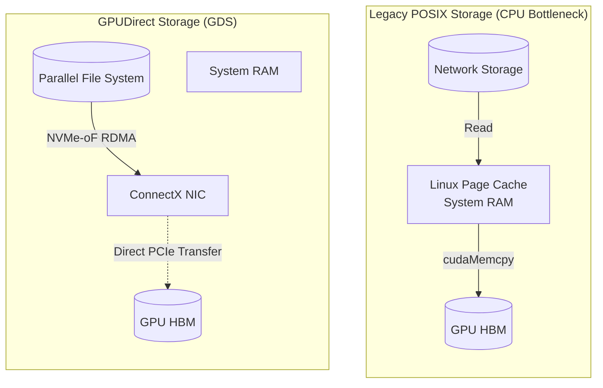

# Chapter 6 — GPUDirect Storage (GDS)

| Chapter metadata | Value |
|---|---|
| Volume | 07 — GPU Networking and Data Paths |
| Difficulty | Advanced |
| Estimated reading time | 30 minutes |
| Primary audience | DevOps, SRE, Platform, Cloud and Infrastructure Engineers |
| Core question | If GPUDirect RDMA connects GPUs to other GPUs, how do we get petabytes of training data off hard drives and into the GPU? |

## Introduction

In the previous chapter, we solved the problem of GPUs talking to other GPUs across the network using GPUDirect RDMA. 

But AI models do not just share math. They must ingest immense amounts of raw data—petabytes of text, millions of high-resolution images, and massive model checkpoints. 

Historically, reading a file from a hard drive required the Linux OS. The CPU would read the file from disk, pull it into System RAM (the Page Cache), and then push it down to the GPU. If you have 8 H100 GPUs trying to read data simultaneously, the host CPU will immediately hit 100% utilization, and the GPUs will starve.

NVIDIA solved this with **GPUDirect Storage (GDS)**. 

## 1. How GDS Works (The `cufile` API)

GDS fundamentally changes the storage paradigm. It uses the exact same concept as GPUDirect RDMA, but applies it to NVMe storage drives.

NVIDIA created a new library called `libcufile`. When a Python application uses this library to open a file, it bypasses the standard Linux POSIX storage APIs (like `read()` or `pread()`).

1. The GPU tells the NVMe drive exactly what data it needs.
2. The NVMe drive uses Direct Memory Access (DMA) to push the file blocks directly over the PCIe bus into the GPU's HBM.
3. The Host CPU and the System RAM are completely bypassed. 

## 2. GDS Over the Network (NVMe-oF)

GDS is incredible for local NVMe drives inside the server. But an AI Factory uses massive, centralized parallel file systems (like WEKA, Lustre, or IBM Storage Scale) located across the network. 

GDS supports **NVMe over Fabrics (NVMe-oF)**. 

If the data is on a remote storage appliance:
1. The remote storage array blasts the data over the InfiniBand/RoCE network.
2. The ConnectX Network Interface Card (NIC) receives the data.
3. The NIC pushes the data directly over the internal PCIe switch into the GPU's HBM.

Again, the Host CPU has no idea the transfer occurred. The GPU pulls data from a remote hard drive across the data center at the exact same speed as if the drive were soldered directly onto the motherboard.

## Architectural Diagram: The Evolution of Storage Paths

## Customer Scenario (Senior Level)

**The Situation:**
A self-driving car company is training computer vision models on 10 million dashcam videos. They purchase a massive WEKA parallel file system and connect it to their DGX cluster via 400G InfiniBand. The WEKA dashboard shows the storage array is capable of 200 GB/s. However, their PyTorch training job is only pulling 10 GB/s, and the GPUs are sitting at 15% utilization waiting for video frames. The Storage Team blames the AI Platform Team.

**The Senior Architect Response:**
"The Storage Team is correct; the storage array is incredibly fast, but our software pipeline is manually routing the data into a CPU bottleneck.

Our data scientists are currently using standard Python `open()` and `read()` commands in their PyTorch DataLoaders. These commands invoke the standard Linux POSIX Virtual File System (VFS). 

When you use POSIX APIs, Linux forces the incoming 400G network traffic to buffer into the host CPU's System RAM (the Page Cache) before it can be transferred to the GPU. A dual-socket Intel CPU simply cannot process and copy 200 Gigabytes of data per second. The CPU's memory controllers are saturated, limiting the throughput to 10 GB/s and starving the GPUs.

To unlock the 200 GB/s capability of the WEKA array, we must refactor the PyTorch DataLoaders. We must implement **NVIDIA DALI (Data Loading Library)** with **GPUDirect Storage (GDS)** enabled. DALI will intercept the file reads and issue `cufile` commands. The WEKA array will then use RDMA to blast the video frames directly from the remote NVMe drives into the GPU memory via the ConnectX NICs, bypassing the Linux Kernel completely and feeding the GPUs at line rate."

## Interview Preparation

**Conceptual:** What is the primary difference between GPUDirect RDMA and GPUDirect Storage (GDS)? *(Hint: GPUDirect RDMA connects GPU memory to GPU memory across the network. GDS connects local NVMe drives, or remote network storage arrays, directly to GPU memory, bypassing the host CPU Bounce Buffer).*

**Troubleshooting:** An application team rewrites their code to use the `cufile` API for GDS, but performance doesn't improve. You check the physical server and notice the local NVMe drives are plugged into the motherboard slots wired directly to CPU 0, while the GPUs are wired to PCIe switches on CPU 1. What is the problem? *(Hint: Physical topology violation. For GDS to bypass the CPU, the NVMe drives must be physically wired to the same PCIe switches as the GPUs. Because they cross a NUMA boundary, the data is forced through the CPU's UPI interconnect, destroying the GDS advantage).*
