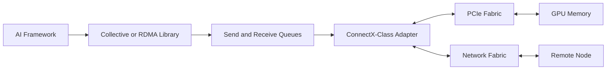
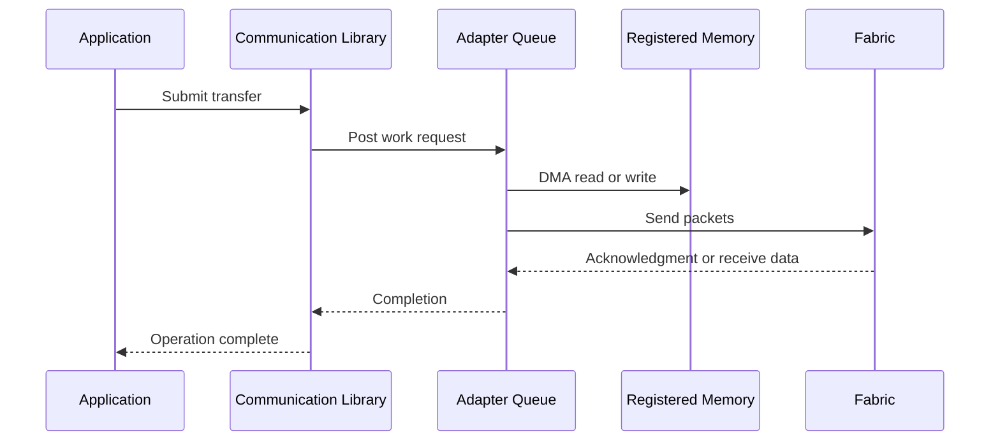
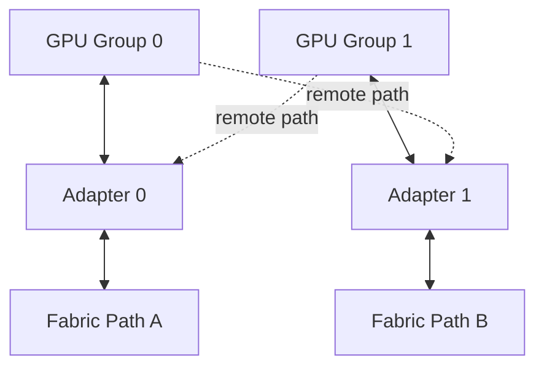

# ConnectX and GPU Network Adapters

## Introduction

A high-speed network adapter in an AI server is not merely an Ethernet or InfiniBand port. It is a data-movement engine with DMA capabilities, queue resources, packet-processing logic, congestion behavior, telemetry, firmware, and a physical relationship to CPUs and GPUs.

In GPU clusters, the adapter must sustain traffic generated by collective communication, distributed storage, checkpointing, service ingress, and management operations. Its line rate matters, but line rate alone does not describe delivered performance. Queue design, PCIe bandwidth, locality, firmware, transport configuration, and application placement can all become limiting factors.

This chapter uses ConnectX-class adapters as the architectural reference while focusing on principles that apply to production GPU networking generally.

| Chapter field | Value |
|---|---|
| Volume | 07 — GPU Networking |
| Difficulty | Advanced |
| Estimated reading time | 50 minutes |
| Previous | GPUDirect Storage |
| Next | Topology-Aware Placement |

## Story

A customer installs dual-port high-speed adapters in every GPU node. The switch ports and cables report the expected speed, but distributed jobs use only part of the available bandwidth. One adapter is heavily loaded while the second remains mostly idle.

The investigation shows that rank placement, routing, and collective configuration all prefer the first adapter. The second adapter is physically closer to another GPU group, but the software does not use that affinity. In addition, both ports share a PCIe path whose aggregate host bandwidth is lower than the sum of their line rates.

The hardware was functioning correctly. The architecture had confused installed bandwidth with usable bandwidth.

## Learning Objectives

After completing this chapter, you will be able to:

- explain the responsibilities of a GPU-cluster network adapter;
- distinguish link rate from delivered application bandwidth;
- describe queue pairs, completion handling, DMA, and offloads at an architectural level;
- reason about multi-port and multi-adapter designs;
- evaluate PCIe and NUMA affinity;
- identify essential adapter telemetry;
- plan firmware and driver lifecycle management;
- troubleshoot underutilization, retries, errors, and imbalance.

## Big Picture

**Figure 7.7.1 — The adapter bridges software queues, the host I/O fabric, and the external network.** Its performance is constrained by both sides of that bridge.

## Adapter Responsibilities

A production adapter may provide:

- packet transmission and reception;
- DMA to host or GPU memory;
- queue-pair and completion processing;
- checksum and segmentation offloads;
- RDMA transport support;
- congestion signaling and rate control;
- traffic classification and quality of service;
- virtualization and device partitioning;
- hardware counters and health telemetry;
- time synchronization and timestamping;
- firmware-managed link behavior.

Not every feature is used by every workload. Architecture should enable the smallest qualified set that satisfies the requirements.

## Queue-Based Data Movement

Applications do not normally ask an adapter to “send this tensor” as one monolithic operation. Communication libraries create queue resources, register memory, post work requests, and poll or receive completion events.

Queue depth, message size, completion strategy, and concurrency affect performance. Too little outstanding work underfills the link. Too much can increase contention, memory use, and tail latency.

## Line Rate versus Delivered Bandwidth

A link advertised at a given rate includes protocol overhead and does not guarantee that the application can deliver payload at that number. Delivered bandwidth may be constrained by:

- PCIe link width and generation;
- adapter processing limits;
- message-size distribution;
- queue depth;
- host or GPU memory bandwidth;
- fabric oversubscription;
- routing imbalance;
- congestion control;
- packet loss and retries;
- remote endpoint behavior;
- software serialization.

A dual-port adapter does not necessarily provide twice the application bandwidth. The ports may share internal resources or a common PCIe uplink.

## Multi-Adapter Node Designs

**Figure 7.7.2 — Multi-adapter designs require affinity.** The second adapter adds value only when software can use it without creating remote topology penalties.

Architectural questions include:

- Is each adapter close to a distinct GPU group?
- Do ports connect to independent switches or the same failure domain?
- Can the collective library stripe traffic across adapters?
- Does the PCIe hierarchy sustain aggregate line rate?
- Are routing and subnet policies balanced?
- How are interrupts and CPU threads assigned?
- What happens when one adapter fails?

## PCIe and NUMA Affinity

The adapter is an endpoint on the PCIe fabric. Its ability to move data depends on the upstream path. A high-speed adapter behind a narrow or down-trained PCIe link can never reach its external line rate.

For host-driven traffic, CPU and memory locality matter. For GPUDirect traffic, GPU-to-adapter locality matters. Production inventory should record:

- PCI bus address;
- negotiated link speed and width;
- NUMA node;
- nearby GPU UUIDs;
- port identifiers;
- switch and cable mapping;
- firmware and driver version.

## Offloads and Their Trade-offs

Offloads move selected work from the CPU into adapter hardware. They can reduce CPU overhead and improve consistency, but also introduce dependencies and observability challenges.

| Offload category | Benefit | Risk |
|---|---|---|
| Checksum or segmentation | Reduces host packet work | Debugging differs from software path |
| RDMA transport | Low-copy, queue-based transfer | Requires end-to-end configuration |
| Congestion control | Faster reaction and hardware enforcement | Misconfiguration can affect the fabric |
| Virtualization | Device sharing and isolation | Resource partitioning complexity |
| Flow steering | Directs traffic efficiently | Incorrect rules cause imbalance or drops |

Enablement should follow a tested profile rather than ad hoc tuning.

## Adapter Telemetry

A useful operational baseline includes:

- link state and negotiated speed;
- transmitted and received bytes;
- packet and symbol errors;
- discards and drops;
- congestion notifications;
- pause or priority-flow-control counters where applicable;
- RDMA retries and timeouts;
- queue errors;
- PCIe correctable and uncorrectable errors;
- temperature and firmware health;
- port utilization distribution.

Absolute counters are less useful than rates and deltas. A counter that has accumulated over years may look alarming while remaining stable. Alert on change during relevant workload windows.

## Firmware and Driver Lifecycle

Adapter firmware, kernel drivers, user-space RDMA libraries, collective libraries, and GPU drivers form a compatibility surface. Production upgrades should use:

1. a qualified version matrix;
2. canary nodes;
3. before-and-after topology captures;
4. host and GPU-buffer benchmarks;
5. sustained collective tests;
6. counter comparison;
7. rollback artifacts.

A link-up check is insufficient. Firmware changes can alter routing behavior, congestion response, queue handling, or interoperability without taking the port down.

## Architecture Trade-offs

### One fast adapter versus several adapters

One adapter simplifies placement and operations. Several adapters can increase bandwidth and resilience but require routing, affinity, and failure-domain design.

### Port bonding versus application awareness

Generic bonding may improve availability for ordinary traffic. Communication libraries may achieve better performance by addressing adapters directly and preserving topology knowledge.

### Maximum offload versus debuggability

Hardware offloads reduce CPU work but can make packet behavior less visible to traditional host tools. Telemetry must extend into the adapter.

### Shared adapter versus dedicated adapter

Sharing improves utilization. Dedicated adapters improve predictability and fault isolation. The correct choice depends on workload criticality and tenancy.

## Production Deployment Pattern

A production node design should define:

- adapter model and firmware;
- port role and fabric attachment;
- GPU affinity map;
- PCIe acceptance criteria;
- MTU and transport configuration;
- QoS and congestion profile;
- management versus data-plane separation;
- benchmark thresholds;
- counter baselines;
- replacement and rollback process.

## Production Troubleshooting

### Scenario 1 — One port carries nearly all traffic

**Diagnosis**

Check routing, collective-library interface selection, process placement, GPU affinity, and whether the application opens queues on both ports.

**Root cause**

Installed capacity was not exposed to the communication algorithm.

**Resolution**

Correct interface selection and rank mapping, then validate that both paths improve the end-to-end workload rather than merely spreading packets.

### Scenario 2 — Link is at full speed but throughput is low

Inspect PCIe width, message size, queue depth, CPU or GPU locality, retries, and remote endpoint behavior. Link state proves connectivity, not payload efficiency.

### Scenario 3 — Errors increase only during large jobs

Correlate adapter errors with switch counters, cable paths, congestion, GPU events, and PCIe errors. Large jobs may activate routes and queue pressure that small tests never exercise.

### Scenario 4 — Performance changes after adapter replacement

Verify firmware, PCIe slot, NUMA location, cable mapping, port configuration, and stable interface naming. A physically compatible replacement may not be operationally identical.

## Customer Scenario

A telecom customer asks whether four network ports per GPU server will quadruple training throughput. The architect maps the GPU groups, PCIe switches, fabric uplinks, and collective traffic. Two additional ports would share the same upstream PCIe bottleneck and the same switch oversubscription.

The recommendation is two well-placed adapters with independent fabric paths, plus topology-aware rank placement. The design spends less while delivering more predictable bandwidth.

## Interview Preparation

### Knowledge Questions

1. Why is line rate different from application bandwidth?
2. What role do queues and completions play?
3. Why does PCIe width matter to a network adapter?
4. Which counters indicate congestion or physical errors?

### Architecture Questions

1. Design a dual-adapter, eight-GPU node.
2. Explain adapter failure domains and fabric attachment.
3. Propose a firmware qualification plan.

### Scenario Questions

1. One port is idle. How do you determine whether this is expected?
2. A 400 Gb/s link delivers much less. What layers do you measure?
3. Throughput regressed after firmware upgrade. What evidence do you compare?

### Customer Questions

1. When do multiple adapters add value?
2. When should ports be dedicated to storage or training?
3. How do you balance redundancy and locality?

## Summary

A GPU network adapter is a queue-driven DMA and transport engine, not simply a link endpoint. Its delivered value depends on software concurrency, PCIe bandwidth, GPU and CPU locality, routing, fabric behavior, and lifecycle qualification.

Production architecture must connect installed ports to real workload paths, monitor hardware counters, and validate changes with end-to-end tests.

## Key Takeaways

- Link rate is only one constraint in a longer data path.
- Multi-adapter designs require explicit affinity and traffic distribution.
- PCIe and NUMA topology can limit otherwise healthy adapters.
- Offloads improve efficiency but expand compatibility and observability requirements.
- Firmware changes require application-level validation.

## Quick Revision Sheet

| Area | Core question |
|---|---|
| Link | Is speed negotiated correctly? |
| Host path | Can PCIe and memory sustain the traffic? |
| GPU path | Is the adapter local to the selected GPU? |
| Software | Are queues and interfaces used effectively? |
| Fabric | Are routing and congestion healthy? |
| Operations | Are counters and versions baselined? |

## Cross References

- Previous: [GPUDirect Storage](./chapter-06-gpudirect-storage)
- Next: [Topology-Aware Placement](./chapter-08-topology-aware-placement)
- Related: [GPUDirect RDMA](./chapter-05-gpudirect-rdma)
- Lab: [Benchmark RDMA and GPUDirect Paths](./labs/lab-03-benchmark-rdma-and-gpudirect-paths)

## Further Reading

Use official adapter hardware documentation, firmware release notes, RDMA driver documentation, fabric-management guides, and collective-library interface-selection guidance for the qualified platform release.
