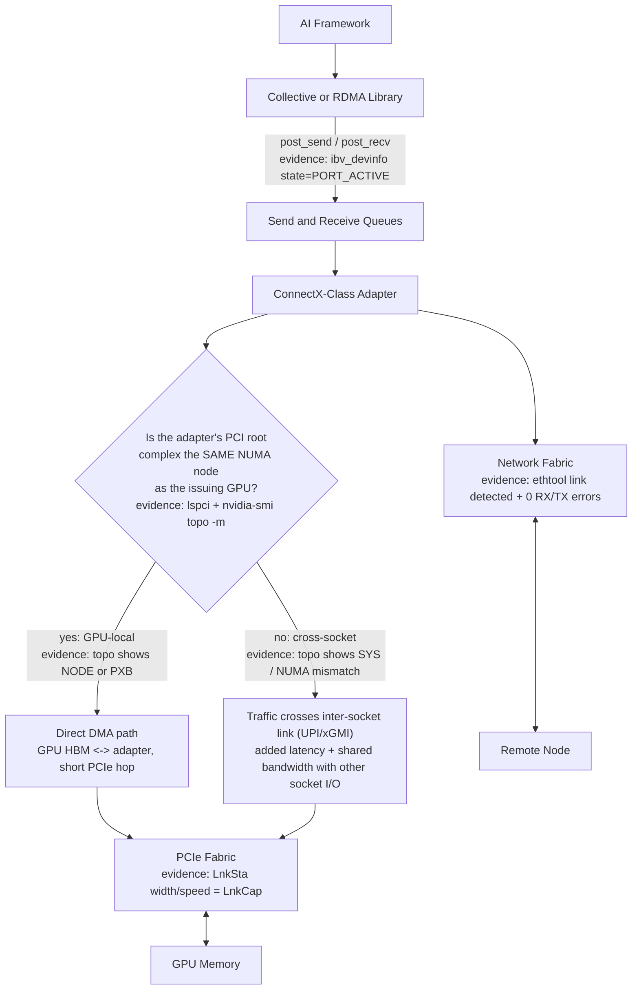
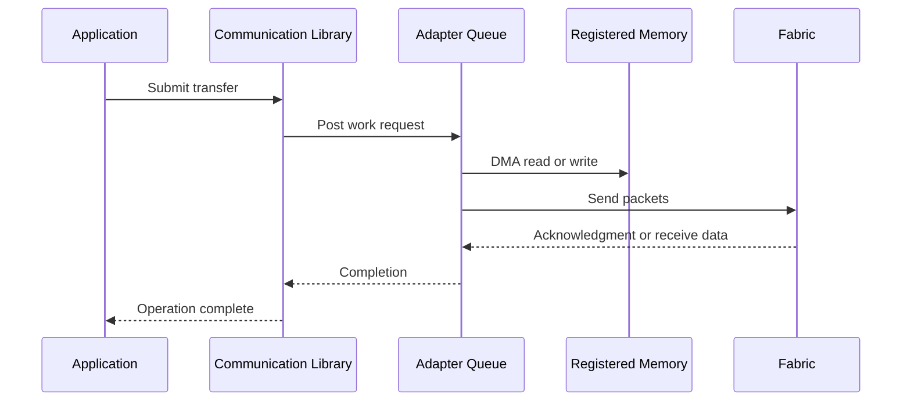
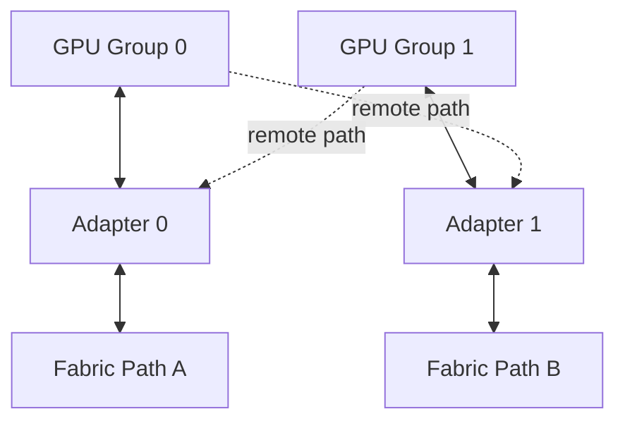

# ConnectX and GPU Network Adapters

## Introduction

A high-speed network adapter in an AI server is not merely an Ethernet or InfiniBand port. It is a data-movement engine with DMA capabilities, queue resources, packet-processing logic, congestion behavior, telemetry, firmware, and a physical relationship to CPUs and GPUs.

In GPU clusters, the adapter must sustain traffic generated by collective communication, distributed storage, checkpointing, service ingress, and management operations. Its line rate matters, but line rate alone does not describe delivered performance. Queue design, PCIe bandwidth, locality, firmware, transport configuration, and application placement can all become limiting factors.

This chapter uses ConnectX-class adapters as the architectural reference while focusing on principles that apply to production GPU networking generally.

| Chapter field | Value |
|---|---|
| Volume | 07 — GPU Networking |
| Difficulty | Advanced |
| Estimated reading time | 50 minutes |
| Previous | GPUDirect Storage |
| Next | Topology-Aware Placement |

## Story

A customer installs dual-port high-speed adapters in every GPU node. The switch ports and cables report the expected speed, but distributed jobs use only part of the available bandwidth. One adapter is heavily loaded while the second remains mostly idle.

The investigation shows that rank placement, routing, and collective configuration all prefer the first adapter. The second adapter is physically closer to another GPU group, but the software does not use that affinity. In addition, both ports share a PCIe path whose aggregate host bandwidth is lower than the sum of their line rates.

The hardware was functioning correctly. The architecture had confused installed bandwidth with usable bandwidth.

## Learning Objectives

After completing this chapter, you will be able to:

- explain the responsibilities of a GPU-cluster network adapter;
- distinguish link rate from delivered application bandwidth;
- describe queue pairs, completion handling, DMA, and offloads at an architectural level;
- reason about multi-port and multi-adapter designs;
- evaluate PCIe and NUMA affinity;
- identify essential adapter telemetry;
- plan firmware and driver lifecycle management;
- troubleshoot underutilization, retries, errors, and imbalance.

## Big Picture



**Figure 7.7.1 — The adapter bridges software queues, the host I/O fabric, and the external network, and the path forks at GPU locality.** A GPU-local adapter (same PCIe root complex / NUMA node) gives a short direct DMA path. A non-local adapter forces traffic across the inter-socket link before it even reaches PCIe, which is the single most common hidden cause of "line rate is fine but delivered bandwidth is not" in a multi-socket node. Each edge above lists the command output that proves that hop is actually healthy — the diagram is a checklist as much as a picture.

## Adapter Responsibilities

A production adapter may provide:

- packet transmission and reception;
- DMA to host or GPU memory;
- queue-pair and completion processing;
- checksum and segmentation offloads;
- RDMA transport support;
- congestion signaling and rate control;
- traffic classification and quality of service;
- virtualization and device partitioning;
- hardware counters and health telemetry;
- time synchronization and timestamping;
- firmware-managed link behavior.

Not every feature is used by every workload. Architecture should enable the smallest qualified set that satisfies the requirements.

## Queue-Based Data Movement

Applications do not normally ask an adapter to “send this tensor” as one monolithic operation. Communication libraries create queue resources, register memory, post work requests, and poll or receive completion events.



Queue depth, message size, completion strategy, and concurrency affect performance. Too little outstanding work underfills the link. Too much can increase contention, memory use, and tail latency.

**Checking that a device actually has active queues and a live port, before trusting anything upstream of it:**

```bash
$ ibdev2netdev
mlx5_0 port 1 ==> eth0 (Up)
mlx5_1 port 1 ==> eth1 (Up)
```

`ibdev2netdev` maps the RDMA device name (`mlx5_0`) to its Linux network interface name (`eth0`) and reports link state. This is the first command to run before any deeper diagnosis — if the mapping is missing or the state is `Down`, nothing downstream (queues, collectives, telemetry) can be trusted.

```bash
$ ibv_devinfo -d mlx5_0
hca_id: mlx5_0
    transport:          InfiniBand (0)
    fw_ver:             28.39.2048
    node_guid:          9803:9b03:00fa:6c20
    sys_image_guid:     9803:9b03:00fa:6c20
    vendor_id:          0x02c9
    phys_port_cnt:      1
        port:   1
            state:          PORT_ACTIVE (4)
            max_mtu:        4096 (5)
            active_mtu:     4096 (5)
            sm_lid:         1
            port_lid:       1
            link_layer:     Ethernet
```

`state: PORT_ACTIVE (4)` is the field that proves the queue pair infrastructure can actually pass traffic — `PORT_INIT` or `PORT_DOWN` here means every "queue depth" or "message size" tuning discussion above is moot until link/negotiation is fixed first. `active_mtu` confirms the negotiated MTU matches what the fabric and collective library expect; a mismatch here silently fragments or drops large RDMA messages.

## Line Rate versus Delivered Bandwidth

A link advertised at a given rate includes protocol overhead and does not guarantee that the application can deliver payload at that number. Delivered bandwidth may be constrained by:

- PCIe link width and generation;
- adapter processing limits;
- message-size distribution;
- queue depth;
- host or GPU memory bandwidth;
- fabric oversubscription;
- routing imbalance;
- congestion control;
- packet loss and retries;
- remote endpoint behavior;
- software serialization.

A dual-port adapter does not necessarily provide twice the application bandwidth. The ports may share internal resources or a common PCIe uplink.

## Multi-Adapter Node Designs



**Figure 7.7.2 — Multi-adapter designs require affinity.** The second adapter adds value only when software can use it without creating remote topology penalties.

Architectural questions include:

- Is each adapter close to a distinct GPU group?
- Do ports connect to independent switches or the same failure domain?
- Can the collective library stripe traffic across adapters?
- Does the PCIe hierarchy sustain aggregate line rate?
- Are routing and subnet policies balanced?
- How are interrupts and CPU threads assigned?
- What happens when one adapter fails?

## PCIe and NUMA Affinity

The adapter is an endpoint on the PCIe fabric. Its ability to move data depends on the upstream path. A high-speed adapter behind a narrow or down-trained PCIe link can never reach its external line rate.

For host-driven traffic, CPU and memory locality matter. For GPUDirect traffic, GPU-to-adapter locality matters. Production inventory should record:

- PCI bus address;
- negotiated link speed and width;
- NUMA node;
- nearby GPU UUIDs;
- port identifiers;
- switch and cable mapping;
- firmware and driver version.

**Building that inventory row for one adapter, with the fields read out:**

```bash
$ lspci -vvv -s 17:00.0 | egrep 'LnkCap|LnkSta|NUMA'
	LnkCap:	Port #0, Speed 32GT/s, Width x16
	LnkSta:	Speed 32GT/s (ok), Width x16 (ok)

$ cat /sys/class/net/eth0/device/numa_node
0

$ nvidia-smi topo -m | egrep 'GPU0|mlx5_0'
        GPU0    mlx5_0  CPU Affinity   NUMA Affinity
GPU0     X      NODE    0-31,64-95      0
mlx5_0  NODE     X
```

`LnkCap` is what the slot supports (32 GT/s, x16 — PCIe Gen5 x16); `LnkSta` is what actually negotiated, and both say `(ok)` meaning the link came up at its full capability. A down-trained link would show `LnkSta: Speed 16GT/s (downgraded)` or a narrower `Width x8 (downgraded)`, which caps the adapter's host-side bandwidth well below its rated line rate regardless of what the switch and cable report. `numa_node: 0` combined with `nvidia-smi topo -m` showing `GPU0`↔`mlx5_0` as `NODE` (same NUMA node, connected through a PCIe host bridge, not crossing sockets) confirms this specific adapter is GPU-local — the "yes" branch in the Big Picture diagram above. If that row instead showed `SYS` (traversing the inter-socket link), it would mean every transfer from GPU0 through this adapter pays a cross-socket penalty before it even reaches the wire.

## Offloads and Their Trade-offs

Offloads move selected work from the CPU into adapter hardware. They can reduce CPU overhead and improve consistency, but also introduce dependencies and observability challenges.

| Offload category | Benefit | Risk |
|---|---|---|
| Checksum or segmentation | Reduces host packet work | Debugging differs from software path |
| RDMA transport | Low-copy, queue-based transfer | Requires end-to-end configuration |
| Congestion control | Faster reaction and hardware enforcement | Misconfiguration can affect the fabric |
| Virtualization | Device sharing and isolation | Resource partitioning complexity |
| Flow steering | Directs traffic efficiently | Incorrect rules cause imbalance or drops |

Enablement should follow a tested profile rather than ad hoc tuning.

## Adapter Telemetry

A useful operational baseline includes:

- link state and negotiated speed;
- transmitted and received bytes;
- packet and symbol errors;
- discards and drops;
- congestion notifications;
- pause or priority-flow-control counters where applicable;
- RDMA retries and timeouts;
- queue errors;
- PCIe correctable and uncorrectable errors;
- temperature and firmware health;
- port utilization distribution.

Absolute counters are less useful than rates and deltas. A counter that has accumulated over years may look alarming while remaining stable. Alert on change during relevant workload windows.

**Reading the baseline set, annotated:**

```bash
$ ibstat mlx5_0
CA 'mlx5_0'
	CA type: MT4129
	Number of ports: 1
	Firmware version: 28.39.2048
	Hardware version: 0
	Node GUID: 0x98039b0300fa6c20
	Port 1:
		State: Active
		Physical state: LinkUp
		Rate: 400
		Base lid: 1
		LMC: 0
```

`State: Active` / `Physical state: LinkUp` is the port-level pair to check before anything else — `Active` is the logical/administrative state, `LinkUp` is the physical layer; both must agree. `Rate: 400` (Gb/s) is the negotiated link rate — compare it against the adapter's rated speed and the switch port configuration; a `Rate` lower than expected with `Physical state: LinkUp` still true usually means auto-negotiation settled on a lower speed, often from a marginal cable or an incompatible transceiver.

```bash
$ ethtool -S eth0 | egrep 'rx_prio0_discards|rx_out_of_buffer|tx_errors|rx_crc_errors|rx_packets|tx_packets'
     rx_packets: 48213908213
     tx_packets: 47990112044
     rx_crc_errors: 0
     tx_errors: 0
     rx_out_of_buffer: 118422
     rx_prio0_discards: 118422
```

`rx_crc_errors: 0` and `tx_errors: 0` rule out a physical-layer/cable problem — those should stay at zero under normal operation, and any nonzero, growing value points at cabling, transceiver, or signal integrity. `rx_out_of_buffer` and `rx_prio0_discards` both nonzero and equal is the signature of receive-side congestion: the adapter is receiving faster than the host can post receive buffers or drain queues, which shows up as an application-visible retransmit or stall even though the link itself is error-free. The correct read here is "not a cable problem, but a host-side buffering/backpressure problem" — exactly the kind of counter this chapter's Scenario 3 troubleshooting below depends on.

```bash
$ show_gids
DEV     PORT    INDEX   GID                                     IPv4            VER     DEV
---     ----    -----   ---                                     ------------    ---     ---
mlx5_0  1       0       fe80:0000:0000:0000:9803:9bff:fe03:6c20                 v1      eth0
mlx5_0  1       1       0000:0000:0000:ffff:0a0a:0164            10.10.1.100     v2      eth0
```

`show_gids` lists the GID table used for RoCE addressing. GID index `1` (`v2`, RoCE v2, carrying the IPv4-mapped address) is normally the one collective libraries and RDMA-CM select for routable traffic; if a job's RDMA connection setup fails or falls back to a slower transport, checking that the expected GID index actually exists and matches the intended subnet is a fast first check.

```bash
$ mlxconfig -d mlx5_0 query | egrep 'ADVANCED_PCI_SETTINGS|PCI_WR_ORDERING|NUM_OF_VFS'
        ADVANCED_PCI_SETTINGS               True(1)
        PCI_WR_ORDERING                     Performance(0)
        NUM_OF_VFS                          8
```

`mlxconfig query` reads the firmware-persisted configuration, not the current runtime link state — this is where PCIe write-ordering, SR-IOV VF counts, and other settings that only take effect after a firmware reset live. A common lifecycle mistake is changing `mlxconfig` settings and expecting them live immediately; they require a device reset (`mlxfwreset`) or reboot, which is why firmware changes belong in the qualified upgrade process described below, not ad hoc tuning.

## Firmware and Driver Lifecycle

Adapter firmware, kernel drivers, user-space RDMA libraries, collective libraries, and GPU drivers form a compatibility surface. Production upgrades should use:

1. a qualified version matrix;
2. canary nodes;
3. before-and-after topology captures;
4. host and GPU-buffer benchmarks;
5. sustained collective tests;
6. counter comparison;
7. rollback artifacts.

A link-up check is insufficient. Firmware changes can alter routing behavior, congestion response, queue handling, or interoperability without taking the port down.

## Architecture Trade-offs

### One fast adapter versus several adapters

One adapter simplifies placement and operations. Several adapters can increase bandwidth and resilience but require routing, affinity, and failure-domain design.

### Port bonding versus application awareness

Generic bonding may improve availability for ordinary traffic. Communication libraries may achieve better performance by addressing adapters directly and preserving topology knowledge.

### Maximum offload versus debuggability

Hardware offloads reduce CPU work but can make packet behavior less visible to traditional host tools. Telemetry must extend into the adapter.

### Shared adapter versus dedicated adapter

Sharing improves utilization. Dedicated adapters improve predictability and fault isolation. The correct choice depends on workload criticality and tenancy.

## Production Deployment Pattern

A production node design should define:

- adapter model and firmware;
- port role and fabric attachment;
- GPU affinity map;
- PCIe acceptance criteria;
- MTU and transport configuration;
- QoS and congestion profile;
- management versus data-plane separation;
- benchmark thresholds;
- counter baselines;
- replacement and rollback process.

## Production Troubleshooting

### Scenario 1 — One port carries nearly all traffic

**Diagnosis**

Check routing, collective-library interface selection, process placement, GPU affinity, and whether the application opens queues on both ports.

**Evidence**

```bash
$ ethtool -S eth0 | grep tx_packets; ethtool -S eth1 | grep tx_packets
     tx_packets: 812004112211
     tx_packets: 4021880

$ nvidia-smi topo -m | egrep 'GPU2|GPU3|mlx5_0|mlx5_1'
        GPU2    GPU3    mlx5_0  mlx5_1
GPU2     X      NV18     SYS    NODE
GPU3    NV18      X      SYS    NODE
mlx5_0  SYS     SYS       X     SYS
mlx5_1  NODE    NODE     SYS     X
```

`tx_packets` on `eth0` outnumbers `eth1` by roughly five orders of magnitude — this is not a minor imbalance, it is effectively single-port operation. The topology table explains why: GPU2 and GPU3 are `NODE`-local (same PCIe root complex) to `mlx5_1`, not `mlx5_0`, yet almost all traffic went out `eth0` (`mlx5_0`). That confirms the root cause below — the collective library or rank-to-interface mapping never considered `mlx5_1` even though it is the topologically correct adapter for GPU2/GPU3.

**Root cause**

Installed capacity was not exposed to the communication algorithm.

**Resolution**

Correct interface selection and rank mapping, then validate that both paths improve the end-to-end workload rather than merely spreading packets. Re-running the same `ethtool -S` delta after the fix should show `tx_packets` on both interfaces growing at comparable rates during a balanced collective, not just packets present on both.

### Scenario 2 — Link is at full speed but throughput is low

Inspect PCIe width, message size, queue depth, CPU or GPU locality, retries, and remote endpoint behavior. Link state proves connectivity, not payload efficiency.

**Evidence**

```bash
$ ibstat mlx5_0 | egrep 'State|Rate'
		State: Active
		Rate: 400

$ lspci -vvv -s 17:00.0 | grep LnkSta
	LnkSta:	Speed 16GT/s (downgraded), Width x8 (downgraded)
```

The RDMA layer reports a healthy, fully negotiated `400` Gb/s port — this is the number a naive check would stop at and declare the adapter fine. But `lspci` shows the PCIe link is running at `16GT/s x8` (Gen4 x8, roughly 16 GB/s each direction) instead of its `32GT/s x16` capability (Gen5 x16, roughly 64 GB/s) — a `(downgraded)` link, most commonly caused by a reseated card not fully retrained, a BIOS/riser negotiation issue, or a slot shared with another downstream device forcing bifurcation. A ~4x narrower host-side path caps delivered bandwidth far below the 400 Gb/s (~50 GB/s) line rate regardless of how healthy the network side looks — this is the mechanism the Big Picture diagram's PCIe edge is checking for.

### Scenario 3 — Errors increase only during large jobs

Correlate adapter errors with switch counters, cable paths, congestion, GPU events, and PCIe errors. Large jobs may activate routes and queue pressure that small tests never exercise.

### Scenario 4 — Performance changes after adapter replacement

Verify firmware, PCIe slot, NUMA location, cable mapping, port configuration, and stable interface naming. A physically compatible replacement may not be operationally identical.

## Customer Scenario

A telecom customer asks whether four network ports per GPU server will quadruple training throughput. The architect maps the GPU groups, PCIe switches, fabric uplinks, and collective traffic. Two additional ports would share the same upstream PCIe bottleneck and the same switch oversubscription.

The recommendation is two well-placed adapters with independent fabric paths, plus topology-aware rank placement. The design spends less while delivering more predictable bandwidth.

**Illustrative arithmetic behind that recommendation:** four 400 Gb/s ports naively summed suggest 1,600 Gb/s (~200 GB/s) of node bandwidth. If all four share one Gen5 x16 PCIe uplink (~64 GB/s of realistic host bandwidth per the earlier PCIe evidence), the achievable ceiling is closer to 64 GB/s — roughly a third of the naive sum, regardless of port count. Two adapters, each on its own Gen5 x16 root complex, can each approach their own ~50 GB/s payload ceiling independently, yielding close to 100 GB/s of real usable bandwidth — less installed capacity, more delivered bandwidth, because it isn't bottlenecked behind a shared upstream link. These figures are illustrative or order-of-magnitude, not vendor-specified numbers for a particular SKU.

## Interview Preparation

### Knowledge Questions

1. Why is line rate different from application bandwidth?
   > "Line rate is what the port negotiated — say 400 Gb/s — and it includes protocol overhead the application never sees as payload. Delivered bandwidth is what actually arrives after PCIe width, queue depth, message size, congestion, and even remote-endpoint behavior all take their cut. I've seen a fully negotiated 400 Gb/s port deliver a fraction of that because the PCIe link behind it was running at Gen4 x8 instead of Gen5 x16 — the wire was never the bottleneck."

2. What role do queues and completions play?
   > "The application doesn't hand the adapter one big blob and wait. The library posts a work request onto a send or receive queue, the adapter DMAs the data and moves packets, and a completion event tells the library the operation finished. If queue depth is too shallow you underfill the link because there's never enough outstanding work; too deep and you add contention and tail latency. `ibv_devinfo` showing `PORT_ACTIVE` is the precondition — no queue tuning matters if the port itself isn't up."

3. Why does PCIe width matter to a network adapter?
   > "The adapter is just an endpoint on the PCIe fabric — its external line rate is meaningless if the host-side link can't keep up. A 400 Gb/s port is roughly 50 GB/s of payload; that needs close to a full Gen5 x16 link. If `lspci` shows the link downgraded to x8, I've effectively halved the host-side ceiling no matter what the network side reports as healthy."

4. Which counters indicate congestion or physical errors?
   > "Physical errors show up as `rx_crc_errors` or symbol errors — those should sit at zero and any growth means cabling or transceiver problems. Congestion shows up differently: `rx_out_of_buffer` and `rx_prio0_discards` climbing together mean the host isn't draining receive queues fast enough, which is a backpressure problem, not a wire problem. I always check both counters together because they point at completely different remediations."

### Architecture Questions

1. Design a dual-adapter, eight-GPU node.
   > "I'd split the eight GPUs into two groups of four based on the PCIe/NVLink topology, and place one adapter local — same root complex, same NUMA node — to each group, verified with `nvidia-smi topo -m`. Each adapter goes to an independent switch so one fabric failure doesn't take out both paths. Then I make sure the collective library actually knows about both interfaces and maps ranks so GPU group 0 traffic goes out adapter 0 and group 1 out adapter 1 — installing two ports doesn't help if the software still funnels everything through one."

2. Explain adapter failure domains and fabric attachment.
   > "A failure domain is everything that goes down together. If both ports on a dual-port adapter share one PCIe uplink, a firmware crash or PCIe error takes out both, so from a failure-domain view they're one unit even though they're two ports. I want each adapter attached to an independent switch and, ideally, an independent PCIe device, so a single card or cable failure only removes half the node's fabric capacity, not all of it."

3. Propose a firmware qualification plan.
   > "Never push firmware straight to production. I'd build a version matrix — firmware, driver, RDMA user-space library, collective library, GPU driver — and validate it on canary nodes first. Before and after, I capture `nvidia-smi topo -m` and adapter counters as a baseline, then run host and GPU-buffer benchmarks plus a sustained collective test, not just a link-up check, because firmware can change congestion response or routing behavior without ever taking the port down. I keep rollback artifacts ready before I touch anything at scale."

### Scenario Questions

1. One port is idle. How do you determine whether this is expected?
   > "First I check whether any GPU group is actually supposed to use that port — `nvidia-smi topo -m` tells me which GPUs are local to it. Then I check `ethtool -S` packet counters on both interfaces to see the actual traffic split, and I check whether the collective library or routing config even knows the second interface exists. An idle port that's topologically the right path for half the GPUs is a configuration bug; an idle port with no local GPU traffic to send may just be correctly reserved for something else."

2. A 400 Gb/s link delivers much less. What layers do you measure?
   > "I work outward from the adapter: `ibstat` for negotiated port rate and state, `lspci -vvv` for PCIe link speed and width — because a downgraded x8 link caps everything above it — then message size and queue depth in the application, then CPU or GPU memory locality, then retries and congestion counters, and finally remote endpoint behavior. Link state proves connectivity; it proves nothing about payload efficiency, so I don't stop at the first green light."

3. Throughput regressed after firmware upgrade. What evidence do you compare?
   > "I pull the pre-upgrade baseline I should have captured — topology output, counter deltas, and collective benchmark numbers — and diff them against post-upgrade. I'm specifically looking for routing or congestion-response changes, since firmware can alter those without the port ever going down. If I don't have a baseline, the answer is 'we can't isolate this cleanly,' which is exactly why the qualification plan requires capturing one before every change."

### Customer Questions

1. When do multiple adapters add value?
   > "When each adapter is genuinely local to a distinct GPU group and attached to an independent fabric path — then you get real additional bandwidth and resilience. If the extra ports share the same upstream PCIe switch or the same leaf switch as the first adapter, you're paying for capacity you can't actually use concurrently."

2. When should ports be dedicated to storage or training?
   > "When the two traffic classes have very different tolerance for jitter or contention — training collectives are latency-sensitive synchronization points, and a storage burst competing for the same queues can stall an entire training step. If both fit comfortably within the adapter's headroom and QoS is configured properly, sharing is fine and cheaper to operate."

3. How do you balance redundancy and locality?
   > "Redundancy wants independent failure domains; locality wants the shortest, most local path to the GPU. Those usually agree — two adapters on separate PCIe roots and separate switches give you both. Where they conflict, I favor locality for the primary path and treat the redundant path as a documented, tested fallback rather than trying to load-balance across a remote adapter under normal conditions."

## Summary

A GPU network adapter is a queue-driven DMA and transport engine, not simply a link endpoint. Its delivered value depends on software concurrency, PCIe bandwidth, GPU and CPU locality, routing, fabric behavior, and lifecycle qualification.

Production architecture must connect installed ports to real workload paths, monitor hardware counters, and validate changes with end-to-end tests.

## Key Takeaways

- Link rate is only one constraint in a longer data path.
- Multi-adapter designs require explicit affinity and traffic distribution.
- PCIe and NUMA topology can limit otherwise healthy adapters.
- Offloads improve efficiency but expand compatibility and observability requirements.
- Firmware changes require application-level validation.

## Quick Revision Sheet

| Area | Core question |
|---|---|
| Link | Is speed negotiated correctly? |
| Host path | Can PCIe and memory sustain the traffic? |
| GPU path | Is the adapter local to the selected GPU? |
| Software | Are queues and interfaces used effectively? |
| Fabric | Are routing and congestion healthy? |
| Operations | Are counters and versions baselined? |

## Cross References

- Previous: [GPUDirect Storage](./chapter-06-gpudirect-storage)
- Next: [Topology-Aware Placement](./chapter-08-topology-aware-placement)
- Related: [GPUDirect RDMA](./chapter-05-gpudirect-rdma)
- Lab: [Benchmark RDMA and GPUDirect Paths](./labs/lab-03-benchmark-rdma-and-gpudirect-paths)

## Further Reading

Use official adapter hardware documentation, firmware release notes, RDMA driver documentation, fabric-management guides, and collective-library interface-selection guidance for the qualified platform release.
