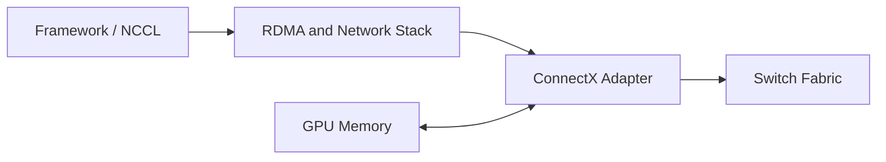

# ConnectX and GPU Network Adapters

A high-speed adapter is not merely a cable endpoint. It terminates transport functions, performs DMA, exposes queues, reports congestion and error telemetry, and becomes part of the GPU communication path. ConnectX adapters are commonly used in NVIDIA AI platforms for InfiniBand or Ethernet-based RDMA designs.

## Learning Objectives

Explain adapter responsibilities, relate queues and DMA to GPU traffic, evaluate placement, and build an operational health model.

## Architecture

## Adapter Responsibilities

The NIC handles packet transmission and reception, queue processing, DMA, completion reporting, offloads, and link management. Depending on transport and configuration, it may participate in congestion control, traffic prioritization, telemetry, and virtualization.

An adapter’s headline speed is only one property. Port count, PCIe generation and width, firmware, link mode, optics, MTU, NUMA placement, and switch configuration determine delivered performance.

| Domain | Questions |
|---|---|
| Physical | Correct cable, optic, lane count, and link speed? |
| PCIe | Full width and generation? Shared uplink? Local to GPUs? |
| Firmware | Qualified version and consistent settings? |
| Transport | InfiniBand or Ethernet/RoCE configured correctly? |
| Workload | Correct HCA and port selected per rank? |
| Operations | Counters, health events, and replacement process available? |

## Multi-Rail Design

Large nodes may use several adapters. Multi-rail designs increase aggregate bandwidth and provide more paths, but only when software distributes traffic correctly and the fabric is built symmetrically. A second adapter does not automatically double throughput.

The architect must map GPU groups to local HCAs, define routing and traffic classes, and avoid oversubscribing shared PCIe roots. Failure behavior also matters: losing one rail may reduce capacity, strand ranks, or force the communication library onto a slower path.

## Production Operations

Maintain adapter inventory, firmware baselines, link-state history, error counters, switch-port mapping, and cable identity. Monitor symbol or physical errors, retransmission-related indicators, congestion, drops, queue problems, temperature, and PCIe health.

Changes should be staged as a compatibility set: NIC firmware, driver/RDMA stack, switch software, and communication libraries can interact.

## Troubleshooting

**Symptom:** the link reports full speed, but collective throughput is low.

Check PCIe negotiation, NUMA locality, HCA selection, message-size scaling, switch counters, congestion, and whether traffic uses RDMA or sockets. Link speed proves only the physical negotiation state.

**Symptom:** one node is a persistent straggler.

Compare its adapter firmware, cable path, PCIe topology, counters, and thermal state with a known-good node. Replace components only after isolating the failing layer.

## Customer Perspective

When a customer asks how many NICs a GPU server needs, start with aggregate communication demand, topology, oversubscription, failure tolerance, storage separation, and rack fabric design. Adapter count is an output of the system model.

## Interview Preparation

**Question:** Why does NIC locality matter for GPUDirect RDMA?

Because a remote or constrained PCIe path can add inter-socket traffic, reduce bandwidth, and increase contention even though both devices individually support direct access.

## Key Takeaways

- The NIC is an active data-movement engine.
- Adapter speed, PCIe placement, firmware, and fabric design must align.
- Multi-rail requires deliberate software and topology mapping.
- Link-up is not an end-to-end performance test.

## Cross References

- [GPUDirect RDMA](./chapter-05-gpudirect-rdma)
- [Next: Topology-Aware Placement](./chapter-08-topology-aware-placement)
