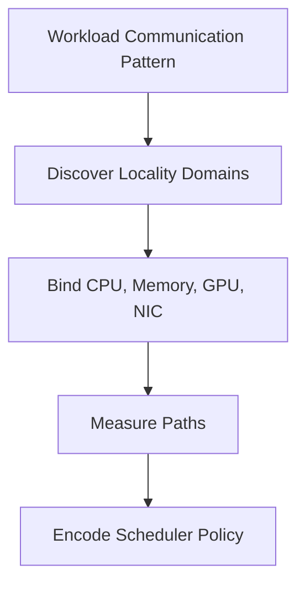

# Topology-Aware Placement

Schedulers commonly treat identical GPUs as interchangeable. Hardware does not. A process can be local to one GPU, remote from another, close to one NIC, and separated from storage by a shared PCIe path. Topology-aware placement converts this physical reality into scheduling policy.

## Learning Objectives

Build locality domains, map ranks to GPUs and NICs, explain when strict affinity helps, and troubleshoot asymmetric placement.

## Placement Model

A locality domain may be a NUMA node, PCIe root, NVLink island, NIC rail, or rack. The useful boundary depends on the communication pattern.

## Rank Mapping

For distributed jobs, each process rank should have a deliberate CPU set, GPU assignment, and preferred network device. Communication libraries can discover topology, but explicit launcher and scheduler integration remains valuable when nodes expose several rails or asymmetric paths.

| Workload | Placement priority |
|---|---|
| Independent inference replicas | Isolation and balanced load |
| Tensor parallelism | Fast GPU peer paths |
| Data parallel training | Local GPU/NIC pairing and scale-out balance |
| Storage-heavy preprocessing | GPU/storage or NIC locality |
| Mixed tenancy | Predictable contention boundaries |

## Kubernetes and Batch Schedulers

Kubernetes device allocation alone does not guarantee CPU or NIC locality. Node labels, topology managers, CPU managers, network attachments, and custom scheduling extensions may be required. Slurm and other HPC schedulers similarly need consistent GPU, CPU, and HCA binding.

Strict affinity can reduce placement flexibility and utilization. Use it where the workload is sensitive; do not impose complex constraints on jobs that gain no measurable benefit.

## Production Design

Create a machine-readable topology inventory and validate it after firmware or hardware changes. Standardize node models where possible. Benchmark representative placements and publish expected ranges so operators can distinguish normal topology variation from failure.

## Troubleshooting

**Symptom:** only some job launches are slow.

Compare the placement map for fast and slow runs. Look for cross-socket CPU/GPU binding, remote NIC selection, oversubscribed PCIe switches, or ranks placed across weak peer links.

**Resolution:** correct the launcher or scheduler policy and verify using repeatable bandwidth and collective tests. Prevent recurrence with admission checks and topology labels.

## Customer Scenario

A shared cluster shows unpredictable training time. Hardware health is normal, but jobs receive different GPU/NIC combinations on each run. The architecture team defines locality groups and rank mapping, trading a small amount of scheduling flexibility for stable performance.

## Interview Preparation

**Question:** When can topology-aware scheduling reduce overall cluster efficiency?

When constraints fragment resources or delay jobs that are not topology-sensitive. The answer is workload classes and measured policies, not universal strict affinity.

## Key Takeaways

- Equal resource counts do not imply equal paths.
- Placement must follow workload communication.
- Scheduler policy should encode measured locality needs.
- Predictability is often more valuable than occasional peak performance.

## Cross References

- [ConnectX and GPU Network Adapters](./chapter-07-connectx-and-gpu-network-adapters)
- [Next: Multi-Node Collectives](./chapter-09-multi-node-collectives-and-nccl-paths)
