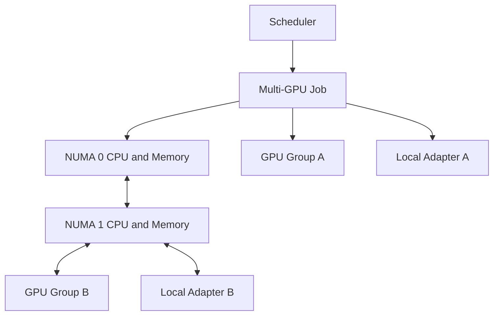
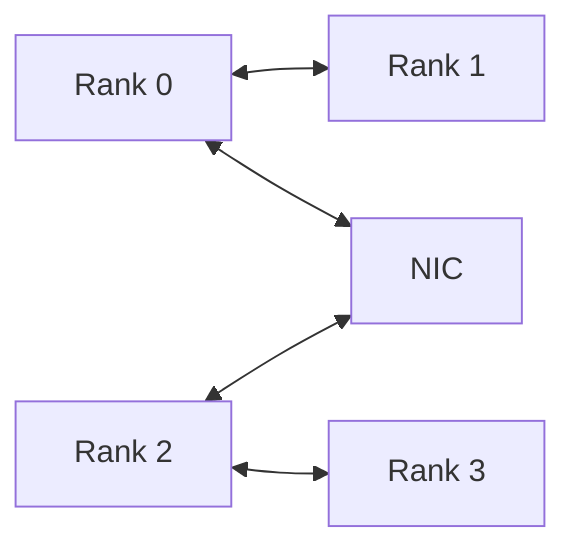

# Topology-Aware Placement

## Introduction

A scheduler can allocate the correct number of GPUs and still produce a poor architecture. Capacity answers how many devices are available. Placement answers which devices, CPUs, adapters, and memory domains should work together.

Topology-aware placement aligns software communication patterns with physical data paths. It becomes essential when workloads exchange large tensors, use several network adapters, cross CPU sockets, or share a node with other jobs.

| Chapter field | Value |
|---|---|
| Volume | 07 — GPU Networking |
| Difficulty | Advanced |
| Estimated reading time | 50 minutes |
| Previous | ConnectX and GPU Network Adapters |
| Next | Multi-Node Collectives and NCCL Paths |

## Story

A four-GPU inference service meets its latency target on one node but misses it on another node of the same model. Device health, driver versions, and clocks are identical.

The first node assigns the tokenizer and request workers to CPU cores local to the selected GPUs. The second node places them on the opposite NUMA socket and routes network traffic through a remote adapter. The logical deployment is identical; the physical path is not.

The platform team introduces topology labels, CPU affinity, and GPU-to-NIC placement rules. Tail latency becomes stable without changing the model or GPU count.

## Learning Objectives

After completing this chapter, you will be able to:

- distinguish resource allocation from topology-aware placement;
- map GPUs, CPUs, memory, adapters, and storage to NUMA domains;
- explain strong and weak GPU communication groups;
- design placement rules for training and inference;
- balance locality against scheduler utilization;
- diagnose fragmentation and remote-path penalties;
- create a commissioning baseline for node topology.

## Big Picture

**Figure 7.8.1 — Placement is a coordinated selection.** CPU, GPU, and adapter choices should follow the workload’s communication graph.

## The Placement Problem

A node may expose several valid resource combinations. The scheduler must choose among them while considering:

- GPU-to-GPU connectivity;
- GPU-to-NIC affinity;
- CPU and memory locality;
- PCIe switch sharing;
- storage-device locality;
- workload communication pattern;
- tenant isolation;
- failure domains;
- cluster utilization.

The best placement for a tightly coupled training job may be wasteful for four independent inference replicas. Architecture must match the workload.

## Logical versus Physical Topology

Logical topology is what software requests: four GPUs, sixteen CPUs, one network interface. Physical topology is how those resources are wired.

Stable placement inputs include:

- GPU UUID and PCI address;
- NUMA node;
- NVLink or NVSwitch connectivity;
- peer-access matrix;
- NIC PCI address and port;
- CPU set;
- storage-device location;
- switch and rack identity.

Do not rely on device indices alone. Enumeration order is not an architectural contract.

## Communication Graph First

Before choosing placement, draw who communicates with whom.

A workload with frequent communication between ranks 0 and 1 should place them on a strong local pair. A model-parallel group may require all selected GPUs to share the strongest available fabric. Independent replicas may prioritize isolation and utilization instead.

## CPU and Memory Binding

CPU workers often perform tokenization, input processing, launch coordination, and network progress. Remote CPU placement can add inter-socket traffic and increase latency.

Production binding strategies may include:

- assigning CPU cores from the GPU’s NUMA domain;
- allocating host memory locally;
- placing network progress threads near the selected adapter;
- avoiding oversubscription of the same core set;
- reserving housekeeping CPUs for system services.

Binding must be measured. Excessively rigid pinning can reduce scheduler flexibility or create imbalance.

## GPU Group Selection

Strong GPU groups may share:

- direct NVLink connections;
- one NVSwitch domain;
- one PCIe switch;
- one root complex;
- one local network adapter.

Weak groups may cross sockets or use host-mediated paths. For communication-heavy jobs, fragmentation across weak groups can dominate runtime.

## Adapter Selection

For distributed jobs, the selected network adapter should be close to the GPU group. In multi-adapter nodes, rank-to-adapter mapping should reflect physical locality and fabric design.

A common hierarchy is:

1. select a suitable GPU group;
2. bind local CPUs and memory;
3. select the nearest adapter;
4. choose the corresponding fabric path;
5. verify that the collective library uses the intended resources.

## Scheduler Design

Topology awareness can be implemented through:

- node labels and feature discovery;
- topology managers;
- custom schedulers or extenders;
- device-plugin metadata;
- resource classes;
- placement constraints;
- job-level rank mapping;
- admission policies.

The scheduler should not encode more detail than it can maintain. A stale topology label is worse than no label because it creates false confidence.

## Locality versus Utilization

Strict placement can leave free GPUs idle while a job waits for a preferred group. Relaxed placement improves occupancy but may reduce application efficiency.

| Policy | Benefit | Cost |
|---|---|---|
| Strict topology group | Predictable performance | Possible queueing and stranded capacity |
| Preferred topology | Better utilization with graceful fallback | Variable performance |
| Count-only allocation | Simple and flexible | High risk for communication-heavy jobs |
| Dedicated node class | Strong predictability | Lower consolidation efficiency |

Service tiers can expose different policies. Critical training may require strict placement, while opportunistic batch inference accepts relaxed locality.

## Production Deployment

A topology-aware platform should maintain:

- node-class diagrams;
- automated topology discovery;
- stable device identifiers;
- validated GPU groups;
- CPU and NIC affinity maps;
- placement policy by workload class;
- performance baselines for preferred and fallback placements;
- alerts for topology drift;
- upgrade and replacement validation.

## Production Troubleshooting

### Scenario 1 — Same job, different node performance

Compare topology, rank placement, CPU sets, memory policy, adapter selection, and PCIe link state. Do not stop at hardware model and software version.

### Scenario 2 — Four-GPU job is slower than two-GPU job

The four-GPU allocation may cross a weak boundary. Inspect the selected peer matrix and collective path.

### Scenario 3 — Network throughput changes with GPU order

Logical indices may map to different physical adapter affinities. Use UUID and PCI address to create the placement map.

### Scenario 4 — Cluster utilization falls after strict affinity policy

The policy may be over-constrained. Measure the performance benefit, introduce preferred rather than mandatory rules where appropriate, or create separate node pools.

## Customer Scenario

A manufacturer operates mixed training and inference on one GPU cluster. Training requires strong multi-GPU groups, while inference uses mostly independent replicas.

The architect creates two scheduling classes. Training receives strict topology groups and local adapters. Inference receives flexible single-GPU allocation with tenant controls. This preserves training efficiency without fragmenting the entire cluster.

## Interview Preparation

### Knowledge Questions

1. Why is GPU count insufficient for scheduling?
2. What is NUMA affinity?
3. Why can device indices be misleading?
4. How does GPU-to-NIC locality affect distributed jobs?

### Architecture Questions

1. Design placement for an eight-GPU, four-NIC node.
2. Explain how you would expose topology to Kubernetes.
3. Balance locality and utilization for a shared cluster.

### Scenario Questions

1. A job is slow only on some GPU combinations. What do you inspect?
2. Strict affinity reduces utilization. How do you redesign the policy?
3. A replaced adapter changes performance. Which mappings may be stale?

## Summary

Topology-aware placement turns a resource count into an architecture. It aligns processes, GPUs, CPUs, memory, adapters, and storage with the workload’s communication graph.

The strongest policy is not always the strictest. Production design must balance performance predictability, utilization, maintainability, and tenant needs.

## Key Takeaways

- Allocation chooses capacity; placement chooses paths.
- Stable identifiers and physical maps are essential.
- Communication-heavy workloads need strong GPU groups and local adapters.
- CPU and memory binding influence end-to-end behavior.
- Topology policies must be measured and maintained.

## Quick Revision Sheet

| Workload | Placement priority |
|---|---|
| Tensor-parallel training | Strong GPU peer fabric |
| Distributed training | GPU-to-NIC locality |
| CPU-heavy inference | CPU and memory locality |
| Independent replicas | Utilization and isolation |
| Storage-heavy workload | GPU-to-storage path |

## Cross References

- Previous: [ConnectX and GPU Network Adapters](./chapter-07-connectx-and-gpu-network-adapters)
- Next: [Multi-Node Collectives and NCCL Paths](./chapter-09-multi-node-collectives-and-nccl-paths)
- Lab: [Inspect PCIe, NUMA, and GPU Topology](./labs/lab-01-inspect-pcie-numa-and-gpu-topology)
- Lab: [Troubleshoot a Multi-GPU Data Path](./labs/lab-04-troubleshoot-a-multi-gpu-data-path)

## Further Reading

Use the platform vendor’s topology guide, operating-system NUMA documentation, CUDA peer-access documentation, network-adapter affinity guidance, and scheduler topology-management documentation.
