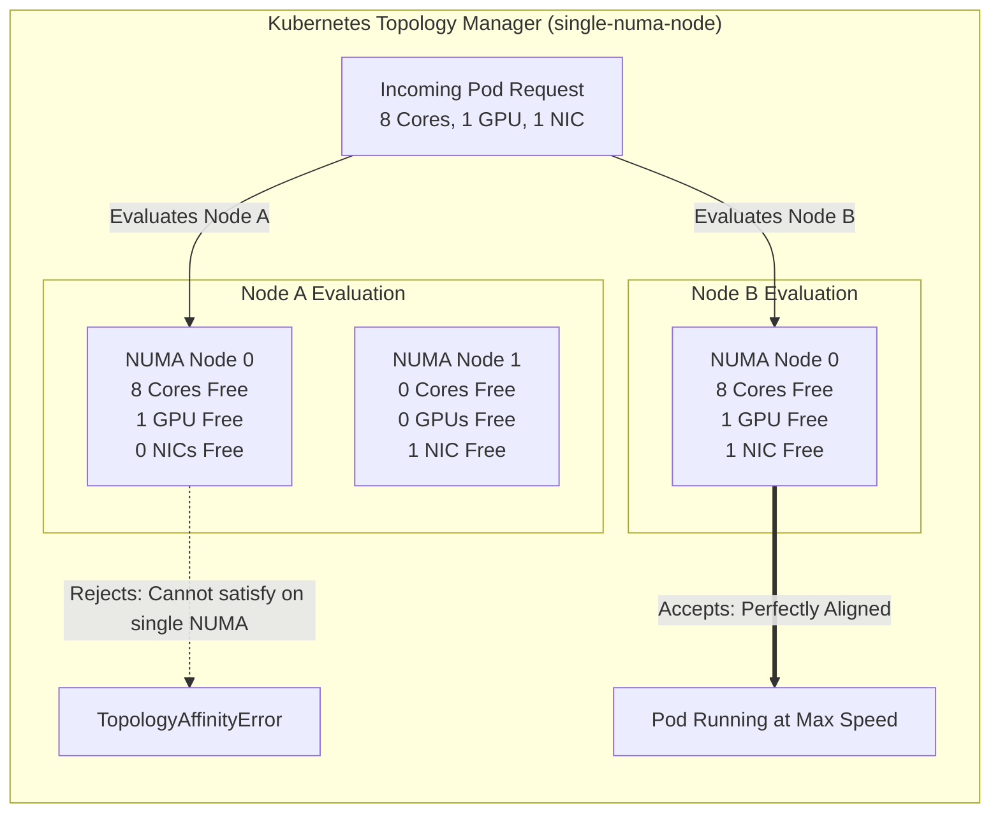

# Chapter 8 — Topology Aware Placement

| Chapter metadata | Value |
|---|---|
| Volume | 07 — GPU Networking and Data Paths |
| Difficulty | Expert |
| Estimated reading time | 35 minutes |
| Primary audience | DevOps, SRE, Platform, Cloud and Infrastructure Engineers |
| Core question | If Kubernetes randomly assigns CPU cores and GPUs to a Pod, how do you prevent the data from crossing the dreaded NUMA boundary? |

## Introduction

In Chapter 2, we mapped the physical motherboard layout. We learned that crossing a NUMA boundary (e.g., CPU 0 talking to CPU 1 across the UPI link) destroys AI performance. 

But there is a massive problem: **Kubernetes does not care about NUMA boundaries by default.**

If you submit a Pod YAML requesting 16 CPU cores, 1 GPU, and 1 Network Card, the default Kubernetes `kube-scheduler` simply looks for a node with enough free capacity. It might assign:
* 16 CPU cores from CPU 0.
* GPU 3 (which is wired to CPU 1).
* NIC 0 (which is wired to CPU 0).

Your application will start successfully. The tests will pass. But because the GPU is physically separated from the CPU cores and the NIC by the UPI link, the workload will run at 30% speed. 

To fix this, a Senior Architect must reconfigure the deepest, most complex levels of the Kubernetes `kubelet`: The **Topology Manager**.

## 1. The Anatomy of Misalignment

Why does the default scheduler fail? Because Kubernetes was built for web microservices. In the web world, CPU 0 and CPU 1 are interchangeable. 

In the AI world, hardware is physically anchored. 
*   A GPU is physically soldered to a specific PCIe root complex.
*   A ConnectX NIC is physically soldered to a specific PCIe root complex.

If you are running an AI inference service, the host CPU must constantly push data into the GPU. If the Kubelet assigns CPU Cores from NUMA Node 0, but assigns a GPU located on NUMA Node 1, every single byte of data must traverse the slow, congested motherboard link. 

## 2. The Kubernetes Topology Manager

The **Topology Manager** is a component inside the `kubelet` (the agent running on every worker node) designed to solve this exact problem. It forces the CPU manager, the Device Manager (GPUs), and the CNI (Network Cards) to talk to each other before allowing a Pod to start.

### Topology Policies
You must explicitly configure the `kubelet` with a topology policy.

1.  `none`: The default. Kubernetes randomly assigns resources. Disastrous for AI.
2.  `best-effort`: Kubernetes *tries* to put everything on the same NUMA node. If it can't, it starts the pod anyway across multiple nodes. (Dangerous in production, as performance is non-deterministic).
3.  `restricted`: If the resources don't perfectly align, the pod is rejected (TopologyAffinityError). 
4.  `single-numa-node`: The gold standard for AI. If the requested CPU cores, GPUs, and Network Interfaces cannot be satisfied by a **single, specific NUMA node**, the Pod is strictly rejected and left in a `TopologyAffinityError` state.

## 3. Configuring the Stack (The NVIDIA GPU Operator)

Enabling `single-numa-node` is not enough. You must ensure the hardware advertises its physical location to Kubernetes.

If you are using the **NVIDIA GPU Operator**, this is heavily automated via **NFD (Node Feature Discovery)**. 
NFD inspects the physical hardware, reads the PCIe topologies, and applies labels to the Kubernetes nodes. 

When deploying the GPU Operator via Helm, you must ensure the `gfd` (GPU Feature Discovery) component is enabled. It maps the exact NUMA affinity of every GPU. 

Furthermore, to align the network cards (e.g., SR-IOV interfaces on ConnectX NICs), you must deploy the **Multus CNI** and the **SR-IOV Network Device Plugin**, which also report their NUMA boundaries to the Topology Manager.

## Architectural Diagram: Topology Manager Alignment

## Customer Scenario (Senior Level)

**The Situation:**
A cloud engineering team is deploying Triton Inference Server pods on a fleet of dual-socket HGX servers. To guarantee maximum performance, they configured the Kubelet with `--topology-manager-policy=single-numa-node`. 
They report: "Our deployment is totally broken. We are requesting 1 GPU and 16 CPU cores per Pod. The servers have 8 GPUs and 128 CPU cores, so we should easily fit 8 Pods per server. But after 4 Pods start, the 5th Pod gets permanently stuck in `TopologyAffinityError`. Kubernetes is refusing to use the remaining 4 empty GPUs."

**The Senior Architect Response:**
"Kubernetes is not broken; it is functioning exactly as we instructed it to. It is protecting the cluster from a devastating performance degradation.

You configured the Topology Manager to `single-numa-node`. This means a Pod will only start if its requested CPU cores and GPU reside on the exact same physical NUMA node. 

In a dual-socket server with 128 cores, NUMA Node 0 has 64 cores and 4 GPUs. NUMA Node 1 has 64 cores and 4 GPUs.

When you launched your Pods requesting 16 cores and 1 GPU:
* Pod 1 took 16 cores and GPU 0 from NUMA 0.
* Pod 2 took 16 cores and GPU 1 from NUMA 0.
* Pod 3 took 16 cores and GPU 2 from NUMA 0.
* Pod 4 took 16 cores and GPU 3 from NUMA 0.

NUMA 0 is now completely out of CPU cores (16 x 4 = 64). 

When Pod 5 tries to schedule, it sees that GPUs 4, 5, 6, and 7 are empty. However, the Linux OS scheduler or another daemonset might be consuming just a few CPU cores on NUMA Node 1. Because Pod 5 requires a contiguous block of 16 free cores on NUMA 1, and only 14 are left, the Topology Manager physically cannot satisfy the `single-numa-node` mandate. 

If it launched the Pod, it would have to assign CPU cores from NUMA 0 and a GPU from NUMA 1, crossing the UPI link and destroying your inference latency. 

To fix this, we must precisely profile the CPU overhead of the Triton server. Does it truly need 16 dedicated cores? If we reduce the Pod request to 12 cores, all 8 Pods will schedule perfectly within the strict NUMA boundaries."

## Interview Preparation

**Conceptual:** Why does a default Kubernetes installation frequently cause AI workloads to run 50% slower on multi-socket servers? *(Hint: The default scheduler randomly assigns CPU cores, Memory, and GPUs without considering physical motherboard layout. This often forces data to cross the highly congested CPU-to-CPU UPI link).*

**Architecture:** What is the difference between the Kubernetes Topology Manager policies `best-effort` and `single-numa-node`? *(Hint: `best-effort` tries to align hardware, but will still start the pod across multiple NUMA nodes if it fails, leading to unpredictable performance. `single-numa-node` acts as a strict guardrail, failing the pod entirely if perfect alignment cannot be achieved, ensuring deterministic high performance).*
