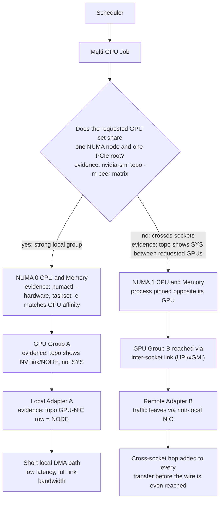
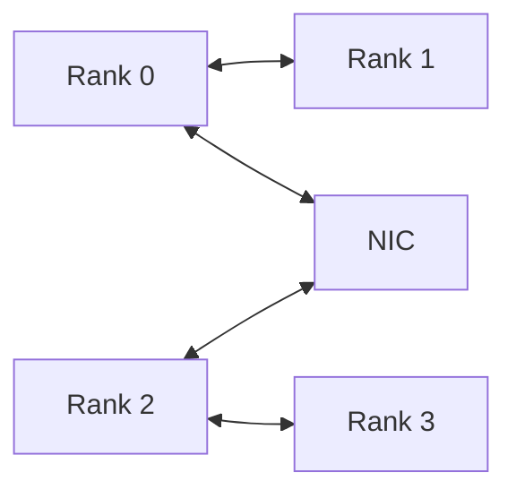

# Topology-Aware Placement

## Introduction

A scheduler can allocate the correct number of GPUs and still produce a poor architecture. Capacity answers how many devices are available. Placement answers which devices, CPUs, adapters, and memory domains should work together.

Topology-aware placement aligns software communication patterns with physical data paths. It becomes essential when workloads exchange large tensors, use several network adapters, cross CPU sockets, or share a node with other jobs.

| Chapter field | Value |
|---|---|
| Volume | 07 — GPU Networking |
| Difficulty | Advanced |
| Estimated reading time | 50 minutes |
| Previous | ConnectX and GPU Network Adapters |
| Next | Multi-Node Collectives and NCCL Paths |

## Story

A four-GPU inference service meets its latency target on one node but misses it on another node of the same model. Device health, driver versions, and clocks are identical.

The first node assigns the tokenizer and request workers to CPU cores local to the selected GPUs. The second node places them on the opposite NUMA socket and routes network traffic through a remote adapter. The logical deployment is identical; the physical path is not.

The platform team introduces topology labels, CPU affinity, and GPU-to-NIC placement rules. Tail latency becomes stable without changing the model or GPU count.

## Learning Objectives

After completing this chapter, you will be able to:

- distinguish resource allocation from topology-aware placement;
- map GPUs, CPUs, memory, adapters, and storage to NUMA domains;
- explain strong and weak GPU communication groups;
- design placement rules for training and inference;
- balance locality against scheduler utilization;
- diagnose fragmentation and remote-path penalties;
- create a commissioning baseline for node topology.

## Big Picture



**Figure 7.8.1 — Placement is a coordinated selection that forks on one question: does the chosen GPU set share a NUMA node and PCIe root?** CPU, GPU, and adapter choices should follow the workload's communication graph, and each edge names the evidence that proves the hop is actually local rather than assumed local. The right branch is the fault-isolation case in this chapter's Story: identical logical deployment, different physical path, different latency.

## The Placement Problem

A node may expose several valid resource combinations. The scheduler must choose among them while considering:

- GPU-to-GPU connectivity;
- GPU-to-NIC affinity;
- CPU and memory locality;
- PCIe switch sharing;
- storage-device locality;
- workload communication pattern;
- tenant isolation;
- failure domains;
- cluster utilization.

The best placement for a tightly coupled training job may be wasteful for four independent inference replicas. Architecture must match the workload.

## Logical versus Physical Topology

Logical topology is what software requests: four GPUs, sixteen CPUs, one network interface. Physical topology is how those resources are wired.

Stable placement inputs include:

- GPU UUID and PCI address;
- NUMA node;
- NVLink or NVSwitch connectivity;
- peer-access matrix;
- NIC PCI address and port;
- CPU set;
- storage-device location;
- switch and rack identity.

Do not rely on device indices alone. Enumeration order is not an architectural contract.

**The single command that answers most of the "stable placement inputs" list at once:**

```bash
$ nvidia-smi topo -m
        GPU0    GPU1    GPU2    GPU3    mlx5_0  mlx5_1  CPU Affinity   NUMA Affinity
GPU0     X      NV18    NV18    NV18    NODE    SYS     0-31,64-95      0
GPU1    NV18     X      NV18    NV18    NODE    SYS     0-31,64-95      0
GPU2    NV18    NV18     X      NV18    SYS     NODE     32-63,96-127    1
GPU3    NV18    NV18    NV18     X      SYS     NODE     32-63,96-127    1
mlx5_0  NODE    NODE    SYS     SYS      X      SYS
mlx5_1  SYS     SYS     NODE    NODE    SYS      X

Legend:
  X    = Self
  NV18 = Connection traversing 18 NVLinks
  NODE = Same NUMA node, connected via PCIe host bridge
  SYS  = Connection traversing PCIe and an SMP interconnect between NUMA nodes
```

Read this table left to right by row: `GPU0`–`GPU3` all show `NV18` to each other, meaning every GPU pair has a direct NVLink path — this is a genuinely strong group, not just "in the same box." The `CPU Affinity`/`NUMA Affinity` columns split cleanly: GPU0/GPU1 sit on NUMA node 0 with cores 0-31 and 64-95, GPU2/GPU3 on NUMA node 1. Critically, `mlx5_0` is `NODE` (local) to GPU0/GPU1 but `SYS` (remote, crosses the inter-socket link) to GPU2/GPU3 — this one table is what the Big Picture diagram's decision branch is checking. A rank on GPU2 sending through `mlx5_0` instead of `mlx5_1` pays the `SYS` penalty on every message even though NVLink between the GPUs themselves is fine.

```bash
$ nvidia-smi topo -p2p r
        GPU0    GPU1    GPU2    GPU3
GPU0     X      OK      OK      OK
GPU1     OK      X      OK      OK
GPU2     OK      OK      X      OK
GPU3     OK      OK      OK      X
```

The peer-access matrix (`-p2p r`, read access) confirms every GPU can directly read another's memory without staging through host memory — `OK` across the board here means CUDA peer access is actually enabled, not just that NVLink is physically present. A `CNS` (chipset not supported) or `NS` (not supported) entry here would mean transfers between that pair fall back to a host-staged copy even though the NVLink topology looks fine, which silently defeats the strong-group assumption.

## Communication Graph First

Before choosing placement, draw who communicates with whom.



A workload with frequent communication between ranks 0 and 1 should place them on a strong local pair. A model-parallel group may require all selected GPUs to share the strongest available fabric. Independent replicas may prioritize isolation and utilization instead.

## CPU and Memory Binding

CPU workers often perform tokenization, input processing, launch coordination, and network progress. Remote CPU placement can add inter-socket traffic and increase latency.

Production binding strategies may include:

- assigning CPU cores from the GPU’s NUMA domain;
- allocating host memory locally;
- placing network progress threads near the selected adapter;
- avoiding oversubscription of the same core set;
- reserving housekeeping CPUs for system services.

Binding must be measured. Excessively rigid pinning can reduce scheduler flexibility or create imbalance.

**Checking and applying the binding, with output:**

```bash
$ numactl --hardware
available: 2 nodes (0-1)
node 0 cpus: 0 1 2 3 4 5 6 7 8 9 10 11 12 13 14 15 16 17 18 19 20 21 22 23 24 25 26 27 28 29 30 31 64 65 66 67 68 69 70 71 72 73 74 75 76 77 78 79 80 81 82 83 84 85 86 87 88 89 90 91 92 93 94 95
node 0 size: 515777 MB
node 1 cpus: 32 33 34 35 36 37 38 39 40 41 42 43 44 45 46 47 48 49 50 51 52 53 54 55 56 57 58 59 60 61 62 63 96 97 98 99 100 101 102 103 104 105 106 107 108 109 110 111 112 113 114 115 116 117 118 119 120 121 122 123 124 125 126 127
node 1 size: 516041 MB
node 0 free: 483210 MB
node 1 free: 501122 MB
```

`numactl --hardware` is the ground truth for which physical cores belong to which NUMA node — cross-reference the `CPU Affinity` column from `nvidia-smi topo -m` against this to confirm the process launcher is actually pinning to the right set, not just a plausible-looking range.

```bash
$ hwloc-ls --no-io | grep -A2 "NUMANode L#1"
  NUMANode L#1 (P#1 504GB)
    Package L#1
      L3 L#1 (32MB)

$ taskset -cp $(pgrep -f "rank2")
pid 48213's current affinity list: 32-63,96-127
```

`hwloc-ls` gives the same NUMA/package hierarchy from a vendor-neutral tool, useful for cross-checking `nvidia-smi topo -m` against the OS's own view when investigating a suspected topology-detection mismatch. `taskset -cp` on a running rank's PID confirms what actually got applied at runtime — `32-63,96-127` matches NUMA node 1's CPU list above, which is correct if this rank is driving GPU2 or GPU3. If a rank meant for GPU2 instead showed `0-31,64-95` (NUMA node 0's range), that is the exact remote-CPU-placement failure described in this chapter's Story — the launcher bound the wrong socket.

## GPU Group Selection

Strong GPU groups may share:

- direct NVLink connections;
- one NVSwitch domain;
- one PCIe switch;
- one root complex;
- one local network adapter.

Weak groups may cross sockets or use host-mediated paths. For communication-heavy jobs, fragmentation across weak groups can dominate runtime.

## Adapter Selection

For distributed jobs, the selected network adapter should be close to the GPU group. In multi-adapter nodes, rank-to-adapter mapping should reflect physical locality and fabric design.

A common hierarchy is:

1. select a suitable GPU group;
2. bind local CPUs and memory;
3. select the nearest adapter;
4. choose the corresponding fabric path;
5. verify that the collective library uses the intended resources.

## Scheduler Design

Topology awareness can be implemented through:

- node labels and feature discovery;
- topology managers;
- custom schedulers or extenders;
- device-plugin metadata;
- resource classes;
- placement constraints;
- job-level rank mapping;
- admission policies.

The scheduler should not encode more detail than it can maintain. A stale topology label is worse than no label because it creates false confidence.

## Locality versus Utilization

Strict placement can leave free GPUs idle while a job waits for a preferred group. Relaxed placement improves occupancy but may reduce application efficiency.

| Policy | Benefit | Cost |
|---|---|---|
| Strict topology group | Predictable performance | Possible queueing and stranded capacity |
| Preferred topology | Better utilization with graceful fallback | Variable performance |
| Count-only allocation | Simple and flexible | High risk for communication-heavy jobs |
| Dedicated node class | Strong predictability | Lower consolidation efficiency |

Service tiers can expose different policies. Critical training may require strict placement, while opportunistic batch inference accepts relaxed locality.

## Production Deployment

A topology-aware platform should maintain:

- node-class diagrams;
- automated topology discovery;
- stable device identifiers;
- validated GPU groups;
- CPU and NIC affinity maps;
- placement policy by workload class;
- performance baselines for preferred and fallback placements;
- alerts for topology drift;
- upgrade and replacement validation.

## Production Troubleshooting

### Scenario 1 — Same job, different node performance

Compare topology, rank placement, CPU sets, memory policy, adapter selection, and PCIe link state. Do not stop at hardware model and software version.

**Evidence**

```bash
# Node A (meets latency target)
$ taskset -cp $(pgrep -f "tokenizer_worker")
pid 21044's current affinity list: 0-31,64-95
$ nvidia-smi --query-compute-apps=pid,used_memory,gpu_uuid --format=csv | grep 21044
21044, 4021 MiB, GPU-3a11...  # this UUID maps to GPU0, NUMA node 0

# Node B (misses latency target)
$ taskset -cp $(pgrep -f "tokenizer_worker")
pid 19882's current affinity list: 32-63,96-127
$ nvidia-smi --query-compute-apps=pid,used_memory,gpu_uuid --format=csv | grep 19882
19882, 4021 MiB, GPU-3a11...  # same logical GPU0, NUMA node 0
```

Both nodes assign the tokenizer worker to the same logical GPU0, but on Node B the process affinity list (`32-63,96-127`, NUMA node 1's cores) does not match GPU0's NUMA node (0, from the earlier `nvidia-smi topo -m` output). The worker is running on the opposite socket from the GPU it feeds — every request now pays a cross-socket memory access plus, per the Story, routes through a remote adapter. This is exactly the diagram's "no" branch, and it is invisible to device health, driver version, and clock checks, which is why the diagnosis has to start with placement evidence, not hardware state.

### Scenario 2 — Four-GPU job is slower than two-GPU job

The four-GPU allocation may cross a weak boundary. Inspect the selected peer matrix and collective path.

**Evidence**

```bash
$ nvidia-smi topo -m | egrep 'GPU1|GPU2'
        GPU0    GPU1    GPU2    GPU3
GPU1    NV18     X      SYS     NV18
GPU2     SYS    SYS      X      NV18
```

The two-GPU job used GPU0/GPU1 (`NV18`, direct NVLink). The four-GPU job's allocation includes GPU1 and GPU2, and that pair shows `SYS` — no NVLink, traffic crosses the inter-socket link. Adding two "more" GPUs added a weak boundary into every collective step, which is why four GPUs underperforms two: the collective's slowest hop, not its GPU count, sets the pace.

### Scenario 3 — Network throughput changes with GPU order

Logical indices may map to different physical adapter affinities. Use UUID and PCI address to create the placement map.

### Scenario 4 — Cluster utilization falls after strict affinity policy

The policy may be over-constrained. Measure the performance benefit, introduce preferred rather than mandatory rules where appropriate, or create separate node pools.

## Customer Scenario

A manufacturer operates mixed training and inference on one GPU cluster. Training requires strong multi-GPU groups, while inference uses mostly independent replicas.

The architect creates two scheduling classes. Training receives strict topology groups and local adapters. Inference receives flexible single-GPU allocation with tenant controls. This preserves training efficiency without fragmenting the entire cluster.

**Illustrative arithmetic behind the split:** on an eight-GPU node with two four-GPU NVLink groups, if strict placement is applied cluster-wide, a request for 3 GPUs cannot be satisfied by either 4-GPU group without stranding one GPU per group — worst case, up to 25% of a group's GPUs (1 of 4) can sit idle waiting for a matching request. Restricting strict placement to the training class (which typically requests full groups: 4 or 8 GPUs) and giving inference count-only allocation removes that fragmentation for the majority of requests, since single-GPU inference replicas can fill exactly the gaps strict training allocation would otherwise strand. These are illustrative proportions to reason about the trade-off, not measured figures from a specific deployment.

## Interview Preparation

### Knowledge Questions

1. Why is GPU count insufficient for scheduling?
   > "Count tells you capacity, not path quality. Four GPUs that all share NVLink is a completely different architecture from four GPUs where two pairs are NVLink-connected but the pairs themselves only reach each other over the inter-socket link. I've seen a four-GPU job run slower than a two-GPU job on the same cluster because the scheduler only checked the number, not which four."

2. What is NUMA affinity?
   > "It's which CPU socket and local memory controller a given piece of hardware — a GPU, a NIC, a block of RAM — is physically wired to. `nvidia-smi topo -m` reports it directly as a NUMA Affinity column, and `numactl --hardware` gives you the CPU core ranges per node. If a process's CPU affinity doesn't match its GPU's NUMA node, every memory access and every interrupt for that GPU crosses sockets."

3. Why can device indices be misleading?
   > "The index CUDA or nvidia-smi assigns at enumeration time isn't a physical promise — it can change across reboots, driver versions, or container restarts. I anchor placement maps to GPU UUID and PCI bus address instead, both of which are stable, and only use the index as a display convenience."

4. How does GPU-to-NIC locality affect distributed jobs?
   > "If the NIC a rank uses is on a different NUMA node from its GPU, every RDMA transfer crosses the inter-socket link before it even reaches the wire — this is the direct cause I've traced when identical two-node deployments showed different tail latency. `nvidia-smi topo -m` shows GPU-to-NIC as NODE or SYS in the same table as GPU-to-GPU, so it's one command to check both."

### Architecture Questions

1. Design placement for an eight-GPU, four-NIC node.
   > "I'd start from `nvidia-smi topo -m` to find the real NVLink/PCIe groups — say two groups of four GPUs, each on its own NUMA node. I'd assign two NICs per group, both local to that node's PCIe root, so each four-GPU group has its own dedicated fabric capacity and neither group's traffic has to cross sockets. Then I verify with the peer-access and GPU-NIC rows of the topology table before calling it done, not just by looking at physical slot positions."

2. Explain how you would expose topology to Kubernetes.
   > "Kubernetes itself doesn't understand NVLink or NUMA locality out of the box, so I'd rely on node feature discovery and topology manager to surface labels — NUMA zone, GPU peer groups — and either a device plugin that's topology-aware or a custom scheduler extender that reads those labels when binding pods. I'd be deliberate about staleness: a topology label that's wrong after hardware replacement is worse than no label, because it creates false confidence instead of an obvious gap."

3. Balance locality and utilization for a shared cluster.
   > "I'd expose this as policy tiers rather than one global rule. Training jobs that are communication-heavy get strict topology groups even if that means some queueing. Independent inference replicas get relaxed, count-only placement since they don't benefit from strict locality and strict placement there would just strand capacity. The mistake is picking one policy for the whole cluster."

### Scenario Questions

1. A job is slow only on some GPU combinations. What do you inspect?
   > "First the peer matrix from `nvidia-smi topo -m` for exactly the GPU set that job landed on — I'm looking for an `SYS` entry between any pair the collective actually uses. Then I check whether the CPU and NIC assigned to those ranks are on the matching NUMA node. Slow-only-sometimes almost always means the scheduler picked a topologically weak combination on some runs and a strong one on others."

2. Strict affinity reduces utilization. How do you redesign the policy?
   > "I'd measure first — how much performance is actually gained from strict placement versus preferred placement with graceful fallback — because the answer is workload-specific. If the gain is small, I'd move that workload class to preferred topology or even count-only. If the gain is large, I'd keep strict placement but carve out a dedicated, smaller node pool for it instead of applying strict rules cluster-wide."

3. A replaced adapter changes performance. Which mappings may be stale?
   > "PCI bus address can shift if the replacement lands in a different slot, NUMA affinity can change if it's not identical hardware in an identical slot, and any placement map or topology label built from the old adapter's identifiers is now wrong. I'd re-run topology discovery and rebuild the GPU-to-NIC affinity map rather than assuming a like-for-like swap preserved the physical relationships."

## Summary

Topology-aware placement turns a resource count into an architecture. It aligns processes, GPUs, CPUs, memory, adapters, and storage with the workload’s communication graph.

The strongest policy is not always the strictest. Production design must balance performance predictability, utilization, maintainability, and tenant needs.

## Key Takeaways

- Allocation chooses capacity; placement chooses paths.
- Stable identifiers and physical maps are essential.
- Communication-heavy workloads need strong GPU groups and local adapters.
- CPU and memory binding influence end-to-end behavior.
- Topology policies must be measured and maintained.

## Quick Revision Sheet

| Workload | Placement priority |
|---|---|
| Tensor-parallel training | Strong GPU peer fabric |
| Distributed training | GPU-to-NIC locality |
| CPU-heavy inference | CPU and memory locality |
| Independent replicas | Utilization and isolation |
| Storage-heavy workload | GPU-to-storage path |

## Cross References

- Previous: [ConnectX and GPU Network Adapters](./chapter-07-connectx-and-gpu-network-adapters)
- Next: [Multi-Node Collectives and NCCL Paths](./chapter-09-multi-node-collectives-and-nccl-paths)
- Lab: [Inspect PCIe, NUMA, and GPU Topology](./labs/lab-01-inspect-pcie-numa-and-gpu-topology)
- Lab: [Troubleshoot a Multi-GPU Data Path](./labs/lab-04-troubleshoot-a-multi-gpu-data-path)

## Further Reading

Use the platform vendor’s topology guide, operating-system NUMA documentation, CUDA peer-access documentation, network-adapter affinity guidance, and scheduler topology-management documentation.
