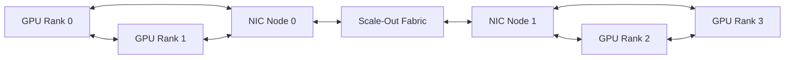
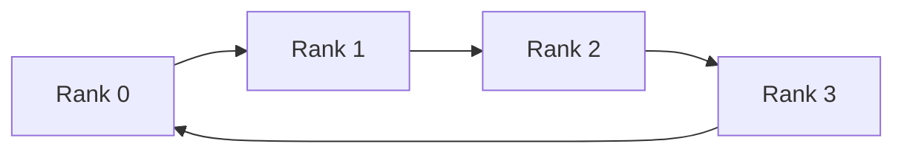
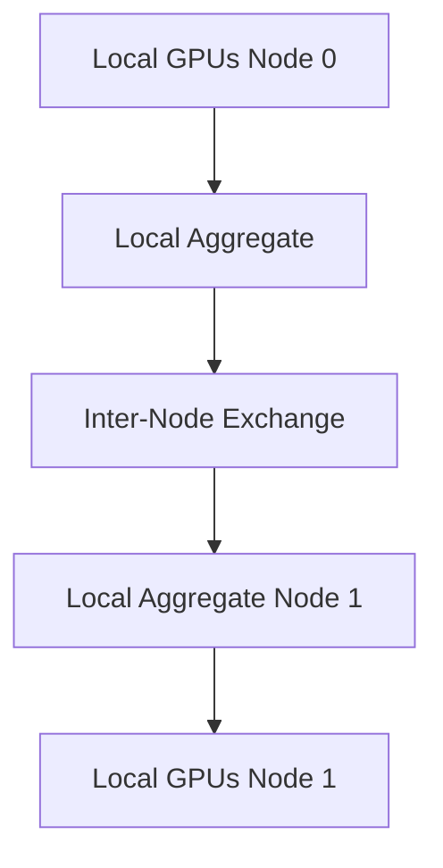

# Multi-Node Collectives and NCCL Paths

## Introduction

Distributed AI frameworks repeatedly perform collective operations such as AllReduce, AllGather, ReduceScatter, Broadcast, and All-to-All. These operations look simple at the programming interface, but their performance depends on a hierarchy of GPU links, PCIe paths, network adapters, routing, message sizes, process placement, and synchronization.

NCCL provides topology-aware collective communication for NVIDIA GPU workloads. It does not replace a healthy fabric. It discovers and orchestrates paths across the hardware that exists.

| Chapter field | Value |
|---|---|
| Volume | 07 — GPU Networking |
| Difficulty | Advanced |
| Estimated reading time | 55 minutes |
| Previous | Topology-Aware Placement |
| Next | Performance Bottlenecks and Benchmarking |

## Story

A 32-GPU training job scales well to two nodes but poorly to four. GPU health checks pass, and the network links show expected speed. A communication trace reveals that ranks are mapped inconsistently across nodes. Some local reductions cross PCIe root complexes before reaching the adapter, while another node uses a strong NVLink path.

One slow rank extends every synchronized collective. The fix combines consistent rank mapping, local GPU grouping, adapter affinity, and fabric validation. The lesson is that a collective is an end-to-end algorithm executed on physical topology.

## Learning Objectives

After completing this chapter, you will be able to:

- explain the purpose of major collective operations;
- distinguish ring, tree, and hierarchical communication patterns;
- describe how NCCL discovers and uses topology;
- reason about channels, ranks, and adapter selection;
- explain why one slow participant affects the whole job;
- validate collective behavior across message sizes;
- troubleshoot hangs and scaling regressions.

## Collective Operations

| Collective | Result | Common use |
|---|---|---|
| Broadcast | One rank sends to all | Model or state distribution |
| Reduce | Values combined at one rank | Aggregation |
| AllReduce | Values combined and returned to all | Gradient synchronization |
| AllGather | Each rank receives all partitions | Parameter or activation gathering |
| ReduceScatter | Reduction result partitioned across ranks | Sharded training |
| All-to-All | Every rank exchanges distinct data with every other | Expert parallelism |

## Big Picture

**Figure 7.9.1 — A multi-node collective uses both local and remote paths.** Performance depends on how the algorithm maps to each segment.

## Ring Algorithms

In a ring, each rank exchanges chunks with neighboring ranks. Large messages can be pipelined across links, making rings bandwidth-efficient when participants are balanced. The trade-off is step count. More ranks add communication phases, and one weak link can limit the ring.

## Tree Algorithms

Trees reduce the number of sequential communication steps and can improve latency for smaller messages. Their performance depends on parent-child mapping and available paths. A poorly placed root or shared uplink can become a bottleneck.

## Hierarchical Collectives

A hierarchical operation first uses the fastest local paths, then communicates between nodes, and finally redistributes results locally.

This structure matches systems where NVLink or NVSwitch provides scale-up bandwidth and RDMA provides scale-out connectivity.

## Topology Discovery

A collective library may inspect GPU peer connectivity, PCIe hierarchy, NUMA affinity, network interfaces, GPU-to-NIC distance, link capabilities, process placement, and transport plugins.

The discovered view must match reality. Container isolation, virtual devices, stale configuration, or inconsistent node setup can hide or distort topology.

## Channels and Parallel Paths

Collective libraries split work into channels so several chunks can move concurrently. More channels can improve link utilization, but consume resources and may increase contention.

The effective design balances message size, rank count, local and remote bandwidth, adapter count, queue resources, GPU memory behavior, and application overlap. Tuning channel counts without measurement can make performance worse.

## Synchronization and Stragglers

Collectives are synchronization points. If one rank arrives late because of slow input, CPU contention, thermal throttling, a weak path, or application imbalance, other ranks wait.

This means a slow collective may actually describe:

- a delayed rank;
- uneven kernel execution;
- storage stalls;
- CPU oversubscription;
- network congestion;
- GPU health events;
- topology mismatch.

Always correlate communication traces with the full iteration timeline.

## Transport Selection and Fallback

NCCL may use different transports for local and remote paths. Fallback preserves functionality but can reduce performance dramatically.

Operational validation should confirm the expected local path, network interfaces, direct-memory behavior, rank mapping, and absence of unintended socket or host-staged fallback.

## Performance Measurement

Use the same operation, metric, message sizes, rank count, and topology when comparing baselines. Measure:

- latency for small messages;
- bandwidth for large messages;
- scaling efficiency by rank count;
- variability across iterations;
- adapter utilization;
- retries and congestion;
- GPU idle time during collectives;
- overlap between computation and communication.

## Production Deployment

A qualified environment should define stable rank ordering, GPU and NIC affinity, approved library and plugin versions, expected topology output, baseline collective tests by node count, failure policy, fabric telemetry correlation, canary tests after upgrades, and job-level diagnostic collection.

## Production Troubleshooting

### Collective stops progressing

Identify the first rank or operation that stopped. Correlate application logs, GPU health, network counters, process state, and fabric events. Determine whether the failure is transport, rank exit, delayed progress, or synchronization mismatch.

### Scaling collapses after adding nodes

Compare local-only and multi-node tests. Inspect oversubscription, routing, adapter affinity, message size, and whether remote communication now dominates the iteration.

### One node is consistently slower

Run pairwise and node-isolated tests. Compare topology, PCIe links, adapter firmware, cable path, switch port, GPU clocks, and CPU placement.

### Small messages are slow but large messages are healthy

The path may be bandwidth-capable but latency-heavy. Review algorithm selection, CPU progress, process scheduling, and transport startup overhead.

## Customer Scenario

An automotive customer asks why a network benchmark reaches line rate while training scales poorly. The architect explains that a point-to-point benchmark measures one path, while training executes synchronized collectives across all ranks and both local and remote links.

The validation plan adds collective tests at one, two, four, and eight nodes; consistent rank mapping; and iteration-level profiling. The evidence identifies an oversubscribed leaf pair rather than a GPU problem.

## Interview Preparation

### Knowledge Questions

1. What is AllReduce?
2. Why are rings bandwidth-efficient?
3. Why may trees help small messages?
4. What is a hierarchical collective?
5. Why does one straggler affect all ranks?

### Architecture Questions

1. Draw a two-node hierarchical AllReduce.
2. Map eight local GPUs to four adapters.
3. Design a collective qualification matrix.

### Scenario Questions

1. Point-to-point bandwidth is healthy but AllReduce is slow. What next?
2. A failure appears only at 16 nodes. Which failure domains expand at that scale?
3. Performance regresses after a library upgrade. How do you detect transport change?

## Summary

Collectives transform a group of GPUs into one distributed execution system. Their behavior depends on algorithms, topology, rank placement, adapters, fabric health, message size, and synchronization.

NCCL can optimize paths, but it cannot repair a weak or inconsistent architecture. Production teams must validate both the communication library and the physical data path.

## Key Takeaways

- Collectives combine local and scale-out communication.
- Ring, tree, and hierarchical algorithms have different strengths.
- Rank placement and topology determine path quality.
- One delayed rank can stall the entire operation.
- Point-to-point success does not prove collective health.
- Fallback and transport changes must be observable.

## Cross References

- Previous: [Topology-Aware Placement](./chapter-08-topology-aware-placement)
- Next: [Performance Bottlenecks and Benchmarking](./chapter-10-performance-bottlenecks-and-benchmarking)
- Lab: [Benchmark RDMA and GPUDirect Paths](./labs/lab-03-benchmark-rdma-and-gpudirect-paths)
- Related: [GPUDirect RDMA](./chapter-05-gpudirect-rdma)

## Further Reading

Use official NCCL documentation, NCCL Tests guidance, framework distributed-training documentation, network-fabric telemetry guides, and the qualified platform topology reference.
