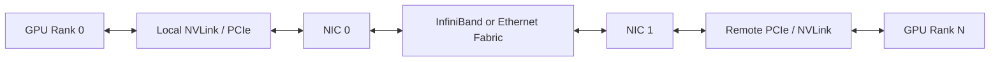

# Multi-Node Collectives and NCCL Paths

Distributed training does not exchange arbitrary traffic. It performs structured collective operations such as all-reduce, all-gather, reduce-scatter, and broadcast. NCCL builds communication graphs that use available GPU peer links, PCIe paths, NICs, and network transports.

## Learning Objectives

Explain collective behavior, trace an NCCL path, distinguish algorithms and transports, and diagnose multi-node scaling loss.

## Communication Path

NCCL selects topology-aware rings, trees, channels, and transports. The best choice depends on message size, topology, link bandwidth, latency, and concurrency. More channels can improve parallelism until they create contention.

## Collective Characteristics

| Collective | Data movement | Common use |
|---|---|---|
| All-reduce | combine and distribute values | gradient synchronization |
| Reduce-scatter | reduce and partition result | sharded training |
| All-gather | collect partitions everywhere | parameter or activation reconstruction |
| Broadcast | one source to all ranks | initialization |

A workload may scale poorly even when point-to-point bandwidth is healthy because collectives stress many links simultaneously and are sensitive to the slowest rank.

## Production Method

Establish a hierarchy of tests:

1. GPU peer bandwidth inside one node.
2. Host-memory RDMA between nodes.
3. GPU-buffer RDMA between selected pairs.
4. NCCL collectives across one node, one rack, and multiple racks.
5. Application throughput with realistic tensor sizes.

Record topology and software versions with every result. A benchmark without context is not a reusable baseline.

## Troubleshooting

**Symptoms:** scaling flattens after one node, NCCL timeout, large variance among runs, or debug logs show sockets instead of RDMA.

Inspect rank mapping, NCCL transport selection, GPU/NIC locality, link and switch counters, MTU, routing, congestion, firewall policy, interface selection, and version compatibility. The slowest link or rank can determine collective completion time.

Avoid tuning environment variables before identifying the layer. Forced algorithms may hide a topology defect and reduce portability.

## Customer Perspective

A customer buying more GPUs expects proportional speedup. Explain that synchronized workloads add communication and coordination. The architecture goal is not linear scaling at any cost; it is acceptable efficiency for the target job size, model, and business objective.

## Interview Preparation

**Question:** Why can an all-reduce benchmark pass while the application still scales poorly?

The application may use different message sizes, overlap patterns, process placement, CPU preprocessing, checkpointing, or synchronization frequency. A synthetic benchmark isolates one path; the application exercises the pipeline.

## Key Takeaways

- Collectives are structured multi-rank communication operations.
- NCCL path selection spans local and scale-out fabrics.
- The slowest rank often controls completion.
- Layered benchmarks are required for diagnosis.

## Cross References

- [Topology-Aware Placement](./chapter-08-topology-aware-placement)
- [Next: Performance Bottlenecks](./chapter-10-performance-bottlenecks-and-benchmarking)
