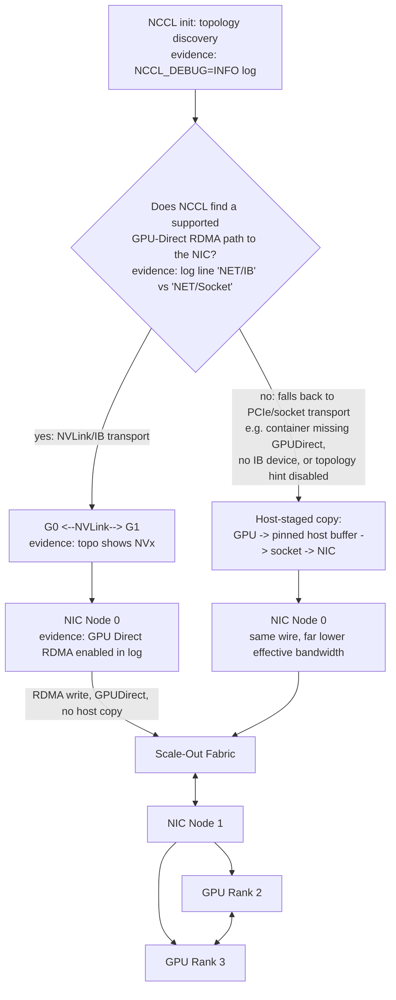
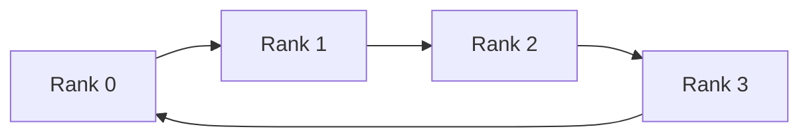
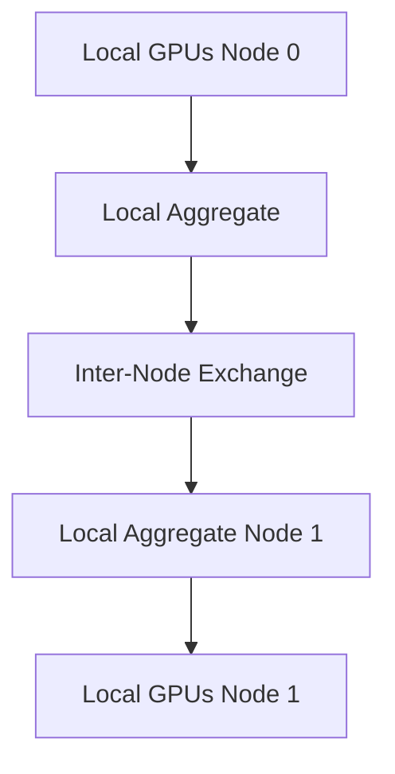

# Multi-Node Collectives and NCCL Paths

## Introduction

Distributed AI frameworks repeatedly perform collective operations such as AllReduce, AllGather, ReduceScatter, Broadcast, and All-to-All. These operations look simple at the programming interface, but their performance depends on a hierarchy of GPU links, PCIe paths, network adapters, routing, message sizes, process placement, and synchronization.

NCCL provides topology-aware collective communication for NVIDIA GPU workloads. It does not replace a healthy fabric. It discovers and orchestrates paths across the hardware that exists.

| Chapter field | Value |
|---|---|
| Volume | 07 — GPU Networking |
| Difficulty | Advanced |
| Estimated reading time | 55 minutes |
| Previous | Topology-Aware Placement |
| Next | Performance Bottlenecks and Benchmarking |

## Story

A 32-GPU training job scales well to two nodes but poorly to four. GPU health checks pass, and the network links show expected speed. A communication trace reveals that ranks are mapped inconsistently across nodes. Some local reductions cross PCIe root complexes before reaching the adapter, while another node uses a strong NVLink path.

One slow rank extends every synchronized collective. The fix combines consistent rank mapping, local GPU grouping, adapter affinity, and fabric validation. The lesson is that a collective is an end-to-end algorithm executed on physical topology.

## Learning Objectives

After completing this chapter, you will be able to:

- explain the purpose of major collective operations;
- distinguish ring, tree, and hierarchical communication patterns;
- describe how NCCL discovers and uses topology;
- reason about channels, ranks, and adapter selection;
- explain why one slow participant affects the whole job;
- validate collective behavior across message sizes;
- troubleshoot hangs and scaling regressions.

## Collective Operations

| Collective | Result | Common use |
|---|---|---|
| Broadcast | One rank sends to all | Model or state distribution |
| Reduce | Values combined at one rank | Aggregation |
| AllReduce | Values combined and returned to all | Gradient synchronization |
| AllGather | Each rank receives all partitions | Parameter or activation gathering |
| ReduceScatter | Reduction result partitioned across ranks | Sharded training |
| All-to-All | Every rank exchanges distinct data with every other | Expert parallelism |

## Big Picture



**Figure 7.9.1 — A multi-node collective uses both local and remote paths, and the critical fork is which transport NCCL actually selected.** The GPUDirect RDMA path moves data NIC-to-GPU with no host copy; the fallback path stages every message through a pinned host buffer, which can cut delivered bandwidth dramatically even though the wire and the collective algorithm are unchanged. `NCCL_DEBUG=INFO` is the evidence that tells you which branch a real run took.

## Ring Algorithms

In a ring, each rank exchanges chunks with neighboring ranks. Large messages can be pipelined across links, making rings bandwidth-efficient when participants are balanced. The trade-off is step count. More ranks add communication phases, and one weak link can limit the ring.



## Tree Algorithms

Trees reduce the number of sequential communication steps and can improve latency for smaller messages. Their performance depends on parent-child mapping and available paths. A poorly placed root or shared uplink can become a bottleneck.

## Hierarchical Collectives

A hierarchical operation first uses the fastest local paths, then communicates between nodes, and finally redistributes results locally.



This structure matches systems where NVLink or NVSwitch provides scale-up bandwidth and RDMA provides scale-out connectivity.

## Topology Discovery

A collective library may inspect GPU peer connectivity, PCIe hierarchy, NUMA affinity, network interfaces, GPU-to-NIC distance, link capabilities, process placement, and transport plugins.

The discovered view must match reality. Container isolation, virtual devices, stale configuration, or inconsistent node setup can hide or distort topology.

## Channels and Parallel Paths

Collective libraries split work into channels so several chunks can move concurrently. More channels can improve link utilization, but consume resources and may increase contention.

The effective design balances message size, rank count, local and remote bandwidth, adapter count, queue resources, GPU memory behavior, and application overlap. Tuning channel counts without measurement can make performance worse.

## Synchronization and Stragglers

Collectives are synchronization points. If one rank arrives late because of slow input, CPU contention, thermal throttling, a weak path, or application imbalance, other ranks wait.

This means a slow collective may actually describe:

- a delayed rank;
- uneven kernel execution;
- storage stalls;
- CPU oversubscription;
- network congestion;
- GPU health events;
- topology mismatch.

Always correlate communication traces with the full iteration timeline.

## Transport Selection and Fallback

NCCL may use different transports for local and remote paths. Fallback preserves functionality but can reduce performance dramatically.

Operational validation should confirm the expected local path, network interfaces, direct-memory behavior, rank mapping, and absence of unintended socket or host-staged fallback.

**Reading NCCL's own transport log.** `NCCL_DEBUG=INFO` on a two-node, eight-GPU-per-node job shows exactly which branch of Figure 7.9.1 was taken:

```text
$ NCCL_DEBUG=INFO NCCL_DEBUG_SUBSYS=INIT,NET python train.py
node0:2201:2201 [0] NCCL INFO NET/IB : Using [0]mlx5_0:1/RoCE [RO]; OOB eth0:10.0.0.11
node0:2201:2201 [0] NCCL INFO Using non-device net plugin version 0
node0:2201:2201 [0] NCCL INFO NET/IB: GPU Direct RDMA Enabled for HCA 0 'mlx5_0'
node0:2201:2201 [0] NCCL INFO Channel 00 : 0[0] -> 8[0] [receive] via NET/IB/0/GDRDMA
```

`NET/IB` with `GPU Direct RDMA Enabled` and the `GDRDMA` suffix on the channel line together confirm the healthy branch: NCCL found an InfiniBand/RoCE HCA, it is registered as GPU-Direct-capable, and cross-node channel 0 is moving data NIC-to-GPU with no host bounce buffer. The unhealthy branch reads very differently — for example `NCCL INFO NET/Socket : Using [0]eth0` with no `GDRDMA` suffix on the channel line, which means NCCL fell back to plain TCP sockets, staging every message through host memory. Seeing `NET/Socket` on a node that has InfiniBand hardware is the single strongest signal of a broken or missing GPUDirect RDMA prerequisite (driver, `nv_peer_mem`/`nvidia-peermem` module, or IB device visibility inside a container) — not a network-cable problem.

## Performance Measurement

Use the same operation, metric, message sizes, rank count, and topology when comparing baselines. Measure:

- latency for small messages;
- bandwidth for large messages;
- scaling efficiency by rank count;
- variability across iterations;
- adapter utilization;
- retries and congestion;
- GPU idle time during collectives;
- overlap between computation and communication.

## Production Deployment

A qualified environment should define stable rank ordering, GPU and NIC affinity, approved library and plugin versions, expected topology output, baseline collective tests by node count, failure policy, fabric telemetry correlation, canary tests after upgrades, and job-level diagnostic collection.

## Production Troubleshooting

### Collective stops progressing

Identify the first rank or operation that stopped. Correlate application logs, GPU health, network counters, process state, and fabric events. Determine whether the failure is transport, rank exit, delayed progress, or synchronization mismatch.

### Scaling collapses after adding nodes

Compare local-only and multi-node tests. Inspect oversubscription, routing, adapter affinity, message size, and whether remote communication now dominates the iteration.

**Worked evidence for this scenario — the Story above.** `nccl-tests` run at each node count makes the collapse measurable instead of anecdotal:

```text
$ ./build/all_reduce_perf -b 64M -e 64M -g 8 --nnodes=2
      size    time    algbw    busbw
    67108864  612.4    109.6    191.8   GB/s

$ ./build/all_reduce_perf -b 64M -e 64M -g 8 --nnodes=4
      size    time    algbw    busbw
    67108864  2891.7   23.2     40.6   GB/s
```

Going from 2 nodes to 4 nodes should reduce achieved `busbw` somewhat (more inter-node hops in the ring), but a drop from ~192 GB/s to ~41 GB/s — nearly 5x — is far larger than topology growth alone explains. Cross-referencing against the NCCL transport log for the 4-node run is the next step: if two of the four nodes show `NET/IB` with `GDRDMA` and the other two show `NET/Socket`, that's the root cause the numbers were pointing at — inconsistent GPUDirect RDMA availability across nodes, exactly as the Story describes ("some local reductions cross PCIe root complexes... while another node uses a strong NVLink path"). The collective is only as fast as its slowest transport, and a mixed fleet silently downgrades every rank to the slowest node's capability.

### One node is consistently slower

Run pairwise and node-isolated tests. Compare topology, PCIe links, adapter firmware, cable path, switch port, GPU clocks, and CPU placement.

### Small messages are slow but large messages are healthy

The path may be bandwidth-capable but latency-heavy. Review algorithm selection, CPU progress, process scheduling, and transport startup overhead.

## Customer Scenario

An automotive customer asks why a network benchmark reaches line rate while training scales poorly. The architect explains that a point-to-point benchmark measures one path, while training executes synchronized collectives across all ranks and both local and remote links.

The validation plan adds collective tests at one, two, four, and eight nodes; consistent rank mapping; and iteration-level profiling. The evidence identifies an oversubscribed leaf pair rather than a GPU problem.

## Interview Preparation

### Knowledge Questions

1. What is AllReduce?

   > "Every rank contributes a value — usually a gradient tensor — and every rank ends up with the combined, reduced result. In training, that's how gradients computed independently on each GPU get synchronized into one consistent update before the optimizer step runs."

2. Why are rings bandwidth-efficient?

   > "Because a ring pipelines the exchange — every rank is simultaneously sending to one neighbor and receiving from another, so the aggregate link utilization stays high even for large messages, and no single node has to be a bottleneck hub. The trade-off is step count: more ranks means more sequential hops around the ring, so latency for small messages gets worse even as bandwidth utilization stays good."

3. Why may trees help small messages?

   > "Because a tree completes in fewer sequential steps than a ring — logarithmic in rank count instead of linear — and for small messages, the fixed per-step latency matters more than raw bandwidth. You're trading some bandwidth efficiency for fewer hops, which is the right trade when the message itself is tiny and latency dominates."

4. What is a hierarchical collective?

   > "It's doing the expensive part cheaply and the cheap part rarely: reduce locally first across the fast scale-up fabric — NVLink or NVSwitch inside a node — then do one inter-node exchange per node instead of per GPU, then redistribute the result locally. It matches the physical reality that intra-node bandwidth is dramatically higher than inter-node bandwidth."

5. Why does one straggler affect all ranks?

   > "Because a collective is a synchronization point by definition — every rank has to reach the same point before the operation can complete. One rank delayed by a slow path, CPU contention, or thermal throttling means every other rank sits idle waiting, even though their own GPUs finished their work on time. That's why I always look at the full iteration timeline, not just aggregate GPU utilization, when a job seems slow — the wait time is invisible in a simple utilization number."

### Architecture Questions

1. Draw a two-node hierarchical AllReduce.

   > "I'd draw each node's local GPUs first, reducing into one local aggregate over NVLink — that's the fast step. Then a single arrow crosses between the two nodes carrying just that one aggregate value per node, not one value per GPU — that's the expensive step, done as few times as possible. Then I'd draw the result broadcasting back down to each node's local GPUs. The whole design is minimizing how much data crosses that one expensive inter-node arrow."

2. Map eight local GPUs to four adapters.

   > "I'd pair GPUs to adapters by NUMA and PCIe locality, two GPUs per adapter, matching each pair to whichever NIC shares their PCIe switch — the same `PIX`-class relationship from the topology matrix in earlier chapters. I'd explicitly avoid a design where all eight GPUs share the same one or two adapters, since that turns the adapter into a shared bottleneck exactly like the oversubscribed-switch case."

3. Design a collective qualification matrix.

   > "I'd run the same collective — AllReduce, say — at multiple node counts: 1, 2, 4, 8, and whatever the target scale is, at a fixed message size, and record achieved busbw at each point. A healthy fabric shows busbw staying roughly flat or degrading gracefully as node count grows; a fabric with a bad component shows a cliff at some specific node count. I'd store that curve as the baseline and re-run it after any firmware or driver upgrade to catch regressions before they show up as a mysterious training slowdown."

### Scenario Questions

1. Point-to-point bandwidth is healthy but AllReduce is slow. What next?

   > "Point-to-point only proves one link between two ranks is fine — it says nothing about synchronization behavior with all ranks participating. I'd pull a per-rank timing breakdown during the actual collective to find whether one specific rank is consistently late, then check that rank's topology and transport log specifically, rather than re-testing the links I already know are healthy."

2. A failure appears only at 16 nodes. Which failure domains expand at that scale?

   > "Switch fan-out and oversubscription ratios usually change as you cross certain node-count thresholds — a leaf switch or spine layer that was fine for 8 nodes might be oversubscribed at 16. Rank-mapping consistency also gets harder to guarantee by hand at that scale, and it's exactly the kind of place where one node quietly using a different transport, like the Story's example, only becomes visible once enough ranks are in the synchronized collective to expose the imbalance."

3. Performance regresses after a library upgrade. How do you detect transport change?

   > "I'd diff the `NCCL_DEBUG=INFO` transport-selection log line by line between the old and new library versions on the same hardware. If the old log shows `NET/IB` with `GDRDMA` and the new one shows `NET/Socket`, that's a transport regression, not a performance regression in the algorithm itself — something in the new version's device detection or a changed default environment variable broke GPUDirect RDMA discovery."

## Summary

Collectives transform a group of GPUs into one distributed execution system. Their behavior depends on algorithms, topology, rank placement, adapters, fabric health, message size, and synchronization.

NCCL can optimize paths, but it cannot repair a weak or inconsistent architecture. Production teams must validate both the communication library and the physical data path.

## Key Takeaways

- Collectives combine local and scale-out communication.
- Ring, tree, and hierarchical algorithms have different strengths.
- Rank placement and topology determine path quality.
- One delayed rank can stall the entire operation.
- Point-to-point success does not prove collective health.
- Fallback and transport changes must be observable.

## Cross References

- Previous: [Topology-Aware Placement](./chapter-08-topology-aware-placement)
- Next: [Performance Bottlenecks and Benchmarking](./chapter-10-performance-bottlenecks-and-benchmarking)
- Lab: [Benchmark RDMA and GPUDirect Paths](./labs/lab-03-benchmark-rdma-and-gpudirect-paths)
- Related: [GPUDirect RDMA](./chapter-05-gpudirect-rdma)

## Further Reading

Use official NCCL documentation, NCCL Tests guidance, framework distributed-training documentation, network-fabric telemetry guides, and the qualified platform topology reference.
