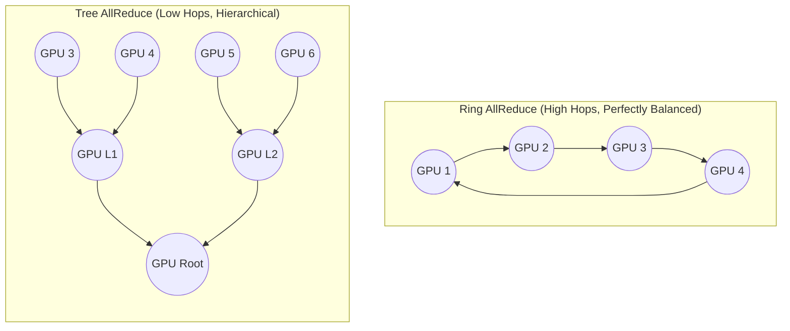

# Chapter 9 — Multi-Node Collectives and NCCL

| Chapter metadata | Value |
|---|---|
| Volume | 07 — GPU Networking and Data Paths |
| Difficulty | Expert |
| Estimated reading time | 35 minutes |
| Primary audience | DevOps, SRE, Platform, Cloud and Infrastructure Engineers |
| Core question | When 10,000 GPUs need to sum up their mathematical gradients, how do they do it without creating a massive network traffic jam? |

## Introduction

So far, we have built the perfect hardware platform. We aligned the NUMA nodes, enabled GPUDirect RDMA, and deployed a 400G InfiniBand fabric. 

But hardware is useless without software that knows how to drive it. If a data scientist uses standard Python sockets to send matrices between GPUs, the cluster will crawl.

To harness the cluster, developers use **NCCL** (NVIDIA Collective Communications Library, pronounced "Nickel"). NCCL is the central nervous system of distributed AI training. It is the software library responsible for efficiently routing mathematical operations (Collectives) across multiple GPUs and multiple nodes. 

If NCCL miscalculates the physical topology of your network, your 10,000-GPU cluster will perform worse than a single server.

## 1. What is a Collective?

In distributed training (like Data Parallelism), you copy the identical neural network model onto 1,000 GPUs. You give each GPU a different chunk of data (e.g., different images). 
Each GPU calculates a "gradient" (a massive mathematical matrix indicating how the model should update its weights to get smarter). 

Before the GPUs can move to the next batch of images, they must sum all 1,000 matrices together, calculate the average, and send the *exact same averaged matrix* back to all 1,000 GPUs. 
This specific operation is called an **AllReduce**. 

If 1,000 GPUs all try to send their massive 10GB matrix to a single "Master GPU" to do the math, that Master GPU's network port will instantly saturate, dropping packets and crashing the cluster. 

## 2. NCCL Topologies: Rings and Trees

NCCL solves the network traffic jam by intelligently organizing the GPUs into logical topologies. 

### The Ring Topology (Ring AllReduce)
Instead of sending data to a Master node, NCCL organizes the GPUs into a giant, logical ring.
* GPU 0 sends a small chunk of its matrix to GPU 1.
* GPU 1 adds its numbers to the chunk, and sends it to GPU 2.
* This continues around the ring. 

**The Advantage:** Every GPU's network port is perfectly balanced. Every GPU is sending and receiving exactly the same amount of data simultaneously. There are no bottlenecks. 
**The Disadvantage:** If the ring spans 1,000 GPUs, the data must take 1,000 hops. As clusters grew to tens of thousands of GPUs, the latency of passing data around the ring became too slow.

### The Tree Topology (Tree AllReduce)
To solve the Ring latency issue, NCCL introduced Trees. 
Instead of a ring, the GPUs are organized into a hierarchical tree. Leaves send data up to branches, the branches do the addition, and send the result up to the root. The root sends the final answer back down the tree. 
**The Advantage:** The number of network hops drops logarithmically.

## Architectural Diagram: Ring vs Tree Collectives

## 3. SHARP: Math in the Network Switch

Even with a Tree topology, the GPUs still have to do the math (adding the matrices together). 
If a GPU is doing addition to average gradients, it is *not* doing matrix multiplication to train the model. This is wasted compute time.

NVIDIA Mellanox introduced **SHARP (Scalable Hierarchical Aggregation and Reduction Protocol)**.

SHARP is a hardware feature built directly into the silicon of Quantum InfiniBand network switches. 
When NCCL is configured to use SHARP:
1. The GPUs send their raw matrices out over the InfiniBand network. 
2. **The InfiniBand Network Switch intercepts the packets, performs the mathematical addition inside the switch ASIC, and sends the final answer back.**

The GPUs do absolutely zero aggregation math. The Host CPUs do zero math. The network switch physically computes the AI gradients, doubling effective network bandwidth (because the switch doesn't have to forward the intermediate data) and freeing the GPUs to train faster.

## Customer Scenario (Senior Level)

**The Situation:**
A Platform team is managing a cluster of 32 OEM HGX nodes connected by 400G InfiniBand. During a massive distributed training run, the cluster randomly halts and throws the error `NCCL WARN Call to epoll_wait failed`. The application developers blame the platform team, stating the servers are unstable.

**The Senior Architect Response:**
"The servers are physically stable, but our software configuration has allowed NCCL to miscalculate the physical topology of our data center, causing a network timeout.

When NCCL initializes a training job, it runs an algorithm to map the fastest path between all participating GPUs. It queries the PCIe bus, looks for NVLink, and maps the InfiniBand NICs. 

Because we are using OEM HGX servers with a highly complex, multi-rail InfiniBand network, NCCL has occasionally misidentified the optimal path. It might be attempting to route traffic across the host CPU's UPI link instead of utilizing GPUDirect RDMA, or it might be attempting to establish a Ring topology that routes data out to the Spine switch when a much shorter path exists on the Leaf switch.

When this sub-optimal path saturates, packets are delayed. NCCL has strict timeout thresholds for synchronous `AllReduce` operations. When the delayed packets fail to arrive, the `epoll_wait` timer expires, and NCCL forcefully aborts the job to prevent a silent hang.

To fix this, we must inject strict environmental variables into the PyTorch deployment. We will explicitly define the topology file (`NCCL_TOPO_FILE`) to force NCCL to understand our exact PCIe layout, and we will export `NCCL_DEBUG=INFO` to verify that NCCL is successfully initializing `NET/IB` (InfiniBand) and not falling back to `NET/Socket` (TCP/IP)."

## Interview Preparation

**Conceptual:** What is the fundamental difference between an `AllReduce` and an `AllGather` collective operation? *(Hint: AllGather collects data from all GPUs and gives every GPU a complete copy of the un-modified data. AllReduce collects the data, performs a mathematical operation on it (like SUM or AVERAGE), and gives every GPU the final calculated answer).*

**Architecture:** Explain the business value of SHARP (Scalable Hierarchical Aggregation and Reduction Protocol). *(Hint: SHARP offloads the collective mathematical reduction operations directly into the ASIC of the InfiniBand network switch. This frees the GPUs to continue training, slashes network latency, and halves the amount of traffic traversing the switch fabric).*
