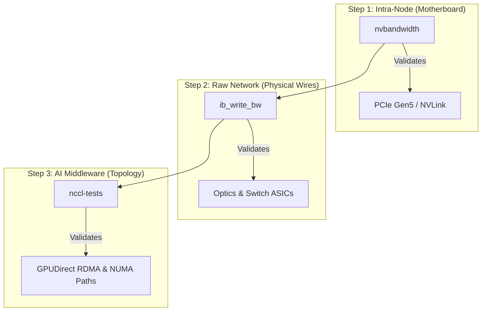

# Chapter 10 — Performance Bottlenecks and Benchmarking

| Chapter metadata | Value |
|---|---|
| Volume | 07 — GPU Networking and Data Paths |
| Difficulty | Advanced |
| Estimated reading time | 30 minutes |
| Primary audience | DevOps, SRE, Platform, Cloud and Infrastructure Engineers |
| Core question | If an AI job is running slowly, how do you mathematically prove exactly which wire or switch is the bottleneck? |

## Introduction

"The cluster is slow."

This is the most terrifying ticket a Senior AI Infrastructure Engineer can receive. 
In traditional IT, if a web server is slow, you check CPU, RAM, and disk IOPS. If they are fine, you blame the database. 

In a distributed AI cluster, "slow" could mean:
* A dirty fiber optic cable is causing microscopic light refraction, leading to 1% packet loss.
* A single PCIe lane out of 16 has failed on one NIC, dropping the bandwidth from 64 GB/s to 32 GB/s. 
* A developer accidentally disabled GPUDirect RDMA.

You cannot find these errors while a PyTorch job is running; PyTorch abstracts too much. A Senior Engineer isolates the hardware layers and benchmarks them sequentially using pure, low-level C++ binaries.

## 1. Validating the Motherboard (`nvbandwidth`)

Before you test the network, you must prove the server's motherboard is healthy. 
NVIDIA provides a tool called `nvbandwidth`. It strictly measures the PCIe and NVLink bandwidth *inside* the single server.

**The Workflow:**
Run `nvbandwidth -t device_to_host`. 
If you are on a PCIe Gen5 server, you should see roughly **50-60 GB/s**. 
If you see **30 GB/s**, you have instantly found the problem. The GPU has physically downgraded its PCIe connection (e.g., from x16 lanes to x8 lanes). This is often caused by thermal expansion slightly unseating the GPU from the PCIe slot, or a damaged riser cable.

## 2. Validating the Physical Network (`ib_write_bw`)

Once the motherboard is verified, you must test the raw physical network cable connecting Server A to Server B. 

We do not use `iperf3`. `iperf3` relies on the Linux Kernel's TCP/IP stack, which will bottleneck the CPU before it saturates a 400G link. 

We use **Perftest (`ib_write_bw`)**. This tool tests raw RDMA (InfiniBand or RoCE) speeds, entirely bypassing the CPU.
1. Run `ib_write_bw` on Server A (acting as the listener).
2. Run `ib_write_bw <IP_of_Server_A>` on Server B.

If you are on a 400G NDR network, you should see roughly **390 Gbps**. 
If it reports exactly **200 Gbps**, the InfiniBand switch port has likely downgraded the link speed due to a dirty fiber optic MPO connector or a damaged Active Electrical Cable (AEC).

## 3. Validating the AI Fabric (`nccl-tests`)

Once the motherboard is fast, and the physical network is fast, you must test the actual AI library. 

NVIDIA provides **`nccl-tests`** (`all_reduce_perf`). This is the ultimate benchmark. It mimics the exact memory allocation and network synchronization behavior of PyTorch, without the overhead of loading an actual neural network. 

**The Workflow:**
You launch `all_reduce_perf` across multiple nodes using MPI or Kubernetes. 
The tool outputs an "Algorithm Bandwidth" and a "Bus Bandwidth".

### Interpreting the NCCL Test
*   If `ib_write_bw` was perfectly fast, but `nccl-tests` is catastrophically slow, the hardware is fine. The software topology is broken. 
*   NCCL might be failing to use GPUDirect RDMA (falling back to traversing the host CPU). You can prove this by re-running the test with `NCCL_DEBUG=INFO`. The logs will explicitly state `NET/Socket` (Bad - using TCP/IP) or `NET/IB` (Good - using RDMA).

## Architectural Diagram: The Troubleshooting Hierarchy

*A Senior Engineer never skips to Step 3. If you run NCCL tests first and it fails, you have no idea if the error is a dirty cable or a NUMA misalignment.*

## Customer Scenario (Senior Level)

**The Situation:**
A data science team requests assistance. They are running a distributed training job across 8 nodes. The job runs, but it is 40% slower than their theoretical calculations. They suspect the InfiniBand network is congested. You run `ib_write_bw` between the nodes, and it shows a perfect 400 Gbps. You run `nccl-tests` across all 8 nodes, and it shows 400 Gbps. You tell the data scientists the network is perfect. They refuse to believe you.

**The Senior Architect Response:**
"The hardware and the network are operating flawlessly, but your application is failing to utilize them due to unoptimized **Message Sizes**.

When we run `nccl-tests`, we test massive, multi-gigabyte payload transfers. InfiniBand networks are incredibly efficient at moving massive blocks of contiguous data. 

However, I profiled your specific PyTorch code using NVIDIA Nsight Systems. Your neural network is structured with thousands of tiny, fragmented layers. When PyTorch synchronizes gradients, it is issuing thousands of microscopic `AllReduce` calls (e.g., 256 KB payloads) over the network instead of batching them into large payloads. 

Because the payloads are so small, the network is dominated by latency overhead, not bandwidth. The GPUs are spending more time executing the handshake for the network transfer than they are actually moving data. This is why `ib_write_bw` shows the network is healthy, but your application is slow. 

To fix this, we do not need network tuning; we need application tuning. You must increase the `bucket_cap_mb` parameter in your PyTorch DistributedDataParallel (DDP) configuration. This forces PyTorch to wait and aggregate those thousands of microscopic gradients into massive 50MB buckets before calling NCCL, instantly transforming the latency-bound transfers into bandwidth-bound transfers, unleashing the full speed of the cluster."

## Interview Preparation

**Conceptual:** Why is `iperf3` practically useless for diagnosing an InfiniBand network in an AI cluster? *(Hint: `iperf3` relies on the Linux OS TCP/IP stack. At 400Gbps, the TCP/IP stack will instantly bottleneck the host CPU, giving you an artificially low throughput reading. You must use RDMA-native tools like `ib_write_bw` to bypass the CPU).*

**Operations:** You run `nccl-tests` across two nodes. The bandwidth is terrible. You run `NCCL_DEBUG=INFO` and see `NCCL INFO NET/Socket`. What does this mean? *(Hint: It means NCCL failed to establish a direct RDMA connection over InfiniBand (NET/IB). It has fallen back to using standard, slow TCP/IP sockets over the management network. You must investigate the InfiniBand driver state or the Pod's network security boundaries).*
