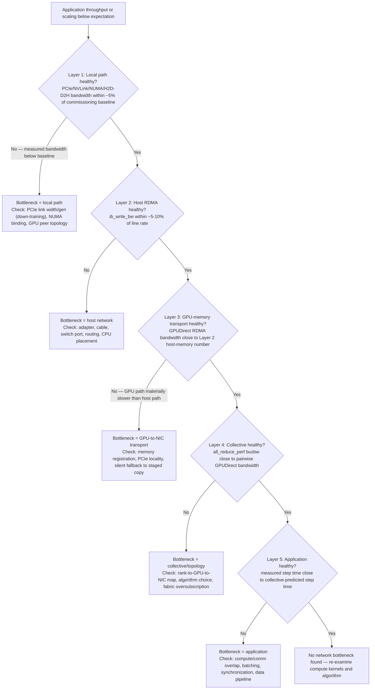

# Performance Bottlenecks and Benchmarking

## Introduction

A benchmark is useful only when it answers a specific architectural question. A single bandwidth number cannot prove that a GPU cluster is healthy. It may measure host memory instead of GPU memory, one link instead of the full collective path, or a short burst instead of sustained production behavior.

GPU-network performance engineering therefore requires a hierarchy of tests. Each test isolates one segment, and the final application trace confirms whether the segments combine correctly.

| Chapter field | Value |
|---|---|
| Volume | 07 — GPU Networking |
| Difficulty | Expert |
| Estimated reading time | 55 minutes |
| Previous | Multi-Node Collectives and NCCL Paths |
| Next | Production Design Scenarios |

## Story

A team reports that its cluster network delivers 95 percent of line rate. Training still scales poorly. The benchmark used one host-memory stream between two nodes. The application uses eight GPUs per node, four adapters, large collectives, checkpoint traffic, and simultaneous data loading.

The benchmark was correct, but it answered the wrong question. The new qualification plan measures PCIe, peer copies, GPU-to-NIC transfers, pairwise RDMA, collectives, and the real workload. It reveals contention on a shared PCIe uplink and uneven adapter selection.

## Learning Objectives

After completing this chapter, you will be able to:

- define a layered benchmark strategy;
- distinguish latency, bandwidth, throughput, and scaling efficiency;
- choose message sizes and concurrency levels;
- identify common benchmark mistakes;
- correlate hardware counters with application traces;
- separate capability tests from production qualification;
- build healthy and degraded baselines;
- communicate benchmark limitations to customers.

## Benchmark Pyramid

The pyramid is not a checklist to run top to bottom once — it is a fault-isolation decision path. Start at Layer 1 whenever application throughput is below expectation, and stop climbing the moment a layer diverges from its baseline. The layer that fails is the layer that owns the fix.



**Figure 7.10.1 — Benchmark pyramid as a fault-isolation decision path.** Each diamond is a go/no-go gate against a stored baseline, not a box in a static chain — the branch taken at the first failing gate tells you which team owns the next step, and every layer below that gate is now proven healthy and does not need to be re-tested.

## Metrics

### Latency

Time required to complete an operation. Important for small messages, request-response traffic, and synchronization.

### Bandwidth

Bytes delivered per unit time over a path. Important for large tensor transfers.

### Throughput

Completed work per unit time, such as training samples per second or inference tokens per second. It includes more than networking.

### Scaling efficiency

The delivered speedup relative to added resources. A simplified expression is:

```text
scaling efficiency = observed speedup / resource multiplier
```

**Illustrative worked example:** an eight-GPU job trains at 420 samples/s. Scaling to sixty-four GPUs (an 8x resource multiplier) delivers 2,688 samples/s.

```text
observed speedup   = 2688 / 420        = 6.4x
resource multiplier = 64 / 8            = 8x
scaling efficiency  = 6.4 / 8           = 0.80  → 80%
```

An 80% scaling efficiency is a plausible, healthy number for a well-tuned eight-node expansion — the missing 20% is normal collective/synchronization overhead, not automatically a defect. Below roughly 60-65% at this scale, the Bottleneck Classification table below is the next step: pairwise Layer 3 tests first, then the collective matrix, to find which segment is eating the gap.

### Tail behavior

Percentile latency and iteration variance expose congestion, retries, and stragglers that averages hide.

## Message-Size Distribution

Test small, medium, and large messages. Small transfers emphasize startup cost and software progress. Large transfers emphasize sustained bandwidth. Real workloads often contain both.

A useful benchmark matrix varies:

- payload size;
- queue depth;
- number of streams or channels;
- GPU pair;
- adapter pair;
- node count;
- collective operation;
- topology placement;
- concurrent storage or tenant traffic.

## Layer 1 — Local Path Tests

Validate:

- GPU memory bandwidth where relevant;
- host-to-device and device-to-host copies;
- GPU peer copies;
- PCIe link speed and width;
- NVLink or NVSwitch paths;
- NUMA-local and remote memory behavior.

These tests establish whether the node itself can move data as designed.

**Topology and link state (`nvidia-smi topo -m`):**

```text
$ nvidia-smi topo -m
        GPU0    GPU1    GPU2    GPU3    NIC0    NIC1    CPU Affinity    NUMA Affinity
GPU0     X      NV18    NV18    NV18    PIX     SYS     0-31            0
GPU1    NV18     X      NV18    NV18    SYS     PIX     0-31            0
GPU2    NV18    NV18     X      NV18    SYS     SYS     32-63           1
GPU3    NV18    NV18    NV18     X      SYS     SYS     32-63           1
NIC0     PIX     SYS     SYS     SYS     X       SYS
NIC1     SYS     PIX     SYS     SYS    SYS      X

Legend:
  NV18 = 18 NVLink connections (scale-up, fastest GPU-GPU path)
  PIX  = connection within a single PCIe switch (fast, local)
  SYS  = crosses a NUMA/CPU-socket boundary (slowest, avoid for hot paths)
```

The row/column for `GPU2`↔`NIC0` reads `SYS` — that GPU has no local adapter; any RDMA traffic from GPU2 has to cross the inter-socket link before it even reaches NIC0. If a training job pins GPU2's ranks to NIC0 anyway, Layer 3 numbers for that pairing will read low even though every individual component is healthy. `NV18` between all GPU pairs confirms a fully connected NVSwitch domain — no GPU pair is starved relative to another for scale-up traffic.

**PCIe link speed and width (`lspci`), confirming no down-training:**

```text
$ sudo lspci -s 17:00.0 -vv | grep -E 'LnkCap|LnkSta'
LnkCap: Port #0, Speed 32GT/s, Width x16
LnkSta: Speed 32GT/s (ok), Width x16 (ok)
```

`LnkCap` is what the slot and device support; `LnkSta` is what actually negotiated. Both reading `32GT/s x16` and `(ok)` confirms full Gen5 x16 — no down-training. If `LnkSta` showed `Speed 16GT/s` or `Width x8 (downgraded)`, that link would deliver roughly half the expected bandwidth before any workload ever touches it, and every layer above it in the pyramid would look "slow" without a network problem existing at all.

**GPU-to-GPU peer bandwidth (`p2pBandwidthLatencyTest`, from CUDA samples):**

```text
$ ./p2pBandwidthLatencyTest
Unidirectional P2P=Enabled Bandwidth (P2P Writes) Matrix (GB/s)
   D\D     0      1      2      3
     0  1450.3  432.1  418.7  420.5
     1   431.9 1451.0  419.2  421.0
     2   417.8  418.4 1448.6  431.5
     3   419.1  420.7  430.9 1449.8

P2P=Enabled Latency Matrix (us)
   D\D     0      1      2      3
     0    0.00   2.14   2.16   2.15
     1    2.15   0.00   2.13   2.14
```

The diagonal (~1450 GB/s) is a GPU reading its own HBM — not a network number, ignore it for topology comparisons. Off-diagonal values (~418-432 GB/s) are NVLink peer bandwidth and should be roughly uniform across all pairs on a fully connected NVSwitch node, matching the `NV18` topology above; a pair reading materially lower (for example, one cell at 90 GB/s while the rest cluster near 420) points at a specific bad link or a PCIe fallback for that one pair, worth cross-checking against `nvidia-smi topo -m` before assuming a cable or transceiver.

## Layer 2 — Host Network Tests

Use host-memory tests to validate adapter, cable, switch, routing, transport, and remote endpoint behavior. Record latency, bandwidth, retries, errors, and CPU placement.

A healthy host test does not prove GPU direct memory access, but an unhealthy host test means higher layers cannot succeed.

**Host-memory RDMA bandwidth (`ib_write_bw`, from `perftest`), server then client:**

```text
# server node
$ ib_write_bw -d mlx5_0 -F --report_gbits

# client node
$ ib_write_bw -d mlx5_0 -F --report_gbits <server_ip>
---------------------------------------------------------------------------------------
 #bytes    #iterations    BW peak[Gb/sec]    BW average[Gb/sec]   MsgRate[Mpps]
 65536     5000             397.42              396.88             0.757
---------------------------------------------------------------------------------------
```

The adapter is a qualified 400Gb/s NIC, so `396.88 Gb/sec` average is roughly 99% of line rate (`396.88 / 400 = 0.992`) — a clean Layer 2 pass. `-F` forces a CPU frequency check so a power-saving governor doesn't quietly cap the result, and `--report_gbits` avoids the common unit mix-up between Gb/s (this tool's default) and GB/s (what application-level dashboards usually show — dividing by 8 to compare the two is a frequent source of false "regression" tickets).

**Degraded comparison — same command, congested or misrouted path:**

```text
---------------------------------------------------------------------------------------
 #bytes    #iterations    BW peak[Gb/sec]    BW average[Gb/sec]   MsgRate[Mpps]
 65536     5000             211.40              158.62             0.303
---------------------------------------------------------------------------------------
```

`158.62 Gb/sec` average against the same 400Gb/s link is ~40% of line rate, and the gap between `peak` (211.40) and `average` (158.62) is itself a signal — a healthy link keeps peak and average close together; a widening gap points at retries, congestion, or an intermittently-selected suboptimal route rather than a flat capability ceiling. This is the exact shape of evidence that sends you to switch/route telemetry rather than back to Layer 1, because Layer 1 (which doesn't touch the fabric) already passed.

## Layer 3 — GPU-Memory Transport Tests

Run approved GPU-buffer RDMA or communication tests. Compare local and remote GPU-to-NIC combinations. Confirm direct-memory path selection rather than inferring it.

**GPUDirect RDMA bandwidth (same `ib_write_bw`, with GPU buffers via `--use_cuda`):**

```text
$ ib_write_bw -d mlx5_0 -F --report_gbits --use_cuda=0 <server_ip>
---------------------------------------------------------------------------------------
 #bytes    #iterations    BW peak[Gb/sec]    BW average[Gb/sec]   MsgRate[Mpps]
 65536     5000             391.05              389.20             0.743
---------------------------------------------------------------------------------------
```

`389.20 Gb/sec` GPU-buffer bandwidth against the Layer 2 host-memory baseline of `396.88 Gb/sec` is a ~1.9% gap — well within normal protocol overhead, confirming GPUDirect RDMA is genuinely active on the local GPU-NIC pairing rather than silently falling back to a staged host copy.

**Degraded comparison — GPU on the wrong NUMA node from the NIC (matches the `SYS` cell from the `nvidia-smi topo -m` output above):**

```text
---------------------------------------------------------------------------------------
 #bytes    #iterations    BW peak[Gb/sec]    BW average[Gb/sec]   MsgRate[Mpps]
 65536     5000             204.11              189.34             0.361
---------------------------------------------------------------------------------------
```

`189.34 Gb/sec` is roughly half of the local-pairing result (`389.20`), even though Layer 2's host-only test on the same NIC passed clean. This is the textbook Layer 3 divergence pattern from the pyramid diagram: host path proven healthy, GPU path materially worse — the fix is rank-to-NIC affinity (bind this GPU's traffic to its local adapter), not a cable swap. Confirming the path actually used GPUDirect rather than falling back silently can be checked with `dmesg | grep -i nv_peer_mem` or the corresponding `nvidia-peermem` module logs, since a silent fallback to a staged host copy produces a similar-shaped bandwidth drop but has a different fix (driver/registration, not affinity).

## Layer 4 — Collective Tests

Measure collectives by operation, message size, GPU count, and node count. Use a fixed rank map and record topology. Repeat tests to expose variance.

**`all_reduce_perf` from nccl-tests, 64 GPUs (8 nodes x 8 GPUs):**

```text
$ mpirun -np 64 -hostfile hosts ./build/all_reduce_perf -b 8M -e 8M -f 2 -g 1
#
#                                                    out-of-place                        in-place
#       size    count     type   redop     time   algbw   busbw    #wrong     time   algbw   busbw    #wrong
#      (B)    (elements)                    (us)  (GB/s)  (GB/s)              (us)  (GB/s)  (GB/s)
     8388608   2097152    float     sum    1823.4  4.601  9.061       0     1811.2  4.632  9.121       0
```

Two numbers matter more than raw bandwidth: `algbw` (algorithm bandwidth — data size divided by time) and `busbw` (bus bandwidth — `algbw` corrected for the number of GPUs, so it's directly comparable to the physical link bandwidth measured at Layer 2/3). `busbw = 9.06 GB/s = ~72.5 Gb/s` against a Layer 3 pairwise result of `~389 Gb/s` is expected, not alarming — a ring or tree AllReduce spreads the payload across many hops, so per-link `busbw` is always a fraction of raw point-to-point bandwidth; the correct comparison is this run's `busbw` against a previous healthy `busbw` at the same GPU/node count, not against the Layer 3 number directly. `#wrong` at `0` on both passes confirms correctness — a nonzero value here means the result is numerically wrong, which is a different class of bug entirely (data corruption) from a slow-but-correct result.

**Degraded comparison — same command, one node with a misrouted NIC:**

```text
     8388608   2097152    float     sum    4980.7  1.684  3.318       0     4955.1  1.693  3.336       0
```

`busbw` collapsed from `9.06` to `3.32 GB/s` — roughly a 63% drop — while count and correctness are unchanged. Per the Bottleneck Classification table below ("Pairwise fast, collective slow"), this points at rank map, algorithm selection, or oversubscription rather than a single bad link, because Layer 3 pairwise tests on the same nodes already passed; the next step is `NCCL_DEBUG=INFO` on the run to see which ring/tree topology NCCL actually built and whether one rank's edges are the slow ones.

## Layer 5 — Application Tests

Profile the real workload. Correlate communication phases with:

- GPU utilization;
- kernel execution;
- storage traffic;
- CPU activity;
- adapter counters;
- collective traces;
- request or iteration latency.

Only this layer proves business value.

**`nvidia-smi dmon` sampled during a training step, aligned against the collective trace:**

```text
$ nvidia-smi dmon -s u -c 5
# gpu    sm   mem
# Idx     %     %
    0    92    71
    0    94    69
    0     8     4   ← communication phase: SMs nearly idle
    0     9     3   ← communication phase continues
    0    91    70   ← compute resumes
```

Two samples at `sm=8-9%` bracketed by samples near `sm=92%` is the compute/communication boundary made visible — if this pattern occupies, say, 400 microseconds of a 5-millisecond step (8% of step time), that is consistent with the Layer 4 `busbw` result and expected overhead. If the same low-utilization band stretches to 30-40% of step time despite Layer 4 showing a healthy `busbw`, the gap is not the network — it is missing compute/communication overlap in the application (for example, gradients not being reduced while the next layer's forward pass could be running), which is an application-code finding, not a networking one.

**Correlating with the collective trace:** `NCCL_DEBUG=INFO` output or a profiler's NCCL trace should show AllReduce calls starting and ending inside that same low-`sm%` window. If they don't line up — if the GPU is idle for reasons unrelated to any logged collective call — the next hypothesis is CPU-side stalls (data loader, checkpoint I/O, Python-level synchronization) rather than anything in this chapter's network stack, which is exactly the "Application" branch in the Benchmark Pyramid decision path above.

## Delivered versus Theoretical Performance

Theoretical bandwidth is a planning ceiling, not an acceptance result. Delivered performance is reduced by protocol overhead, encoding, packet headers, synchronization, queue behavior, and topology.

Do not invent a universal efficiency target. Establish an approved baseline for each node class, software version, operation, and message range.

## Bottleneck Classification

| Symptom | Likely domain | Next test |
|---|---|---|
| Low local peer bandwidth | PCIe, NVLink, topology | Pairwise GPU tests |
| Host RDMA slow | Adapter, fabric, CPU placement | Point-to-point RDMA |
| Host fast, GPU path slow | Peer-memory integration or locality | GPU-buffer RDMA |
| Pairwise fast, collective slow | Rank map, algorithm, oversubscription | Collective matrix |
| Collective fast, application slow | Compute, input, synchronization | Application trace |
| Average healthy, high variance | Congestion, retries, stragglers | Counter and percentile analysis |

## Common Benchmark Mistakes

1. Testing only one message size.
2. Reporting peak rather than sustained results.
3. Ignoring warm-up and registration effects.
4. Comparing different topologies.
5. Changing several variables at once.
6. Using device indices without recording UUID and PCI address.
7. Omitting firmware and software versions.
8. Running on an idle fabric when production is shared.
9. Treating a microbenchmark as application proof.
10. Publishing expected output that was never observed.

## Controlled Experiment Design

A reliable test changes one variable at a time. Record:

- hypothesis;
- environment;
- topology;
- versions;
- exact command;
- workload size;
- repetitions;
- raw output;
- counter snapshots;
- interpretation;
- limitations.

This makes results reproducible and suitable for change control.

## Production Baselines

Maintain at least three baselines:

- **commissioning baseline:** clean node and fabric after deployment;
- **production baseline:** representative shared load;
- **degraded baseline:** known failure or fallback, used for recognition.

A degraded baseline is valuable because it teaches operators what a broken path looks like before an incident.

## Production Troubleshooting

### Peak bandwidth is healthy but application throughput is low

Inspect communication frequency, synchronization, CPU and storage delays, and overlap. The application may not generate large enough transfers to benefit from peak bandwidth.

**Evidence pattern:** Layer 2 `ib_write_bw` reports `396.88 Gb/sec` (99% of a 400Gb/s link), but the training job only sustains `220 samples/s` against a `380 samples/s` baseline from the commissioning run. The Layer 5 `nvidia-smi dmon` trace shows communication windows using message sizes far below the 64KB payload the `ib_write_bw` test used:

```text
$ NCCL_DEBUG=INFO python train.py 2>&1 | grep "AllReduce" | head -3
NCCL INFO AllReduce: opCount 4a sendbuff 0x7f... count 65536 datatype ncclFloat32 ... nchannels 2
```

`count 65536` elements at 4 bytes each is 256KB per call — small relative to the 8MB payload the healthy Layer 4 baseline used, so per-call fixed overhead (kernel launch, synchronization) dominates instead of link bandwidth. The fix is application-level (larger gradient buckets / fused AllReduce), not a network change — a network engineer chasing this as a fabric problem would find every layer test passing and waste an escalation cycle.

### Results vary between runs

Check competing traffic, power state, thermal behavior, routing, queue state, process binding, and background services. Use percentile distributions instead of one average.

**Evidence pattern:** ten repeated `all_reduce_perf` runs at the same size show a mean `busbw` of `9.06 GB/s` but a p99 of `4.1 GB/s` — the average alone hides that 1 run in 10 stalls badly:

```text
run  busbw(GB/s)
1    9.05
2    9.11
3    9.08
4    4.12  ← outlier
5    9.02
...
p50 = 9.06   p90 = 9.09   p99 = 4.12
```

A single-number average of these ten runs (`8.4 GB/s`) looks like a mild 7% regression from a 9.06 baseline; the percentile view shows the real story is one severe stall, not a broad slowdown — which changes the investigation from "is the fabric generally slower" to "what happened during run 4" (competing tenant traffic, a retried packet, a thermal throttle event captured in adapter counters at that timestamp).

### One GPU pair is slower

Map the pair to PCIe, NVLink, root-complex, and adapter topology. Repeat with stable identifiers.

### Performance falls only under full cluster load

Look for fabric oversubscription, incast, congestion-control response, shared storage traffic, and job placement across failure domains.

## Customer Scenario

A customer asks for a guarantee that a new fabric will make training twice as fast. The architect separates network capability from application speedup and proposes an acceptance plan:

1. define the current iteration profile;
2. identify communication share;
3. establish layered baselines;
4. test the new design under representative concurrency;
5. measure end-to-end throughput and variance;
6. document assumptions.

This produces an evidence-based business case rather than a promise based on line rate.

## Interview Preparation

### Knowledge Questions

**1. Difference between bandwidth and throughput?**
> "Bandwidth is bytes delivered per second over a specific path — what `ib_write_bw` measures on a link. Throughput is completed business work per second, like samples per second or tokens per second, and it depends on far more than the network: compute time, synchronization, data loading. A link can report 99% of line rate while throughput is terrible, because throughput also has to account for how much of the step is actually spent moving bytes versus computing or waiting."

**2. Why test multiple message sizes?**
> "Small messages expose fixed per-call overhead — kernel launch, synchronization, queue posting — so a 4KB test tells you about latency and software path cost. Large messages, say 8MB, saturate the link and tell you about sustained bandwidth. A workload that does frequent small AllReduce calls, like a model with many small gradient buckets, is bottlenecked by the small-message number even if the large-message number looks perfect, so I test the actual message-size distribution the application uses, not just one convenient size."

**3. Why can peak results be misleading?**
> "Peak is the best sample in a run; average or p99 over repeated runs is what production actually experiences. I've seen `ib_write_bw` peak at 211 Gb/s on a degraded path while the average sat at 158 — the gap between peak and average is itself diagnostic, because a healthy link keeps them close together. A vendor number is almost always a peak, single-stream, idle-fabric number, and I always ask what percentile and what background load it was measured under before comparing it to my own baseline."

**4. What is scaling efficiency?**
> "It's observed speedup divided by the resource multiplier. If I go from 8 to 64 GPUs — an 8x multiplier — and throughput goes from 420 to 2,688 samples/s, that's a 6.4x speedup, so efficiency is 6.4 divided by 8, which is 80%. Some loss is normal and expected from synchronization overhead; I'd only start investigating below roughly 60-65% at that scale, and I'd go straight to the pairwise Layer 3 numbers first because that's usually cheaper to rule in or out than the collective matrix."

### Architecture Questions

**1. Design a benchmark pyramid for a new cluster.**
> "I'd run it in the order the pyramid implies: local PCIe/NVLink/NUMA tests first with `p2pBandwidthLatencyTest` and `nvidia-smi topo -m`, then host RDMA with `ib_write_bw` at line rate, then the same test with GPU buffers via `--use_cuda` to confirm GPUDirect is actually active rather than silently falling back, then `nccl-tests` collectives at 2, 4, and 8 nodes to catch scaling problems early, and only then the real training job. Each layer's healthy result becomes the commissioning baseline I compare every future run against."

**2. Define acceptance tests for an eight-GPU node.**
> "Topology first — confirm `nvidia-smi topo -m` shows the expected NVLink connectivity and every PCIe link reports full width and generation with no down-training. Then pairwise peer bandwidth across all 28 GPU pairs should cluster tightly around the same value; any outlier pair gets flagged before the node goes into service. Then an all-GPU AllReduce baseline is captured and stored — that's the number every later regression gets compared against, not a spec-sheet theoretical figure."

**3. Create a shared-fabric production baseline.**
> "I'd capture three separate baselines, not one: a commissioning baseline on a clean, idle fabric right after deployment; a production baseline measured under representative concurrent tenant load, since that's the condition production actually runs under; and a degraded baseline captured during a known, intentionally injected failure, so operators have already seen what broken looks like before it happens for real at 3am."

### Scenario Questions

**1. Host RDMA passes but AllReduce fails to scale. What layer comes next?**
> "Per the Bottleneck Classification table, pairwise-fast-collective-slow points at the rank map, algorithm choice, or fabric oversubscription — not the link itself, since Layer 2 already passed. I'd run `NCCL_DEBUG=INFO` to see what ring or tree topology NCCL actually built, confirm rank-to-GPU-to-NIC affinity matches the physical topology, and check whether the collective matrix at smaller node counts (2, 4 nodes) already shows the same drop, which would point at algorithm selection rather than scale-dependent congestion."

**2. Results vary only at night. Which environmental factors matter?**
> "Nighttime is usually when batch jobs, backups, or other tenants share the same fabric, so my first hypothesis is competing traffic, not hardware degrading on a schedule. I'd check adapter and switch counters for retries and congestion-control activity during those windows, and compare against a scheduling calendar before touching any hardware — thermal and power-state changes are also worth ruling out if the datacenter's cooling load shifts overnight, but that's usually second, not first."

**3. A vendor presents one peak number. What information is missing?**
> "Message size, run count and percentile, background load on the fabric during the test, firmware and driver versions, and whether it was point-to-point or a representative collective. A single peak, single-stream number on an idle fabric tells me almost nothing about what my actual multi-tenant, mixed-message-size workload will see — I'd ask them to reproduce it as a layered pyramid result with raw output, the same way I'd document my own."

## Summary

Benchmarking is a process of reducing uncertainty. Local, network, GPU-memory, collective, and application tests answer different questions. A production qualification plan uses all of them in sequence.

The objective is not to produce the largest number. It is to explain where time is spent, identify the limiting path, and detect regressions safely.

## Key Takeaways

- Benchmark questions must precede benchmark commands.
- Test the hierarchy from local paths to the application.
- Use multiple message sizes and repeated runs.
- Record topology and versions with every result.
- Compare against node-class baselines, not universal claims.
- Application traces are the final evidence.

## Quick Revision Sheet

| Layer | What it proves |
|---|---|
| Local | Node data paths |
| Host network | Fabric and adapter path |
| GPU transport | Direct GPU-memory communication |
| Collective | Multi-rank orchestration |
| Application | Business workload outcome |

## Cross References

- Previous: [Multi-Node Collectives and NCCL Paths](./chapter-09-multi-node-collectives-and-nccl-paths)
- Next: [Production Design Scenarios](./chapter-11-production-design-scenarios)
- Lab: [Benchmark RDMA and GPUDirect Paths](./labs/lab-03-benchmark-rdma-and-gpudirect-paths)
- Lab: [Troubleshoot a Multi-GPU Data Path](./labs/lab-04-troubleshoot-a-multi-gpu-data-path)

## Further Reading

Use official CUDA sample documentation, NCCL Tests guidance, RDMA benchmark documentation, adapter telemetry references, and framework profiling guides appropriate to the qualified release.
