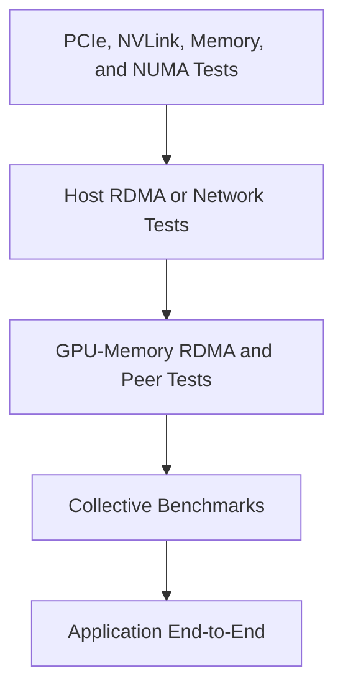

# Performance Bottlenecks and Benchmarking

## Introduction

A benchmark is useful only when it answers a specific architectural question. A single bandwidth number cannot prove that a GPU cluster is healthy. It may measure host memory instead of GPU memory, one link instead of the full collective path, or a short burst instead of sustained production behavior.

GPU-network performance engineering therefore requires a hierarchy of tests. Each test isolates one segment, and the final application trace confirms whether the segments combine correctly.

| Chapter field | Value |
|---|---|
| Volume | 07 — GPU Networking |
| Difficulty | Expert |
| Estimated reading time | 55 minutes |
| Previous | Multi-Node Collectives and NCCL Paths |
| Next | Production Design Scenarios |

## Story

A team reports that its cluster network delivers 95 percent of line rate. Training still scales poorly. The benchmark used one host-memory stream between two nodes. The application uses eight GPUs per node, four adapters, large collectives, checkpoint traffic, and simultaneous data loading.

The benchmark was correct, but it answered the wrong question. The new qualification plan measures PCIe, peer copies, GPU-to-NIC transfers, pairwise RDMA, collectives, and the real workload. It reveals contention on a shared PCIe uplink and uneven adapter selection.

## Learning Objectives

After completing this chapter, you will be able to:

- define a layered benchmark strategy;
- distinguish latency, bandwidth, throughput, and scaling efficiency;
- choose message sizes and concurrency levels;
- identify common benchmark mistakes;
- correlate hardware counters with application traces;
- separate capability tests from production qualification;
- build healthy and degraded baselines;
- communicate benchmark limitations to customers.

## Benchmark Pyramid



**Figure 7.10.1 — Benchmark from components to applications.** Each layer reduces uncertainty before the next layer adds complexity.

## Metrics

### Latency

Time required to complete an operation. Important for small messages, request-response traffic, and synchronization.

### Bandwidth

Bytes delivered per unit time over a path. Important for large tensor transfers.

### Throughput

Completed work per unit time, such as training samples per second or inference tokens per second. It includes more than networking.

### Scaling efficiency

The delivered speedup relative to added resources. A simplified expression is:

```text
scaling efficiency = observed speedup / resource multiplier
```

### Tail behavior

Percentile latency and iteration variance expose congestion, retries, and stragglers that averages hide.

## Message-Size Distribution

Test small, medium, and large messages. Small transfers emphasize startup cost and software progress. Large transfers emphasize sustained bandwidth. Real workloads often contain both.

A useful benchmark matrix varies:

- payload size;
- queue depth;
- number of streams or channels;
- GPU pair;
- adapter pair;
- node count;
- collective operation;
- topology placement;
- concurrent storage or tenant traffic.

## Layer 1 — Local Path Tests

Validate:

- GPU memory bandwidth where relevant;
- host-to-device and device-to-host copies;
- GPU peer copies;
- PCIe link speed and width;
- NVLink or NVSwitch paths;
- NUMA-local and remote memory behavior.

These tests establish whether the node itself can move data as designed.

## Layer 2 — Host Network Tests

Use host-memory tests to validate adapter, cable, switch, routing, transport, and remote endpoint behavior. Record latency, bandwidth, retries, errors, and CPU placement.

A healthy host test does not prove GPU direct memory access, but an unhealthy host test means higher layers cannot succeed.

## Layer 3 — GPU-Memory Transport Tests

Run approved GPU-buffer RDMA or communication tests. Compare local and remote GPU-to-NIC combinations. Confirm direct-memory path selection rather than inferring it.

## Layer 4 — Collective Tests

Measure collectives by operation, message size, GPU count, and node count. Use a fixed rank map and record topology. Repeat tests to expose variance.

## Layer 5 — Application Tests

Profile the real workload. Correlate communication phases with:

- GPU utilization;
- kernel execution;
- storage traffic;
- CPU activity;
- adapter counters;
- collective traces;
- request or iteration latency.

Only this layer proves business value.

## Delivered versus Theoretical Performance

Theoretical bandwidth is a planning ceiling, not an acceptance result. Delivered performance is reduced by protocol overhead, encoding, packet headers, synchronization, queue behavior, and topology.

Do not invent a universal efficiency target. Establish an approved baseline for each node class, software version, operation, and message range.

## Bottleneck Classification

| Symptom | Likely domain | Next test |
|---|---|---|
| Low local peer bandwidth | PCIe, NVLink, topology | Pairwise GPU tests |
| Host RDMA slow | Adapter, fabric, CPU placement | Point-to-point RDMA |
| Host fast, GPU path slow | Peer-memory integration or locality | GPU-buffer RDMA |
| Pairwise fast, collective slow | Rank map, algorithm, oversubscription | Collective matrix |
| Collective fast, application slow | Compute, input, synchronization | Application trace |
| Average healthy, high variance | Congestion, retries, stragglers | Counter and percentile analysis |

## Common Benchmark Mistakes

1. Testing only one message size.
2. Reporting peak rather than sustained results.
3. Ignoring warm-up and registration effects.
4. Comparing different topologies.
5. Changing several variables at once.
6. Using device indices without recording UUID and PCI address.
7. Omitting firmware and software versions.
8. Running on an idle fabric when production is shared.
9. Treating a microbenchmark as application proof.
10. Publishing expected output that was never observed.

## Controlled Experiment Design

A reliable test changes one variable at a time. Record:

- hypothesis;
- environment;
- topology;
- versions;
- exact command;
- workload size;
- repetitions;
- raw output;
- counter snapshots;
- interpretation;
- limitations.

This makes results reproducible and suitable for change control.

## Production Baselines

Maintain at least three baselines:

- **commissioning baseline:** clean node and fabric after deployment;
- **production baseline:** representative shared load;
- **degraded baseline:** known failure or fallback, used for recognition.

A degraded baseline is valuable because it teaches operators what a broken path looks like before an incident.

## Production Troubleshooting

### Peak bandwidth is healthy but application throughput is low

Inspect communication frequency, synchronization, CPU and storage delays, and overlap. The application may not generate large enough transfers to benefit from peak bandwidth.

### Results vary between runs

Check competing traffic, power state, thermal behavior, routing, queue state, process binding, and background services. Use percentile distributions instead of one average.

### One GPU pair is slower

Map the pair to PCIe, NVLink, root-complex, and adapter topology. Repeat with stable identifiers.

### Performance falls only under full cluster load

Look for fabric oversubscription, incast, congestion-control response, shared storage traffic, and job placement across failure domains.

## Customer Scenario

A customer asks for a guarantee that a new fabric will make training twice as fast. The architect separates network capability from application speedup and proposes an acceptance plan:

1. define the current iteration profile;
2. identify communication share;
3. establish layered baselines;
4. test the new design under representative concurrency;
5. measure end-to-end throughput and variance;
6. document assumptions.

This produces an evidence-based business case rather than a promise based on line rate.

## Interview Preparation

### Knowledge Questions

1. Difference between bandwidth and throughput?
2. Why test multiple message sizes?
3. Why can peak results be misleading?
4. What is scaling efficiency?

### Architecture Questions

1. Design a benchmark pyramid for a new cluster.
2. Define acceptance tests for an eight-GPU node.
3. Create a shared-fabric production baseline.

### Scenario Questions

1. Host RDMA passes but AllReduce fails to scale. What layer comes next?
2. Results vary only at night. Which environmental factors matter?
3. A vendor presents one peak number. What information is missing?

## Summary

Benchmarking is a process of reducing uncertainty. Local, network, GPU-memory, collective, and application tests answer different questions. A production qualification plan uses all of them in sequence.

The objective is not to produce the largest number. It is to explain where time is spent, identify the limiting path, and detect regressions safely.

## Key Takeaways

- Benchmark questions must precede benchmark commands.
- Test the hierarchy from local paths to the application.
- Use multiple message sizes and repeated runs.
- Record topology and versions with every result.
- Compare against node-class baselines, not universal claims.
- Application traces are the final evidence.

## Quick Revision Sheet

| Layer | What it proves |
|---|---|
| Local | Node data paths |
| Host network | Fabric and adapter path |
| GPU transport | Direct GPU-memory communication |
| Collective | Multi-rank orchestration |
| Application | Business workload outcome |

## Cross References

- Previous: [Multi-Node Collectives and NCCL Paths](./chapter-09-multi-node-collectives-and-nccl-paths)
- Next: [Production Design Scenarios](./chapter-11-production-design-scenarios)
- Lab: [Benchmark RDMA and GPUDirect Paths](./labs/lab-03-benchmark-rdma-and-gpudirect-paths)
- Lab: [Troubleshoot a Multi-GPU Data Path](./labs/lab-04-troubleshoot-a-multi-gpu-data-path)

## Further Reading

Use official CUDA sample documentation, NCCL Tests guidance, RDMA benchmark documentation, adapter telemetry references, and framework profiling guides appropriate to the qualified release.
