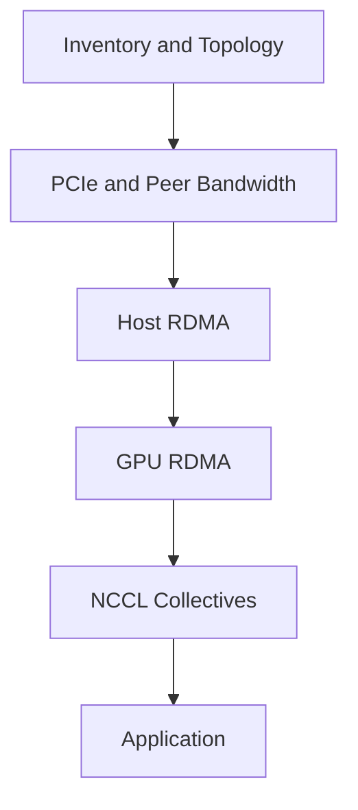

# Performance Bottlenecks and Benchmarking

GPU networking performance is an end-to-end property. A low result can originate in the GPU, PCIe, CPU affinity, NIC, cable, switch, routing, storage, communication library, or application. Benchmarking must isolate these layers before optimization.

## Learning Objectives

Design a benchmark ladder, distinguish latency and bandwidth regimes, recognize misleading tests, and create production acceptance thresholds.

## Benchmark Ladder

Each stage depends on the previous one. Starting with the application creates too many unknowns.

## Measurement Dimensions

| Dimension | Why it matters |
|---|---|
| Message size | Small messages expose latency; large messages expose bandwidth |
| Direction | Read, write, send, receive, and bidirectional paths differ |
| Concurrency | Multiple queues or ranks can expose contention |
| Topology | Local and remote paths are not equivalent |
| Duration | Short tests can miss thermal or congestion behavior |
| Distribution | Median alone hides tail latency and stragglers |

Measure useful payload throughput rather than quoting line rate. Protocol overhead, encoding, packet headers, and application synchronization reduce delivered bandwidth.

## Baselines and Acceptance

A production baseline should include node model, firmware, BIOS, kernel, driver, CUDA, RDMA stack, NCCL, switch software, cable map, topology, commands, and result ranges. Use ranges rather than one “golden” number. Alert on meaningful deviation from comparable nodes.

Acceptance should cover:

- no unexpected topology differences;
- expected PCIe generation and width;
- stable peer and RDMA results;
- collective scaling within defined efficiency bands;
- no sustained error-counter growth;
- repeatability under load.

## Common Benchmark Mistakes

- Comparing different message sizes.
- Testing pageable host memory when the application uses GPU buffers.
- Reporting the best run and hiding variance.
- Ignoring CPU frequency, affinity, and power state.
- Testing one pair while production uses all links concurrently.
- Treating a synthetic peak as an application SLA.

## Troubleshooting

When a result is low, move downward in the ladder. If application performance is poor but collectives are healthy, inspect computation and data pipeline. If collectives are poor but point-to-point GPU RDMA is healthy, inspect rank mapping and collective algorithms. If GPU RDMA is poor but host RDMA is healthy, inspect direct registration and topology.

## Customer Scenario

A customer claims the network delivers only half of its rated speed. A large-message host RDMA test is healthy, but GPU-buffer tests are low for cross-socket pairs. The issue is placement, not switch capacity. The benchmark ladder prevents an unnecessary fabric replacement.

## Interview Preparation

**Question:** What makes a benchmark production-grade?

Reproducibility, version and topology context, representative workloads, variance reporting, acceptance ranges, and a clear connection to service objectives.

## Key Takeaways

- Isolate layers before tuning.
- Test latency, bandwidth, concurrency, and topology.
- Preserve context with every result.
- Synthetic peaks and application performance are related but not identical.

## Cross References

- [Multi-Node Collectives](./chapter-09-multi-node-collectives-and-nccl-paths)
- [Next: Production Design Scenarios](./chapter-11-production-design-scenarios)
