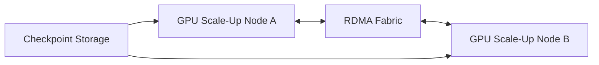

# Production GPU Networking Design Scenarios

Architecture becomes useful when principles are applied under constraints. This chapter examines four common customer designs and shows how the dominant communication pattern changes the recommendation.

## Scenario 1: Eight-GPU Training Nodes

The workload uses tensor and data parallelism. Inside each node, high-bandwidth peer communication is critical. Across nodes, each rank must reach a local high-speed NIC without crossing avoidable NUMA boundaries.

Design priorities are symmetric GPU/NIC mapping, nonblocking rack fabric where justified, collective benchmarks, checkpoint isolation, and consistent firmware.

## Scenario 2: Independent Inference Replicas

Each GPU serves separate requests. Peer bandwidth may matter less than client network, model loading, and tail latency. A large NVSwitch domain can be unnecessary unless the model spans GPUs.

Design for service replicas, load balancing, failure isolation, model-cache placement, and predictable network queues. Avoid purchasing scale-up capability that the workload cannot use.

## Scenario 3: Storage-Intensive Scientific Pipeline

The application reads large datasets, performs GPU computation, and writes results. The dominant path may be storage-to-GPU rather than GPU-to-GPU.

Evaluate local NVMe, shared filesystem bandwidth, metadata behavior, GPUDirect Storage support, PCIe locality, and burst writes. More NIC bandwidth will not fix a storage namespace or metadata bottleneck.

## Scenario 4: Multi-Tenant GPU Cluster

Training, inference, and interactive jobs share nodes. Strict topology placement can fragment capacity, while unconstrained placement creates unstable performance.

Use workload classes. Reserve topology-sensitive pools for distributed jobs and flexible pools for independent workloads. Expose locality through scheduler metadata, enforce quotas, and measure tenant interference.

## Decision Matrix

| Requirement | Architecture response |
|---|---|
| Tight in-node synchronization | NVLink/NVSwitch-capable scale-up platform |
| Large multi-node collectives | Local NIC affinity and RDMA fabric |
| High checkpoint throughput | Separate storage path and burst testing |
| Low-latency independent inference | Service-network and replica optimization |
| Shared cluster efficiency | Workload classes and selective affinity |
| Operational simplicity | Standardized nodes, versions, and cable maps |

## Availability and Failure

Design degraded modes. A failed NIC may reduce rails; a failed GPU may make a topology-sensitive node unsuitable; a switch maintenance event may reduce bisection bandwidth. Scheduling and monitoring must understand these states rather than treating the node as simply Ready or NotReady.

## Customer Workshop Questions

1. Which tensors or files move, how large are they, and how often?
2. Which traffic stays inside a node, rack, or cluster?
3. Is latency, throughput, utilization, or cost the primary objective?
4. Which failures must the service tolerate?
5. Which teams own servers, fabric, storage, and communication libraries?
6. What growth changes the topology requirement?

## Interview Preparation

**Question:** Design networking for 256 GPUs.

A strong response starts with workload parallelism and traffic model, then covers node scale-up, GPU/NIC locality, rail count, fabric topology, oversubscription, routing, congestion, storage, management separation, validation, observability, and failure handling.

## Key Takeaways

- Workload communication determines network architecture.
- Training, inference, storage, and shared clusters have different dominant paths.
- Failure and operations belong in the initial design.
- A recommendation must state assumptions and trade-offs.

## Cross References

- [Performance Bottlenecks](./chapter-10-performance-bottlenecks-and-benchmarking)
- [Next: Volume Summary](./chapter-12-volume-07-summary)
