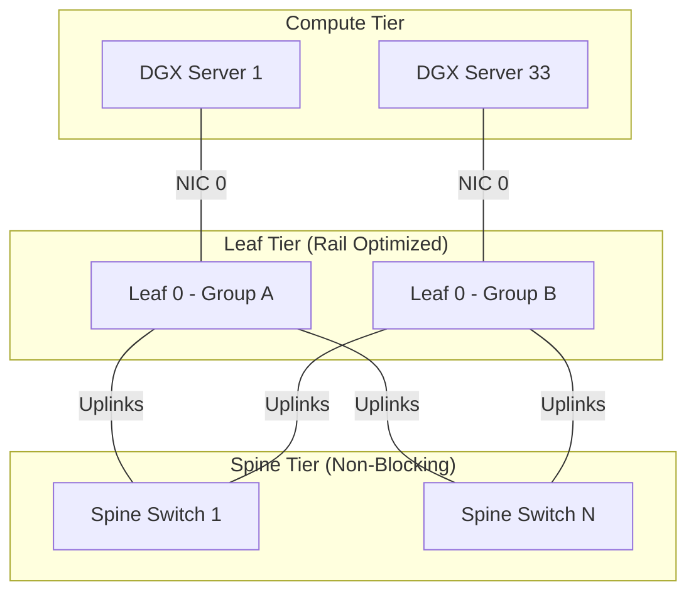

# Chapter 11 — Production Design Scenarios

| Chapter metadata | Value |
|---|---|
| Volume | 07 — GPU Networking and Data Paths |
| Difficulty | Expert |
| Estimated reading time | 30 minutes |
| Primary audience | DevOps, SRE, Platform, Cloud and Infrastructure Engineers |
| Core question | If you are given a blank check to build a 1,024-GPU cluster, how do you mathematically design the network? |

## Introduction

In this volume, we moved from the motherboard PCIe lanes, out through the ConnectX NICs, across the InfiniBand fiber, and into the NCCL libraries. 

Now, we must synthesize this knowledge. A Senior Infrastructure Architect is expected to design the physical topography of the data center. If you miscalculate the port counts, oversubscribe the spine switches, or improperly route the storage network, you will build a multi-million-dollar bottleneck.

This chapter presents real-world architectural scenarios that test your ability to apply the rules of GPU networking at scale.

---

## Scenario 1: The Non-Blocking Fat-Tree

**The Challenge:**
You are designing a cluster of 128 DGX H100 servers (1,024 GPUs total). The standard NVIDIA Quantum-2 NDR (400G) InfiniBand switch has exactly 64 ports. You cannot plug 1,024 GPUs into a 64-port switch. How do you design the network to ensure that GPU 1 can talk to GPU 1,000 at maximum speed without hitting a bottleneck?

**The Senior Architecture:**
You must design a **2-Tier Non-Blocking Fat-Tree (Clos Topology)**.

A DGX H100 has 8 Compute NICs. We will use the **Rail-Optimized** design.
1. We purchase 8 "Leaf" switches. 
2. NIC 0 from every server plugs into Leaf Switch 0. NIC 1 plugs into Leaf Switch 1, etc.
3. However, a 64-port Leaf switch can only hold 32 servers (because half the ports must be reserved to connect *up* to the next tier of switches). 

Because we have 128 servers, we need 4 separate "Leaf Groups" (each holding 32 servers). 
Now we have multiple islands. To connect them, we add a second tier of switches: the **Spine Switches**.
* The 32 "up" ports on every Leaf switch are cabled perfectly symmetrically into the Spine switches.

Because there is an equal number of 400G cables going *down* to the servers as there are going *up* to the spines, the network is **Non-Blocking (1:1 Oversubscription ratio)**. There is no physical bottleneck. 

---

## Scenario 2: The Multi-Tenant Bandwidth Trap

**The Challenge:**
Your company decides to split the new 1,024-GPU cluster into two logically separated clusters (512 GPUs each) for two different departments. To save money on networking gear, the networking team suggests applying a 2:1 Oversubscription ratio on the Spine switches. "Since there are two different departments running different jobs, they won't use the network at the exact same time."

**The Senior Architecture:**
You must strictly reject oversubscription in a dedicated AI cluster.

In traditional web hosting, a 2:1 or even 10:1 oversubscription ratio is perfectly fine because web traffic is bursty and random. AI training traffic is synchronous and massive. 

When a 512-GPU training job reaches the end of a forward pass, all 512 GPUs will execute an `AllReduce` operation at the exact same microsecond. They will instantly flood the network with 400G of traffic each. 
If the Leaf switch has 32 servers connected to it, but only 16 cables going up to the Spine (a 2:1 oversubscription), the traffic will violently slam into a physical wall at the Leaf switch. The switch will be forced to buffer the data, and ultimately drop packets. 

You must mandate a 1:1 non-blocking architecture, regardless of multi-tenancy, because a single distributed job can perfectly saturate the network on its own.

---

## Scenario 3: The Storage Subnet Collision

**The Challenge:**
To simplify the cluster, an engineer suggests routing the Parallel File System (Storage) traffic over the exact same InfiniBand switches used for the GPU Compute traffic. "InfiniBand is 400G, there is plenty of bandwidth for both."

**The Senior Architecture:**
You must enforce a physically separated **Multi-Plane Topology**.

While InfiniBand has enough *bandwidth* for both, it does not have the architecture to protect *latency*. 
During an `AllReduce` gradient synchronization, the GPUs are incredibly sensitive to latency jitter. If GPU 10 is delayed by 5 microseconds, all 1,000 GPUs stall for 5 microseconds. 

If you route Storage traffic on the Compute network, a massive storage event (like writing a 100GB model checkpoint to disk) will flood the InfiniBand switches. While InfiniBand's flow control prevents packets from dropping, the storage packets will physically fill the buffers inside the switch. When the tiny, highly-sensitive Compute packets arrive at the switch, they are forced to wait in line behind the massive storage packets. This introduces severe microsecond jitter. 

You must mandate a dedicated Storage Fabric (either separate InfiniBand switches or a dedicated 400G RoCEv2 Ethernet network) attached exclusively to the BlueField-3 DPUs, leaving the ConnectX-7 compute NICs completely free of storage noise.

---

## Interview Preparation

**Architecture:** What does "1:1 Oversubscription" (Non-blocking) mean in a Fat-Tree network topology? *(Hint: It means that for every gigabit of bandwidth connected "down" to the servers, there is exactly one gigabit of bandwidth connected "up" to the spine switches. This guarantees that all servers can talk to all other servers simultaneously without physically bottlenecking the switch).*

**Troubleshooting:** Why is it catastrophic to mix Storage traffic and GPU Compute traffic on the same physical InfiniBand switches during large-scale training? *(Hint: Storage traffic causes microbursts that fill the switch buffers. This introduces microsecond latency (jitter) to the Compute traffic. Because training is synchronous, jitter on one node delays the entire cluster).*
