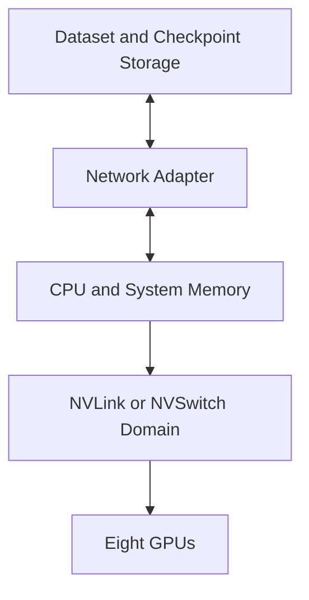
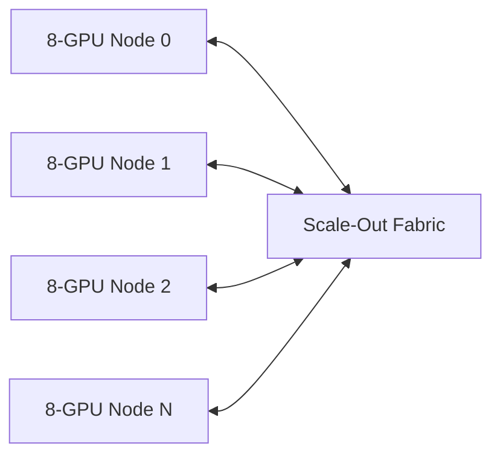
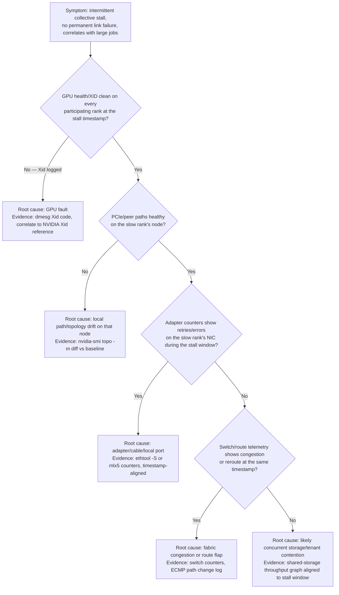

# Production Design Scenarios

## Introduction

Architecture becomes useful when it guides decisions under constraints. Customers rarely ask for “a topology.” They ask how to train a larger model, reduce inference latency, share expensive GPUs, expand an existing cluster, or recover from recurring communication failures.

This chapter applies the concepts from Volume 07 to production scenarios. The objective is not to declare one universal design. It is to show how workload behavior, locality, scale, reliability, operations, and cost lead to different answers.

| Chapter field | Value |
|---|---|
| Volume | 07 — GPU Networking |
| Difficulty | Architect |
| Estimated reading time | 60 minutes |
| Previous | Performance Bottlenecks and Benchmarking |
| Next | Volume 07 Summary |

## Learning Objectives

After completing this chapter, you will be able to:

- translate workload requirements into communication requirements;
- design scale-up and scale-out paths together;
- identify assumptions and acceptance criteria;
- compare alternative GPU, adapter, and fabric placements;
- include observability, upgrades, and failure recovery in the design;
- explain trade-offs to technical and business stakeholders;
- conduct a structured customer architecture workshop.

## Design Method

Every scenario follows the same sequence:

1. business objective;
2. workload communication profile;
3. existing constraints;
4. proposed topology;
5. alternatives;
6. failure domains;
7. operational model;
8. acceptance tests;
9. cost and growth path;
10. unresolved assumptions.


## Scenario 1 — Eight-GPU Single-Node Training

### Customer goal

Train models that fit within one eight-GPU system while maximizing iteration throughput and preserving a simple operating model.

### Communication profile

The job uses tensor or model parallelism and exchanges data frequently among all GPUs. Scale-up communication dominates; scale-out networking is secondary.

### Recommended architecture

- one validated eight-GPU topology;
- NVLink or NVSwitch connectivity where supported;
- CPU workers bound to local NUMA resources;
- local high-speed storage or a qualified shared-storage path;
- one or more network adapters placed for dataset and checkpoint traffic;
- topology-aware rank ordering;
- peer and collective baselines captured during commissioning.



### Trade-offs

A dense scale-up system simplifies model placement and can deliver strong local communication. It also creates a large single-node failure domain. Maintenance or hardware failure may interrupt the entire job.

### Acceptance criteria

- expected GPU topology;
- peer access across approved pairs;
- collective baseline across all eight GPUs;
- no PCIe down-training;
- checkpoint and restore validation;
- thermal stability under sustained load.

## Scenario 2 — Sixty-Four-GPU Distributed Training

### Customer goal

Scale from eight to sixty-four GPUs without allowing communication to dominate the training iteration.

### Workload profile

Data parallelism is combined with model parallelism. Local traffic should use scale-up links; gradient and shard communication cross nodes.

### Recommended architecture

- consistent eight-GPU node class;
- multiple adapters per node aligned with GPU groups;
- GPUDirect RDMA where qualified;
- non-blocking or intentionally oversubscribed fabric sized to the workload;
- stable rank and adapter mapping;
- collective benchmarks at 2, 4, and 8 nodes;
- storage traffic separated or accounted for;
- job diagnostics retained for failed runs.



### Alternative designs

A less expensive oversubscribed fabric may be appropriate when jobs do not occupy the full cluster or communication is a small share of runtime. The decision should follow measured communication volume and concurrency.

### Failure domains

- adapter or cable failure;
- leaf-switch failure;
- slow rank;
- route imbalance;
- node topology drift;
- collective-library regression;
- checkpoint-storage saturation.

### Acceptance criteria

The customer should approve scaling efficiency and variance targets based on a representative workload, not only point-to-point bandwidth.

**Evidence from the commissioning run — collective benchmark matrix at 2, 4, and 8 nodes (16, 32, 64 GPUs), `all_reduce_perf` at 8MB:**

```text
nodes   GPUs   busbw(GB/s)   ideal-linear busbw(GB/s)   scaling efficiency
2       16     9.02          9.02 (baseline)            100% (baseline)
4       32     8.71          9.02                        96.6%
8       64     8.05          9.02                        89.2%
```

`scaling efficiency` here is `busbw` at N nodes divided by the 2-node baseline `busbw`, since `busbw` is already corrected for GPU count and a perfectly scaling fabric would hold it flat. `89.2%` at 64 GPUs against the fixed adapter-per-GPU-group design in this scenario's Recommended Architecture is a healthy accepted result — the customer's acceptance criteria for this scenario would set a floor, for example "reject below 80% at the target node count," rather than expecting the abstractly perfect `100%` a spec-sheet extrapolation implies. A run that instead showed a sharp drop only at 8 nodes (say, to 60%) — not a gradual decline — would point at the "Pairwise fast, collective slow" pattern from Chapter 10's Bottleneck Classification table: rank map or oversubscription at that specific scale, not a gradual efficiency tax.

## Scenario 3 — Low-Latency Multi-GPU Inference

### Customer goal

Serve a model that spans several GPUs while meeting strict first-token and tail-latency objectives.

### Workload profile

Requests are smaller than training collectives, but synchronization occurs on every generation step. Latency and jitter matter more than peak bulk bandwidth.

### Recommended architecture

- model shards placed on a strong local GPU group;
- CPU tokenization and networking bound to local NUMA domains;
- ingress adapter close to the selected GPUs;
- minimal cross-socket traffic;
- admission control to protect latency;
- continuous telemetry for queueing, GPU utilization, and interconnect behavior;
- replicas spread across node failure domains.

### Trade-offs

Strict topology placement improves predictability but can strand resources. Multiple smaller replicas may provide better availability than one large replica, but only if the model fits and quality requirements allow it.

### Validation

Measure end-to-end latency percentiles, not just tokens per second. Include concurrent clients, realistic sequence lengths, and failure of one replica.

## Scenario 4 — Shared Research Cluster

### Customer goal

Serve many teams with mixed single-GPU, multi-GPU, training, and inference workloads.

### Challenges

- resource fragmentation;
- noisy neighbors;
- inconsistent performance expectations;
- tenant isolation;
- chargeback;
- competing storage and network traffic.

### Recommended architecture

Create workload classes:

| Class | Placement | Network policy | Service expectation |
|---|---|---|---|
| Critical distributed training | Strict topology groups | Reserved or protected capacity | Predictable scaling |
| Interactive inference | Local CPU/GPU/NIC affinity | Latency-oriented QoS | Tail-latency objective |
| Batch single-GPU | Flexible placement | Shared bandwidth | Best effort |
| Experimental multi-GPU | Preferred topology | Shared with limits | Variable performance |

Use quotas, topology-aware scheduling, observability by tenant, and documented fallback behavior.

### Trade-offs

Maximum utilization and maximum predictability are competing goals. The platform should expose service tiers rather than pretending every workload receives both.

## Scenario 5 — Storage-Heavy Scientific Training

### Customer goal

Train against large scientific datasets while minimizing GPU idle time and checkpoint disruption.

### Architecture

- shared parallel storage sized for aggregate demand;
- local NVMe staging for hot datasets;
- GDS for supported bulk transfers;
- data format optimized for large parallel reads;
- metadata and small-file pressure reduced through sharding;
- storage adapters aligned with GPU topology;
- checkpoint writes staggered or asynchronous where supported.

### Key principle

Storage, network, CPU processing, and GPU consumption must be designed as one pipeline. A direct path cannot compensate for poor metadata scale or serialized preprocessing.

## Scenario 6 — Phased Cluster Expansion

### Customer goal

Add new GPU generations and faster adapters without replacing the existing cluster immediately.

### Risks

Mixed generations create different GPU memory, link capabilities, adapter speeds, firmware, and performance profiles. A scheduler may place one distributed job across incompatible node classes.

### Recommended architecture

- separate node pools by qualified hardware class;
- explicit labels and placement constraints;
- independent baselines;
- avoid cross-generation distributed jobs unless validated;
- compatible fabric and routing design;
- staged migration plan;
- clear decommission criteria.

### Customer communication

Explain that physical compatibility is not performance equivalence. Mixed clusters can be valuable for different workload tiers, but homogeneous groups simplify distributed execution.

## Scenario 7 — Recurring Communication Failures

### Symptoms

- intermittent collective stalls;
- no permanent link failure;
- failures correlate with large jobs;
- retries increase on selected paths;
- rerunning on different nodes succeeds.

### Incident architecture



**Figure — incident triage as a decision path, not a checklist.** Collect all five evidence sources on the same timeline before triage, then walk the tree — the goal is to name the first layer whose evidence actually diverges at the stall timestamp, not the first layer tested. Do not begin by increasing timeouts or replacing random components.

**Worked evidence — the failure this scenario describes, timestamp-aligned:**

```text
$ dmesg -T | grep -i xid
(no output — GPU health clean, rules out the GPU branch)

$ nvidia-smi topo -m | diff - baseline_topo.txt
(no output — topology unchanged, rules out the local-path branch)

$ ethtool -S mlx5_2 | grep -E 'rx_discards|tx_pause|rx_pause'
rx_discards_phy: 184213    ← nonzero and climbing since baseline capture
tx_pause: 0
rx_pause: 91044
```

`rx_discards_phy` climbing on the adapter local to the slow rank, with `rx_pause` frames present, is direct evidence of receive-side congestion on that link — not a cable or firmware fault (which would typically show link-down or CRC-error counters instead). This is what "failures correlate with large jobs" looks like as raw evidence: the discard counter only climbs when a large collective saturates that link, and "rerunning on different nodes succeeds" because the replacement node's adapter isn't the one accumulating discards. The fix is capacity/placement (spread this rank's traffic across more adapters, or address oversubscription on that specific leaf) rather than a hardware swap, which a team that skipped straight to "replace the NIC" would have gotten wrong.

## Customer Workshop Questions

### Business

- What outcome is blocked today?
- What is the cost of slow or failed jobs?
- Which service objectives matter?

### Workload

- How many GPUs participate?
- Which parallelism strategies are used?
- What are message sizes and collective frequency?
- How much input and checkpoint data moves?
- Is latency or throughput primary?

### Platform

- What node topologies exist?
- Which adapters and fabrics are deployed?
- How are jobs scheduled?
- Which versions are qualified?
- What telemetry and baselines exist?

### Operations

- How are upgrades canaried?
- How are failed nodes quarantined?
- How is capacity reserved?
- Who owns cross-layer incidents?

## Architecture Decision Record Template

```text
Decision:
Business objective:
Workload assumptions:
Selected architecture:
Alternatives considered:
Performance expectations:
Failure domains:
Security implications:
Operational requirements:
Cost assumptions:
Validation plan:
Rollback plan:
Open questions:
```

## Interview Preparation

### Architecture Questions

1. Design a 256-GPU training fabric and explain oversubscription assumptions.
2. Design low-latency inference for a model spanning four GPUs.
3. Design a shared cluster with strict and best-effort service tiers.
4. Explain how you would phase in a new GPU generation.

### Scenario Questions

1. Training scales to two nodes but not eight. Structure the investigation.
2. A customer wants twice the ports for twice the performance. How do you respond?
3. Utilization is low despite healthy GPUs. Which upstream layers matter?
4. A topology policy strands capacity. How do you balance the trade-off?

### Customer Questions

1. Why should the customer buy a high-performance fabric?
2. When is Ethernet sufficient?
3. When is GPUDirect operational complexity justified?
4. How do you prove value before full rollout?

## Summary

Production GPU networking begins with workload communication, not product selection. Training, inference, shared clusters, storage-heavy pipelines, and phased expansions create different requirements.

A strong architecture documents assumptions, physical paths, failure domains, operational ownership, and acceptance tests. It also explains why alternatives were not selected.

## Key Takeaways

- Design starts with the workload and business objective.
- Scale-up and scale-out must be planned together.
- Topology, storage, and scheduling are part of networking.
- Service tiers make performance and utilization trade-offs explicit.
- Acceptance tests must include representative applications.
- Growth and upgrades belong in the initial architecture.

## Cross References

- Previous: [Performance Bottlenecks and Benchmarking](./chapter-10-performance-bottlenecks-and-benchmarking)
- Next: [Volume 07 Summary](./chapter-12-volume-07-summary)
- Related: [Topology-Aware Placement](./chapter-08-topology-aware-placement)
- Lab: [Troubleshoot a Multi-GPU Data Path](./labs/lab-04-troubleshoot-a-multi-gpu-data-path)

## Further Reading

Use official NVIDIA validated-design material, platform-vendor topology guides, collective and RDMA documentation, storage architecture references, and customer-specific workload traces when producing the final design.
