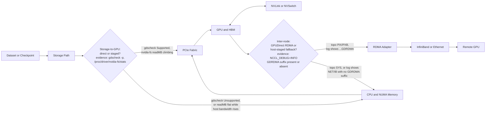
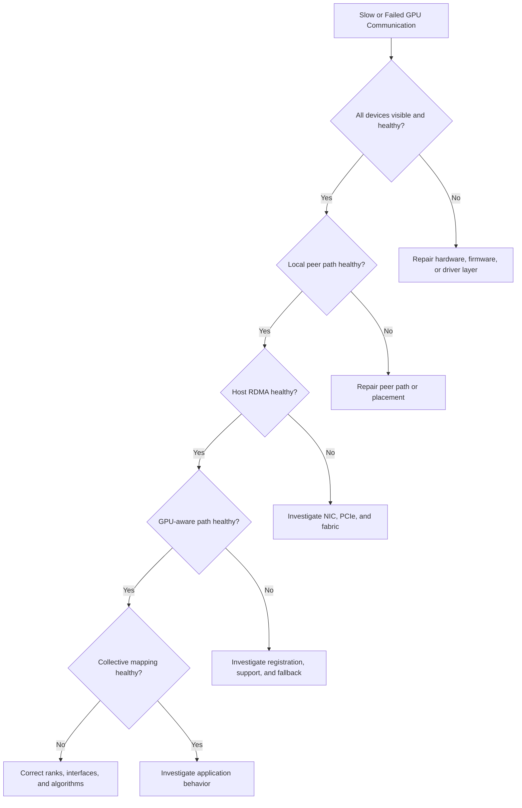

# Volume 07 Summary

## Introduction

GPU networking is the discipline of moving data efficiently and predictably between CPUs, GPUs, memory, storage, adapters, and remote nodes.

The central lesson of this volume is that a GPU cluster is not a collection of identical accelerators. It is a hierarchy of communication paths. The path selected by software determines whether a workload receives the bandwidth, latency, and reliability promised by the hardware design.

## The End-to-End Mental Model



**Figure 7.12.1 — GPU networking as an end-to-end system, with the two fallback points that actually cause silent degradation.** No single fast component compensates for a weak required segment. The two gates mark the exact places this volume showed a "working" path can quietly become a slower one while the job keeps running: storage falling back to a CPU bounce-buffer copy (Chapter 06), and inter-node transfer falling back to host-staged RDMA (Chapter 05). Both are diagnosed the same way — compare a direct-path counter or log line against a known-good baseline, not by watching for an error.

## What Each Chapter Established

| Chapter | Core lesson |
|---|---|
| Why GPU Networking Exists | Data movement becomes part of the algorithm once work spans devices |
| PCIe, NUMA, and Host Data Paths | CPU sockets, root complexes, switches, and locality shape host I/O |
| NVLink and NVSwitch | Scale-up fabrics reduce dependence on general-purpose host paths |
| DMA, RDMA, and Peer-to-Peer | Device engines move payloads, but protection and ordering still matter |
| GPUDirect RDMA | GPU memory can participate more directly in network transfers when the platform is qualified |
| GPUDirect Storage | Storage paths can reduce host-memory staging when end-to-end support exists |
| ConnectX and GPU Network Adapters | The adapter is a queueing, transport, telemetry, and offload endpoint—not merely a port |
| Topology-Aware Placement | Rank, CPU, GPU, NIC, and memory placement must reflect the physical machine |
| Multi-Node Collectives and NCCL Paths | Collective performance depends on algorithms mapped onto real topology |
| Performance Bottlenecks and Benchmarking | Measurement must progress from components to application behavior |
| Production Design Scenarios | Workload, reliability, cost, and operations determine the architecture |

## Architecture Principles Reinforced

### Follow the data

Start with the producer and consumer. Draw every boundary crossed by the tensor, gradient, model shard, dataset block, or checkpoint.

### Locality is not optional

A scheduler may satisfy a GPU count while selecting remote CPUs, weak peer pairs, or distant NICs. Functional allocation is not the same as efficient allocation.

### Direct does not mean automatic

GPUDirect and RDMA depend on supported devices, firmware, drivers, memory registration, topology, permissions, and application behavior.

### Synchronization exposes the slowest participant

Collectives amplify stragglers. One weak rank, congested link, or remote path can extend the step time of the entire job.

### Benchmark layers in order

A useful sequence is:

```text
Inventory
  → Local GPU peer test
  → Host RDMA test
  → GPU-aware RDMA test
  → Collective benchmark
  → Representative workload
```

Skipping layers makes root-cause isolation harder.

**What each layer actually looks like, in commands and output, on a healthy commissioning run:**

```bash
nvidia-smi topo -m
```

```text
        GPU0    GPU1    NIC0    NIC1    CPU Affinity
GPU0     X      NV18    PIX     SYS     0-31
GPU1    NV18     X      SYS     PIX     32-63
```

Inventory and local peer test in one table: `NV18` between GPU0 and GPU1 confirms an NVLink peer path is present and healthy; `PIX` versus `SYS` on the GPU-to-NIC columns identifies which adapter is locally reachable for each GPU. Read this table before running anything else — every later number in the sequence should be interpreted against the placement it shows.

```bash
ib_write_bw -d mlx5_0 -a <remote_host>
```

```text
BW average[MB/sec]: 24798.55
```

Host RDMA test: this isolates the fabric, cabling, and adapter from anything GPU-specific. It is the baseline that a later GPU-aware number gets compared against — not a vendor spec sheet.

```bash
ib_write_bw -d mlx5_0 -a --use_cuda=0 <remote_host>
```

```text
BW average[MB/sec]: 23488.02
```

GPU-aware RDMA test: `23488.02` sitting at roughly 95% of the `24798.55` host-memory baseline is the signature of a healthy direct path — GPUDirect RDMA is engaging, not falling back. A result near 40% of baseline (a pattern this volume returns to more than once) means the transfer is staging through host memory regardless of what the test's exit code reports.

```bash
NCCL_DEBUG=INFO NCCL_DEBUG_SUBSYS=INIT,NET python train.py
```

```text
node0:1234:1234 [0] NCCL INFO Channel 00/04 : 0[0] -> 2[0] via NET/IB/0/GDRDMA
```

Collective benchmark: the `GDRDMA` suffix on the inter-node channel is the one line that confirms NCCL actually selected the GPUDirect RDMA transport for that link, rather than a plain `NET/IB` line that would mean a silent fallback. This is the layer where topology, drivers, and the collective library's own transport selection all have to agree simultaneously — which is why it comes after, not before, the two layers above.

## Production Architecture Checklist

### Workload

- What data moves?
- How much moves per step or request?
- Which parallelism strategy is used?
- How frequently does global synchronization occur?
- Are transfers latency-sensitive, bandwidth-sensitive, or both?

### Node design

- Which GPUs share strong peer paths?
- Which NIC is local to each GPU group?
- Are PCIe links and switch uplinks sufficient?
- Are CPU and memory resources balanced across NUMA domains?
- Does storage share critical PCIe bandwidth?

### Scale-out fabric

- Is the transport InfiniBand or Ethernet with RoCE?
- What topology and oversubscription are acceptable?
- Which routing and congestion controls are required?
- How is failure isolated?
- Which counters and alerts prove health?

### Software

- Which driver, CUDA, NCCL, and adapter versions are qualified?
- How are ranks bound to CPUs, GPUs, and NICs?
- What fallback paths exist?
- How are upgrades canaried and rolled back?

### Operations

- Is every node topology inventoried?
- Are acceptance baselines stored?
- Can support bundles be generated quickly?
- Are link, queue, retry, and XID signals monitored?
- Are incident runbooks path-oriented?

## Troubleshooting Framework



**Figure 7.12.2 — Layered troubleshooting decision tree.** Stop at the first layer that diverges from the healthy baseline.

**Walking the tree on a real incident — "Host RDMA passes, GPU-aware path fails."** The `Inventory` and `Local` gates already passed (devices enumerate, NVLink peer test is healthy), so the tree says to check `Host`, then `GPUPath`:

```bash
ib_write_bw -d mlx5_0 -a <remote_host>                # Host gate
```

```text
BW average[MB/sec]: 24798.55
```

```bash
ib_write_bw -d mlx5_0 -a --use_cuda=0 <remote_host>   # GPUPath gate
```

```text
BW average[MB/sec]: 9762.44
```

`Host` passes clean at 24798.55 MB/sec. `GPUPath` comes back at 9762.44 MB/sec — roughly 39% of the host figure, not a modest degradation but the signature of a transfer staging through host memory instead of reading GPU memory directly. Per the tree, this stops the investigation at the `GPUPath` node and routes to "Investigate registration, support, and fallback" — not to the fabric or NIC, which the `Host` gate already cleared.

```bash
nvidia-smi topo -m | grep -E "GPU0.*NIC"
```

```text
GPU0     X      NV18    SYS     PIX
```

The mechanism: this GPU's traffic is bound to a NIC that shows `SYS` — crossing the CPU-to-CPU interconnect — while a `PIX`-local NIC sits unused one column over. The fix is a rank/adapter binding change, not a driver reinstall or a fabric ticket, and the tree's job was precisely to stop the team from investigating those first.

## Common Production Symptoms

| Symptom | Likely investigation boundary |
|---|---|
| One GPU pair is slower | Peer topology, link state, PCIe hierarchy |
| Host RDMA is slow | NIC, PCIe, MTU, route, congestion, switch counters |
| Host RDMA passes but NCCL is slow | GPU-to-NIC locality, registration, fallback, rank mapping |
| High CPU during “direct” transfer | Registration, polling, socket fallback, preprocessing |
| Scaling collapses after adding nodes | Collective algorithm, oversubscription, straggler, storage interference |
| Performance changes after reboot | Enumeration, affinity, firmware, link negotiation, route selection |
| Intermittent hang | Completion ordering, timeout, failed rank, congestion, resource exhaustion |

**Evidence for two rows above, from real command output used elsewhere in this volume:**

*"High CPU during 'direct' transfer"* — the tell is host-memory bandwidth rising during a stage that should not touch host memory at all. For storage, that means `/proc/driver/nvidia-fs/stats` `readMB` staying flat while `iostat` shows the device still delivering throughput — bytes are moving, but not through the GDS counter, meaning they went through a CPU bounce buffer instead. For network, it is `mpstat` `%usr` climbing during a collective phase that `NCCL_DEBUG=INFO` shows landing on a plain `NET/IB` line with no `GDRDMA` suffix. In both cases the job completes and reports no error — CPU utilization is the only signal.

*"Scaling collapses after adding nodes"* — distinguish a gradual tax from a cliff before touching hardware. A commissioning matrix from this volume's Chapter 11 showed:

```text
nodes   GPUs   busbw(GB/s)   scaling efficiency
2       16     9.02          100% (baseline)
4       32     8.71           96.6%
8       64     8.05           89.2%
```

89.2% at 64 GPUs is a gradual oversubscription tax — expected and often accepted against a stated floor. A run that instead dropped sharply only at one specific node count — say straight to 60% at 8 nodes with no comparable dip at 4 — points at a rank-mapping or topology problem specific to that scale, not a fabric capacity problem, and calls for the `nvidia-smi topo -m` diff shown above rather than a bandwidth upgrade.

## Customer Architecture Conversation

When a customer asks for “the fastest GPU network,” begin with discovery rather than products.

Ask:

1. What workload and model architecture are involved?
2. How many GPUs participate in one job?
3. Which parallelism modes are used?
4. What are the iteration-time or request-latency objectives?
5. How large are datasets and checkpoints?
6. What failure behavior is acceptable?
7. What networking skills and operational tools already exist?
8. What budget, power, cooling, and rack constraints apply?

Only then should the design compare scale-up and scale-out technologies.

## Architecture Trade-offs

| Decision | Benefit | Cost or risk |
|---|---|---|
| Stronger scale-up fabric | Better local communication flexibility | Higher platform cost and power |
| Strict topology placement | Better predictable performance | Lower scheduling flexibility |
| RDMA and direct memory paths | Less staging and CPU copying | Qualification and operational complexity |
| More NICs per node | More aggregate bandwidth and locality options | More ports, cabling, cost, and failure points |
| Non-oversubscribed fabric | Predictable large-job behavior | Higher switch and optics cost |
| Aggressive polling | Lower transport latency | Higher CPU consumption |

There is no universal winner. The correct design satisfies the workload under customer constraints.

## Interview Revision

### Knowledge

**Explain PCIe root complexes and NUMA locality.**
> "A PCIe root complex is where the CPU connects to the I/O hierarchy — it's the host entry point for every device attached to that socket. NUMA locality means device access isn't uniform: a device attached to socket 0's root complex is 'local' to CPU cores and memory on socket 0 (distance 10), but remote to socket 1 (distance ~21x that cost), which matters for every DMA transfer because the path between device and memory goes through the CPU that owns that memory controller."

**Distinguish NVLink, NVSwitch, DMA, RDMA, and GPUDirect.**
> "NVLink is a point-to-point high-bandwidth GPU-to-GPU link. NVSwitch creates a switched fabric from those links so every GPU-pair connection gets strong throughput instead of relying on a sparse graph of direct links. DMA lets any device move bytes after CPU setup, without CPU copying every byte. RDMA extends that across a network: a remote system can read or write registered memory without the CPU on the receiving end copying the bytes. GPUDirect is NVIDIA's family of extensions that let network and storage devices DMA directly to/from GPU memory instead of bouncing through host buffers. They're all separate concepts, even though they're often mentioned together."

**Explain memory registration and completion semantics.**
> "Before a device can DMA into a buffer, the OS and driver register that memory region — map it, pin it, mark it accessible. Completion means the device signals that the transfer finished and the data is safe to read. Without explicit completion semantics, software can't know whether the payload is actually in GPU memory yet or whether the DMA is still in flight. Ordering matters: a GPU kernel that runs before a RDMA write finishes will read stale data."

**Describe the role of ConnectX adapters.**
> "ConnectX adapters are network interface cards that do far more than move bits on the wire. They have built-in packet handling, queue structures (SQ/RQ/CQ), memory regions for RDMA, support for GPUDirect RDMA so they can talk directly to GPU memory, optional offloads like TSO or checksum handling, and extensive counters for telemetry. They're not just 'a NIC' — they're the device that makes RDMA and GPU-Direct RDMA possible and efficient."

**Explain NCCL rings and trees conceptually.**
> "A ring collective has each rank sending to one neighbor and receiving from another, so multiple hops are pipelined for large messages and everyone stays busy. A tree collective reduces communication steps by routing through a tree structure — logarithmic in the number of ranks — so it's faster for small messages that have high per-hop latency. NCCL picks the algorithm that fits the message size and topology. The key insight is that 'fast collective' and 'optimal algorithm' aren't synonyms — the right algorithm depends on what's actually slow in this topology at this message size."

### Architecture

**Design an eight-GPU node with GPU-to-NIC affinity.**
> "I'd start with `nvidia-smi topo -m` to identify which NICs are PIX (local) to which GPU groups. On a dual-socket 8-GPU node, I'd expect roughly 4 GPUs per socket, one NIC local to each socket. I'd pin data loaders and communication ranks so GPU0-3 use NIC0 and GPU4-7 use NIC1, avoiding cross-socket traffic for every collective. Then I'd validate the assignment with a pairwise test: confirm point-to-point RDMA performance is consistent within each GPU-NIC group, and degraded across groups."

**Design a multi-rack training fabric.**
> "I'd design intra-node communication over NVLink/NVSwitch (fast, high bandwidth), use hierarchical collectives so each node's gradient gets reduced locally first, then a single per-node aggregate crosses the fabric, reducing inter-node traffic volume. Fabric-wise, I'd use either 3:1 oversubscribed InfiniBand if latency is the requirement, or RoCE Ethernet with PFC/ECN if cost matters and the workload tolerates occasional tail latency. And I'd make sure NICs are pinned to GPU groups: not all 64 GPUs going through 2 shared adapters — that's a bottleneck waiting to happen."

**Explain how storage traffic should be isolated or scheduled.**
> "Storage I/O can dominate host memory bandwidth and CPU cache if it's not managed. In a shared cluster, I'd separate storage-heavy jobs to their own node pool or use QoS limits so they don't starve compute-focused jobs. Alternatively, tier data: keep hot training samples in memory or a fast local cache, and only use the high-performance storage path for bulk offline reads (checkpoints, rare data reloads), not constant in-epoch access."

**Define a topology-aware scheduler policy.**
> "The scheduler should preserve GPU groups that share strong NVLink/NVSwitch connectivity — force jobs to use 4 or 8 GPUs from the same NVSwitch mesh, not arbitrary scattered GPUs. Label nodes by their strong-group granule, then use affinity and anti-affinity rules in the scheduler to ensure ranks are mapped to CPUs and NICs in the same NUMA node as their assigned GPU. And have explicit 'reserve group' vs 'fragment' policies: either keep a group intact or say it's unavailable, rather than letting the scheduler quietly fragment it and the job discover later that performance is terrible."

**Define acceptance tests for a new GPU node.**
> "Acceptance should validate topology (topo matrix stable against baseline), PCIe link negotiation (all devices at expected generation and width), peer access (all GPU pairs read OK in the p2p matrices), collective throughput (nccl-tests at typical message sizes shows expected busbw), storage path (GDS supported and reading at expected throughput), and network path (ib_write_bw or perftest achieves expected RDMA bandwidth). I'd run that battery on every new node before it enters production, and store the baseline; any regression or deviation from later runs gets flagged."

### Troubleshooting

**Host RDMA passes, but GPU collectives fail.**
> "The point-to-point host-memory RDMA path and the GPU-to-GPU path are different — GPU-capable RDMA (GPUDirect RDMA) requires peer-memory support (nv_peer_mem kernel module or similar) and IOMMU pass-through configuration. Check whether the GPU-aware collective test produces NCCL_DEBUG=INFO output with 'NET/Socket' (host-staged fallback) instead of 'NET/IB' with 'GDRDMA' suffix. If it fell back, either the peer-memory module isn't loaded or IOMMU configuration changed. Host RDMA passing is necessary but not sufficient for GPU collectives."

**One rank is consistently slower.**
> "Check that rank's GPU-to-NIC topology (`nvidia-smi topo -m` for that specific rank's GPU), whether it's using a `SYS` (remote) path instead of `PIX` (local), and whether the rank's CPU affinity matches its GPU's NUMA node. Run an isolated pairwise test on that rank's GPU/NIC pair specifically — if the bandwidth is low compared to others, that's evidence. If pairwise bandwidth is high but collective stalls, the issue is synchronization (the rank is finishing late because the whole collective waits), not the rank's own path."

**Performance changed after a firmware update.**
> "Firmware updates can change PCIe link training, IOMMU policy, BIOS settings, or NVLink firmware on the GPU side. Compare `lspci -vv` LnkSta before/after (check for width/speed downgrade), run `nvidia-smi topo -m` and diff it (check for topology drift), and run the baseline collective benchmark again and compare busbw. If all those match and performance is still different, capture NCCL_DEBUG=INFO output and check for transport changes — firmware updates can trigger fallback to less-optimal transport even when both the old and new paths are 'supported'."

**GPU utilization falls during checkpointing.**
> "Checkpointing serializes the job if it's a blocking write to shared storage. GPUs go idle waiting for the checkpoint to complete. Solutions: make checkpointing async or overlapped (issue the write, keep training on different data), use local NVMe with GDS for fast checkpoints and full-sync only at epoch boundaries, or dedicate a background worker to handle checkpoints so training doesn't stall. Measuring the checkpoint time relative to an epoch helps decide: if checkpoint is 10% of epoch, async is enough; if it's 50%, structural change is needed."

**NCCL selects an unexpected interface.**
> "NCCL discovers topology and picks transports via environment hints and capability detection. If it's not picking the interface you expect, set `NCCL_DEBUG=INFO` to see which interface it actually chose and why. If it shows 'Socket' instead of 'IB', the GPU-Direct RDMA path isn't available — check `lsmod` for nv_peer_mem, check `gdscheck -p` if using GPUDirect Storage, and run a peer-access test. If NCCL is picking the right transport but the wrong *adapter*, check `nvidia-smi topo -m` for which adapter is actually local to the GPU, and set `NCCL_IB_HCA` or `NCCL_SOCKET_IFNAME` to force the right one."

## Quick Revision Sheet

| Concept | One-line explanation |
|---|---|
| PCIe | General-purpose host I/O hierarchy |
| NUMA | Non-uniform CPU, memory, and device locality |
| NVLink | High-bandwidth point-to-point GPU interconnect |
| NVSwitch | Switch fabric connecting several GPUs |
| DMA | Device moves payload after CPU setup |
| RDMA | Direct memory operation across a network |
| GPUDirect RDMA | Supported GPU-memory participation in RDMA paths |
| GPUDirect Storage | Supported storage-to-GPU path with reduced host staging |
| ConnectX | Network adapter providing transport, queues, offloads, and telemetry |
| NCCL | Collective library selecting algorithms and transports from topology |

## Lab Completion Checklist

Before leaving Volume 07, you should be able to:

- inspect PCIe, NUMA, GPU, NIC, and storage topology;
- map stable GPU UUIDs to PCI addresses;
- validate peer access and NVLink behavior;
- distinguish host-memory and GPU-memory RDMA tests;
- benchmark several message sizes and directions;
- interpret adapter and fabric counters;
- identify rank, CPU, GPU, and NIC affinity;
- diagnose a fallback or remote path;
- restore a healthy baseline after failure injection;
- explain the architecture to a customer.

## Final Summary

GPU networking is not a single product. It connects compute, memory, I/O, storage, transport, and distributed software.

The most durable operational habit is to follow the data. Draw the expected path, prove each layer, compare it with a known baseline, and only then change the architecture.

## Final Takeaways

- Data movement is part of the AI algorithm.
- Topology determines path quality.
- Direct-memory technologies shorten paths but add qualification requirements.
- Collectives expose the slowest rank and weakest segment.
- Benchmarking must progress from components to applications.
- Production design includes monitoring, upgrades, rollback, and customer constraints.
- The right question is not “Which technology is fastest?” but “Which architecture satisfies this workload under these constraints?”

## Cross References

- [Volume 07 Introduction](./index)
- [Chapter 01 — Why GPU Networking Exists](./chapter-01-why-gpu-networking-exists)
- [Chapter 10 — Performance Bottlenecks and Benchmarking](./chapter-10-performance-bottlenecks-and-benchmarking)
- [Chapter 11 — Production Design Scenarios](./chapter-11-production-design-scenarios)
- [Lab 04 — Troubleshoot a Multi-GPU Data Path](./labs/lab-04-troubleshoot-a-multi-gpu-data-path)

## Further Reading

Continue with the next roadmap volume for a detailed treatment of InfiniBand architecture, verbs, subnet management, routing, congestion control, telemetry, and operations.
