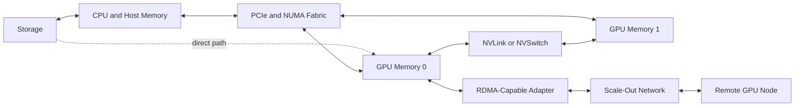
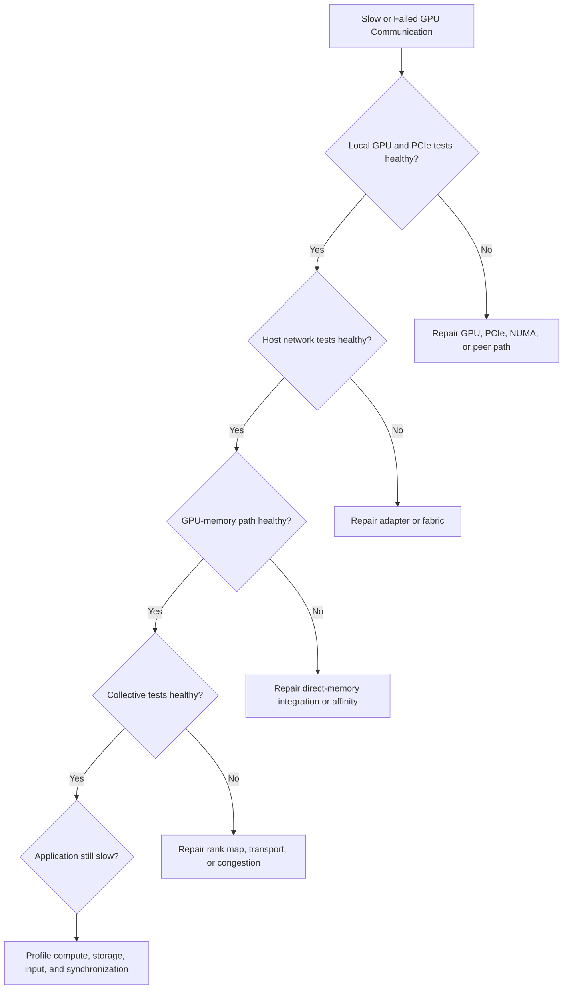

# Volume 07 Summary

## Introduction

GPU networking is the study of how data moves through an accelerated system. The subject includes far more than the cable between two servers. It includes GPU memory, host memory, PCI Express, NUMA domains, NVLink, NVSwitch, DMA, RDMA, GPUDirect, network adapters, storage paths, collectives, process placement, and synchronization.

The central lesson of this volume is simple:

> A GPU cluster is a hierarchy of data paths, and application performance is constrained by the paths the workload actually uses.

| Volume field | Value |
|---|---|
| Volume | 07 — GPU Networking |
| Difficulty | Advanced |
| Primary outcome | Diagnose and design topology-aware GPU communication paths |
| Next volume | Volume 08 — InfiniBand |

## The Complete Architecture

**Figure 7.12.1 — GPU networking spans storage, host, scale-up, and scale-out domains.** Every boundary introduces constraints, observability requirements, and failure modes.

## The Architectural Story

### Why GPU networking exists

One GPU can compute against local memory. Multi-GPU and multi-node workloads must exchange model state, activations, gradients, inference shards, datasets, and checkpoints. Communication therefore becomes part of the algorithm.

### Why topology matters

Two identical devices can communicate through different paths. Logical indices do not describe PCIe switches, root complexes, NUMA domains, NVLink neighborhoods, adapter affinity, or storage locality.

### Why direct paths exist

Host staging is flexible but can add copies, CPU overhead, and synchronization. GPUDirect technologies shorten selected paths between GPU memory, adapters, and storage. They do not remove control-plane software, compatibility requirements, topology, or security boundaries.

### Why collectives matter

Distributed frameworks express communication through collectives. Ring, tree, and hierarchical algorithms map workload communication onto local and remote links. One slow rank can delay every participant.

### Why benchmarking must be layered

A point-to-point network result cannot prove collective or application performance. Validation must progress from local paths to host networking, GPU-memory transport, collectives, and the real workload.

## Chapter-by-Chapter Revision

### Chapter 01 — Why GPU Networking Exists

- Compute and communication must be designed together.
- Scale-up and scale-out solve different boundaries.
- Healthy components do not prove a healthy end-to-end path.

### Chapter 02 — PCIe, NUMA, and Host Data Paths

- PCIe is the general I/O backbone.
- Root complexes, switches, link width, and NUMA locality affect delivered performance.
- Remote memory and remote adapter access can create hidden penalties.

### Chapter 03 — NVLink and NVSwitch

- Specialized GPU interconnects reduce dependence on host paths.
- Direct links and switched fabrics provide different connectivity models.
- Strong local fabrics improve communication-heavy workloads but add cost, power, and operational complexity.

### Chapter 04 — DMA, RDMA, and Peer-to-Peer

- DMA moves data without CPU copying each byte.
- RDMA extends queue-based direct memory access across nodes.
- Peer access enables direct addressing but does not guarantee equal path quality.

### Chapter 05 — GPUDirect RDMA

- The adapter can read or write registered GPU memory directly.
- Memory registration, synchronization, drivers, topology, and transport remain essential.
- Host RDMA success does not prove a GPU-memory path.

### Chapter 06 — GPUDirect Storage

- Eligible storage I/O can target GPU memory more directly.
- Data format, preprocessing, metadata behavior, and storage scale still determine pipeline performance.
- Microbenchmarks prove capability; application traces prove value.

### Chapter 07 — ConnectX and GPU Network Adapters

- An adapter is a DMA, queue, transport, telemetry, and firmware system.
- Line rate differs from delivered payload bandwidth.
- Multiple ports create value only when software and topology use them effectively.

### Chapter 08 — Topology-Aware Placement

- Allocation chooses capacity; placement chooses data paths.
- CPU, memory, GPU, adapter, and storage affinity must follow the communication graph.
- Strict locality improves predictability but can reduce utilization.

### Chapter 09 — Multi-Node Collectives and NCCL Paths

- Collectives combine local and remote communication.
- Algorithms, rank ordering, channels, transport selection, and stragglers affect scaling.
- Point-to-point success does not prove collective health.

### Chapter 10 — Performance Bottlenecks and Benchmarking

- Benchmarks must answer defined questions.
- Use a pyramid from local capability to application outcome.
- Record message sizes, topology, versions, repetitions, and counter evidence.

### Chapter 11 — Production Design Scenarios

- Product selection follows workload and constraints.
- Training, inference, shared clusters, storage-heavy pipelines, and phased growth require different designs.
- Operations, failure domains, and acceptance tests are part of architecture.

## Core Comparison Table

| Technology or concept | Problem solved | What it does not solve |
|---|---|---|
| PCIe | General host I/O connectivity | Equal locality or unlimited aggregate bandwidth |
| NUMA awareness | Aligns CPU and memory placement | GPU peer connectivity |
| NVLink | High-bandwidth GPU peer path | Inter-node scale-out by itself |
| NVSwitch | Flexible local GPU fabric | External network congestion |
| DMA | Device-managed data transfer | End-to-end transport semantics |
| RDMA | Queue-based remote memory transfer | Poor topology or application imbalance |
| GPUDirect RDMA | Reduces host staging for GPU networking | Fabric loss, congestion, or bad rank placement |
| GPUDirect Storage | Reduces host staging for storage I/O | Slow metadata, preprocessing, or inadequate storage |
| Topology-aware scheduling | Aligns workload with physical paths | Hardware faults or insufficient capacity |
| NCCL | Orchestrates GPU collectives | A weak or inconsistent physical architecture |

## Production Architecture Checklist

### Workload

- What data moves?
- How much data moves per iteration or request?
- Which ranks communicate most frequently?
- Is the workload latency-sensitive or bandwidth-sensitive?
- How much synchronization exists?

### Node topology

- Are GPU UUIDs and PCI addresses recorded?
- Which GPUs share NVLink, NVSwitch, PCIe switches, or root complexes?
- Which CPU and memory domain is local?
- Which adapter is closest to each GPU group?
- Which storage devices or paths are local?

### Network

- Are link rates and PCIe widths correct?
- Are routing and oversubscription understood?
- Are congestion and retry counters monitored?
- Are multiple ports actually used?
- Are fallback transports visible?

### Operations

- Is there a qualified firmware and driver matrix?
- Are canary and rollback procedures documented?
- Are commissioning and production baselines retained?
- Can operators collect synchronized cross-layer evidence?
- Are failed nodes quarantined automatically or procedurally?

## Troubleshooting Decision Tree

**Figure 7.12.2 — Troubleshoot from the lowest proven layer upward.** Avoid changing several layers simultaneously.

## Healthy versus Broken Evidence

| Layer | Healthy evidence | Broken evidence |
|---|---|---|
| GPU | Stable health and expected clocks | XID, reset, throttling, missing device |
| PCIe | Expected width, speed, topology | Down-trained link, errors, remote path |
| Peer fabric | Expected links and peer bandwidth | Missing link, degraded pair, fallback |
| Adapter | Balanced utilization and stable counters | Errors, retries, one-sided traffic |
| Fabric | Stable latency and routing | Congestion, drops, path imbalance |
| Collective | Consistent scaling and transport | Hangs, large variance, fallback |
| Application | Improved throughput or latency | GPUs waiting on communication or input |

## Customer Conversation Framework

When a customer asks for faster networking, ask:

1. What business outcome is constrained?
2. Which workload phase is slow?
3. What is the communication pattern?
4. Which physical path is used today?
5. What evidence identifies bandwidth, latency, contention, or synchronization as the bottleneck?
6. Which alternative designs were considered?
7. What operational complexity is acceptable?
8. How will success be measured?

The architect’s job is to explain why a design is appropriate, not merely list technologies.

## Interview Master Review

### Knowledge Questions

1. Why does multi-GPU scaling become a networking problem?
2. Compare PCIe, NVLink, and NVSwitch.
3. Compare DMA, RDMA, and GPUDirect RDMA.
4. What is GPU-to-NIC affinity?
5. Why does NUMA matter?
6. What is a collective operation?
7. Why can one rank slow the whole job?
8. Why is line rate not application bandwidth?

### Architecture Questions

1. Design an eight-GPU node with four adapters.
2. Design a sixty-four-GPU training cluster.
3. Design low-latency multi-GPU inference.
4. Design a shared cluster with multiple service tiers.
5. Design a benchmark and acceptance plan.

### Troubleshooting Questions

1. Host RDMA is healthy but GPU RDMA is slow.
2. AllReduce scales to two nodes but not eight.
3. Performance changes by GPU index.
4. An upgrade triggers host-staged fallback.
5. A large job fails while small tests pass.

### Whiteboard Exercise

Draw the complete path from a shared storage system to a remote GPU. Include storage, network adapter, PCIe, CPU and memory domains, local GPU fabric, scale-out fabric, and the remote node. Mark where copies, registrations, queues, synchronization, congestion, and failures can occur.

## Lab Readiness Checklist

Before leaving Volume 07, you should be able to:

- inspect PCIe, NUMA, and GPU topology;
- validate peer access and local interconnects;
- distinguish host and GPU-memory RDMA tests;
- benchmark multiple message sizes;
- interpret adapter and fabric counters;
- identify rank and adapter affinity;
- diagnose a fallback path;
- create a production evidence bundle;
- explain the design to a customer.

## Final Summary

GPU networking is not a single product. It is an architectural discipline that connects compute, memory, I/O, storage, and distributed software.

The most important operational habit is to follow the data. Draw the expected path, prove each layer, compare against a known baseline, and only then change the architecture. This method remains useful as GPU generations, adapter speeds, and software stacks evolve.

## Final Takeaways

- Data movement is part of the AI algorithm.
- Topology determines path quality.
- Direct-memory technologies shorten paths but add qualification requirements.
- Collectives expose the slowest rank and weakest segment.
- Benchmarking must progress from components to applications.
- Production design includes monitoring, upgrades, rollback, and customer constraints.
- The correct question is not “Which technology is fastest?” but “Which architecture satisfies this workload under these constraints?”

## Cross References

- [Volume 07 Introduction](./index)
- [Chapter 01 — Why GPU Networking Exists](./chapter-01-why-gpu-networking-exists)
- [Chapter 10 — Performance Bottlenecks and Benchmarking](./chapter-10-performance-bottlenecks-and-benchmarking)
- [Chapter 11 — Production Design Scenarios](./chapter-11-production-design-scenarios)
- Next volume: [Volume 08 — InfiniBand](../volume-08/index)

## Further Reading

Continue with Volume 08 for the architecture, verbs model, subnet management, routing, congestion control, telemetry, and troubleshooting of InfiniBand fabrics used in large AI clusters.
