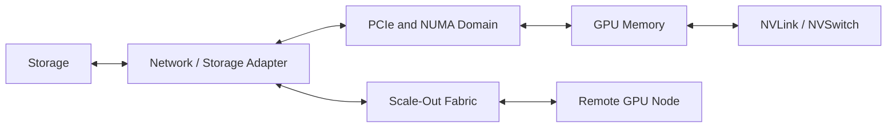
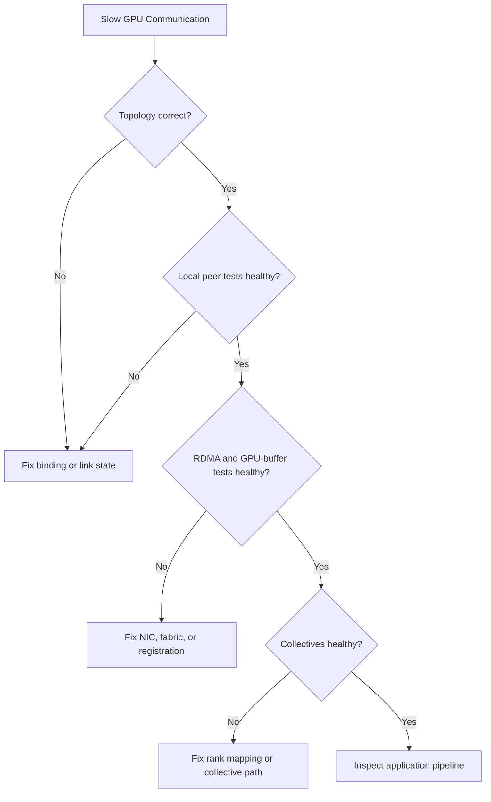

# Volume 07 Summary

GPU networking is the study of how tensors and files move among CPU memory, GPU memory, storage, network adapters, peer GPUs, and remote nodes. The central lesson is that performance belongs to the complete path.

## Architecture Summary

| Layer | Primary question |
|---|---|
| PCIe and NUMA | Are devices, CPUs, and memory local? |
| NVLink/NVSwitch | Is peer communication using the scale-up fabric? |
| DMA/RDMA | Which staging copies are removed? |
| GPUDirect RDMA | Can the NIC access GPU buffers through a supported path? |
| GPUDirect Storage | Can storage feed GPU memory efficiently? |
| NCCL | Are collectives mapped to the intended topology and transport? |
| Scheduler | Does placement preserve locality and avoid contention? |
| Operations | Can degraded paths be detected and recovered? |

## Design Principles

1. Start with the workload communication graph.
2. Discover the real topology rather than inferring it from device count.
3. Separate scale-up, scale-out, storage, service, and management traffic.
4. Benchmark from components upward.
5. Preserve version and topology context with results.
6. Treat firmware, drivers, libraries, and switch configuration as one compatibility system.
7. Design degraded modes before production.

## Quick Revision Sheet

- PCIe is a general I/O fabric; NUMA changes access cost.
- NVLink provides high-bandwidth peer links; NVSwitch creates a switched scale-up domain.
- DMA removes CPU copying; RDMA extends direct access over a network.
- GPUDirect RDMA and Storage remove selected host-staging boundaries.
- ConnectX adapters are active DMA and transport engines.
- NCCL maps collectives across available local and remote paths.
- The slowest rank or shared uplink can determine job completion time.

## Troubleshooting Flow

## Interview Notes

Senior-level answers should connect topology, workload behavior, performance, operations, and cost. Avoid statements such as “InfiniBand is always faster” or “GPUDirect removes the CPU.” Explain assumptions, supported paths, failure modes, and evidence.

## Lab Checklist

- Inspect PCIe and NUMA topology.
- Validate peer access and NVLink.
- Benchmark host and GPU RDMA paths.
- Diagnose an intentionally degraded multi-GPU path.

## Next Volume

[Volume 08 — InfiniBand](../volume-08/index) moves from endpoint data paths into the fabric itself: verbs, queue pairs, subnet management, routing, congestion, monitoring, and production operations.
