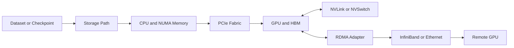
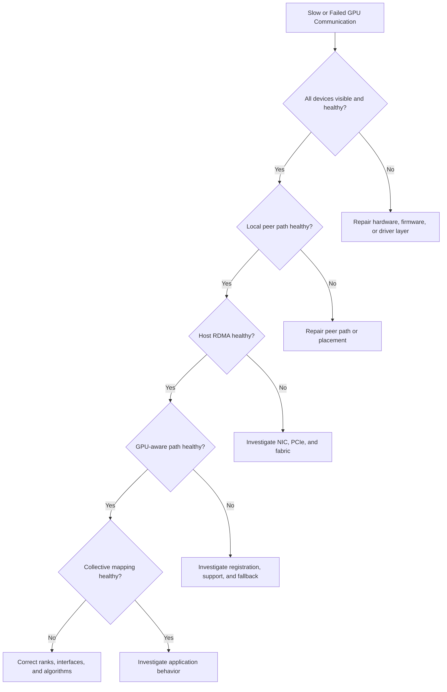

# Volume 07 Summary

## Introduction

GPU networking is the discipline of moving data efficiently and predictably between CPUs, GPUs, memory, storage, adapters, and remote nodes.

The central lesson of this volume is that a GPU cluster is not a collection of identical accelerators. It is a hierarchy of communication paths. The path selected by software determines whether a workload receives the bandwidth, latency, and reliability promised by the hardware design.

## The End-to-End Mental Model



**Figure 7.12.1 — GPU networking as an end-to-end system.** No single fast component compensates for a weak required segment.

## What Each Chapter Established

| Chapter | Core lesson |
|---|---|
| Why GPU Networking Exists | Data movement becomes part of the algorithm once work spans devices |
| PCIe, NUMA, and Host Data Paths | CPU sockets, root complexes, switches, and locality shape host I/O |
| NVLink and NVSwitch | Scale-up fabrics reduce dependence on general-purpose host paths |
| DMA, RDMA, and Peer-to-Peer | Device engines move payloads, but protection and ordering still matter |
| GPUDirect RDMA | GPU memory can participate more directly in network transfers when the platform is qualified |
| GPUDirect Storage | Storage paths can reduce host-memory staging when end-to-end support exists |
| ConnectX and GPU Network Adapters | The adapter is a queueing, transport, telemetry, and offload endpoint—not merely a port |
| Topology-Aware Placement | Rank, CPU, GPU, NIC, and memory placement must reflect the physical machine |
| Multi-Node Collectives and NCCL Paths | Collective performance depends on algorithms mapped onto real topology |
| Performance Bottlenecks and Benchmarking | Measurement must progress from components to application behavior |
| Production Design Scenarios | Workload, reliability, cost, and operations determine the architecture |

## Architecture Principles Reinforced

### Follow the data

Start with the producer and consumer. Draw every boundary crossed by the tensor, gradient, model shard, dataset block, or checkpoint.

### Locality is not optional

A scheduler may satisfy a GPU count while selecting remote CPUs, weak peer pairs, or distant NICs. Functional allocation is not the same as efficient allocation.

### Direct does not mean automatic

GPUDirect and RDMA depend on supported devices, firmware, drivers, memory registration, topology, permissions, and application behavior.

### Synchronization exposes the slowest participant

Collectives amplify stragglers. One weak rank, congested link, or remote path can extend the step time of the entire job.

### Benchmark layers in order

A useful sequence is:

```text
Inventory
  → Local GPU peer test
  → Host RDMA test
  → GPU-aware RDMA test
  → Collective benchmark
  → Representative workload
```

Skipping layers makes root-cause isolation harder.

## Production Architecture Checklist

### Workload

- What data moves?
- How much moves per step or request?
- Which parallelism strategy is used?
- How frequently does global synchronization occur?
- Are transfers latency-sensitive, bandwidth-sensitive, or both?

### Node design

- Which GPUs share strong peer paths?
- Which NIC is local to each GPU group?
- Are PCIe links and switch uplinks sufficient?
- Are CPU and memory resources balanced across NUMA domains?
- Does storage share critical PCIe bandwidth?

### Scale-out fabric

- Is the transport InfiniBand or Ethernet with RoCE?
- What topology and oversubscription are acceptable?
- Which routing and congestion controls are required?
- How is failure isolated?
- Which counters and alerts prove health?

### Software

- Which driver, CUDA, NCCL, and adapter versions are qualified?
- How are ranks bound to CPUs, GPUs, and NICs?
- What fallback paths exist?
- How are upgrades canaried and rolled back?

### Operations

- Is every node topology inventoried?
- Are acceptance baselines stored?
- Can support bundles be generated quickly?
- Are link, queue, retry, and XID signals monitored?
- Are incident runbooks path-oriented?

## Troubleshooting Framework



**Figure 7.12.2 — Layered troubleshooting decision tree.** Stop at the first layer that diverges from the healthy baseline.

## Common Production Symptoms

| Symptom | Likely investigation boundary |
|---|---|
| One GPU pair is slower | Peer topology, link state, PCIe hierarchy |
| Host RDMA is slow | NIC, PCIe, MTU, route, congestion, switch counters |
| Host RDMA passes but NCCL is slow | GPU-to-NIC locality, registration, fallback, rank mapping |
| High CPU during “direct” transfer | Registration, polling, socket fallback, preprocessing |
| Scaling collapses after adding nodes | Collective algorithm, oversubscription, straggler, storage interference |
| Performance changes after reboot | Enumeration, affinity, firmware, link negotiation, route selection |
| Intermittent hang | Completion ordering, timeout, failed rank, congestion, resource exhaustion |

## Customer Architecture Conversation

When a customer asks for “the fastest GPU network,” begin with discovery rather than products.

Ask:

1. What workload and model architecture are involved?
2. How many GPUs participate in one job?
3. Which parallelism modes are used?
4. What are the iteration-time or request-latency objectives?
5. How large are datasets and checkpoints?
6. What failure behavior is acceptable?
7. What networking skills and operational tools already exist?
8. What budget, power, cooling, and rack constraints apply?

Only then should the design compare scale-up and scale-out technologies.

## Architecture Trade-offs

| Decision | Benefit | Cost or risk |
|---|---|---|
| Stronger scale-up fabric | Better local communication flexibility | Higher platform cost and power |
| Strict topology placement | Better predictable performance | Lower scheduling flexibility |
| RDMA and direct memory paths | Less staging and CPU copying | Qualification and operational complexity |
| More NICs per node | More aggregate bandwidth and locality options | More ports, cabling, cost, and failure points |
| Non-oversubscribed fabric | Predictable large-job behavior | Higher switch and optics cost |
| Aggressive polling | Lower transport latency | Higher CPU consumption |

There is no universal winner. The correct design satisfies the workload under customer constraints.

## Interview Revision

### Knowledge

- Explain PCIe root complexes and NUMA locality.
- Distinguish NVLink, NVSwitch, DMA, RDMA, and GPUDirect.
- Explain memory registration and completion semantics.
- Describe the role of ConnectX adapters.
- Explain NCCL rings and trees conceptually.

### Architecture

- Design an eight-GPU node with GPU-to-NIC affinity.
- Design a multi-rack training fabric.
- Explain how storage traffic should be isolated or scheduled.
- Define a topology-aware scheduler policy.
- Define acceptance tests for a new GPU node.

### Troubleshooting

- Host RDMA passes, but GPU collectives fail.
- One rank is consistently slower.
- Performance changed after a firmware update.
- GPU utilization falls during checkpointing.
- NCCL selects an unexpected interface.

## Quick Revision Sheet

| Concept | One-line explanation |
|---|---|
| PCIe | General-purpose host I/O hierarchy |
| NUMA | Non-uniform CPU, memory, and device locality |
| NVLink | High-bandwidth point-to-point GPU interconnect |
| NVSwitch | Switch fabric connecting several GPUs |
| DMA | Device moves payload after CPU setup |
| RDMA | Direct memory operation across a network |
| GPUDirect RDMA | Supported GPU-memory participation in RDMA paths |
| GPUDirect Storage | Supported storage-to-GPU path with reduced host staging |
| ConnectX | Network adapter providing transport, queues, offloads, and telemetry |
| NCCL | Collective library selecting algorithms and transports from topology |

## Lab Completion Checklist

Before leaving Volume 07, you should be able to:

- inspect PCIe, NUMA, GPU, NIC, and storage topology;
- map stable GPU UUIDs to PCI addresses;
- validate peer access and NVLink behavior;
- distinguish host-memory and GPU-memory RDMA tests;
- benchmark several message sizes and directions;
- interpret adapter and fabric counters;
- identify rank, CPU, GPU, and NIC affinity;
- diagnose a fallback or remote path;
- restore a healthy baseline after failure injection;
- explain the architecture to a customer.

## Final Summary

GPU networking is not a single product. It connects compute, memory, I/O, storage, transport, and distributed software.

The most durable operational habit is to follow the data. Draw the expected path, prove each layer, compare it with a known baseline, and only then change the architecture.

## Final Takeaways

- Data movement is part of the AI algorithm.
- Topology determines path quality.
- Direct-memory technologies shorten paths but add qualification requirements.
- Collectives expose the slowest rank and weakest segment.
- Benchmarking must progress from components to applications.
- Production design includes monitoring, upgrades, rollback, and customer constraints.
- The right question is not “Which technology is fastest?” but “Which architecture satisfies this workload under these constraints?”

## Cross References

- [Volume 07 Introduction](./index)
- [Chapter 01 — Why GPU Networking Exists](./chapter-01-why-gpu-networking-exists)
- [Chapter 10 — Performance Bottlenecks and Benchmarking](./chapter-10-performance-bottlenecks-and-benchmarking)
- [Chapter 11 — Production Design Scenarios](./chapter-11-production-design-scenarios)
- [Lab 04 — Troubleshoot a Multi-GPU Data Path](./labs/lab-04-troubleshoot-a-multi-gpu-data-path)

## Further Reading

Continue with the next roadmap volume for a detailed treatment of InfiniBand architecture, verbs, subnet management, routing, congestion control, telemetry, and operations.
