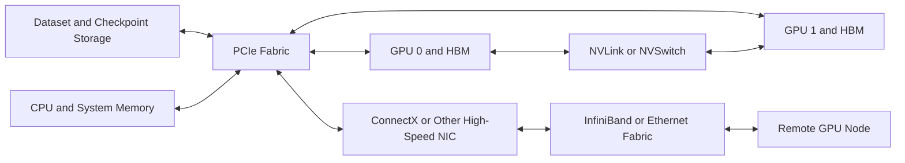

# Volume 07 — GPU Networking

A GPU does not execute in isolation. It depends on a system of data paths that feed instructions, move tensors, exchange gradients, read datasets, write checkpoints, and connect one accelerator to the next.

When a workload fits on one GPU, these paths can remain mostly invisible. Once the workload spans several GPUs or several nodes, communication becomes part of the algorithm. A fast accelerator can spend most of its time waiting for data that is crossing a slow, indirect, congested, or incorrectly selected path.

This volume teaches GPU networking from the inside out. It begins with PCI Express and NUMA locality, moves through NVLink and NVSwitch, explains DMA and RDMA, and then connects those ideas to GPUDirect, ConnectX adapters, NCCL communication paths, topology-aware placement, benchmarking, and production design.

| Volume field | Value |
|---|---|
| Difficulty | Advanced |
| Estimated reading time | 16–20 hours |
| Prerequisites | Volumes 01–06 |
| Primary focus | GPU data movement, locality, and communication architecture |
| Outcome | Design, validate, benchmark, and troubleshoot GPU communication paths |

## The Production Problem

A customer deploys eight-GPU servers for distributed training. Every GPU passes health checks. Every network port reports its configured speed. Yet scaling from one node to eight nodes delivers only a small throughput improvement.

The problem cannot be solved by inspecting components independently. The architecture must follow the data:

1. Which GPU owns the tensor?
2. Which peer needs it?
3. Does traffic remain inside the GPU fabric?
4. Does it cross PCIe or a CPU root complex?
5. Is the selected network adapter local to the GPU?
6. Does the transfer use host staging or direct memory access?
7. Which collective algorithm and transport path are active?
8. Is storage traffic competing with communication traffic?

This volume builds the mental model required to answer those questions.

## The Big Picture

**Figure 7.0.1 — End-to-end GPU data path.** Application performance depends on the complete route from storage and host memory through the local GPU fabric and into the scale-out network.

## Learning Outcomes

After completing this volume, you will be able to:

- explain why GPU communication becomes a system bottleneck;
- interpret PCIe trees, NUMA domains, GPU topology, and NIC affinity;
- compare PCIe, NVLink, NVSwitch, DMA, RDMA, and peer-to-peer paths;
- explain how GPUDirect RDMA and GPUDirect Storage reduce unnecessary staging;
- reason about ConnectX adapter placement and queue behavior;
- map NCCL collectives onto physical communication paths;
- build topology-aware workload-placement policies;
- benchmark bandwidth and latency without confusing component health with application performance;
- troubleshoot multi-GPU and multi-node communication failures;
- explain design trade-offs to enterprise customers.

## Chapter Journey

| Chapter | Engineering question |
|---|---|
| 01 — Why GPU Networking Exists | Why does adding GPUs create a communication problem? |
| 02 — PCIe, NUMA, and Host Data Paths | How do CPU sockets, root complexes, switches, and memory locality shape transfers? |
| 03 — NVLink and NVSwitch | Why does scale-up GPU communication need a specialized fabric? |
| 04 — DMA, RDMA, and Peer-to-Peer | How can devices move data without making the CPU copy every byte? |
| 05 — GPUDirect RDMA | How does a network adapter communicate more directly with GPU memory? |
| 06 — GPUDirect Storage | How can storage feed GPUs with fewer host-memory stages? |
| 07 — ConnectX and GPU Network Adapters | What role does the adapter play beyond link speed? |
| 08 — Topology-Aware Placement | How should processes, GPUs, CPUs, and NICs be aligned? |
| 09 — Multi-Node Collectives and NCCL Paths | How do collective algorithms map onto real hardware? |
| 10 — Performance Bottlenecks and Benchmarking | How do we measure the correct layer and interpret the result? |
| 11 — Production Design Scenarios | How do requirements become deployable architectures? |
| 12 — Volume Summary | How do the concepts combine into an operational model? |

## Hands-on Labs

| Lab | Outcome |
|---|---|
| Lab 01 — Inspect PCIe, NUMA, and GPU Topology | Produce a support-ready topology inventory and locality map |
| Lab 02 — Validate Peer Access and NVLink | Verify peer capability, communication paths, and link behavior |
| Lab 03 — Benchmark RDMA and GPUDirect Paths | Measure host-memory and GPU-memory transfer paths safely |
| Lab 04 — Troubleshoot a Multi-GPU Data Path | Diagnose a layered communication incident from symptom to prevention |

## Architecture Principles Applied

This volume repeatedly applies five principles from the project architecture guide.

### Move computation closer to data

Avoid unnecessary staging when supported direct paths can move data between the devices that produce and consume it.

### Locality matters

A logically valid allocation can still be physically inefficient. CPU, GPU, NIC, storage, and NUMA placement must be treated as one design problem.

### Minimize synchronization

Collective communication makes the slowest participant visible to the entire job. Tail behavior matters as much as average bandwidth.

### Benchmark before optimizing

Do not replace hardware because a job is slow. Measure each segment, identify the active path, and compare it with a known-good baseline.

### Design for operations

Topology maps, firmware baselines, counters, alerts, runbooks, and acceptance tests are architecture deliverables—not post-deployment extras.

## Production Reading Strategy

Read Chapters 01–04 first to establish the data-movement model. Continue with Chapters 05–07 to understand direct GPU I/O and network-adapter behavior. Chapters 08–10 connect architecture to placement and measurement. Chapter 11 converts the technical model into customer designs, and Chapter 12 provides the revision framework.

Perform the labs on a non-production or approved maintenance environment. Some commands are read-only, but benchmarking and failure injection can affect shared links and workload latency.

:::warning Production safety
Do not change PCIe settings, unload drivers, disable links, modify firmware, or disrupt network interfaces on a production GPU node without an approved maintenance plan and rollback procedure.
:::

## What This Volume Does Not Assume

The reader is expected to understand Linux, networking, containers, and basic GPU architecture. The volume does not assume prior knowledge of NVLink, RDMA, GPUDirect, ConnectX, NCCL, or topology-aware GPU placement.

## Cross References

- [Volume 02 — GPU Topology, Peer Access, and Data Paths](../volume-02/chapter-10-gpu-topology-peer-access-and-data-paths)
- [Volume 05 — DGX Networking and Fabric Integration](../volume-05/chapter-06-dgx-networking-and-fabric-integration)
- [Volume 06 — HGX Topology and Data Paths](../volume-06/chapter-04-hgx-topology-and-data-paths)
- Next volume: Volume 08 — InfiniBand
