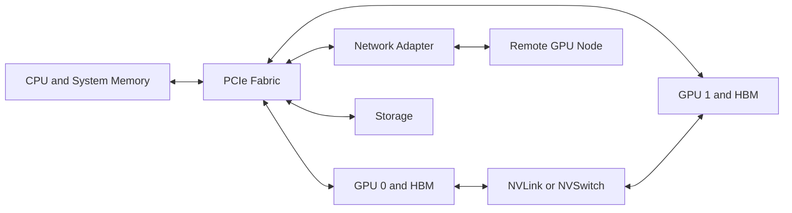

# Volume 07 — GPU Networking

A GPU cluster is not simply a collection of accelerators. It is a hierarchy of data paths. Tensors move through CPU memory, GPU memory, PCI Express, NVLink, NVSwitch, network adapters, storage systems, and inter-node fabrics. Every transition introduces bandwidth limits, latency, contention, and failure modes.

This volume teaches engineers to reason about those paths before choosing hardware or tuning software. The goal is to understand why a workload scales, why it stalls, and which physical link is responsible.

| Volume field | Value |
|---|---|
| Difficulty | Advanced |
| Estimated reading time | 14–18 hours |
| Prerequisites | Volumes 01–06 |
| Primary focus | GPU data movement and topology |
| Outcome | Diagnose and design topology-aware GPU communication paths |

## The Big Picture

**Figure 7.0.1 — A GPU workload crosses several communication domains.** Performance depends on the slowest required path, not the fastest component in isolation.

## Planned Chapter Sequence

1. Why GPU Networking Exists
2. PCIe as the Host I/O Backbone
3. NUMA, Locality, and Device Affinity
4. NVLink Architecture and Use Cases
5. NVSwitch and Scale-Up Fabrics
6. DMA, Peer-to-Peer, and Memory Access Paths
7. GPUDirect RDMA
8. GPUDirect Storage
9. Topology-Aware Workload Placement
10. Measuring Bandwidth and Latency
11. Production Troubleshooting
12. Volume 07 Summary

## Planned Labs

- Inspect PCIe and NUMA topology
- Validate peer-to-peer GPU access
- Measure NVLink and PCIe behavior
- Build a topology-aware placement plan

No pull request will be opened until the entire chapter and lab sequence is present and validated.
