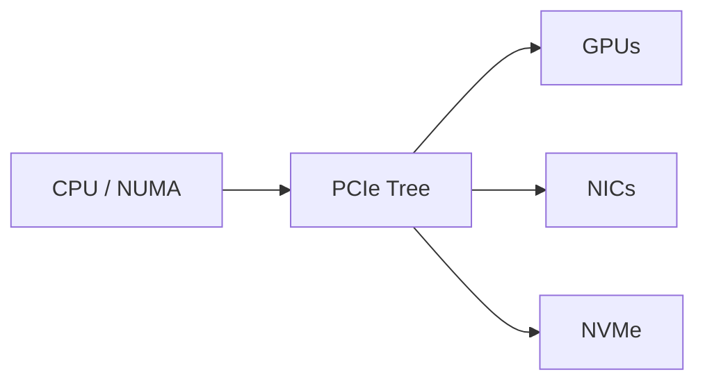

# Lab 01 — Inspect PCIe, NUMA, and GPU Topology

| Field | Value |
|---|---|
| Difficulty | Intermediate |
| Estimated time | 45 minutes |
| Platform | Linux GPU node |
| Lab type | Exploration |

## 1. Objective

Map GPUs, CPUs, NUMA nodes, NICs, NVMe devices, PCIe roots, and peer relationships.

## 2. Background

Topology explains why nominally identical device assignments can produce different paths and performance.

## 3. Learning Outcomes

You will collect a support-ready inventory, identify locality domains, and detect degraded PCIe negotiation.

## 4. Architecture



## 5. Prerequisites

Linux shell access, `pciutils`, `numactl`, NVIDIA driver, and permission to read system topology.

## 6. Environment

Record host model, BIOS, kernel, driver, GPU model, NIC model, and timestamp.

## 7. Components

PCIe root complexes, NUMA nodes, GPUs, network adapters, storage devices, and inter-socket links.

## 8. Deployment Steps

**Purpose:** inspect NUMA domains.

```bash
numactl --hardware
lscpu -e=CPU,NODE,SOCKET,CORE
```

**Purpose:** inspect PCIe hierarchy and link state.

```bash
lspci -tv
lspci -vv | less
```

**Purpose:** inspect GPU topology.

```bash
nvidia-smi topo -m
nvidia-smi -q
```

Save outputs in a dated directory.

## 9. Validation

Confirm every GPU, NIC, and NVMe device appears and has a documented NUMA relationship.

## 10. Verification

For each GPU, record the nearest CPU domain, NIC, storage device, and peer GPUs.

## 11. Observability

Review PCIe replay or error indicators, GPU link telemetry, kernel logs, and device health events.

## 12. Performance Measurements

Optionally compare a pinned-memory transfer while binding the process to local and remote NUMA nodes.

## 13. Failure Injection

Run a test with intentionally remote CPU and memory affinity. Do not modify firmware or physically remove devices.

## 14. Troubleshooting

If a device is missing, check `dmesg`, driver binding, firmware inventory, PCIe slot status, and power state. If link width is lower than expected, compare with the platform design before changing settings.

## 15. Cleanup

Remove temporary output files and restore any process-affinity settings.

## 16. Summary

You created a topology map that can guide rank, GPU, NIC, and CPU placement.

## 17. Challenge Exercises

Convert the inventory into node labels or a machine-readable JSON document.

## 18. Further Reading

- [PCIe, NUMA, and Host Data Paths](../chapter-02-pcie-numa-and-host-data-paths)
- [Topology-Aware Placement](../chapter-08-topology-aware-placement)
