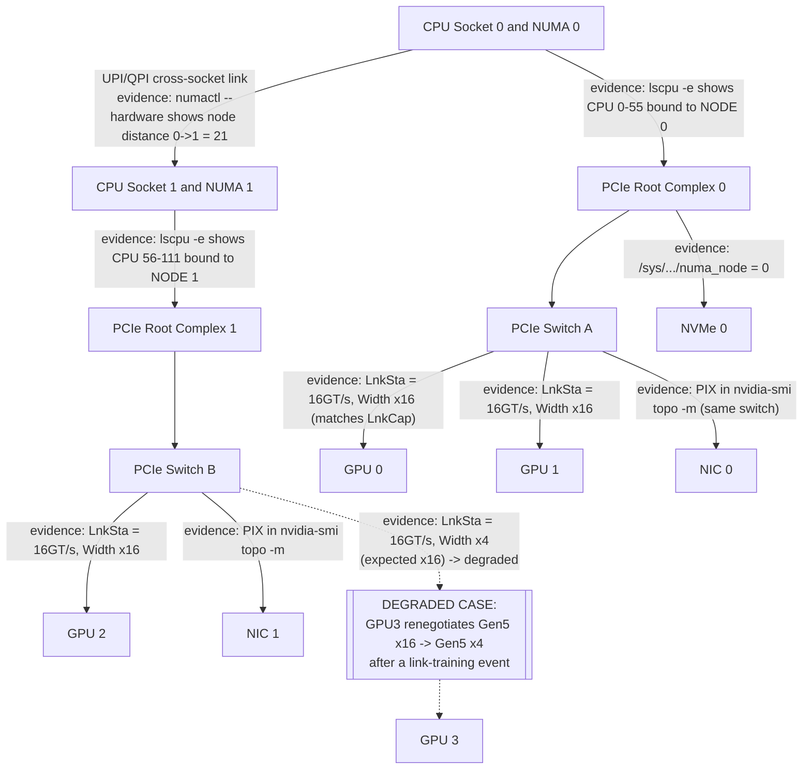

# Lab 01 — Inspect PCIe, NUMA, and GPU Topology

```yaml
Title: Inspect PCIe, NUMA, and GPU Topology
Volume: 07
Chapter: 02
Difficulty: Intermediate
Estimated Time: 75 Minutes
Prerequisites: Linux administration, NVIDIA driver access, basic PCIe and NUMA knowledge
Target Platform: Bare-metal or virtualized Linux GPU node
Target Audience: GPU Platform Engineers, SREs, Infrastructure Architects
Lab Type: L1 Exploration
```

## 1. Objective

Create a support-ready topology baseline that maps GPUs, CPU sockets, NUMA nodes, PCIe switches, network adapters, and NVMe devices. Use the map to identify local and remote communication paths before running performance-sensitive workloads.

## 2. Background

A node can report every device as healthy while still exposing inefficient paths. A GPU may be close to one NIC and remote from another. Two GPUs may share a PCIe switch, cross a root complex, or communicate through a dedicated scale-up fabric.

This lab establishes the physical truth of the node. The resulting inventory becomes an input to workload placement, acceptance testing, performance analysis, and incident response.

## 3. Learning Outcomes

After completing this lab, you will be able to:

- identify CPU sockets and NUMA domains;
- map PCIe endpoints and switch hierarchy;
- associate each GPU with its PCI bus address and NUMA node;
- identify GPU-to-GPU and GPU-to-NIC locality;
- compare negotiated PCIe width and speed with the approved design;
- collect a reusable evidence bundle;
- explain how the topology should influence process placement.

## 4. Architecture



**Figure 7.L1.1 — Example topology inventory.** Your system may differ; the goal is to document the actual hierarchy rather than assume this layout. Each edge above is labeled with the specific piece of command evidence in this lab that proves the hop is healthy — a diagram without that evidence is just an assumption drawn as a picture. The dashed branch shows what a genuinely degraded path looks like: `GPU3` still enumerates and still answers `nvidia-smi`, but its upstream PCIe link has retrained down from the expected `Gen5 x16` to `Gen5 x4` (a 4x reduction in available bandwidth), which Step 6 below is specifically built to catch — a healthy-looking `nvidia-smi` output alone would never surface this.

## 5. Prerequisites

### Hardware

- At least one NVIDIA GPU
- Preferably two or more GPUs
- One or more high-speed network adapters

### Software

- Linux with shell access
- NVIDIA driver and `nvidia-smi`
- `pciutils`
- `numactl`
- `lscpu`, `find`, `readlink`, and `journalctl`

Install missing utilities on Ubuntu:

```bash
sudo apt-get update
sudo apt-get install -y pciutils numactl hwloc
```

### Permissions

Most inventory commands are read-only. Some detailed PCIe fields and kernel logs may require `sudo`.

## 6. Environment

Create a working directory and capture the environment.

```bash
export LAB_DIR="$HOME/volume-07-lab-01-$(date +%Y%m%d-%H%M%S)"
mkdir -p "$LAB_DIR"

uname -a | tee "$LAB_DIR/uname.txt"
lscpu | tee "$LAB_DIR/lscpu.txt"
nvidia-smi | tee "$LAB_DIR/nvidia-smi.txt"
```

Record manually:

| Field | Value |
|---|---|
| Server model | |
| BIOS or firmware release | |
| Operating system | |
| Kernel | |
| NVIDIA driver | |
| GPU model and count | |
| NIC model and count | |
| Maintenance state | |

Every output block in the remainder of this lab illustrates results from one reference system, so the numbers stay internally consistent as you move from command to command: an **8-GPU DGX H100-class node** — 2x Intel Xeon Platinum 8480C (56 cores / 112 threads each, 2 NUMA nodes), 8x NVIDIA H100 SXM5 80GB GPUs fully meshed through 4x NVSwitch, 8x NVIDIA ConnectX-7 400Gb/s NICs (one rail-aligned NIC per GPU), PCIe Gen5 x16 host links throughout, and local NVMe for staging. Figure 7.L1.1 above shows a simplified 4-GPU/2-switch slice of that node for readability. A real record of your own hardware will differ — the point of this table is to pin down what "expected" means before you compare against it in Step 6 and Section 14.

An example of a fully completed row for that reference system:

| Field | Value |
|---|---|
| Server model | NVIDIA DGX H100 |
| BIOS or firmware release | DGX OS 6.2, BMC 2.15, BIOS 1.4.2 |
| Operating system | Ubuntu 22.04.4 LTS |
| Kernel | 5.15.0-105-generic |
| NVIDIA driver | 550.90.07 |
| GPU model and count | NVIDIA H100 80GB HBM3, 8x |
| NIC model and count | ConnectX-7 400GbE/NDR, 8x |
| Maintenance state | In production, no open maintenance window |

## 7. Components

| Component | Why it matters |
|---|---|
| CPU socket | Owns local memory controllers and PCIe roots |
| NUMA node | Defines relative CPU and memory locality |
| PCIe root complex | Connects host processors to I/O hierarchy |
| PCIe switch | Fans one upstream path out to several endpoints |
| GPU | Consumes host, peer, storage, and network data |
| NIC | Carries scale-out communication |
| NVMe device | Supplies local data staging and checkpoints |
| Inter-socket fabric | Carries remote NUMA and cross-root traffic |

## 8. Deployment Steps

### Step 1 — Inspect CPU and NUMA layout

**Purpose:** Identify sockets, NUMA nodes, and CPU membership.

```bash
numactl --hardware | tee "$LAB_DIR/numactl-hardware.txt"
lscpu -e=CPU,NODE,SOCKET,CORE,ONLINE | tee "$LAB_DIR/lscpu-topology.txt"
```

**Expected output** (reference system: dual-socket DGX H100, 56 physical cores/socket, hyperthreading on):

```text
$ numactl --hardware
available: 2 nodes (0-1)
node 0 cpus: 0 1 2 3 4 5 6 7 8 9 10 11 12 13 14 15 16 17 18 19 20 21 22 23 24 25 26 27 28 29 30 31 32 33 34 35 36 37 38 39 40 41 42 43 44 45 46 47 48 49 50 51 52 53 54 55 112 113 114 115 116 117 118 119 120 121 122 123 124 125 126 127 128 129 130 131 132 133 134 135 136 137 138 139 140 141 142 143 144 145 146 147 148 149 150 151 152 153 154 155 156 157 158 159 160 161 162 163 164 165 166 167
node 0 size: 1031982 MB
node 0 free: 891204 MB
node 1 cpus: 56 57 58 59 60 61 62 63 64 65 66 67 68 69 70 71 72 73 74 75 76 77 78 79 80 81 82 83 84 85 86 87 88 89 90 91 92 93 94 95 96 97 98 99 100 101 102 103 104 105 106 107 108 109 110 111 168 169 170 171 172 173 174 175 176 177 178 179 180 181 182 183 184 185 186 187 188 189 190 191 192 193 194 195 196 197 198 199 200 201 202 203 204 205 206 207 208 209 210 211 212 213 214 215 216 217 218 219 220 221 222 223
node 1 size: 1032184 MB
node 1 free: 903417 MB
node distances:
node   0   1
  0:  10  21
  1:  21  10

$ lscpu -e=CPU,NODE,SOCKET,CORE,ONLINE
CPU NODE SOCKET CORE ONLINE
  0    0      0    0 yes
  1    0      0    1 yes
  2    0      0    2 yes
...
 55    0      0   55 yes
 56    1      1    0 yes
...
223    1      1  111 yes
```

**Interpretation:** The `node distances` matrix is the number to internalize: `10` is the SLIT (System Locality Information Table) baseline cost of accessing local memory, and `21` is roughly 2.1x that cost for a cross-socket ("remote") access over the CPU-to-CPU interconnect (UPI on this Xeon generation). A process bound to a CPU on NUMA node 0 that ends up allocating or touching memory attached to NUMA node 1 pays this 2.1x latency penalty on every access, not once — that ratio is what Step 12's benchmark makes concrete with real numbers. A degraded or misconfigured node would show more than 2 NUMA nodes for a 2-socket system (sub-NUMA clustering enabled unexpectedly), a distance value far outside the typical 10-21 range, or a `node X free` far below `node X size` with no workload running, which points at a memory leak or a stuck reservation rather than a topology problem.

### Step 2 — Inspect the PCIe tree

**Purpose:** Visualize root ports, switches, and endpoints.

```bash
lspci -Dtv | tee "$LAB_DIR/lspci-tree.txt"
lspci -Dnn | tee "$LAB_DIR/lspci-devices.txt"
```

Representative (trimmed) output:

```text
$ lspci -Dtv
-+-[0000:ae]-+-00.0-[af]----00.0  NVIDIA Corporation Device 2330
 |           \-01.0-[b0]----00.0  Mellanox Technologies MT2910 ConnectX-7
 +-[0000:64]-+-00.0-[65]----00.0  NVIDIA Corporation Device 2330
 |           \-01.0-[66]----00.0  Mellanox Technologies MT2910 ConnectX-7
 +-[0000:19]-+-00.0-[1a]----00.0  NVIDIA Corporation Device 2330
 |           \-01.0-[1b]----00.0  Mellanox Technologies MT2910 ConnectX-7
 \-[0000:00]-+-1d.0-[03]----00.0  Samsung Electronics NVMe SSD Controller PM1733
             \-1f.0        Intel Corporation Sky Lake-E LPC Controller

$ lspci -Dnn | grep -Ei 'NVIDIA|Ethernet|InfiniBand|Non-Volatile memory'
0000:1a:00.0 3D controller [0302]: NVIDIA Corporation GH100 [10de:2330]
0000:1b:00.0 Ethernet controller [0200]: Mellanox Technologies MT2910 Family [ConnectX-7] [15b3:1021]
0000:65:00.0 3D controller [0302]: NVIDIA Corporation GH100 [10de:2330]
0000:66:00.0 Ethernet controller [0200]: Mellanox Technologies MT2910 Family [ConnectX-7] [15b3:1021]
0000:af:00.0 3D controller [0302]: NVIDIA Corporation GH100 [10de:2330]
0000:b0:00.0 Ethernet controller [0200]: Mellanox Technologies MT2910 Family [ConnectX-7] [15b3:1021]
0000:03:00.0 Non-Volatile memory controller [0108]: Samsung Electronics Co Ltd NVMe SSD Controller PM1733 [144d:a824]
```

Locate NVIDIA GPUs, Ethernet or InfiniBand adapters, and NVMe controllers.

```bash
lspci -Dnn | grep -Ei 'NVIDIA|Ethernet|InfiniBand|Non-Volatile memory' \
  | tee "$LAB_DIR/accelerator-io-devices.txt"
```

**Interpretation:** The `[10de:2330]` vendor:device pair (`10de` = NVIDIA) confirms PCIe enumeration only — it does not yet prove the driver loaded or that `nvidia-smi` can talk to the device (that is Step 3). Each GPU appears one hop below its own root port/PCIe switch (`0000:1a`, `0000:65`, `0000:af` in this trim), with a ConnectX-7 NIC as a sibling under the same switch — that sibling relationship is exactly what later shows up as `PIX` (single-bridge hop) in `nvidia-smi topo -m`. A GPU that is physically seated but not enumerating at all would be absent from this `grep` output entirely, which is the classic "hardware/firmware/PCIe discovery boundary" symptom covered in Section 14.

### Step 3 — Map GPU identities

**Purpose:** Connect logical indices to stable identifiers and bus addresses.

```bash
nvidia-smi --query-gpu=index,uuid,name,pci.bus_id,driver_version \
  --format=csv | tee "$LAB_DIR/gpu-identities.csv"
```

Representative output (8-GPU reference system):

```text
index, uuid, name, pci.bus_id, driver_version
0, GPU-3a1f9c02-7b44-4e6a-9e2d-1a2b3c4d5e6f, NVIDIA H100 80GB HBM3, 00000000:19:00.0, 550.90.07
1, GPU-8e2d4f11-9c3a-4b7e-a1f0-2b3c4d5e6f70, NVIDIA H100 80GB HBM3, 00000000:3B:00.0, 550.90.07
2, GPU-c4a7b823-1d5e-4f9a-b2c1-3c4d5e6f7081, NVIDIA H100 80GB HBM3, 00000000:4C:00.0, 550.90.07
3, GPU-f19a0d34-2e6f-4a0b-c3d2-4d5e6f708192, NVIDIA H100 80GB HBM3, 00000000:5D:00.0, 550.90.07
4, GPU-01b2c945-3f70-4b1c-d4e3-5e6f708192a3, NVIDIA H100 80GB HBM3, 00000000:9B:00.0, 550.90.07
5, GPU-52c3da56-4081-4c2d-e5f4-6f708192a3b4, NVIDIA H100 80GB HBM3, 00000000:AC:00.0, 550.90.07
6, GPU-a3d4eb67-5192-4d3e-f605-708192a3b4c5, NVIDIA H100 80GB HBM3, 00000000:BD:00.0, 550.90.07
7, GPU-f4e5fc78-62a3-4e4f-0716-8192a3b4c5d6, NVIDIA H100 80GB HBM3, 00000000:CE:00.0, 550.90.07
```

Do not use GPU index as the only operational identifier. Record UUID and PCI bus address.

**Interpretation:** GPU `index` (the leftmost column) is assigned by driver enumeration order and is **not guaranteed stable** across reboots, driver reloads, or `CUDA_VISIBLE_DEVICES` remapping — a job pinned to "GPU 3" by index alone can silently land on different silicon after a maintenance window. `uuid` (`GPU-3a1f9c02-...`) and `pci.bus_id` (`00000000:19:00.0`) are the two identifiers that stay fixed to the physical card and physical slot respectively; cross-reference both against Section 14's "GPU missing" symptom, where the first thing to check is whether the expected UUID/BDF pair is still present at all, before worrying about which index it landed on.

### Step 4 — Inspect GPU topology

```bash
nvidia-smi topo -m | tee "$LAB_DIR/nvidia-topology.txt"
nvidia-smi topo -p2p r | tee "$LAB_DIR/p2p-read-capability.txt" 2>&1 || true
nvidia-smi topo -p2p w | tee "$LAB_DIR/p2p-write-capability.txt" 2>&1 || true
```

**Expected output** (8-GPU DGX H100-class node, fully meshed through NVSwitch, one rail-aligned NIC per GPU):

```text
$ nvidia-smi topo -m
        GPU0    GPU1    GPU2    GPU3    GPU4    GPU5    GPU6    GPU7    NIC0    NIC1    NIC2    NIC3    CPU Affinity    NUMA Affinity
GPU0     X      NV18    NV18    NV18    NV18    NV18    NV18    NV18    PIX     SYS     SYS     SYS     0-55,112-167    0
GPU1    NV18     X      NV18    NV18    NV18    NV18    NV18    NV18    SYS     PIX     SYS     SYS     0-55,112-167    0
GPU2    NV18    NV18     X      NV18    NV18    NV18    NV18    NV18    SYS     SYS     PIX     SYS     0-55,112-167    0
GPU3    NV18    NV18    NV18     X      NV18    NV18    NV18    NV18    SYS     SYS     SYS     PIX     0-55,112-167    0
GPU4    NV18    NV18    NV18    NV18     X      NV18    NV18    NV18    PIX     SYS     SYS     SYS     56-111,168-223  1
GPU5    NV18    NV18    NV18    NV18    NV18     X      NV18    NV18    SYS     PIX     SYS     SYS     56-111,168-223  1
GPU6    NV18    NV18    NV18    NV18    NV18    NV18     X      NV18    SYS     SYS     PIX     SYS     56-111,168-223  1
GPU7    NV18    NV18    NV18    NV18    NV18    NV18    NV18     X      SYS     SYS     SYS     PIX     56-111,168-223  1

Legend:
  X    = Self
  SYS  = Connection traversing PCIe as well as the SMP interconnect between NUMA nodes (e.g., QPI/UPI)
  NODE = Connection traversing PCIe as well as the interconnect between PCIe Host Bridges within a NUMA node
  PHB  = Connection traversing PCIe as well as a PCIe Host Bridge (typically the CPU)
  PXB  = Connection traversing multiple PCIe bridges (without traversing the PCIe Host Bridge)
  PIX  = Connection traversing at most a single PCIe bridge
  NV#  = Connection traversing a bonded set of # NVLinks

$ nvidia-smi topo -p2p r
       GPU0  GPU1  GPU2  GPU3  GPU4  GPU5  GPU6  GPU7
GPU0    X     OK    OK    OK    OK    OK    OK    OK
GPU1    OK    X     OK    OK    OK    OK    OK    OK
GPU2    OK    OK    X     OK    OK    OK    OK    OK
GPU3    OK    OK    OK    X     OK    OK    OK    OK
GPU4    OK    OK    OK    OK    X     OK    OK    OK
GPU5    OK    OK    OK    OK    OK    X     OK    OK
GPU6    OK    OK    OK    OK    OK    OK    X     OK
GPU7    OK    OK    OK    OK    OK    OK    OK    X
```

**Interpretation:** `NV18` between every GPU pair means each hop is carried over a bonded set of 18 NVLink4 lanes through NVSwitch — on H100 SXM5 that is the full 900GB/s bidirectional per-GPU aggregate, and the fact every off-diagonal cell reads identically (`NV18` everywhere, not a mix of `NV18` and `SYS`) is itself the proof this node is a fully non-blocking NVSwitch mesh rather than a partially-connected topology. `PIX` in the `NICx` columns means that GPU and its rail-aligned NIC sit behind at most one PCIe bridge — the shortest possible host path — while `SYS` for the other NICs means that path crosses the cross-socket SMP interconnect, which is why workloads should always prefer the `PIX`-local NIC for a given GPU's RDMA traffic. `CPU Affinity`/`NUMA Affinity` map directly onto the `numactl --hardware` output from Step 1. **A degraded topology on this same hardware would show a mix of `NV18` and a lower bonded count (e.g. `NV6`) for one specific pair** — that is a link failure on a subset of NVLink lanes, not a total loss, and it is invisible unless you read every cell instead of skimming for "does the matrix exist." The `p2p -r`/`-w` matrices should show `OK` for every off-diagonal pair on a fully meshed node; any cell reading `CNS` (chipset not supported) or blank instead of `OK` means peer access is not available for that specific pair regardless of what the topology matrix implies, which is exactly the gap Lab 02 is built to catch.

### Step 5 — Resolve device NUMA nodes

For every relevant PCI address:

```bash
for dev in $(lspci -D | grep -Ei 'NVIDIA|Ethernet|InfiniBand|Non-Volatile memory' | awk '{print $1}'); do
  numa_file="/sys/bus/pci/devices/$dev/numa_node"
  printf '%s NUMA=' "$dev"
  cat "$numa_file" 2>/dev/null || echo unknown
done | tee "$LAB_DIR/device-numa-map.txt"
```

A value of `-1` means the kernel does not expose a specific NUMA association. Do not automatically treat it as NUMA node 0.

Representative output:

```text
0000:1a:00.0 NUMA=0
0000:1b:00.0 NUMA=0
0000:65:00.0 NUMA=0
0000:66:00.0 NUMA=0
0000:af:00.0 NUMA=0
0000:b0:00.0 NUMA=0
0000:9b:00.0 NUMA=1
0000:9c:00.0 NUMA=1
0000:03:00.0 NUMA=-1
```

**Interpretation:** The NVMe controller (`0000:03:00.0`) reporting `NUMA=-1` is common on some chipset-attached storage controllers where the kernel genuinely has no locality information to report — treat it as "unknown," not as "node 0," since silently defaulting it to node 0 would make every NUMA-binding decision downstream look falsely justified. Every GPU and NIC pair sharing the same NUMA value in the same row grouping (`0-...1a`/`1b` and `65`/`66` both NUMA=0) confirms the rail-alignment implied by the topology matrix in Step 4 — a GPU/NIC pair reporting different NUMA nodes despite `nvidia-smi topo -m` showing `PIX` between them would be a strong signal of a BIOS-level PCIe topology misconfiguration and worth escalating before trusting the matrix.

### Step 6 — Inspect PCIe link negotiation

Choose one GPU bus address from `gpu-identities.csv`.

```bash
export GPU_BDF='0000:1a:00.0'   # replace with an actual GPU BDF from Step 3
sudo lspci -s "$GPU_BDF" -vv | grep -E 'LnkCap:|LnkSta:' \
  | tee "$LAB_DIR/${GPU_BDF//:/_}-link.txt"
```

Representative output — healthy GPU (`GPU0`, PCI BDF `0000:1a:00.0`, matches the `0000:19:00.0` root port in Step 3):

```text
$ sudo lspci -s 0000:1a:00.0 -vv | grep -E 'LnkCap:|LnkSta:'
        LnkCap: Port #0, Speed 32GT/s, Width x16, ASPM not supported
        LnkSta: Speed 32GT/s (ok), Width x16 (ok)
```

**Healthy interpretation:** `LnkCap` (link capability — the fastest speed/width both ends of the link can support) reads `32GT/s, Width x16`, which is PCIe Gen5 x16. `LnkSta` (link status — what's actually negotiated right now) reads `32GT/s (ok), Width x16 (ok)` — the `(ok)` suffix means the currently-negotiated value equals the capability, i.e., the link came up at full speed and full width. Negotiated speed and width should match the supported platform design for the current power and workload state.

Representative output — the degraded case from Figure 7.L1.1 (`GPU3`, retrained down after a link event):

```text
$ sudo lspci -s 0000:5d:00.0 -vv | grep -E 'LnkCap:|LnkSta:'
        LnkCap: Port #0, Speed 32GT/s, Width x16, ASPM not supported
        LnkSta: Speed 32GT/s (ok), Width x4 (downgraded)
```

Here `LnkCap` is unchanged (the hardware can still do Gen5 x16), but `LnkSta` shows `Width x4 (downgraded)` — the link renegotiated down to a quarter of its designed lane width. Theoretical PCIe Gen5 x16 raw signaling bandwidth is `16 lanes x ~4GB/s per lane ≈ 63GB/s` in each direction before protocol overhead; at `x4` that ceiling drops to `4 lanes x ~4GB/s ≈ 16GB/s` — a workload doing host-to-device staging over this GPU would see roughly a 4x drop in achievable PCIe throughput with no corresponding change in `nvidia-smi`'s health fields, which is exactly why this check exists as its own step rather than being inferred from `nvidia-smi` alone.

:::note
Some devices reduce link activity when idle. Compare against platform documentation and, where safe, observe under load before declaring a fault.
:::

### Step 7 — Inspect network-adapter locality

```bash
for iface in /sys/class/net/*; do
  name=$(basename "$iface")
  dev=$(readlink -f "$iface/device" 2>/dev/null || true)
  [ -n "$dev" ] && printf '%-16s %s\n' "$name" "$dev"
done | tee "$LAB_DIR/interface-pci-map.txt"
```

Use `ethtool -i &lt;interface&gt;` or `ibdev2netdev` where appropriate to map logical interfaces to PCI devices.

Representative output:

```text
$ for iface in /sys/class/net/*; do
    name=$(basename "$iface")
    dev=$(readlink -f "$iface/device" 2>/dev/null || true)
    [ -n "$dev" ] && printf '%-16s %s\n' "$name" "$dev"
  done
eth0             /sys/devices/pci0000:00/.../0000:00:1f.6
enp27s0f0np0     /sys/devices/pci0000:19/.../0000:1b:00.0
enp101s0f0np0    /sys/devices/pci0000:65/.../0000:66:00.0
enp175s0f0np0    /sys/devices/pci0000:af/.../0000:b0:00.0
```

**Interpretation:** `enp27s0f0np0` resolving to PCI device `0000:1b:00.0` is the ConnectX-7 NIC sitting on the same PCIe switch as `GPU0` (`0000:1a:00.0`) from Step 3 — that shared-switch relationship is what `nvidia-smi topo -m` reports as `PIX` for that GPU/NIC pair in Step 4. `eth0` resolving to the chipset's onboard `0000:00:1f.6` (management/BMC-adjacent NIC, not rail-aligned to any GPU) is expected and not part of the accelerator data path. If a rail-aligned interface name is missing from this output entirely, the NIC either isn't bound to a kernel driver or isn't enumerating — cross-check against the `lspci -Dnn` list from Step 2 before assuming a naming difference.

### Step 8 — Build the topology worksheet

Create a table like this:

| GPU UUID | PCI BDF | NUMA | Closest CPU set | Closest NIC | Peer group | Notes |
|---|---|---:|---|---|---|---|
| | | | | | | |

Example of a completed row, built from Steps 3-7 on the reference system above:

| GPU UUID | PCI BDF | NUMA | Closest CPU set | Closest NIC | Peer group | Notes |
|---|---|---:|---|---|---|---|
| GPU-3a1f9c02-...5e6f | 00000000:19:00.0 | 0 | 0-55,112-167 | enp27s0f0np0 (0000:1b:00.0, PIX) | NVSwitch mesh, all 8 GPUs NV18 | Gen5 x16 confirmed via LnkSta, healthy |

## 9. Validation

The inventory is valid when:

- every expected GPU appears;
- every GPU has a UUID and PCI address;
- CPU sockets and NUMA domains are documented;
- NIC and storage PCI addresses are recorded;
- GPU topology is captured;
- negotiated PCIe status is checked against design expectations;
- no unexplained missing or duplicate device exists.

## 10. Verification

Answer these questions from evidence:

1. Which GPUs share the shortest PCIe path?
2. Which GPUs have a direct scale-up connection?
3. Which NIC is closest to each GPU group?
4. Which CPU and memory domain should feed each group?
5. Which allocations would cross CPU sockets?
6. Are any devices negotiating below the expected link width or speed?

## 11. Observability

Collect supporting logs and counters.

```bash
journalctl -k -b | grep -Ei 'pcie|aer|nvrm|nvidia|xid' \
  | tee "$LAB_DIR/kernel-pcie-gpu-events.txt"

nvidia-smi -q | tee "$LAB_DIR/nvidia-smi-q.txt"
```

Look for:

- Advanced Error Reporting events;
- XID errors;
- repeated link retraining;
- driver initialization failures;
- corrected or uncorrected PCIe errors.

## 12. Performance Measurements

Optional: compare local and remote NUMA CPU-memory behavior with an approved memory tool or application benchmark.

```bash
numactl --cpunodebind=0 --membind=0 <approved-benchmark-command>
numactl --cpunodebind=1 --membind=1 <approved-benchmark-command>
```

Use the same workload and record multiple runs. The objective is to demonstrate locality effects, not to publish universal numbers.

## 13. Failure Injection

Use a safe logical failure: run a CPU-side data feeder on a NUMA node remote from the selected GPU.

```bash
numactl --cpunodebind=<remote-node> --membind=<remote-node> \
  <approved-gpu-transfer-test>
```

Observe latency, throughput, CPU utilization, and consistency. Do not disable links, alter BIOS settings, or remove devices.

## 14. Troubleshooting

### Symptom: GPU missing from `nvidia-smi`

**Diagnosis:** Check `lspci`, driver binding, kernel logs, BMC inventory, and slot power.

**Root cause categories:** Hardware enumeration, firmware, power, driver binding, or virtualization passthrough.

### Symptom: Link width lower than expected

**Diagnosis:** Compare `LnkCap` and `LnkSta`, inspect AER events, and compare with a known-good node of the same design.

**Resolution:** Follow the server-vendor runbook. Do not force PCIe settings without platform approval.

**Worked evidence for this exact symptom** — this is precisely the GPU3 case captured in Step 6:

```text
$ sudo lspci -s 0000:5d:00.0 -vv | grep -E 'LnkCap:|LnkSta:'
        LnkCap: Port #0, Speed 32GT/s, Width x16, ASPM not supported
        LnkSta: Speed 32GT/s (ok), Width x4 (downgraded)

$ sudo dmesg -T | grep -i "5d:00.0" | tail -5
[Wed Aug  6 03:14:22 2026] pcieport 0000:5c:00.0: AER: Corrected error received: 0000:5d:00.0
[Wed Aug  6 03:14:22 2026] pcieport 0000:5c:00.0: AER: can't find device of ID0500
[Wed Aug  6 03:14:22 2026] pcieport 0000:5c:00.0: AER: Multiple Corrected error received: 0000:5c:00.0
```

`LnkCap` unchanged at `x16` but `LnkSta` at `Width x4 (downgraded)` confirms the device retrained down from its designed width — a 4x reduction in PCIe lanes. The `dmesg` AER (Advanced Error Reporting) lines around the same boot are the corroborating evidence: repeated "Corrected error" events on the upstream port `0000:5c:00.0` just before the downgrade is exactly the signal that separates "signal-integrity/riser problem" (this case — the link degraded itself to preserve stability) from "BIOS policy" (which would show no AER events at all, just a conservative negotiated state from boot). Compare the same two commands against an identical, healthy node before opening a hardware ticket — matching AER activity on a healthy node's same slot would point at a systemic platform issue instead of a single bad card.

### Symptom: Correct devices but poor locality

**Diagnosis:** Compare process CPU binding, memory binding, GPU BDF, and NIC BDF.

**Resolution:** Align CPU workers, memory, GPU, and NIC within the same locality domain where possible.

**Worked evidence for this exact symptom.** Combine the worksheet row from Step 8 with the running process's actual affinity:

```text
$ taskset -cp 71820
pid 71820's current affinity list: 56-111,168-223

$ grep -A1 "GPU-3a1f9c02" topology-worksheet.md
| GPU-3a1f9c02-...5e6f | 00000000:19:00.0 | 0 | 0-55,112-167 | enp27s0f0np0 (0000:1b:00.0, PIX) | NVSwitch mesh, all 8 GPUs NV18 |
```

The worksheet says GPU 0's local CPU set is `0-55,112-167` (NUMA node 0), but `taskset -cp` shows the process actually driving that GPU is pinned to `56-111,168-223` — NUMA node 1. Every host-to-device transfer for this process now crosses the inter-socket interconnect before reaching the correct PCIe root complex, even though every device involved — GPU, NIC, CPU — is individually healthy. This is the "correct devices, wrong relationship" failure mode the symptom name describes: no single `nvidia-smi` or `lspci` check flags it, only cross-referencing the worksheet against live process affinity does.

## 15. Cleanup

This lab makes no persistent configuration changes. Remove only temporary artifacts that are not needed.

```bash
# Keep the evidence directory for operational baselines, or remove it explicitly.
# rm -rf "$LAB_DIR"
```

## 16. Summary

You created a physical topology inventory and translated it into placement guidance. This baseline can be reused after firmware upgrades, device replacement, driver changes, or performance incidents.

## 17. Challenge Exercises

- Convert the inventory into JSON.
- Generate Kubernetes node labels from approved topology groups.
- Compare two supposedly identical servers and explain every difference.
- Add the evidence bundle to a node-commissioning pipeline.

## 18. Further Reading

- [Volume 07 Introduction](../index)
- [PCIe, NUMA, and Host Data Paths](../chapter-02-pcie-numa-and-host-data-paths)
- [Topology-Aware Placement](../chapter-08-topology-aware-placement)
- [Performance Bottlenecks and Benchmarking](../chapter-10-performance-bottlenecks-and-benchmarking)
