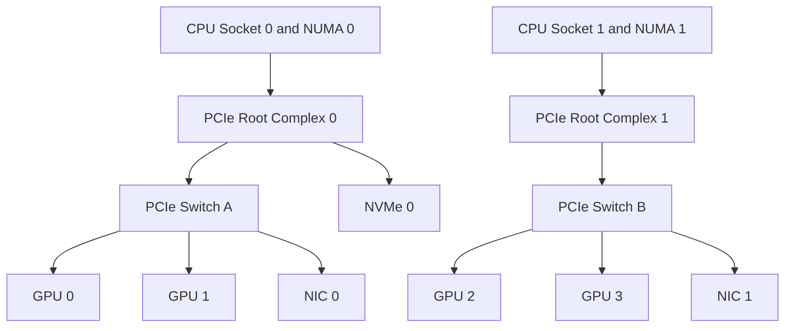

# Lab 01 — Inspect PCIe, NUMA, and GPU Topology

```yaml
Title: Inspect PCIe, NUMA, and GPU Topology
Volume: 07
Chapter: 02
Difficulty: Intermediate
Estimated Time: 75 Minutes
Prerequisites: Linux administration, NVIDIA driver access, basic PCIe and NUMA knowledge
Target Platform: Bare-metal or virtualized Linux GPU node
Target Audience: GPU Platform Engineers, SREs, Infrastructure Architects
Lab Type: L1 Exploration
```

## 1. Objective

Create a support-ready topology baseline that maps GPUs, CPU sockets, NUMA nodes, PCIe switches, network adapters, and NVMe devices. Use the map to identify local and remote communication paths before running performance-sensitive workloads.

## 2. Background

A node can report every device as healthy while still exposing inefficient paths. A GPU may be close to one NIC and remote from another. Two GPUs may share a PCIe switch, cross a root complex, or communicate through a dedicated scale-up fabric.

This lab establishes the physical truth of the node. The resulting inventory becomes an input to workload placement, acceptance testing, performance analysis, and incident response.

## 3. Learning Outcomes

After completing this lab, you will be able to:

- identify CPU sockets and NUMA domains;
- map PCIe endpoints and switch hierarchy;
- associate each GPU with its PCI bus address and NUMA node;
- identify GPU-to-GPU and GPU-to-NIC locality;
- compare negotiated PCIe width and speed with the approved design;
- collect a reusable evidence bundle;
- explain how the topology should influence process placement.

## 4. Architecture



**Figure 7.L1.1 — Example topology inventory.** Your system may differ; the goal is to document the actual hierarchy rather than assume this layout.

## 5. Prerequisites

### Hardware

- At least one NVIDIA GPU
- Preferably two or more GPUs
- One or more high-speed network adapters

### Software

- Linux with shell access
- NVIDIA driver and `nvidia-smi`
- `pciutils`
- `numactl`
- `lscpu`, `find`, `readlink`, and `journalctl`

Install missing utilities on Ubuntu:

```bash
sudo apt-get update
sudo apt-get install -y pciutils numactl hwloc
```

### Permissions

Most inventory commands are read-only. Some detailed PCIe fields and kernel logs may require `sudo`.

## 6. Environment

Create a working directory and capture the environment.

```bash
export LAB_DIR="$HOME/volume-07-lab-01-$(date +%Y%m%d-%H%M%S)"
mkdir -p "$LAB_DIR"

uname -a | tee "$LAB_DIR/uname.txt"
lscpu | tee "$LAB_DIR/lscpu.txt"
nvidia-smi | tee "$LAB_DIR/nvidia-smi.txt"
```

Record manually:

| Field | Value |
|---|---|
| Server model | |
| BIOS or firmware release | |
| Operating system | |
| Kernel | |
| NVIDIA driver | |
| GPU model and count | |
| NIC model and count | |
| Maintenance state | |

## 7. Components

| Component | Why it matters |
|---|---|
| CPU socket | Owns local memory controllers and PCIe roots |
| NUMA node | Defines relative CPU and memory locality |
| PCIe root complex | Connects host processors to I/O hierarchy |
| PCIe switch | Fans one upstream path out to several endpoints |
| GPU | Consumes host, peer, storage, and network data |
| NIC | Carries scale-out communication |
| NVMe device | Supplies local data staging and checkpoints |
| Inter-socket fabric | Carries remote NUMA and cross-root traffic |

## 8. Deployment Steps

### Step 1 — Inspect CPU and NUMA layout

**Purpose:** Identify sockets, NUMA nodes, and CPU membership.

```bash
numactl --hardware | tee "$LAB_DIR/numactl-hardware.txt"
lscpu -e=CPU,NODE,SOCKET,CORE,ONLINE | tee "$LAB_DIR/lscpu-topology.txt"
```

**Expected output:** One section per NUMA node, including CPU lists and memory capacity.

**Interpretation:** A process bound to a CPU on NUMA node 0 may pay an additional cost when accessing memory or I/O attached to NUMA node 1.

### Step 2 — Inspect the PCIe tree

**Purpose:** Visualize root ports, switches, and endpoints.

```bash
lspci -Dtv | tee "$LAB_DIR/lspci-tree.txt"
lspci -Dnn | tee "$LAB_DIR/lspci-devices.txt"
```

Locate NVIDIA GPUs, Ethernet or InfiniBand adapters, and NVMe controllers.

```bash
lspci -Dnn | grep -Ei 'NVIDIA|Ethernet|InfiniBand|Non-Volatile memory' \
  | tee "$LAB_DIR/accelerator-io-devices.txt"
```

### Step 3 — Map GPU identities

**Purpose:** Connect logical indices to stable identifiers and bus addresses.

```bash
nvidia-smi --query-gpu=index,uuid,name,pci.bus_id,driver_version \
  --format=csv | tee "$LAB_DIR/gpu-identities.csv"
```

Do not use GPU index as the only operational identifier. Record UUID and PCI bus address.

### Step 4 — Inspect GPU topology

```bash
nvidia-smi topo -m | tee "$LAB_DIR/nvidia-topology.txt"
nvidia-smi topo -p2p r | tee "$LAB_DIR/p2p-read-capability.txt" 2>&1 || true
nvidia-smi topo -p2p w | tee "$LAB_DIR/p2p-write-capability.txt" 2>&1 || true
```

**Expected output:** A matrix describing relationships such as same switch, same host bridge, cross-socket, or direct GPU interconnect.

### Step 5 — Resolve device NUMA nodes

For every relevant PCI address:

```bash
for dev in $(lspci -D | grep -Ei 'NVIDIA|Ethernet|InfiniBand|Non-Volatile memory' | awk '{print $1}'); do
  numa_file="/sys/bus/pci/devices/$dev/numa_node"
  printf '%s NUMA=' "$dev"
  cat "$numa_file" 2>/dev/null || echo unknown
done | tee "$LAB_DIR/device-numa-map.txt"
```

A value of `-1` means the kernel does not expose a specific NUMA association. Do not automatically treat it as NUMA node 0.

### Step 6 — Inspect PCIe link negotiation

Choose one GPU bus address from `gpu-identities.csv`.

```bash
export GPU_BDF='0000:00:00.0'   # replace with an actual GPU BDF
sudo lspci -s "$GPU_BDF" -vv | grep -E 'LnkCap:|LnkSta:' \
  | tee "$LAB_DIR/${GPU_BDF//:/_}-link.txt"
```

**Healthy interpretation:** Negotiated speed and width should match the supported platform design for the current power and workload state.

:::note
Some devices reduce link activity when idle. Compare against platform documentation and, where safe, observe under load before declaring a fault.
:::

### Step 7 — Inspect network-adapter locality

```bash
for iface in /sys/class/net/*; do
  name=$(basename "$iface")
  dev=$(readlink -f "$iface/device" 2>/dev/null || true)
  [ -n "$dev" ] && printf '%-16s %s\n' "$name" "$dev"
done | tee "$LAB_DIR/interface-pci-map.txt"
```

Use `ethtool -i <interface>` or `ibdev2netdev` where appropriate to map logical interfaces to PCI devices.

### Step 8 — Build the topology worksheet

Create a table like this:

| GPU UUID | PCI BDF | NUMA | Closest CPU set | Closest NIC | Peer group | Notes |
|---|---|---:|---|---|---|---|
| | | | | | | |

## 9. Validation

The inventory is valid when:

- every expected GPU appears;
- every GPU has a UUID and PCI address;
- CPU sockets and NUMA domains are documented;
- NIC and storage PCI addresses are recorded;
- GPU topology is captured;
- negotiated PCIe status is checked against design expectations;
- no unexplained missing or duplicate device exists.

## 10. Verification

Answer these questions from evidence:

1. Which GPUs share the shortest PCIe path?
2. Which GPUs have a direct scale-up connection?
3. Which NIC is closest to each GPU group?
4. Which CPU and memory domain should feed each group?
5. Which allocations would cross CPU sockets?
6. Are any devices negotiating below the expected link width or speed?

## 11. Observability

Collect supporting logs and counters.

```bash
journalctl -k -b | grep -Ei 'pcie|aer|nvrm|nvidia|xid' \
  | tee "$LAB_DIR/kernel-pcie-gpu-events.txt"

nvidia-smi -q | tee "$LAB_DIR/nvidia-smi-q.txt"
```

Look for:

- Advanced Error Reporting events;
- XID errors;
- repeated link retraining;
- driver initialization failures;
- corrected or uncorrected PCIe errors.

## 12. Performance Measurements

Optional: compare local and remote NUMA CPU-memory behavior with an approved memory tool or application benchmark.

```bash
numactl --cpunodebind=0 --membind=0 <approved-benchmark-command>
numactl --cpunodebind=1 --membind=1 <approved-benchmark-command>
```

Use the same workload and record multiple runs. The objective is to demonstrate locality effects, not to publish universal numbers.

## 13. Failure Injection

Use a safe logical failure: run a CPU-side data feeder on a NUMA node remote from the selected GPU.

```bash
numactl --cpunodebind=<remote-node> --membind=<remote-node> \
  <approved-gpu-transfer-test>
```

Observe latency, throughput, CPU utilization, and consistency. Do not disable links, alter BIOS settings, or remove devices.

## 14. Troubleshooting

### Symptom: GPU missing from `nvidia-smi`

**Diagnosis:** Check `lspci`, driver binding, kernel logs, BMC inventory, and slot power.

**Root cause categories:** Hardware enumeration, firmware, power, driver binding, or virtualization passthrough.

### Symptom: Link width lower than expected

**Diagnosis:** Compare `LnkCap` and `LnkSta`, inspect AER events, and compare with a known-good node of the same design.

**Resolution:** Follow the server-vendor runbook. Do not force PCIe settings without platform approval.

### Symptom: Correct devices but poor locality

**Diagnosis:** Compare process CPU binding, memory binding, GPU BDF, and NIC BDF.

**Resolution:** Align CPU workers, memory, GPU, and NIC within the same locality domain where possible.

## 15. Cleanup

This lab makes no persistent configuration changes. Remove only temporary artifacts that are not needed.

```bash
# Keep the evidence directory for operational baselines, or remove it explicitly.
# rm -rf "$LAB_DIR"
```

## 16. Summary

You created a physical topology inventory and translated it into placement guidance. This baseline can be reused after firmware upgrades, device replacement, driver changes, or performance incidents.

## 17. Challenge Exercises

- Convert the inventory into JSON.
- Generate Kubernetes node labels from approved topology groups.
- Compare two supposedly identical servers and explain every difference.
- Add the evidence bundle to a node-commissioning pipeline.

## 18. Further Reading

- [Volume 07 Introduction](../index)
- [PCIe, NUMA, and Host Data Paths](../chapter-02-pcie-numa-and-host-data-paths)
- [Topology-Aware Placement](../chapter-08-topology-aware-placement)
- [Performance Bottlenecks and Benchmarking](../chapter-10-performance-bottlenecks-and-benchmarking)
