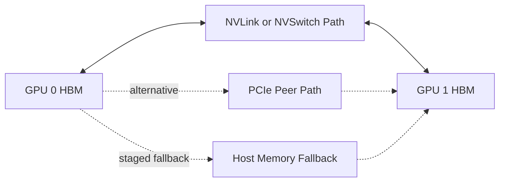

# Lab 02 — Validate Peer Access and NVLink

```yaml
Title: Validate Peer Access and NVLink
Volume: 07
Chapter: 03
Difficulty: Intermediate
Estimated Time: 90 Minutes
Prerequisites: CUDA toolkit or compatible CUDA container, at least two NVIDIA GPUs
Target Platform: Multi-GPU NVIDIA system
Target Audience: GPU Platform Engineers, Performance Engineers, SREs
Lab Type: L3 Configuration and Validation
```

## 1. Objective

Prove which GPU pairs can use peer access, determine which pairs communicate through NVLink or another path, measure pairwise bandwidth and latency, and create a baseline that can detect future topology degradation.

## 2. Background

A topology matrix describes expected connectivity. It does not prove that a CUDA process can enable peer access, that every expected link is active, or that delivered bandwidth is stable.

This lab separates four questions:

1. Are both GPUs visible and healthy?
2. Does the platform expose a peer path?
3. Can CUDA enable peer access?
4. Does measured behavior match the expected path?

## 3. Learning Outcomes

After completing this lab, you will be able to:

- read the GPU topology matrix;
- inspect NVLink status where supported;
- run CUDA peer-access validation;
- compare unidirectional and bidirectional transfer results;
- recognize asymmetric or unexpectedly weak pairs;
- collect telemetry during the test;
- distinguish lack of peer support from a degraded link.

## 4. Architecture



**Figure 7.L2.1 — Possible GPU-to-GPU paths.** The application-visible result depends on hardware topology, platform support, driver state, and CUDA peer capability.

## 5. Prerequisites

- Two or more NVIDIA GPUs
- NVIDIA driver and `nvidia-smi`
- CUDA toolkit with samples, or a compatible CUDA development container
- Compiler toolchain if building samples locally
- Permission to run sustained GPU transfers
- Completed Lab 01 topology inventory

:::warning Shared-system impact
Peer-bandwidth tests can consume GPU engines and interconnect bandwidth. Run them only during an approved test window.
:::

## 6. Environment

```bash
export LAB_DIR="$HOME/volume-07-lab-02-$(date +%Y%m%d-%H%M%S)"
mkdir -p "$LAB_DIR"

nvidia-smi --query-gpu=index,uuid,name,pci.bus_id,driver_version \
  --format=csv | tee "$LAB_DIR/gpu-inventory.csv"
nvidia-smi topo -m | tee "$LAB_DIR/topology-before.txt"
```

Record:

| Field | Value |
|---|---|
| Server model | |
| GPU model and count | |
| Driver version | |
| CUDA toolkit version | |
| GPU power mode | |
| MIG mode | |
| Virtualization mode | |

## 7. Components

| Component | Responsibility |
|---|---|
| CUDA peer-access API | Determines whether one device can access another device's memory |
| Copy engines | Move data asynchronously between supported memory domains |
| NVLink | Direct high-bandwidth GPU interconnect on supported systems |
| NVSwitch | Switch fabric connecting several GPUs on supported platforms |
| PCIe peer path | Alternative peer route when platform support permits |
| Host memory | Staging path when direct peer access is unavailable |

## 8. Deployment Steps

### Step 1 — Inspect expected connectivity

```bash
nvidia-smi topo -m | tee "$LAB_DIR/topology-matrix.txt"
nvidia-smi topo -p2p r | tee "$LAB_DIR/p2p-read.txt" 2>&1 || true
nvidia-smi topo -p2p w | tee "$LAB_DIR/p2p-write.txt" 2>&1 || true
```

**Expected output:** A matrix showing pair relationships and peer capability. Exact labels vary by platform and driver.

### Step 2 — Inspect NVLink state

```bash
nvidia-smi nvlink --status | tee "$LAB_DIR/nvlink-status.txt" 2>&1 || true
```

On systems without NVLink, the command may report that NVLink information is unavailable. That is not automatically an error.

Capture detailed GPU state:

```bash
nvidia-smi -q | tee "$LAB_DIR/nvidia-smi-q-before.txt"
```

### Step 3 — Obtain CUDA samples

Use the sample source that matches the installed toolkit or an approved container image. Example local workflow:

```bash
git clone --depth 1 https://github.com/NVIDIA/cuda-samples.git
cd cuda-samples/Samples/5_Domain_Specific/p2pBandwidthLatencyTest
make -j"$(nproc)"
```

Record the exact source revision. Do not assume that output formats are identical across toolkit versions.

### Step 4 — Run peer-access validation

```bash
./p2pBandwidthLatencyTest | tee "$LAB_DIR/p2p-bandwidth-latency.txt"
```

Also run `simpleP2P` when available:

```bash
cd ../../0_Introduction/simpleP2P
make -j"$(nproc)"
./simpleP2P | tee "$LAB_DIR/simple-p2p.txt"
```

**Expected healthy behavior:** Supported pairs pass data-integrity checks and report transfer results. Unsupported pairs are clearly identified rather than silently treated as direct peers.

### Step 5 — Repeat for stability

```bash
for run in 1 2 3 4 5; do
  echo "=== RUN $run ===" | tee -a "$LAB_DIR/repeated-results.txt"
  ./p2pBandwidthLatencyTest | tee -a "$LAB_DIR/repeated-results.txt"
done
```

Use the median and variation, not one peak number.

### Step 6 — Observe while testing

In another terminal:

```bash
nvidia-smi dmon -s pucvmt -d 1 | tee "$LAB_DIR/nvidia-dmon.txt"
```

Stop with `Ctrl+C` after the benchmark completes.

## 9. Validation

Validation passes when:

- all expected GPUs are present;
- topology output matches the approved platform design;
- supported peer pairs pass the CUDA validation;
- unsupported pairs are understood and documented;
- no new XID or link-related errors appear;
- repeated tests remain within an explainable range.

## 10. Verification

Build a matrix:

| Source GPU | Destination GPU | Expected path | Peer capable | Measured direction | Result range | Notes |
|---:|---:|---|---|---|---|---|
| 0 | 1 | | | H2D/D2D | | |

Answer:

1. Are all direct-link pairs peer capable?
2. Are any peer-capable pairs using a weaker PCIe path?
3. Are results symmetric in both directions?
4. Does one pair show excessive variance?
5. Does the physical topology explain the result?

## 11. Observability

Collect before and after evidence:

```bash
nvidia-smi -q | tee "$LAB_DIR/nvidia-smi-q-after.txt"
journalctl -k --since '30 minutes ago' | grep -Ei 'nvrm|nvidia|xid|pcie' \
  | tee "$LAB_DIR/kernel-events.txt"
```

Where supported, collect NVLink counters through approved DCGM or `nvidia-smi` interfaces. Compare deltas rather than isolated values.

## 12. Performance Measurements

Report:

- unidirectional bandwidth;
- bidirectional bandwidth;
- latency;
- run-to-run variation;
- GPU clocks and power state;
- selected source and destination pair;
- whether peer access was enabled;
- expected physical path.

Do not compare results across different GPU generations, power modes, or benchmark versions without qualification.

## 13. Failure Injection

Use one reversible logical failure.

### Option A — Select a weaker pair

Choose two GPUs without the preferred NVLink relationship and compare against a strong pair.

### Option B — Remote CPU affinity

Bind the benchmark process to a CPU NUMA node remote from the selected GPUs.

```bash
numactl --cpunodebind=<remote-node> --membind=<remote-node> \
  ./p2pBandwidthLatencyTest
```

The purpose is to demonstrate path sensitivity. Do not disable NVLink, change firmware, or unload drivers.

## 14. Troubleshooting

### Peer access unavailable

**Check:** GPU model, platform topology, virtualization mode, MIG mode, IOMMU policy, driver compatibility, and sample output.

**Root cause:** Unsupported pair, platform limitation, isolation mode, or software mismatch.

### One pair is much slower

**Check:** Topology matrix, direct-link state, PCIe negotiation, power state, concurrent workloads, and repeated-run variance.

**Resolution:** Correct placement, remove contention, restore the approved link state, or escalate hardware findings with evidence.

### Data-integrity validation fails

Stop the test. Collect GPU health, XID events, sample version, compiler version, and reproduction steps before retrying.

## 15. Cleanup

```bash
pkill -f 'nvidia-smi dmon' 2>/dev/null || true
```

Remove cloned sources and binaries only when they are not required for the baseline. Preserve the evidence directory.

## 16. Summary

You proved peer capability and measured the delivered path instead of relying only on hardware labels. The resulting matrix can guide rank placement and detect future regressions.

## 17. Challenge Exercises

- Generate a pairwise heat map from the output.
- Compare results before and after a driver upgrade.
- Correlate benchmark pairs with NCCL ring construction.
- Add the test to a node-acceptance workflow.

## 18. Further Reading

- [Volume 07 Introduction](../index)
- [NVLink and NVSwitch](../chapter-03-nvlink-and-nvswitch)
- [Topology-Aware Placement](../chapter-08-topology-aware-placement)
- [Performance Bottlenecks and Benchmarking](../chapter-10-performance-bottlenecks-and-benchmarking)
