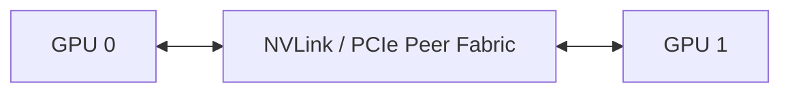

# Lab 02 — Validate Peer Access and NVLink

| Field | Value |
|---|---|
| Difficulty | Intermediate |
| Estimated time | 60 minutes |
| Target platform | Multi-GPU NVIDIA system |
| Lab type | Validation |

## 1. Objective

Validate peer reachability, NVLink state, and pairwise bandwidth without assuming every GPU pair is equivalent.

## 2. Background

A topology matrix shows expected relationships; controlled transfers prove the usable path.

## 3. Learning Outcomes

You will identify peer-capable pairs, measure directional bandwidth, and isolate a degraded or weaker path.

## 4. Architecture



## 5. Prerequisites

CUDA toolkit or suitable container, NVIDIA driver, at least two GPUs, and platform documentation.

## 6. Environment

Record GPU model, firmware, driver, CUDA version, power mode, and topology.

## 7. Components

CUDA peer access, copy engines, NVLink or PCIe paths, and GPU telemetry.

## 8. Deployment Steps

```bash
nvidia-smi topo -m
nvidia-smi nvlink --status || true
```

Build or run the CUDA samples `p2pBandwidthLatencyTest` and `simpleP2P` from a version compatible with the installed toolkit.

```bash
./p2pBandwidthLatencyTest | tee peer-results.txt
./simpleP2P | tee peer-validation.txt
```

## 9. Validation

Confirm the peer-access matrix matches the platform design and that supported pairs complete without errors.

## 10. Verification

Compare unidirectional and bidirectional results across local and weaker pairs. Use ranges, not one universal target.

## 11. Observability

Collect GPU clocks, power, temperature, NVLink counters, and XID events during the test.

## 12. Performance Measurements

Repeat tests several times and report median and variation. Separate warm-up from measured runs.

## 13. Failure Injection

Bind a process to a remote NUMA node or deliberately select a non-NVLink pair. Do not disable links or alter firmware.

## 14. Troubleshooting

If peer access fails, verify platform support, IOMMU policy, virtualization mode, driver state, and process permissions. If one pair is slow, compare topology and link telemetry with a known-good pair.

## 15. Cleanup

Remove build artifacts and test logs not required for the baseline.

## 16. Summary

You proved which GPU pairs can communicate directly and how topology changes performance.

## 17. Challenge Exercises

Create a heat map from the pairwise bandwidth matrix and propose rank placement.

## 18. Further Reading

- [NVLink and NVSwitch](../chapter-03-nvlink-and-nvswitch)
- [Topology-Aware Placement](../chapter-08-topology-aware-placement)
