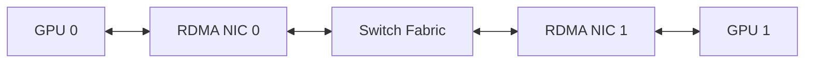

# Lab 03 — Benchmark RDMA and GPUDirect Paths

| Field | Value |
|---|---|
| Difficulty | Advanced |
| Estimated time | 90 minutes |
| Target platform | Two GPU nodes with supported RDMA |
| Lab type | Performance validation |

## 1. Objective

Establish host RDMA and GPU-buffer RDMA baselines and prove the transport selected by the communication stack.

## 2. Background

A healthy fabric can still deliver poor GPU communication when registration, topology, or library selection causes fallback.

## 3. Learning Outcomes

You will validate links, run layered bandwidth tests, inspect counters, and distinguish fabric issues from GPU-direct issues.

## 4. Architecture

## 5. Prerequisites

Two supported nodes, working RDMA transport, compatible drivers, GPU-direct benchmark tooling, and maintenance approval.

## 6. Environment

Record IP/GID/LID information, HCA firmware, driver stack, GPU driver, CUDA, topology, switch ports, and MTU.

## 7. Components

RDMA queues, registered host buffers, registered GPU buffers, completion queues, and the physical fabric.

## 8. Deployment Steps

Validate adapters and links with the platform’s supported tools. Run a host-memory bandwidth test first, for example the appropriate `perftest` command for the selected transport. Then run a GPU-buffer-aware test supported by the environment or NCCL point-to-point/collective tests.

Capture commands and outputs rather than pasting assumed values into documentation.

## 9. Validation

Confirm the host RDMA test reaches a stable range with no increasing error counters.

## 10. Verification

Confirm the GPU-buffer test uses RDMA rather than sockets or host staging by checking debug logs and CPU behavior.

## 11. Observability

Collect NIC counters, switch counters, PCIe state, GPU telemetry, and communication-library logs.

## 12. Performance Measurements

Test several message sizes, directions, and GPU/NIC pairings. Report median, tail, and run-to-run variance.

## 13. Failure Injection

Select a remote-socket NIC or force a nonpreferred interface in a controlled test. Do not disrupt shared fabric configuration.

## 14. Troubleshooting

If host RDMA is poor, inspect physical and fabric layers. If host RDMA is healthy but GPU RDMA is poor, inspect peer-memory support, registration, topology, and software compatibility.

## 15. Cleanup

Stop test servers, restore interface selection, and archive approved baseline results.

## 16. Summary

You built a layered evidence chain from physical link to GPU-buffer transfer.

## 17. Challenge Exercises

Repeat across same-rack and cross-rack pairs and compare oversubscription or routing effects.

## 18. Further Reading

- [GPUDirect RDMA](../chapter-05-gpudirect-rdma)
- [Performance Bottlenecks](../chapter-10-performance-bottlenecks-and-benchmarking)
