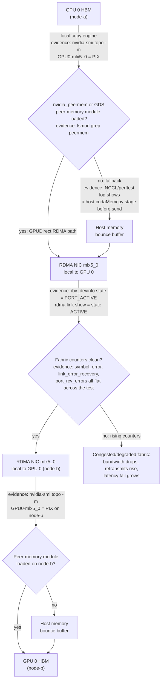

# Lab 03 — Benchmark RDMA and GPUDirect Paths

```yaml
Title: Benchmark RDMA and GPUDirect Paths
Volume: 07
Chapter: 05
Difficulty: Advanced
Estimated Time: 120 Minutes
Prerequisites: Two GPU nodes, working RDMA fabric, approved benchmark tools
Target Platform: Bare-metal GPU nodes with supported RDMA adapters
Target Audience: GPU Infrastructure Engineers, Network Engineers, SREs
Lab Type: L4 Production Validation
```

## 1. Objective

Build a layered network-performance baseline that separates host-memory RDMA, GPU-memory RDMA, topology effects, and collective-library behavior.

## 2. Background

A GPU-direct path depends on more than link state. The NIC, GPU, PCIe hierarchy, peer-memory support, registration path, communication library, and fabric must all cooperate. A healthy host RDMA result does not prove that GPU buffers use the same efficient path.

## 3. Learning Outcomes

After completing this lab, you will be able to:

- inventory RDMA devices and addressing;
- validate the host-memory RDMA path first;
- run an approved GPU-buffer or NCCL benchmark;
- verify the selected transport from logs and counters;
- compare local and remote GPU-to-NIC placement;
- distinguish physical-fabric problems from GPU-direct problems;
- create acceptance ranges without inventing universal thresholds.

## 4. Architecture



**Figure 7.L3.1 — Layered RDMA benchmark path with the fault-isolation branches this lab actually tests.** Host-memory and GPU-memory tests share the same physical fabric but take different local-I/O paths before the packet ever leaves the node. Each decision diamond names the exact command whose output proves that hop is healthy — Steps 1–7 below produce that evidence in the same order the diagram tests it.

## 5. Prerequisites

- Two isolated or approved GPU nodes
- Compatible NVIDIA GPU drivers
- Supported RDMA adapters and drivers
- Working InfiniBand or RoCE configuration
- `rdma-core`, `ibverbs-utils`, and approved `perftest` tools
- CUDA-aware benchmark or `nccl-tests`
- Firewall and security policy permitting the test
- Maintenance approval for sustained traffic

:::danger
Do not run saturation benchmarks on a shared production fabric without coordination. They can consume link bandwidth and affect latency-sensitive workloads.
:::

## 6. Environment

On both nodes:

```bash
export LAB_DIR="$HOME/volume-07-lab-03-$(date +%Y%m%d-%H%M%S)"
mkdir -p "$LAB_DIR"

hostname | tee "$LAB_DIR/hostname.txt"
nvidia-smi --query-gpu=index,uuid,name,pci.bus_id,driver_version \
  --format=csv | tee "$LAB_DIR/gpus.csv"
rdma link show | tee "$LAB_DIR/rdma-links.txt"
ibv_devinfo | tee "$LAB_DIR/ibv-devinfo.txt"
nvidia-smi topo -m | tee "$LAB_DIR/topology.txt"
```

Record adapter firmware, MTU, switch port, selected interface, GID or LID, routing domain, and benchmark versions.

**Illustrative reference system used throughout this lab:** two 8x H100 80GB SXM DGX-H100-class nodes (`node-a`, `node-b`), dual-socket, four NVSwitch-connected GPUs per socket, one ConnectX-7 NDR400 InfiniBand adapter local to each GPU (`mlx5_0`…`mlx5_7`, 400 Gb/s per port, theoretical line rate 50 GB/s). All numbers below are illustrative for this class of node — record your own node's actual values, they will differ by adapter generation, cable/switch health, and firmware.

Representative `nvidia-smi topo -m` output on `node-a` (abbreviated to the rows that matter for this lab; the full matrix has one row/column per GPU and NIC):

```text
$ nvidia-smi topo -m
        GPU0    GPU1    GPU2    GPU3    GPU4    GPU5    GPU6    GPU7    mlx5_0  mlx5_1  mlx5_3  mlx5_7  CPU Affinity     NUMA Affinity
GPU0     X      NV18    NV18    NV18    NV18    NV18    NV18    NV18    PIX     SYS     SYS     SYS     0-63,128-191     0
GPU1    NV18     X      NV18    NV18    NV18    NV18    NV18    NV18    SYS     PIX     SYS     SYS     0-63,128-191     0
GPU3    NV18    NV18    NV18     X      NV18    NV18    NV18    NV18    SYS     SYS     PIX     SYS     0-63,128-191     0
GPU7    NV18    NV18    NV18    NV18    NV18    NV18    NV18     X      SYS     SYS     SYS     PIX     64-127,192-255   1
mlx5_0   PIX     SYS     SYS     SYS     SYS     SYS     SYS     SYS      X      SYS     SYS     SYS
mlx5_7   SYS     SYS     SYS     SYS     SYS     SYS     SYS     PIX     SYS     SYS     SYS      X

Legend:
  X    = Self
  SYS  = Traversing PCIe as well as the SMP interconnect between NUMA nodes (QPI/UPI)
  PIX  = Traversing at most a single PCIe bridge
  NV#  = Connection traversing a bonded set of # NVLinks
```

Read this before running any benchmark: `GPU0`↔`mlx5_0` is `PIX` (one PCIe bridge apart, same NUMA node 0) — this is the GPU/NIC pair to use for a GPU-direct test on GPU 0. `GPU0`↔`mlx5_7` is `SYS`, meaning that pairing would cross the inter-socket link even before the packet reaches the wire; using it would still work, but bandwidth and latency would not represent the node's real capability. Every GPU-to-GPU pair shows `NV18` (18 bonded fourth-generation NVLinks through NVSwitch) — this is expected on an 8-GPU NVSwitch-connected node and is not itself evidence about the RDMA fabric, which is a separate physical path through the NICs.

## 7. Components

| Component | Evidence |
|---|---|
| GPU | UUID, PCI BDF, health, power state |
| RDMA adapter | Device, port state, firmware, PCI BDF |
| PCIe path | Root complex, switch, NUMA locality |
| Fabric | Link state, MTU, route, congestion counters |
| Host-memory registration | `perftest` host-buffer behavior |
| GPU-memory registration | CUDA-aware or GPU-direct test behavior |
| Communication library | Transport selection and debug logs |

## 8. Deployment Steps

### Step 1 — Prove basic reachability

Use the transport-appropriate checks. Examples:

```bash
ibstat
ibv_devices
rdma link show
```

Representative output on `node-a` (one port shown; the reference node has 8 ConnectX-7 ports, `mlx5_0`…`mlx5_7`, one per GPU):

```text
$ ibstat mlx5_0
CA 'mlx5_0'
        CA type: MT4129
        Number of ports: 1
        Firmware version: 28.39.2048
        Hardware version: 0
        Node GUID: 0x9803c8fffe1a2b30
        System image GUID: 0x9803c8fffe1a2b30
        Port 1:
                State: Active
                Physical state: LinkUp
                Rate: 400
                Base lid: 7
                LMC: 0
                SM lid: 1
                Capability mask: 0x2651e848
                Port GUID: 0x9803c8fffe1a2b30
                Link layer: InfiniBand

$ ibv_devices
    device                 node GUID
    ------              ----------------
    mlx5_0              9803c8fffe1a2b30
    mlx5_1              9803c8fffe1a2b31
    mlx5_2              9803c8fffe1a2b32
    mlx5_3              9803c8fffe1a2b33
    mlx5_4              9803c8fffe1a2b34
    mlx5_5              9803c8fffe1a2b35
    mlx5_6              9803c8fffe1a2b36
    mlx5_7              9803c8fffe1a2b37

$ rdma link show
link mlx5_0/1 state ACTIVE physical_state LINK_UP netdev enp27s0f0np0
link mlx5_1/1 state ACTIVE physical_state LINK_UP netdev enp59s0f0np0
link mlx5_2/1 state ACTIVE physical_state LINK_UP netdev enp91s0f0np0
link mlx5_3/1 state ACTIVE physical_state LINK_UP netdev enp123s0f0np0
link mlx5_4/1 state ACTIVE physical_state LINK_UP netdev enp155s0f0np0
link mlx5_5/1 state ACTIVE physical_state LINK_UP netdev enp187s0f0np0
link mlx5_6/1 state ACTIVE physical_state LINK_UP netdev enp219s0f0np0
link mlx5_7/1 state ACTIVE physical_state LINK_UP netdev enp251s0f0np0
```

**Interpretation:** `ibstat`'s `State: Active` / `Physical state: LinkUp` pair is the two-layer check to internalize — `Physical state` is the electrical/optical link (cable and transceiver good), while `State` is the InfiniBand subnet-manager-negotiated logical state; a port stuck at `Physical state: LinkUp` but `State: Initializing` for more than a few seconds after boot means the subnet manager hasn't completed initialization, not a cable problem. `Rate: 400` confirms the port negotiated the full NDR400 rate (400 Gb/s = 50 GB/s theoretical line rate) rather than falling back to a lower rate on a marginal cable. `rdma link show` reporting `state ACTIVE physical_state LINK_UP` for all 8 ports with the expected `netdev` name for each is the "F: Fabric counters clean?" precondition in Figure 7.L3.1 — this is the evidence you gather before Step 2's counters even matter, since a port that isn't `ACTIVE` will trivially fail every counter check downstream for an unrelated reason.

For RoCE, also validate IP, VLAN, MTU, priority, PFC, and ECN configuration using the environment's approved tools.

### Step 2 — Snapshot counters

```bash
for dev in /sys/class/infiniband/*/ports/*/counters; do
  echo "### $dev"
  grep -H . "$dev"/* 2>/dev/null
done | tee "$LAB_DIR/counters-before.txt"
```

Representative output for `mlx5_0`:

```text
### /sys/class/infiniband/mlx5_0/ports/1/counters
/sys/class/infiniband/mlx5_0/ports/1/counters/port_rcv_data:8823914021
/sys/class/infiniband/mlx5_0/ports/1/counters/port_xmit_data:8801220117
/sys/class/infiniband/mlx5_0/ports/1/counters/port_rcv_packets:41220981
/sys/class/infiniband/mlx5_0/ports/1/counters/port_xmit_packets:41198456
/sys/class/infiniband/mlx5_0/ports/1/counters/port_rcv_errors:0
/sys/class/infiniband/mlx5_0/ports/1/counters/symbol_error:0
/sys/class/infiniband/mlx5_0/ports/1/counters/link_error_recovery:0
/sys/class/infiniband/mlx5_0/ports/1/counters/link_downed:0
/sys/class/infiniband/mlx5_0/ports/1/counters/local_link_integrity_errors:0
/sys/class/infiniband/mlx5_0/ports/1/counters/excessive_buffer_overrun_errors:0
/sys/class/infiniband/mlx5_0/ports/1/counters/VL15_dropped:0
```

**Interpretation:** Record this snapshot before every benchmark run so the after-snapshot in Section 11 can be diffed rather than read in isolation — `port_rcv_data`/`port_xmit_data` will obviously grow under load, but `symbol_error`, `link_error_recovery`, `port_rcv_errors`, and `VL15_dropped` should stay at `0` (or their pre-test baseline) end to end. This is the `F: Fabric counters clean?` gate in Figure 7.L3.1 — any of these counters climbing during Step 3's bandwidth test, independent of the throughput number itself, is the signal that routes you to the `Degraded` branch (congested or degraded fabric) rather than a GPU-direct software problem.

### Step 3 — Run host-memory RDMA bandwidth

On the server node:

```bash
ib_write_bw --report_gbits --duration 30
```

On the client node, use the server address and the approved device or port selection:

```bash
ib_write_bw <server-address> --report_gbits --duration 30
```

Repeat with the transport-specific parameters required in your environment.

**Expected behavior:** The test completes, bandwidth stabilizes after warm-up, and error counters do not increase unexpectedly.

### Step 4 — Run host-memory latency

```bash
# Server
ib_write_lat

# Client
ib_write_lat <server-address>
```

Record median and tail behavior where the tool exposes them.

### Step 5 — Validate GPU-aware software support

Document the approved mechanism used by the platform, such as CUDA-aware MPI, a supported GPU-buffer extension in `perftest`, or `nccl-tests`.

Check loaded modules and packages without assuming a specific deployment model:

```bash
lsmod | grep -Ei 'nvidia|peermem|rdma'
ldconfig -p | grep -Ei 'nccl|ibverbs|cuda'
```

### Step 6 — Run GPU-buffer or NCCL validation

Example with `nccl-tests` across two nodes:

```bash
export NCCL_DEBUG=INFO
export NCCL_DEBUG_SUBSYS=INIT,NET,GRAPH

mpirun -np 2 -H node-a:1,node-b:1 \
  -x NCCL_DEBUG -x NCCL_DEBUG_SUBSYS \
  ./build/all_reduce_perf -b 8M -e 1G -f 2 -g 1 \
  | tee "$LAB_DIR/nccl-all-reduce.txt"
```

Adapt the launcher, host list, interface selection, and process binding to the approved environment.

### Step 7 — Capture transport evidence

Review logs for:

- selected network interface;
- RDMA transport selection;
- GPU Direct RDMA capability;
- socket fallback;
- rank-to-GPU mapping;
- ring or tree construction.

Do not infer GPU-direct usage from throughput alone.

## 9. Validation

The lab passes when:

- both RDMA ports are active;
- host-memory bandwidth and latency are stable;
- no unexplained physical or transport errors increase;
- the GPU-aware benchmark completes correctly;
- logs show the intended transport or clearly document fallback;
- CPU usage, counters, and topology are consistent with the selected path.

## 10. Verification

Create a results table:

| Test | Buffer type | GPU/NIC locality | Message size | Median result | Variance | Transport evidence |
|---|---|---|---|---|---|---|
| Host RDMA bandwidth | Host | Local | | | | |
| GPU-aware collective | GPU | Local | | | | |
| GPU-aware collective | GPU | Remote | | | | |

## 11. Observability

During tests, collect:

```bash
nvidia-smi dmon -s pucvmt -d 1 | tee "$LAB_DIR/gpu-dmon.txt"
```

Collect NIC and switch counters before and after. Also record:

- PCIe link state;
- CPU utilization;
- interrupt distribution;
- retransmission or congestion counters;
- XID and kernel events;
- communication-library logs.

## 12. Performance Measurements

Test several message sizes because small-message latency and large-message bandwidth exercise different limits.

Recommended reporting dimensions:

- 4 KiB to 64 KiB for latency-sensitive behavior;
- 1 MiB to 64 MiB for transition behavior;
- 128 MiB and above for sustained bandwidth;
- unidirectional and bidirectional modes where supported;
- same-rack and cross-rack pairs where approved.

Use repeated runs, median, and coefficient of variation. Do not publish a result without the topology and software versions that produced it.

## 13. Failure Injection

Use a reversible placement fault:

- select a NIC remote from the GPU;
- bind the rank to a remote CPU NUMA node;
- force an alternate approved interface only for the test process.

Example:

```bash
export NCCL_SOCKET_IFNAME=<nonpreferred-interface>
numactl --cpunodebind=<remote-node> --membind=<remote-node> \
  <approved-gpu-aware-test>
```

Do not alter shared PFC, ECN, routing, switch, or firmware configuration.

## 14. Troubleshooting

### Host RDMA is slow

Inspect link speed, MTU, routing, switch counters, adapter counters, PCIe negotiation, CPU affinity, and congestion.

### Host RDMA is healthy but GPU-aware traffic is slow

Inspect GPU-to-NIC locality, peer-memory support, registration failures, library compatibility, IOMMU mode, and transport fallback.

### Results vary heavily

Check competing traffic, power state, thermal behavior, CPU scheduling, adaptive routing, congestion events, and benchmark duration.

### Test hangs

Check address selection, firewall policy, launcher reachability, queue resources, library logs, and rank consistency. Stop the test before repeatedly retrying without evidence.

## 15. Cleanup

Stop benchmark servers and monitoring processes, unset test-only variables, and archive results.

```bash
unset NCCL_DEBUG NCCL_DEBUG_SUBSYS NCCL_SOCKET_IFNAME
pkill -f 'ib_write_bw|ib_write_lat|nvidia-smi dmon' 2>/dev/null || true
```

## 16. Summary

You built an evidence chain from physical RDMA health to host-memory transfer and finally to GPU-aware communication. This method prevents a GPU-direct problem from being misdiagnosed as a fabric problem—or the reverse.

## 17. Challenge Exercises

- Compare same-switch and cross-switch node pairs.
- Repeat with multiple ranks per node.
- Correlate NCCL topology output with Lab 01's physical map.
- Define acceptance ranges for node commissioning.
- Automate counter snapshots and result metadata.

## 18. Further Reading

- [Volume 07 Introduction](../index)
- [GPUDirect RDMA](../chapter-05-gpudirect-rdma)
- [ConnectX and GPU Network Adapters](../chapter-07-connectx-and-gpu-network-adapters)
- [Multi-Node Collectives and NCCL Paths](../chapter-09-multi-node-collectives-and-nccl-paths)
- [Performance Bottlenecks and Benchmarking](../chapter-10-performance-bottlenecks-and-benchmarking)
