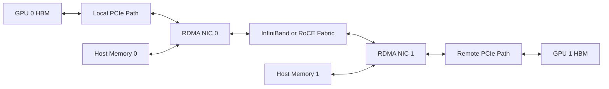

# Lab 03 — Benchmark RDMA and GPUDirect Paths

```yaml
Title: Benchmark RDMA and GPUDirect Paths
Volume: 07
Chapter: 05
Difficulty: Advanced
Estimated Time: 120 Minutes
Prerequisites: Two GPU nodes, working RDMA fabric, approved benchmark tools
Target Platform: Bare-metal GPU nodes with supported RDMA adapters
Target Audience: GPU Infrastructure Engineers, Network Engineers, SREs
Lab Type: L4 Production Validation
```

## 1. Objective

Build a layered network-performance baseline that separates host-memory RDMA, GPU-memory RDMA, topology effects, and collective-library behavior.

## 2. Background

A GPU-direct path depends on more than link state. The NIC, GPU, PCIe hierarchy, peer-memory support, registration path, communication library, and fabric must all cooperate. A healthy host RDMA result does not prove that GPU buffers use the same efficient path.

## 3. Learning Outcomes

After completing this lab, you will be able to:

- inventory RDMA devices and addressing;
- validate the host-memory RDMA path first;
- run an approved GPU-buffer or NCCL benchmark;
- verify the selected transport from logs and counters;
- compare local and remote GPU-to-NIC placement;
- distinguish physical-fabric problems from GPU-direct problems;
- create acceptance ranges without inventing universal thresholds.

## 4. Architecture



**Figure 7.L3.1 — Layered RDMA benchmark path.** Host-memory and GPU-memory tests share the network but exercise different registration and local-I/O paths.

## 5. Prerequisites

- Two isolated or approved GPU nodes
- Compatible NVIDIA GPU drivers
- Supported RDMA adapters and drivers
- Working InfiniBand or RoCE configuration
- `rdma-core`, `ibverbs-utils`, and approved `perftest` tools
- CUDA-aware benchmark or `nccl-tests`
- Firewall and security policy permitting the test
- Maintenance approval for sustained traffic

:::danger
Do not run saturation benchmarks on a shared production fabric without coordination. They can consume link bandwidth and affect latency-sensitive workloads.
:::

## 6. Environment

On both nodes:

```bash
export LAB_DIR="$HOME/volume-07-lab-03-$(date +%Y%m%d-%H%M%S)"
mkdir -p "$LAB_DIR"

hostname | tee "$LAB_DIR/hostname.txt"
nvidia-smi --query-gpu=index,uuid,name,pci.bus_id,driver_version \
  --format=csv | tee "$LAB_DIR/gpus.csv"
rdma link show | tee "$LAB_DIR/rdma-links.txt"
ibv_devinfo | tee "$LAB_DIR/ibv-devinfo.txt"
nvidia-smi topo -m | tee "$LAB_DIR/topology.txt"
```

Record adapter firmware, MTU, switch port, selected interface, GID or LID, routing domain, and benchmark versions.

## 7. Components

| Component | Evidence |
|---|---|
| GPU | UUID, PCI BDF, health, power state |
| RDMA adapter | Device, port state, firmware, PCI BDF |
| PCIe path | Root complex, switch, NUMA locality |
| Fabric | Link state, MTU, route, congestion counters |
| Host-memory registration | `perftest` host-buffer behavior |
| GPU-memory registration | CUDA-aware or GPU-direct test behavior |
| Communication library | Transport selection and debug logs |

## 8. Deployment Steps

### Step 1 — Prove basic reachability

Use the transport-appropriate checks. Examples:

```bash
ibstat
ibv_devices
rdma link show
```

For RoCE, also validate IP, VLAN, MTU, priority, PFC, and ECN configuration using the environment's approved tools.

### Step 2 — Snapshot counters

```bash
for dev in /sys/class/infiniband/*/ports/*/counters; do
  echo "### $dev"
  grep -H . "$dev"/* 2>/dev/null
done | tee "$LAB_DIR/counters-before.txt"
```

### Step 3 — Run host-memory RDMA bandwidth

On the server node:

```bash
ib_write_bw --report_gbits --duration 30
```

On the client node, use the server address and the approved device or port selection:

```bash
ib_write_bw <server-address> --report_gbits --duration 30
```

Repeat with the transport-specific parameters required in your environment.

**Expected behavior:** The test completes, bandwidth stabilizes after warm-up, and error counters do not increase unexpectedly.

### Step 4 — Run host-memory latency

```bash
# Server
ib_write_lat

# Client
ib_write_lat <server-address>
```

Record median and tail behavior where the tool exposes them.

### Step 5 — Validate GPU-aware software support

Document the approved mechanism used by the platform, such as CUDA-aware MPI, a supported GPU-buffer extension in `perftest`, or `nccl-tests`.

Check loaded modules and packages without assuming a specific deployment model:

```bash
lsmod | grep -Ei 'nvidia|peermem|rdma'
ldconfig -p | grep -Ei 'nccl|ibverbs|cuda'
```

### Step 6 — Run GPU-buffer or NCCL validation

Example with `nccl-tests` across two nodes:

```bash
export NCCL_DEBUG=INFO
export NCCL_DEBUG_SUBSYS=INIT,NET,GRAPH

mpirun -np 2 -H node-a:1,node-b:1 \
  -x NCCL_DEBUG -x NCCL_DEBUG_SUBSYS \
  ./build/all_reduce_perf -b 8M -e 1G -f 2 -g 1 \
  | tee "$LAB_DIR/nccl-all-reduce.txt"
```

Adapt the launcher, host list, interface selection, and process binding to the approved environment.

### Step 7 — Capture transport evidence

Review logs for:

- selected network interface;
- RDMA transport selection;
- GPU Direct RDMA capability;
- socket fallback;
- rank-to-GPU mapping;
- ring or tree construction.

Do not infer GPU-direct usage from throughput alone.

## 9. Validation

The lab passes when:

- both RDMA ports are active;
- host-memory bandwidth and latency are stable;
- no unexplained physical or transport errors increase;
- the GPU-aware benchmark completes correctly;
- logs show the intended transport or clearly document fallback;
- CPU usage, counters, and topology are consistent with the selected path.

## 10. Verification

Create a results table:

| Test | Buffer type | GPU/NIC locality | Message size | Median result | Variance | Transport evidence |
|---|---|---|---|---|---|---|
| Host RDMA bandwidth | Host | Local | | | | |
| GPU-aware collective | GPU | Local | | | | |
| GPU-aware collective | GPU | Remote | | | | |

## 11. Observability

During tests, collect:

```bash
nvidia-smi dmon -s pucvmt -d 1 | tee "$LAB_DIR/gpu-dmon.txt"
```

Collect NIC and switch counters before and after. Also record:

- PCIe link state;
- CPU utilization;
- interrupt distribution;
- retransmission or congestion counters;
- XID and kernel events;
- communication-library logs.

## 12. Performance Measurements

Test several message sizes because small-message latency and large-message bandwidth exercise different limits.

Recommended reporting dimensions:

- 4 KiB to 64 KiB for latency-sensitive behavior;
- 1 MiB to 64 MiB for transition behavior;
- 128 MiB and above for sustained bandwidth;
- unidirectional and bidirectional modes where supported;
- same-rack and cross-rack pairs where approved.

Use repeated runs, median, and coefficient of variation. Do not publish a result without the topology and software versions that produced it.

## 13. Failure Injection

Use a reversible placement fault:

- select a NIC remote from the GPU;
- bind the rank to a remote CPU NUMA node;
- force an alternate approved interface only for the test process.

Example:

```bash
export NCCL_SOCKET_IFNAME=<nonpreferred-interface>
numactl --cpunodebind=<remote-node> --membind=<remote-node> \
  <approved-gpu-aware-test>
```

Do not alter shared PFC, ECN, routing, switch, or firmware configuration.

## 14. Troubleshooting

### Host RDMA is slow

Inspect link speed, MTU, routing, switch counters, adapter counters, PCIe negotiation, CPU affinity, and congestion.

### Host RDMA is healthy but GPU-aware traffic is slow

Inspect GPU-to-NIC locality, peer-memory support, registration failures, library compatibility, IOMMU mode, and transport fallback.

### Results vary heavily

Check competing traffic, power state, thermal behavior, CPU scheduling, adaptive routing, congestion events, and benchmark duration.

### Test hangs

Check address selection, firewall policy, launcher reachability, queue resources, library logs, and rank consistency. Stop the test before repeatedly retrying without evidence.

## 15. Cleanup

Stop benchmark servers and monitoring processes, unset test-only variables, and archive results.

```bash
unset NCCL_DEBUG NCCL_DEBUG_SUBSYS NCCL_SOCKET_IFNAME
pkill -f 'ib_write_bw|ib_write_lat|nvidia-smi dmon' 2>/dev/null || true
```

## 16. Summary

You built an evidence chain from physical RDMA health to host-memory transfer and finally to GPU-aware communication. This method prevents a GPU-direct problem from being misdiagnosed as a fabric problem—or the reverse.

## 17. Challenge Exercises

- Compare same-switch and cross-switch node pairs.
- Repeat with multiple ranks per node.
- Correlate NCCL topology output with Lab 01's physical map.
- Define acceptance ranges for node commissioning.
- Automate counter snapshots and result metadata.

## 18. Further Reading

- [Volume 07 Introduction](../index)
- [GPUDirect RDMA](../chapter-05-gpudirect-rdma)
- [ConnectX and GPU Network Adapters](../chapter-07-connectx-and-gpu-network-adapters)
- [Multi-Node Collectives and NCCL Paths](../chapter-09-multi-node-collectives-and-nccl-paths)
- [Performance Bottlenecks and Benchmarking](../chapter-10-performance-bottlenecks-and-benchmarking)
