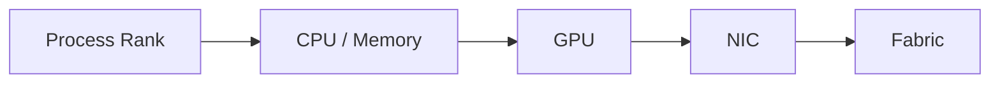

# Lab 04 — Troubleshoot a Multi-GPU Data Path

| Field | Value |
|---|---|
| Difficulty | Advanced |
| Estimated time | 75 minutes |
| Target platform | Multi-GPU node or two-node lab |
| Lab type | Failure and troubleshooting |

## 1. Objective

Use topology, telemetry, and layered benchmarks to find and correct an inefficient data path.

## 2. Background

Production incidents rarely announce the failed layer. They appear as low utilization, slow collectives, or one straggling rank.

## 3. Learning Outcomes

You will form a hypothesis, collect evidence, isolate the layer, correct placement, and prove recovery.

## 4. Architecture

## 5. Prerequisites

Completed Labs 01–03, a nonproduction environment, and permission to change process affinity or interface selection.

## 6. Environment

Archive the healthy topology and benchmark baseline before injecting failure.

## 7. Components

Launcher, CPU affinity, NUMA memory, GPU assignment, NIC selection, peer path, and communication library.

## 8. Deployment Steps

Run a known-good collective or transfer test. Then create one safe fault, such as binding a rank to a remote NUMA node, selecting a remote NIC, or disabling the preferred interface only for the test process.

## 9. Validation

Confirm the injected condition changes the intended path and does not affect unrelated users.

## 10. Verification

Observe reduced throughput, increased CPU usage, different library logs, or increased cross-socket traffic.

## 11. Observability

Collect topology, rank binding, NIC selection, PCIe state, GPU telemetry, network counters, and benchmark timing.

## 12. Performance Measurements

Compare healthy, broken, and repaired runs using identical message sizes and duration.

## 13. Failure Injection

Use only reversible process-level changes. Document the exact command and expected symptom.

## 14. Troubleshooting

Follow the evidence chain: inventory → local peer test → host RDMA → GPU RDMA → collective → application. Stop when the first layer diverges from baseline.

## 15. Cleanup

Restore affinity and environment variables, stop test processes, and rerun the healthy baseline.

## 16. Summary

You converted a vague performance symptom into a proven topology and placement root cause.

## 17. Challenge Exercises

Write a runbook decision tree and an automated preflight check that rejects the broken placement.

## 18. Further Reading

- [Topology-Aware Placement](../chapter-08-topology-aware-placement)
- [Volume 07 Summary](../chapter-12-volume-07-summary)
