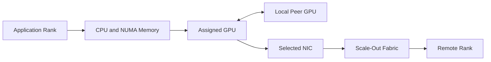

# Lab 04 — Troubleshoot a Multi-GPU Data Path

```yaml
Title: Troubleshoot a Multi-GPU Data Path
Volume: 07
Chapter: 11
Difficulty: Advanced
Estimated Time: 120 Minutes
Prerequisites: Completed Labs 01–03, non-production environment, approved benchmark workload
Target Platform: Multi-GPU node or two-node GPU lab
Target Audience: GPU Platform Engineers, SREs, Network Engineers
Lab Type: L5 Failure and Troubleshooting
```

## 1. Objective

Diagnose a communication-performance incident by following the data path from process placement through CPU affinity, GPU assignment, peer connectivity, NIC selection, and the scale-out fabric. Correct the root cause and prove recovery with identical before-and-after tests.

## 2. Background

Production communication failures rarely present as a clean “network down” event. More often, the application reports low GPU utilization, slow collectives, one straggling rank, high CPU consumption, or inconsistent throughput.

Blindly restarting drivers or replacing network hardware can destroy evidence. This lab teaches a layered incident workflow:

```text
Inventory → Local topology → Peer path → Host RDMA → GPU-aware path → Collective → Application
```

The first layer that diverges from the healthy baseline usually defines the investigation boundary.

## 3. Learning Outcomes

After completing this lab, you will be able to:

- define a healthy communication baseline;
- inject a reversible placement fault;
- form and test a topology hypothesis;
- correlate rank, CPU, GPU, and NIC placement;
- identify transport fallback and remote-NUMA paths;
- distinguish component health from path efficiency;
- restore the healthy state and verify recovery;
- write prevention controls and a production runbook.

## 4. Architecture



**Figure 7.L4.1 — Troubleshooting path.** A poor result may come from any boundary even when every component reports healthy status.

## 5. Prerequisites

- Lab 01 topology inventory
- Lab 02 peer-access baseline
- Lab 03 host and GPU-aware network baseline
- One approved benchmark or representative workload
- Ability to control process CPU affinity, GPU visibility, or interface selection
- No unrelated users on the test resources
- Rollback command prepared before failure injection

:::danger
Use only process-scoped and reversible failure injection. Do not disable shared links, alter switch policy, unload drivers, or change production firmware.
:::

## 6. Environment

Create an incident workspace.

```bash
export LAB_DIR="$HOME/volume-07-lab-04-$(date +%Y%m%d-%H%M%S)"
mkdir -p "$LAB_DIR"/{healthy,broken,recovered}

hostname | tee "$LAB_DIR/hostname.txt"
nvidia-smi topo -m | tee "$LAB_DIR/topology.txt"
numactl --hardware | tee "$LAB_DIR/numa.txt"
rdma link show | tee "$LAB_DIR/rdma-links.txt" 2>&1 || true
```

Record the benchmark command, message sizes, duration, process count, GPU mapping, CPU binding, and selected interface.

## 7. Components

| Layer | Healthy evidence | Broken evidence |
|---|---|---|
| Process launcher | Expected rank count and host map | Missing, duplicate, or misplaced rank |
| CPU affinity | Rank bound near GPU and NIC | Remote socket or unrestricted migration |
| GPU assignment | Correct UUID and local peer group | Wrong or fragmented device selection |
| Peer path | Expected NVLink or PCIe relationship | Host-staged or weaker pair |
| NIC selection | Adapter local to GPU group | Remote NIC or socket fallback |
| Fabric | Stable counters and route | Errors, congestion, or wrong interface |
| Collective library | Intended transport and topology | Fallback, timeout, or inefficient graph |

## 8. Deployment Steps

### Step 1 — Run the healthy baseline

Use the approved test from Lab 03 or a representative collective.

```bash
export NCCL_DEBUG=INFO
export NCCL_DEBUG_SUBSYS=INIT,NET,GRAPH

<healthy-benchmark-command> \
  2>&1 | tee "$LAB_DIR/healthy/benchmark.log"
```

Collect system state during the run:

```bash
nvidia-smi dmon -s pucvmt -d 1 \
  > "$LAB_DIR/healthy/gpu-dmon.txt" &
export DMON_PID=$!
```

Stop monitoring after the test.

```bash
kill "$DMON_PID" 2>/dev/null || true
```

### Step 2 — Prove the healthy placement

Capture rank and process affinity.

```bash
ps -eLo pid,tid,psr,comm,args | grep -E 'all_reduce_perf|python|mpirun' \
  | tee "$LAB_DIR/healthy/process-placement.txt"
```

Record the selected GPU UUID, CPU NUMA node, NIC, and communication transport.

### Step 3 — Select one safe failure

Choose exactly one:

#### Failure A — Remote CPU and memory binding

```bash
numactl --cpunodebind=<remote-node> --membind=<remote-node> \
  <benchmark-command> \
  2>&1 | tee "$LAB_DIR/broken/benchmark.log"
```

#### Failure B — Nonpreferred network interface

```bash
export NCCL_SOCKET_IFNAME=<nonpreferred-interface>
<benchmark-command> 2>&1 | tee "$LAB_DIR/broken/benchmark.log"
```

#### Failure C — Weaker GPU pair

Restrict the process to a documented weaker pair.

```bash
export CUDA_VISIBLE_DEVICES=<gpu-a>,<gpu-b>
<benchmark-command> 2>&1 | tee "$LAB_DIR/broken/benchmark.log"
```

### Step 4 — Confirm the failure changed only the intended path

Check:

- selected ranks and GPUs;
- CPU binding;
- interface selection;
- topology relationship;
- absence of unrelated hardware errors.

If the injected condition affects other users or shared configuration, stop and roll back immediately.

## 9. Validation

The failure injection is valid when:

- the benchmark still runs or fails in the expected controlled way;
- the selected path differs from the healthy baseline;
- unrelated GPUs, NICs, and workloads are unaffected;
- evidence demonstrates the changed affinity or interface;
- the symptom is repeatable at least twice.

## 10. Verification

Compare healthy and broken runs.

| Metric | Healthy | Broken | Difference |
|---|---:|---:|---:|
| Throughput | | | |
| Latency | | | |
| GPU utilization | | | |
| CPU utilization | | | |
| Cross-socket traffic | | | |
| Transport selected | | | |
| Error or congestion counters | | | |

A result is useful only when the benchmark inputs are identical apart from the injected condition.

## 11. Observability

Collect evidence for both states:

```bash
nvidia-smi --query-gpu=index,uuid,pci.bus_id,utilization.gpu,utilization.memory,power.draw \
  --format=csv -l 1
```

Capture:

- `nvidia-smi topo -m`;
- process CPU affinity with `taskset -pc <pid>`;
- memory policy with `numactl --show`;
- NIC selection from communication-library logs;
- adapter and switch counters;
- PCIe state;
- kernel and XID events;
- benchmark timestamps and message sizes.

## 12. Performance Measurements

Use at least five healthy, five broken, and five recovered runs when practical. Report:

- median;
- minimum and maximum;
- run-to-run variance;
- tail behavior;
- topology and software versions.

Do not claim a percentage improvement from one pair of runs.

## 13. Failure Injection

Document the exact fault in the incident record:

```yaml
Failure: Remote NUMA binding
Scope: One benchmark process
Expected Symptom: Increased CPU overhead and lower GPU communication throughput
Rollback: Remove numactl binding and rerun standard launcher
Safety Boundary: No system or fabric configuration changed
```

## 14. Troubleshooting

### Step 1 — Inventory

Are all expected devices visible and healthy? If not, stop at hardware or driver diagnosis.

### Step 2 — Local peer path

Does the selected GPU pair match the approved topology? Compare with Lab 02.

### Step 3 — Host RDMA

If host RDMA is degraded, investigate the local PCIe and network fabric before GPU-direct software.

### Step 4 — GPU-aware transport

If host RDMA is healthy but the GPU test is poor, inspect registration support, peer-memory modules, topology, IOMMU policy, and fallback logs.

### Step 5 — Collective construction

Inspect rank mapping, ring or tree construction, channel count, and interface selection.

### Step 6 — Application

Only after lower layers pass should you investigate framework scheduling, tensor sizes, overlap, and synchronization.

### Root-cause statement template

> The workload was functionally healthy but used `<inefficient path>` because `<placement or selection cause>`. Evidence included `<logs, topology, counters, benchmark delta>`. Restoring `<approved placement>` returned results to the baseline range.

## 15. Cleanup

Restore the environment.

```bash
unset NCCL_SOCKET_IFNAME CUDA_VISIBLE_DEVICES
pkill -f 'nvidia-smi dmon' 2>/dev/null || true
```

Rerun the original healthy command:

```bash
<healthy-benchmark-command> \
  2>&1 | tee "$LAB_DIR/recovered/benchmark.log"
```

Confirm telemetry, counters, and throughput return to the healthy range.

## 16. Summary

You converted a vague performance symptom into a proven path-level root cause. The exercise demonstrated why topology, process placement, and transport evidence must be examined before replacing hardware or tuning application code.

## 17. Challenge Exercises

- Convert the troubleshooting workflow into a Mermaid decision tree.
- Write a preflight script that rejects remote GPU-to-NIC placement.
- Add alerts for transport fallback or repeated NCCL timeout patterns.
- Repeat the exercise with a weaker GPU peer pair.
- Build a support bundle that collects all evidence with one command.

## 18. Further Reading

- [Volume 07 Introduction](../index)
- [Topology-Aware Placement](../chapter-08-topology-aware-placement)
- [Multi-Node Collectives and NCCL Paths](../chapter-09-multi-node-collectives-and-nccl-paths)
- [Performance Bottlenecks and Benchmarking](../chapter-10-performance-bottlenecks-and-benchmarking)
- [Production Design Scenarios](../chapter-11-production-design-scenarios)
- [Volume 07 Summary](../chapter-12-volume-07-summary)
