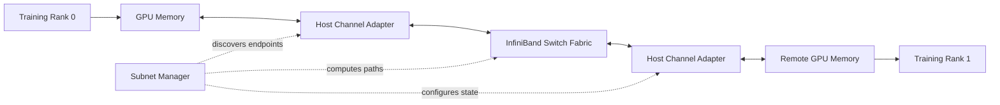
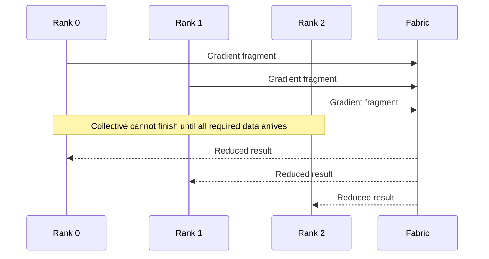
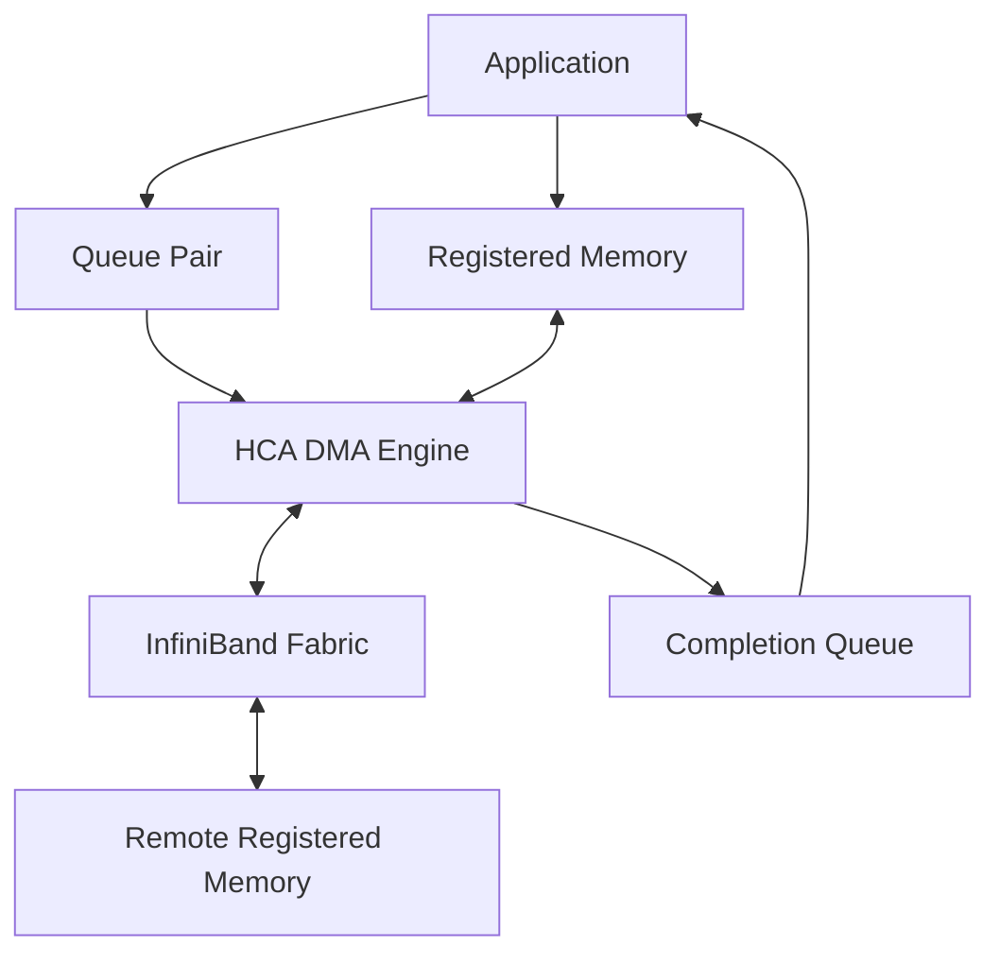

# Why InfiniBand Exists

## Introduction

A distributed training job runs across hundreds of GPUs. Every node passes diagnostics. The model fits in memory. The storage system feeds data quickly enough. Yet step time varies from iteration to iteration, and scaling efficiency collapses as more nodes join.

The problem is not simply “the network is slow.” The workload has turned the network into part of the execution engine.

During an AllReduce, AllGather, ReduceScatter, or point-to-point model-parallel exchange, ranks cannot progress independently. One delayed path can hold back the entire group. At this scale, average throughput is insufficient. The fabric must deliver predictable latency, sustained bandwidth, efficient memory movement, and operational evidence when behavior changes.

InfiniBand exists for this class of system.

| Chapter field | Value |
|---|---|
| Volume | 08 — InfiniBand |
| Difficulty | Advanced |
| Estimated reading time | 60–75 minutes |
| Primary focus | Why tightly coupled systems need a managed RDMA fabric |
| Previous | Volume 07 — GPU Networking |
| Next | InfiniBand Architecture and Link Layers |

## Story: The Cluster That Was Reachable but Not Fast

A customer deploys a 256-GPU training cluster. Acceptance tests confirm that every host can communicate with every other host. Link-state dashboards are green. Simple point-to-point tests show high bandwidth.

The first large training job performs well for several minutes, then step time begins to oscillate. GPU utilization drops in waves. Some collective operations complete quickly; others take several times longer.

The initial debate follows familiar organizational boundaries:

- the application team suspects NCCL;
- the platform team suspects process placement;
- the network team points to active links;
- the storage team notes that checkpoint traffic overlaps with training.

A layered investigation shows that all four teams are partly correct. One switch tier is carrying uneven traffic. A subset of ports negotiated below the intended width. Several ranks use HCAs remote from their assigned GPUs. Checkpoint traffic shares the same fabric during peak collective phases.

Nothing is completely unavailable. The system is simply no longer behaving as one coordinated machine.

That is the problem InfiniBand architecture must solve: not basic reachability, but predictable distributed execution.

## Learning Objectives

After completing this chapter, you will be able to:

- explain why tightly synchronized workloads stress conventional networking assumptions;
- describe why bandwidth, latency, jitter, and synchronization must be evaluated together;
- explain the architectural purpose of RDMA;
- distinguish the InfiniBand data plane from its subnet-management control plane;
- identify HCAs, switches, queues, routes, addressing, and registered memory as one system;
- explain when InfiniBand is appropriate and when it adds unnecessary complexity;
- structure a customer discovery conversation before recommending a fabric.

## Big Picture

**Figure 8.1.1 — InfiniBand combines a high-speed data path with a managed fabric control plane.** Applications submit work through HCAs while the subnet manager discovers the fabric and establishes usable paths.

## The Fundamental Workload Difference

Traditional enterprise applications are often loosely coupled. One service sends a request, waits for a response, and can retry or route around a slow dependency. Capacity is commonly expressed as transactions per second or aggregate throughput.

Distributed AI and HPC workloads are often tightly coupled. Many ranks advance through a sequence of compute and communication phases. A synchronization point forces faster participants to wait for the slowest.

**Figure 8.1.2 — Collective completion depends on the slowest required participant.** A small delay becomes job-wide idle time.

This changes the network design objective.

| Loosely coupled service | Tightly coupled distributed workload |
|---|---|
| Requests can often be retried independently | Ranks frequently wait at synchronization points |
| Average latency may be acceptable | Tail latency and jitter can dominate step time |
| Traffic is often many independent flows | Traffic may form synchronized bursts |
| CPU networking overhead may be tolerable | Repeated CPU copies and kernel transitions become visible |
| Reachability proves basic service | Reachability says little about collective efficiency |

## Why Conventional Host Networking Became Expensive

A conventional socket-based data path may involve:

1. an application prepares data;
2. the operating system copies or maps buffers;
3. the kernel networking stack processes the request;
4. protocol work consumes CPU cycles;
5. the NIC transmits the payload;
6. the receiving host performs the reverse path;
7. the application is notified and copies or consumes the data.

This model is general, portable, and secure. It is excellent for many workloads. The problem appears when a distributed job repeats large transfers at high frequency and expects low variation.

Costs accumulate through:

- system calls and context transitions;
- CPU protocol processing;
- intermediate memory copies;
- cache pollution;
- interrupt or polling overhead;
- queueing variability;
- scheduler interference.

At small scale, these costs may be hidden behind computation. At large scale, they become part of every iteration.

## Why RDMA Matters

Remote Direct Memory Access allows an adapter to move data between registered memory regions with reduced CPU involvement in the payload path.

The CPU still performs important work:

- resource creation;
- memory registration;
- queue setup;
- work submission;
- completion processing;
- error handling;
- orchestration and security.

RDMA does not remove the CPU. It removes selected copies and protocol work from the critical data path.

**Figure 8.1.3 — RDMA separates control from payload movement.** The application posts work, the HCA moves data, and completions report progress or failure.

## Why InfiniBand Is More Than RDMA

RDMA is a capability. InfiniBand is a complete fabric architecture built around that capability.

It includes:

- host channel adapters;
- switch forwarding;
- physical and link layers;
- queue-based transports;
- addressing and path information;
- partitions and protection;
- subnet management;
- routing and path calculation;
- congestion and flow-control mechanisms;
- port, link, route, and performance telemetry.

A production fabric must make all these layers work together.

## The Host Channel Adapter

The Host Channel Adapter (HCA) connects a server to the InfiniBand fabric. It is not merely a faster Ethernet NIC.

The HCA:

- owns queue and transport resources;
- accesses registered memory;
- executes work requests;
- packetizes and transmits operations;
- validates protection information;
- reports completions and errors;
- exposes counters and health state.

In GPU systems, HCA placement matters. A fast adapter attached to the wrong PCIe root may force traffic across a CPU interconnect before reaching the GPU. Fabric speed cannot compensate for poor local topology.

## The Switch Fabric

InfiniBand switches forward traffic according to fabric configuration and path information. Large deployments may use leaf-spine, fat-tree, dragonfly-like, rail-optimized, or other validated topologies.

The physical topology determines:

- path length;
- bisection bandwidth;
- oversubscription;
- failure domains;
- cable count;
- switch radix requirements;
- upgrade complexity;
- congestion behavior.

A switch fabric is not automatically non-blocking merely because every link is fast. The ratio of endpoint-facing capacity to uplink capacity matters.

## The Subnet Manager

InfiniBand includes an explicit subnet-management model. The subnet manager discovers the fabric, assigns identifiers, calculates forwarding paths, and configures operational state.

This produces an important distinction:

> A port can be physically present and electrically healthy without being fully usable by the subnet.

The operational state may depend on:

- successful discovery;
- valid local identifiers;
- configured forwarding tables;
- partition membership;
- correct subnet-manager authority;
- compatible link state;
- path availability.

The subnet manager is therefore part of the fabric’s availability architecture, not an optional monitoring utility.

## Predictability versus Peak Speed

Customers often ask which fabric has the highest bandwidth. Peak bandwidth matters, but synchronized workloads also care about consistency.

A useful performance model includes:

- **serialization time:** how long the payload takes to cross the link;
- **latency:** fixed and variable delay per operation;
- **jitter:** variation between otherwise similar operations;
- **contention:** multiple flows sharing links and queues;
- **synchronization amplification:** one slow path delaying many ranks;
- **topology:** number and quality of hops;
- **software efficiency:** how effectively the application uses the transport.

A fabric that delivers slightly lower peak throughput but lower tail latency may produce better job completion time than a fabric with higher peaks and unstable behavior.

## InfiniBand versus Ethernet: The Architectural Question

The correct comparison is not “Which technology is better?” It is “Which operational model best satisfies the workload?”

| Decision area | InfiniBand tendency | Ethernet tendency |
|---|---|---|
| Fabric model | Purpose-built managed RDMA fabric | General-purpose network with optional RoCE/RDMA design |
| Operations | Specialized tools and subnet management | Broader enterprise familiarity and integration |
| Isolation | Partitions and fabric controls | VLAN, VRF, ACL, QoS, and cloud-native controls |
| Congestion design | Native fabric mechanisms and topology practices | Requires careful PFC, ECN, QoS, and routing design for RoCE |
| Customer fit | Tightly coupled AI/HPC at scale | Broad mixed workloads and organizational standardization |

Both can support AI workloads. The choice depends on performance targets, operational maturity, existing standards, scale, and risk tolerance.

## When InfiniBand Is Appropriate

InfiniBand becomes attractive when:

- distributed jobs synchronize frequently;
- communication occupies a large fraction of iteration time;
- large messages and high message rates coexist;
- predictable tail latency matters;
- direct-memory transport is required;
- the cluster needs high bisection bandwidth;
- the organization can operate a specialized fabric;
- the software stack is validated for the transport.

## When InfiniBand May Be the Wrong Choice

InfiniBand may add unnecessary cost or complexity when:

- workloads are primarily single-node;
- inference requests are independent and modest in scale;
- communication is not on the critical path;
- the organization lacks InfiniBand operational skills;
- enterprise Ethernet integration is a stronger requirement;
- cloud or virtualization constraints favor another transport;
- the expected performance improvement is not measurable.

A good architect can explain why not to use a technology.

## Production Architecture Considerations

### Scalability

Scaling requires more than adding switch ports. Evaluate topology, uplinks, bisection bandwidth, routing, subnet-manager scale, cable plant, telemetry retention, and operational blast radius.

### Availability

Plan for failed ports, cables, HCAs, switches, subnet managers, and management paths. Define which failures reduce bandwidth and which stop communication.

### Security and isolation

Use partitions, access controls, supported virtualization mechanisms, and least privilege. Direct-memory transport increases the importance of correct memory registration and protection.

### Observability

Collect endpoint, switch, route, error, congestion, and application evidence. Retain healthy baselines by node class, rail, rack, and message size.

### Lifecycle management

Firmware, driver, OFED, CUDA, NCCL, switch software, and subnet-manager changes must be qualified as a compatibility set. Upgrade one layer without understanding the others and a working fabric can become an inconsistent one.

### Cost

Include adapters, switches, optics or cables, rack space, power, cooling, support, spares, tooling, and specialist staffing. Purchase price alone is not total cost.

## Production Troubleshooting

### Scenario 1 — Port is up but traffic does not flow

**Symptoms**

- physical link indicators are healthy;
- the port does not reach the expected logical state;
- applications cannot establish communication.

**Diagnosis**

Check subnet-manager availability, port state, local identifier assignment, partition membership, path records, forwarding state, and recent topology changes.

**Likely root causes**

- subnet manager not authoritative;
- incomplete discovery;
- invalid partition configuration;
- incompatible link settings;
- stale or missing path state.

### Scenario 2 — Bandwidth is lower on one node group

**Symptoms**

- basic connectivity passes;
- one rack or rail delivers lower throughput;
- collective performance depends on node selection.

**Diagnosis**

Compare negotiated speed and width, error counters, routes, cable inventory, HCA locality, and switch-port baselines.

**Likely root causes**

- degraded link width;
- damaged cable or transceiver;
- different route length;
- oversubscribed uplink;
- remote NUMA placement.

### Scenario 3 — Latency rises only under load

**Symptoms**

- idle benchmarks look healthy;
- concurrent jobs cause tail latency spikes;
- retries or congestion indicators increase.

**Diagnosis**

Inspect traffic distribution, hot links, service levels, congestion counters, adaptive-routing behavior, and competing storage or management traffic.

**Likely root causes**

- synchronized incast;
- topology imbalance;
- poor path diversity;
- shared traffic classes;
- incorrect congestion configuration.

### Prevention

Commission every node and switch against a documented baseline. Revalidate after cable, firmware, topology, routing, or subnet-manager changes.

## Customer Discovery Framework

Before recommending InfiniBand, ask:

1. What workloads will use the fabric?
2. How many GPUs participate in one job?
3. Which collective patterns dominate?
4. What percentage of step time is communication?
5. What growth is expected over three years?
6. Is storage traffic shared with training traffic?
7. What availability target applies?
8. Which networking skills exist internally?
9. What is the upgrade and support model?
10. What evidence would justify the investment?

Only after answering these questions should the discussion move to switch generations, rail counts, or cable speeds.

## Interview Preparation

### Knowledge Questions

1. Why does synchronization amplify network jitter?
2. What problem does RDMA solve?
3. What is the role of an HCA?
4. Why is the subnet manager required?
5. Why does active link state not prove fabric health?

### Architecture Questions

1. Draw the InfiniBand data and control planes.
2. Explain how GPU-to-HCA locality affects distributed training.
3. Compare a non-blocking and oversubscribed topology.
4. Design subnet-manager availability for a production cluster.

### Scenario Questions

1. Point-to-point bandwidth is healthy, but AllReduce is slow. What do you inspect?
2. One rack performs worse after maintenance. How do you isolate the cause?
3. The fabric is stable at idle but unstable under concurrent jobs. What changes in your diagnosis?

### Customer Questions

1. Why should we choose InfiniBand instead of Ethernet?
2. What operational skills will we need?
3. How do we prove the fabric is delivering business value?
4. When would you advise us not to buy InfiniBand?

### Whiteboard Question

Draw a 64-node two-tier fabric. Mark endpoint links, uplinks, subnet management, failure domains, and the point where oversubscription would appear.

## Summary

InfiniBand exists because tightly coupled workloads require more than packet delivery. They require efficient remote memory access, queue-based communication, managed paths, predictable behavior, and fabric-level operations.

Its value appears when communication is on the critical path. Its complexity is justified only when workload requirements and organizational capability demand it.

## Key Takeaways

- Distributed AI turns the network into part of the compute system.
- Synchronization makes tail latency and jitter job-wide concerns.
- RDMA reduces selected CPU and copy overhead but still requires control and protection.
- InfiniBand combines HCAs, switches, transports, addressing, routes, and subnet management.
- Reachability does not prove bandwidth, latency, or collective efficiency.
- InfiniBand should be selected from workload and operational requirements, not GPU count alone.

## Quick Revision Sheet

| Concept | Remember |
|---|---|
| Tight coupling | Ranks wait for one another |
| RDMA | Adapter moves data between registered memory regions |
| HCA | Host endpoint for queue-based transport |
| Subnet manager | Discovers fabric and programs usable paths |
| Tail latency | Slow operations delay synchronized jobs |
| Bisection bandwidth | Capacity available across a topology cut |
| Reachability | Necessary but insufficient evidence of health |

## Lab Checklist

Before moving on, confirm that you can:

- explain why synchronized workloads expose network variability;
- draw the HCA-to-switch-to-HCA data path;
- distinguish physical link state from subnet state;
- explain why GPU-to-HCA topology matters;
- describe when InfiniBand is not required.

## Cross References

- [Volume 08 Introduction](./index)
- Next: [InfiniBand Architecture and Link Layers](./chapter-02-infiniband-architecture-and-link-layers)
- Previous volume: [Volume 07 — GPU Networking](pathname://../volume-07/index)
- Related foundation: [DMA, RDMA, and Peer-to-Peer](pathname://../volume-07/chapter-04-dma-rdma-and-peer-to-peer)
- Related lab: [Inventory an InfiniBand Fabric](./labs/lab-01-inventory-an-infiniband-fabric)

## Further Reading

Use the current InfiniBand Architecture Specification, NVIDIA networking documentation, HCA and switch manuals, subnet-manager documentation, firmware release notes, and the validated software support matrix for the deployed platform.