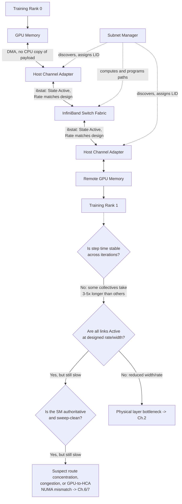
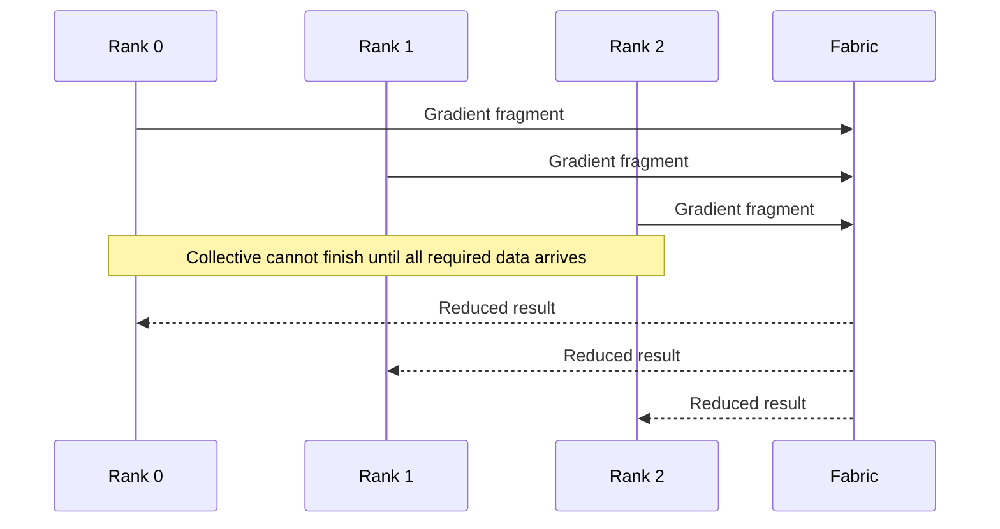
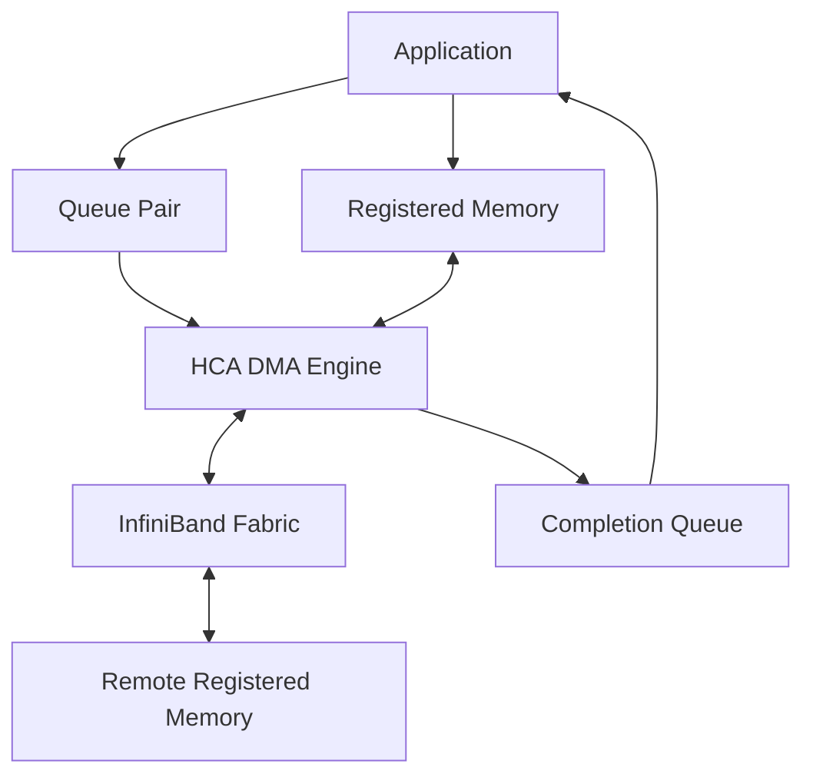

# Why InfiniBand Exists

## Introduction

A distributed training job runs across hundreds of GPUs. Every node passes diagnostics. The model fits in memory. The storage system feeds data quickly enough. Yet step time varies from iteration to iteration, and scaling efficiency collapses as more nodes join.

The problem is not simply “the network is slow.” The workload has turned the network into part of the execution engine.

During an AllReduce, AllGather, ReduceScatter, or point-to-point model-parallel exchange, ranks cannot progress independently. One delayed path can hold back the entire group. At this scale, average throughput is insufficient. The fabric must deliver predictable latency, sustained bandwidth, efficient memory movement, and operational evidence when behavior changes.

InfiniBand exists for this class of system.

| Chapter field | Value |
|---|---|
| Volume | 08 — InfiniBand |
| Difficulty | Advanced |
| Estimated reading time | 60–75 minutes |
| Primary focus | Why tightly coupled systems need a managed RDMA fabric |
| Previous | Volume 07 — GPU Networking |
| Next | InfiniBand Architecture and Link Layers |

## Story: The Cluster That Was Reachable but Not Fast

A customer deploys a 256-GPU training cluster. Acceptance tests confirm that every host can communicate with every other host. Link-state dashboards are green. Simple point-to-point tests show high bandwidth.

The first large training job performs well for several minutes, then step time begins to oscillate. GPU utilization drops in waves. Some collective operations complete quickly; others take several times longer.

The initial debate follows familiar organizational boundaries:

- the application team suspects NCCL;
- the platform team suspects process placement;
- the network team points to active links;
- the storage team notes that checkpoint traffic overlaps with training.

A layered investigation shows that all four teams are partly correct. One switch tier is carrying uneven traffic. A subset of ports negotiated below the intended width. Several ranks use HCAs remote from their assigned GPUs. Checkpoint traffic shares the same fabric during peak collective phases.

Nothing is completely unavailable. The system is simply no longer behaving as one coordinated machine.

That is the problem InfiniBand architecture must solve: not basic reachability, but predictable distributed execution.

## Learning Objectives

After completing this chapter, you will be able to:

- explain why tightly synchronized workloads stress conventional networking assumptions;
- describe why bandwidth, latency, jitter, and synchronization must be evaluated together;
- explain the architectural purpose of RDMA;
- distinguish the InfiniBand data plane from its subnet-management control plane;
- identify HCAs, switches, queues, routes, addressing, and registered memory as one system;
- explain when InfiniBand is appropriate and when it adds unnecessary complexity;
- structure a customer discovery conversation before recommending a fabric.

## Big Picture



**Figure 8.1.1 — InfiniBand combines a high-speed data path with a managed fabric control plane, and "green" at each hop is a specific, checkable claim, not a color.** Reachability (the top row) and fabric health (the SM annotations) are necessary but not sufficient — the decision path underneath is what actually separates "physically fine" from "delivering predictable collective performance." This is the mechanism behind the chapter's opening story: every one of the three root causes (reduced width, adaptive-routing behavior, NUMA-mismatched HCAs) lives on a different branch of this same diagram.

## The Fundamental Workload Difference

Traditional enterprise applications are often loosely coupled. One service sends a request, waits for a response, and can retry or route around a slow dependency. Capacity is commonly expressed as transactions per second or aggregate throughput.

Distributed AI and HPC workloads are often tightly coupled. Many ranks advance through a sequence of compute and communication phases. A synchronization point forces faster participants to wait for the slowest.



**Figure 8.1.2 — Collective completion depends on the slowest required participant.** A small delay becomes job-wide idle time.

This changes the network design objective.

| Loosely coupled service | Tightly coupled distributed workload |
|---|---|
| Requests can often be retried independently | Ranks frequently wait at synchronization points |
| Average latency may be acceptable | Tail latency and jitter can dominate step time |
| Traffic is often many independent flows | Traffic may form synchronized bursts |
| CPU networking overhead may be tolerable | Repeated CPU copies and kernel transitions become visible |
| Reachability proves basic service | Reachability says little about collective efficiency |

## Why Conventional Host Networking Became Expensive

A conventional socket-based data path may involve:

1. an application prepares data;
2. the operating system copies or maps buffers;
3. the kernel networking stack processes the request;
4. protocol work consumes CPU cycles;
5. the NIC transmits the payload;
6. the receiving host performs the reverse path;
7. the application is notified and copies or consumes the data.

This model is general, portable, and secure. It is excellent for many workloads. The problem appears when a distributed job repeats large transfers at high frequency and expects low variation.

Costs accumulate through:

- system calls and context transitions;
- CPU protocol processing;
- intermediate memory copies;
- cache pollution;
- interrupt or polling overhead;
- queueing variability;
- scheduler interference.

At small scale, these costs may be hidden behind computation. At large scale, they become part of every iteration.

## Why RDMA Matters

Remote Direct Memory Access allows an adapter to move data between registered memory regions with reduced CPU involvement in the payload path.

The CPU still performs important work:

- resource creation;
- memory registration;
- queue setup;
- work submission;
- completion processing;
- error handling;
- orchestration and security.

RDMA does not remove the CPU. It removes selected copies and protocol work from the critical data path.



**Figure 8.1.3 — RDMA separates control from payload movement.** The application posts work, the HCA moves data, and completions report progress or failure.

## Why InfiniBand Is More Than RDMA

RDMA is a capability. InfiniBand is a complete fabric architecture built around that capability.

It includes:

- host channel adapters;
- switch forwarding;
- physical and link layers;
- queue-based transports;
- addressing and path information;
- partitions and protection;
- subnet management;
- routing and path calculation;
- congestion and flow-control mechanisms;
- port, link, route, and performance telemetry.

A production fabric must make all these layers work together.

## The Host Channel Adapter

The Host Channel Adapter (HCA) connects a server to the InfiniBand fabric. It is not merely a faster Ethernet NIC.

The HCA:

- owns queue and transport resources;
- accesses registered memory;
- executes work requests;
- packetizes and transmits operations;
- validates protection information;
- reports completions and errors;
- exposes counters and health state.

In GPU systems, HCA placement matters. A fast adapter attached to the wrong PCIe root may force traffic across a CPU interconnect before reaching the GPU. Fabric speed cannot compensate for poor local topology.

## The Switch Fabric

InfiniBand switches forward traffic according to fabric configuration and path information. Large deployments may use leaf-spine, fat-tree, dragonfly-like, rail-optimized, or other validated topologies.

The physical topology determines:

- path length;
- bisection bandwidth;
- oversubscription;
- failure domains;
- cable count;
- switch radix requirements;
- upgrade complexity;
- congestion behavior.

A switch fabric is not automatically non-blocking merely because every link is fast. The ratio of endpoint-facing capacity to uplink capacity matters.

## The Subnet Manager

InfiniBand includes an explicit subnet-management model. The subnet manager discovers the fabric, assigns identifiers, calculates forwarding paths, and configures operational state.

This produces an important distinction:

> A port can be physically present and electrically healthy without being fully usable by the subnet.

The operational state may depend on:

- successful discovery;
- valid local identifiers;
- configured forwarding tables;
- partition membership;
- correct subnet-manager authority;
- compatible link state;
- path availability.

The subnet manager is therefore part of the fabric’s availability architecture, not an optional monitoring utility.

## Predictability versus Peak Speed

Customers often ask which fabric has the highest bandwidth. Peak bandwidth matters, but synchronized workloads also care about consistency.

A useful performance model includes:

- **serialization time:** how long the payload takes to cross the link;
- **latency:** fixed and variable delay per operation;
- **jitter:** variation between otherwise similar operations;
- **contention:** multiple flows sharing links and queues;
- **synchronization amplification:** one slow path delaying many ranks;
- **topology:** number and quality of hops;
- **software efficiency:** how effectively the application uses the transport.

A fabric that delivers slightly lower peak throughput but lower tail latency may produce better job completion time than a fabric with higher peaks and unstable behavior.

### Turning "predictability" into a number: annotated `ib_write_bw` and `ib_write_lat`

Peak bandwidth claims are usually proven with a single large-message run. Predictability claims require reading the *distribution*, not the average. A representative `ib_write_bw` run (host-memory RDMA write, one queue pair, 2MiB messages) looks like this:

```text
$ ib_write_bw -d mlx5_0 -i 1 --report_gbits -F --duration 10 <server>
---------------------------------------------------------------------------------------
                    RDMA_Write BW Test
Dual-port       : OFF          Device         : mlx5_0
Number of qps   : 1            Transport type : IB
Connection type : RC           Using SRQ      : OFF
rdma_cm QPs     : OFF
Data ex. method  : Ethernet
---------------------------------------------------------------------------------------
local address: LID 0x0c QPN 0x012a PSN 0x3a1f2e RKey 0x1c0a00 VAddr 0x7f2a10000000
remote address: LID 0x51 QPN 0x00e3 PSN 0x0091ab RKey 0x1c0b00 VAddr 0x7f11a0000000
---------------------------------------------------------------------------------------
 #bytes  #iterations  BW peak[Gb/sec]  BW average[Gb/sec]  MsgRate[Mpps]
 2097152 18420        399.82           398.71              23.76
---------------------------------------------------------------------------------------
```

**Reading it:** `BW average` (398.71 Gb/s) is close to `BW peak` (399.82 Gb/s) — a ~0.3% spread. On a 400Gb/s-class HDR/NDR-generation link, this is the signature of a healthy, uncongested path: the average tracks the peak because nothing is intermittently stalling the queue pair. `local address`/`remote address` confirm this ran over the actual RC (Reliable Connected) transport at the LIDs shown, not a fallback path.

Now the same path under concurrent load from an unrelated job sharing an upstream switch — same command, same message size, same host pair:

```text
 #bytes  #iterations  BW peak[Gb/sec]  BW average[Gb/sec]  MsgRate[Mpps]
 2097152 18420        399.71           241.06              14.36
```

**Reading it:** `BW peak` is essentially unchanged (399.71 Gb/s) — the link itself is not degraded, and a single-snapshot "is the link fast?" check would still pass. `BW average` has collapsed to 241.06 Gb/s, a ~40% drop, because credit backpressure from the congested upstream path is stalling the queue intermittently. This is exactly the gap the chapter's "predictability versus peak speed" argument is about: **peak proves the link can go fast for an instant; average-under-concurrency proves whether it stays fast**, and only the second number predicts real job completion time. `ib_write_lat` run alongside this would show the same story from the latency side — p50 barely moves while p99 stretches, because tail latency is where synchronization amplification actually bites (Figure 8.1.2).

## InfiniBand versus Ethernet: The Architectural Question

The correct comparison is not “Which technology is better?” It is “Which operational model best satisfies the workload?”

| Decision area | InfiniBand tendency | Ethernet tendency |
|---|---|---|
| Fabric model | Purpose-built managed RDMA fabric | General-purpose network with optional RoCE/RDMA design |
| Operations | Specialized tools and subnet management | Broader enterprise familiarity and integration |
| Isolation | Partitions and fabric controls | VLAN, VRF, ACL, QoS, and cloud-native controls |
| Congestion design | Native fabric mechanisms and topology practices | Requires careful PFC, ECN, QoS, and routing design for RoCE |
| Customer fit | Tightly coupled AI/HPC at scale | Broad mixed workloads and organizational standardization |

Both can support AI workloads. The choice depends on performance targets, operational maturity, existing standards, scale, and risk tolerance.

## When InfiniBand Is Appropriate

InfiniBand becomes attractive when:

- distributed jobs synchronize frequently;
- communication occupies a large fraction of iteration time;
- large messages and high message rates coexist;
- predictable tail latency matters;
- direct-memory transport is required;
- the cluster needs high bisection bandwidth;
- the organization can operate a specialized fabric;
- the software stack is validated for the transport.

## When InfiniBand May Be the Wrong Choice

InfiniBand may add unnecessary cost or complexity when:

- workloads are primarily single-node;
- inference requests are independent and modest in scale;
- communication is not on the critical path;
- the organization lacks InfiniBand operational skills;
- enterprise Ethernet integration is a stronger requirement;
- cloud or virtualization constraints favor another transport;
- the expected performance improvement is not measurable.

A good architect can explain why not to use a technology.

## Production Architecture Considerations

### Scalability

Scaling requires more than adding switch ports. Evaluate topology, uplinks, bisection bandwidth, routing, subnet-manager scale, cable plant, telemetry retention, and operational blast radius.

### Availability

Plan for failed ports, cables, HCAs, switches, subnet managers, and management paths. Define which failures reduce bandwidth and which stop communication.

### Security and isolation

Use partitions, access controls, supported virtualization mechanisms, and least privilege. Direct-memory transport increases the importance of correct memory registration and protection.

### Observability

Collect endpoint, switch, route, error, congestion, and application evidence. Retain healthy baselines by node class, rail, rack, and message size.

### Lifecycle management

Firmware, driver, OFED, CUDA, NCCL, switch software, and subnet-manager changes must be qualified as a compatibility set. Upgrade one layer without understanding the others and a working fabric can become an inconsistent one.

### Cost

Include adapters, switches, optics or cables, rack space, power, cooling, support, spares, tooling, and specialist staffing. Purchase price alone is not total cost.

## Production Troubleshooting

### Scenario 1 — Port is up but traffic does not flow

**Symptoms**

- physical link indicators are healthy;
- the port does not reach the expected logical state;
- applications cannot establish communication.

**Diagnosis**

Check subnet-manager availability, port state, local identifier assignment, partition membership, path records, forwarding state, and recent topology changes.

**Likely root causes**

- subnet manager not authoritative;
- incomplete discovery;
- invalid partition configuration;
- incompatible link settings;
- stale or missing path state.

**Evidence.** `ibstat` on the affected port is the first read:

```text
$ ibstat mlx5_2
CA 'mlx5_2'
    CA type: MT4129
    Number of ports: 1
    Port 1:
        State: Initializing
        Physical state: LinkUp
        Rate: 400
        Base lid: 0
        LMC: 0
        SM lid: 0
        Capability mask: 0x2651e848
        Port GUID: 0x9803eb0300a1b2c4
```

`Physical state: LinkUp` proves the wire and lane negotiation succeeded — this is why the port LED reads green. But `State: Initializing` (not `Active`), `Base lid: 0`, and `SM lid: 0` prove the subnet manager has never assigned this port a usable identity: it exists on the wire but not in the subnet. This is precisely the "green LED, no LID" symptom from this chapter's opening story, and it is diagnosable from one command without touching the switch.

### Scenario 2 — Bandwidth is lower on one node group

**Symptoms**

- basic connectivity passes;
- one rack or rail delivers lower throughput;
- collective performance depends on node selection.

**Diagnosis**

Compare negotiated speed and width, error counters, routes, cable inventory, HCA locality, and switch-port baselines.

**Likely root causes**

- degraded link width;
- damaged cable or transceiver;
- different route length;
- oversubscribed uplink;
- remote NUMA placement.

**Evidence.** Comparing `ibstat` between the slow rack and a known-good rack isolates width immediately:

```text
# Known-good node
$ ibstat mlx5_0 | grep -E 'State|Rate'
        State: Active
        Rate: 400

# Slow-rack node
$ ibstat mlx5_0 | grep -E 'State|Rate'
        State: Active
        Rate: 100
```

Both ports report `Active` — a naive up/down check passes on both. But `Rate: 100` versus `Rate: 400` means the slow-rack port negotiated at one-quarter the designed signaling rate, most commonly because only one of four lanes qualified (a bent connector or a marginal cable). At the same offered load, this node group's effective bandwidth ceiling is ~25% of the healthy rack's — which is exactly the "collective performance depends on node selection" symptom, because any collective touching this rack now serializes behind its slowest participant.

### Scenario 3 — Latency rises only under load

**Symptoms**

- idle benchmarks look healthy;
- concurrent jobs cause tail latency spikes;
- retries or congestion indicators increase.

**Diagnosis**

Inspect traffic distribution, hot links, service levels, congestion counters, adaptive-routing behavior, and competing storage or management traffic.

**Likely root causes**

- synchronized incast;
- topology imbalance;
- poor path diversity;
- shared traffic classes;
- incorrect congestion configuration.

### Prevention

Commission every node and switch against a documented baseline. Revalidate after cable, firmware, topology, routing, or subnet-manager changes.

## Customer Discovery Framework

Before recommending InfiniBand, ask:

1. What workloads will use the fabric?
2. How many GPUs participate in one job?
3. Which collective patterns dominate?
4. What percentage of step time is communication?
5. What growth is expected over three years?
6. Is storage traffic shared with training traffic?
7. What availability target applies?
8. Which networking skills exist internally?
9. What is the upgrade and support model?
10. What evidence would justify the investment?

Only after answering these questions should the discussion move to switch generations, rail counts, or cable speeds.

## Interview Preparation

### Knowledge Questions

1. Why does synchronization amplify network jitter?
   **Model answer:** "In a loosely coupled service, one slow request only hurts that request. In a synchronized collective like AllReduce, every rank has to arrive at the same barrier before any of them can proceed — so the group's completion time is the completion time of its single slowest participant, every iteration. A jitter spike that would be invisible in a request-response system becomes a job-wide stall, repeated thousands of times over a training run, because the fast ranks are burning idle GPU time waiting."

2. What problem does RDMA solve?
   **Model answer:** "It removes the CPU and the kernel networking stack from the payload-movement path. A conventional socket send touches a system call, a kernel copy, protocol processing, and an interrupt on the far end — all per message. RDMA lets the HCA move data directly between registered memory regions on two machines after the CPU has set up the queue and permissions once, so the per-message cost drops to roughly the DMA and wire time, not a full kernel round trip."

3. What is the role of an HCA?
   **Model answer:** "It's the endpoint that owns the queue pairs, does the DMA into and out of registered memory, packetizes and transmits on the wire, and reports completions back to the application. It's not just a faster NIC — a conventional NIC hands frames to the kernel; an HCA executes application-described work requests with the CPU largely out of the payload path."

4. Why is the subnet manager required?
   **Model answer:** "InfiniBand switches don't run a distributed routing protocol like Ethernet/IP does. They forward using tables that something else has to compute and program. The subnet manager is that something — it discovers every node and switch, assigns LIDs, computes routes, and pushes forwarding state into every switch. Without it, a fully cabled fabric is just a pile of unconfigured hardware; nothing forwards until the SM programs it."

5. Why does active link state not prove fabric health?
   **Model answer:** "`Active` proves the physical layer negotiated and the port passed subnet-manager admission — that's two checkpoints, not the whole path. It says nothing about negotiated width versus design, route balance, congestion on the path this specific traffic takes, or GPU-to-HCA locality. I've seen `ibstat` show `Active` at a quarter of designed rate — technically 'up,' operationally degraded."

### Architecture Questions

1. Draw the InfiniBand data and control planes.
   **Model answer:** "I'd draw the data plane as the horizontal path — GPU memory to HCA to switch fabric to remote HCA to remote GPU memory — and the control plane as the subnet manager sitting off to the side with dotted arrows into every HCA and switch on that path, labeled 'discovers, assigns LID, programs routes.' The key point I'd say out loud while drawing: the SM's arrows never touch the data plane's horizontal line during normal operation — packets don't route through the SM — but every box on that line only forwards because the SM configured it first."

2. Explain how GPU-to-HCA locality affects distributed training.
   **Model answer:** "If a GPU's assigned HCA sits on a different NUMA node or a different PCIe root complex, every RDMA operation from that GPU has to cross the CPU interconnect — QPI/UPI or equivalent — before it even reaches the fabric. That adds latency and consumes cross-socket bandwidth that's shared with everything else running on that CPU. At scale, a handful of misplaced ranks like this shows up as unexplained stragglers in a collective, because their local hop is already slower than everyone else's before the network is even involved."

3. Compare a non-blocking and oversubscribed topology.
   **Model answer:** "Non-blocking means uplink capacity from a leaf equals or exceeds its downlink (endpoint-facing) capacity, so in principle every endpoint can talk to every other endpoint at full rate simultaneously. Oversubscribed means uplink capacity is deliberately lower — a 2:1 ratio means 16 endpoint ports share 8 uplink ports' worth of bandwidth. Oversubscription isn't automatically wrong; it's a bet that not all endpoints will need full bandwidth at the same instant. The risk is entirely workload-dependent: an all-to-all collective that saturates every endpoint at once is exactly the pattern that breaks that bet."

4. Design subnet-manager availability for a production cluster.
   **Model answer:** "One authoritative master, at least one standby on genuinely independent power and management infrastructure, both running identical, version-controlled routing and partition configuration. I'd test failover under real traffic before go-live, not just confirm the standby process starts — because a standby with drifted configuration can 'succeed' at taking over and still reroute traffic differently, which shows up as a performance regression that looks unrelated to the failover event."

### Scenario Questions

1. Point-to-point bandwidth is healthy, but AllReduce is slow. What do you inspect?
   **Model answer:** "Point-to-point healthy rules out the physical path and basic transport for that one pair, so I'd move to what's specific to the collective: rank placement relative to topology, whether the ring or tree crosses an oversubscribed cut repeatedly, and per-link utilization during the actual collective — not during the synthetic benchmark. I'd also check whether all participating ranks individually have healthy point-to-point paths, not just the one pair I originally tested."

2. One rack performs worse after maintenance. How do you isolate the cause?
   **Model answer:** "First I'd diff the current topology snapshot against the pre-maintenance one — cabling mistakes during maintenance are common and preserve reachability while changing which ports go where. Then `ibstat` across every port in that rack for rate and width versus baseline. If both check out, I'd look at routing — maintenance can trigger an SM sweep that redistributes paths differently than before, concentrating this rack's traffic onto fewer uplinks even though nothing physically changed for it."

3. The fabric is stable at idle but unstable under concurrent jobs. What changes in your diagnosis?
   **Model answer:** "At idle, there's no contention, so physical and subnet-state checks are the whole story and they'll look clean. Under concurrent load I'm now looking for congestion evidence specifically — transmit-wait counters, credit-stall patterns, whether multiple jobs share the same uplinks or virtual lanes. A fabric can be completely healthy by every idle-time metric and still congest badly the moment two synchronized collectives compete for the same cut — that's a routing/placement problem, not a hardware problem, and it only shows up under exactly the load pattern that matters."

### Customer Questions

1. Why should we choose InfiniBand instead of Ethernet?
   **Model answer:** "It depends on how much of your step time is communication and how synchronized your workload is. If you're running large synchronized training jobs where tail latency and jitter directly extend every iteration, InfiniBand's native RDMA, credit-based flow control, and centralized routing give you more predictable behavior with less tuning than getting equivalent behavior out of RoCE on Ethernet. If your workloads are mostly independent inference requests, that predictability may not be worth the operational specialization."

2. What operational skills will we need?
   **Model answer:** "Subnet-manager administration, fabric-specific diagnostic tools like `ibstat`/`iblinkinfo`/`ibqueryerrors`, and topology-aware troubleshooting that's different from typical Ethernet/IP runbooks. This isn't a skill set most enterprise network teams already have, and underestimating that ramp is one of the most common reasons InfiniBand deployments underperform their potential in year one."

3. How do we prove the fabric is delivering business value?
   **Model answer:** "Baseline your actual training throughput and scaling efficiency as GPU count grows, and compare it against the theoretical peak for your model and cluster size. The value of InfiniBand isn't 'the link is fast' — it's measurable in scaling efficiency staying flat as you add nodes, instead of degrading, because communication isn't becoming the bottleneck."

4. When would you advise us not to buy InfiniBand?
   **Model answer:** "If your workload is primarily single-node, or your inference traffic is bursty and independent rather than synchronized, or your team doesn't have and doesn't want fabric-specialist skills — I'd say a well-tuned Ethernet/RoCE design gets you most of the benefit with infrastructure your team already knows how to run. I'd rather say that up front than sell complexity you won't operationally sustain."

### Whiteboard Question

Draw a 64-node two-tier fabric. Mark endpoint links, uplinks, subnet management, failure domains, and the point where oversubscription would appear.

**What I'd actually say while drawing:** "I'll put leaf switches across the bottom, each with, say, 16 endpoint-facing ports feeding my 64 nodes across 4 leaves, and a spine layer above connecting to every leaf. The oversubscription point is right here" — pointing at a leaf — "if each leaf has 16 downlinks to nodes but only 8 uplinks to spine, that's a 2:1 ratio, and it's a property of this leaf, not the whole fabric, so I'd mark it per-tier, not as one global number. The subnet manager goes off to the side with dotted lines into every leaf and spine — it's not in the data path. Failure domains: one leaf failing takes out 16 nodes' local connectivity; one spine failing reduces uplink capacity fabric-wide but shouldn't disconnect anyone if I have at least two spines — that redundancy is exactly what I'd point to as the reason two spines, not one, is the actual availability requirement here."

## Summary

InfiniBand exists because tightly coupled workloads require more than packet delivery. They require efficient remote memory access, queue-based communication, managed paths, predictable behavior, and fabric-level operations.

Its value appears when communication is on the critical path. Its complexity is justified only when workload requirements and organizational capability demand it.

## Key Takeaways

- Distributed AI turns the network into part of the compute system.
- Synchronization makes tail latency and jitter job-wide concerns.
- RDMA reduces selected CPU and copy overhead but still requires control and protection.
- InfiniBand combines HCAs, switches, transports, addressing, routes, and subnet management.
- Reachability does not prove bandwidth, latency, or collective efficiency.
- InfiniBand should be selected from workload and operational requirements, not GPU count alone.

## Quick Revision Sheet

| Concept | Remember |
|---|---|
| Tight coupling | Ranks wait for one another |
| RDMA | Adapter moves data between registered memory regions |
| HCA | Host endpoint for queue-based transport |
| Subnet manager | Discovers fabric and programs usable paths |
| Tail latency | Slow operations delay synchronized jobs |
| Bisection bandwidth | Capacity available across a topology cut |
| Reachability | Necessary but insufficient evidence of health |

## Lab Checklist

Before moving on, confirm that you can:

- explain why synchronized workloads expose network variability;
- draw the HCA-to-switch-to-HCA data path;
- distinguish physical link state from subnet state;
- explain why GPU-to-HCA topology matters;
- describe when InfiniBand is not required.

## Cross References

- [Volume 08 Introduction](./index)
- Next: [InfiniBand Architecture and Link Layers](./chapter-02-infiniband-architecture-and-link-layers)
- Previous volume: [Volume 07 — GPU Networking](pathname://../volume-07/index)
- Related foundation: [DMA, RDMA, and Peer-to-Peer](pathname://../volume-07/chapter-04-dma-rdma-and-peer-to-peer)
- Related lab: [Inventory an InfiniBand Fabric](./labs/lab-01-inventory-an-infiniband-fabric)

## Further Reading

Use the current InfiniBand Architecture Specification, NVIDIA networking documentation, HCA and switch manuals, subnet-manager documentation, firmware release notes, and the validated software support matrix for the deployed platform.