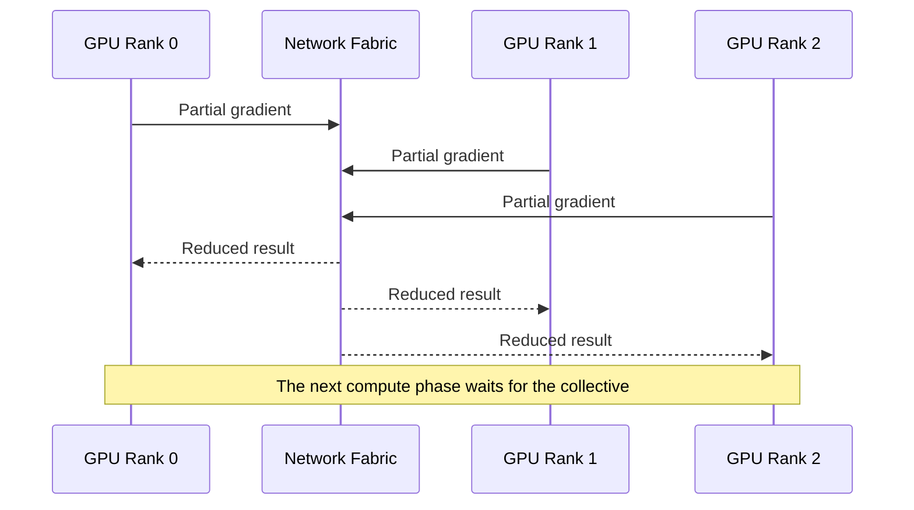
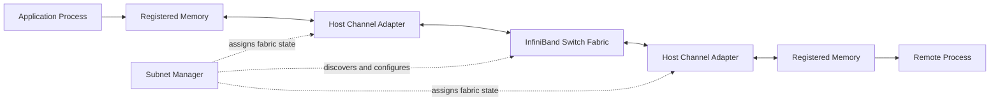

# Why InfiniBand Exists

A distributed training job runs across hundreds of GPUs. Each node is individually healthy, yet step time varies from iteration to iteration. A small delay in one communication phase forces every participant in the collective operation to wait. The application is not simply sending messages; it is coordinating a parallel machine.

InfiniBand exists for environments where communication is part of the computation itself. It combines high-throughput links, remote direct memory access, queue-based transports, centralized fabric management, and mechanisms intended to deliver predictable communication across large clusters.

## Learning Objectives

After completing this chapter, you will be able to:

- explain why tightly synchronized workloads stress conventional networking models;
- describe the architectural purpose of RDMA;
- distinguish the data plane from the subnet-management control plane;
- identify HCAs, switches, queue-based transports, and addressing as core fabric elements;
- explain when InfiniBand is appropriate and when it adds unnecessary complexity;
- frame InfiniBand value in production rather than marketing terms.

## The Problem: Communication on the Critical Path

A web application can often tolerate variable network delay by retrying, buffering, or serving another request. A synchronized training job behaves differently. During an AllReduce operation, ranks exchange partial results and cannot continue until the collective completes.

One delayed path can increase the completion time for all participants. Predictability therefore matters alongside peak bandwidth.

## Why the Socket Model Became Expensive

Traditional networking usually moves data through several software and memory layers. An application calls the operating system, kernel networking processes the request, data may be copied into intermediate buffers, and the network adapter transmits it. The receiving side reverses the process.

This model is general and safe, but repeated kernel transitions, CPU involvement, buffer copies, and interrupt processing consume resources and add variability. Large distributed workloads transfer substantial volumes repeatedly, making those costs visible.

RDMA changes the data path. After resources and permissions are established, an adapter can move data directly between registered memory regions with less CPU involvement. The CPU still participates in setup, control, memory registration, and application logic, but it does not need to copy every payload.

## The InfiniBand System Model

**Figure 8.1.1 — InfiniBand combines an RDMA data path with a managed fabric control plane.** The adapter executes queue-based operations while the subnet manager establishes usable fabric state.

## Core Architectural Elements

### Host Channel Adapter

The HCA connects a host to the fabric. It owns transport resources, processes work requests, accesses registered memory, and reports completions. In GPU systems, adapter placement relative to GPUs and CPUs affects the end-to-end path.

### Switch fabric

Switches forward traffic across the subnet. A production design must account for topology, path diversity, oversubscription, failure domains, cable plant, and congestion behavior.

### Queue-based communication

Applications submit work requests to queues rather than asking the kernel to process every message synchronously. Queue pairs represent transport endpoints, while completion queues report finished or failed operations.

### Subnet management

InfiniBand uses a subnet manager to discover the fabric, assign local identifiers, calculate paths, and maintain operational state. A link can be electrically active while the port remains unusable because subnet configuration has not completed correctly.

## What InfiniBand Optimizes

InfiniBand is designed around the needs of clustered systems:

- efficient remote memory access;
- high message rates;
- low and predictable latency;
- large sustained transfers;
- explicit transport semantics;
- fabric-level topology and path management;
- operational visibility into ports, routes, errors, and congestion.

These properties benefit distributed AI, HPC, storage, and other workloads in which communication overhead materially affects delivered computation.

## When InfiniBand Is Appropriate

InfiniBand becomes attractive when:

- workloads synchronize frequently across many nodes;
- communication consumes a significant portion of job time;
- direct-memory paths are required;
- the cluster needs high bisection bandwidth and predictable latency;
- the organization can operate a specialized fabric;
- application and middleware stacks support the transport effectively.

It may be unnecessary for independent single-node jobs, modest inference services, or environments where operational standardization on Ethernet is more valuable than the incremental performance benefit.

## Production Trade-Offs

| Dimension | Benefit | Operational cost |
|---|---|---|
| RDMA | Reduces CPU and copy overhead | Requires memory registration and transport-aware software |
| Managed subnet | Consistent fabric discovery and path state | Introduces subnet-manager design and recovery requirements |
| Specialized tooling | Deep fabric diagnostics | Requires trained operators and dedicated runbooks |
| High-density fabrics | Strong distributed performance | Increases cable, topology, cooling, and lifecycle complexity |
| Predictable transport | Helps synchronized workloads | Must still be validated under congestion and failures |

InfiniBand does not remove bottlenecks automatically. Poor GPU-to-HCA locality, oversubscribed topology, weak collective configuration, storage interference, or unhealthy links can still dominate performance.

## Production Scenario

A cluster passes a simple ping-style test, but collective bandwidth varies widely. The operations team initially suspects the training framework. A layered investigation reveals that several ports are active at a degraded width after a cabling change. Basic reachability remained intact, but aggregate capacity and path balance changed.

The incident illustrates why production validation must include link state, width, speed, error counters, topology, routes, and application-level benchmarks—not reachability alone.

## Troubleshooting Framework

**Symptoms**

- collective bandwidth varies across nodes;
- a port is physically up but not usable;
- retries or symbol errors increase;
- one rail performs differently from another;
- jobs hang during communication phases;
- latency rises only under concurrent load.

**Diagnosis**

1. Verify HCA and port state.
2. Confirm the subnet manager is active and authoritative.
3. Inspect negotiated link speed and width.
4. Map topology and routes.
5. Review error and congestion counters.
6. Benchmark endpoint pairs before testing full collectives.
7. Correlate fabric evidence with rank and adapter placement.

**Root cause pattern**

The logical fabric remains reachable, but its capacity, path state, or transport resources differ from the intended design.

## Customer Perspective

A customer should not buy InfiniBand merely because a cluster contains GPUs. The architect should establish communication volume, synchronization frequency, scale, service objectives, operational skills, existing network standards, and future growth.

The recommendation should explain both value and responsibility: InfiniBand can reduce communication overhead and improve predictability, but it requires deliberate topology, subnet management, monitoring, maintenance, and incident response.

## Interview Preparation

### Conceptual question

Why does RDMA matter for distributed AI?

A strong answer discusses direct access to registered memory, reduced CPU involvement, fewer copies, lower software overhead, predictable transfer behavior, and the need for topology-aware integration.

### Architecture question

What is the role of the subnet manager?

Explain discovery, identifier assignment, path calculation, fabric configuration, and the distinction between a physically active link and a usable managed subnet.

## Key Takeaways

- Distributed AI places communication on the critical path of computation.
- InfiniBand reduces data-movement overhead through RDMA and queue-based transports.
- HCAs, switches, addressing, routes, and subnet management form one system.
- Reachability does not prove healthy bandwidth or predictable latency.
- InfiniBand is justified by workload and operational requirements, not GPU count alone.

## Cross References

- [Volume 08 Introduction](./index)
- [Volume 07 — GPU Networking](../volume-07/index)
- [Volume 06 — HGX Cluster Integration](../volume-06/chapter-06-hgx-networking-storage-and-cluster-integration)
